# psycho-space — Architecture

## LLM Continuation Context

_Machine-oriented recap for an LLM continuing this work. Written for agents, not humans — optimise for hand-off, not prose. Keep current with the doc._

- **topic:** psycho-space at two altitudes — the structural view (§1–7: logical containers, runtime flows, package layout, data model, API map, security) and, in §8, a one-paragraph summary of every decision that produced that shape, each linking to its full record in `docs/adrs/`. `CLAUDE.md` carries the *rules*; this file carries the *shape* and the *why*.
- **status:** a current-state snapshot, deliberately not a history — `git log` holds how it got here. **One Go binary** (embedded Vue SPA + `/api` + a WebSocket) behind nginx on one Ubuntu box, PostgreSQL 16 local, no Redis, no cron, no worker and no queue. Login is **VK ID or Яндекс ID** — two providers behind one identity model, where an identity is the pair `(provider, blind index)` and a second provider means a second account rather than a link (ADR-054); access is allowlist-gated. Live sections: **wishlist** (items + threaded comments, both upvotable), **admin/settings**, and **four games**. **«Смолтолк в Химках»** (`internal/gamekhimki/`) is LLM-judged dialogue and the only paid path. **«Ванягоччи»** (`internal/gamevanyagotchi/`) is realtime with **no LLM on any path**: a shared plane broadcast at 5 Hz over the hub, a Postgres-backed **pet** whose stats decay lazily from `(value, as_of)`, **seven regulars** — at least one in every place — whose POSITIONS are closed-form though their speech is not, walking with server-decided tiredness, absent players drawn asleep where they stood, and speech balloons. The yard is drawn **2.5D**: painted backdrops, cut-out figures anchored at the feet, four depth bands, the hashed identity colour as a ground shadow and the player's VK photograph as a badge beside the head. Its controls are **on the plane** rather than under it — the crate is what you tap to drink, a death screen is the only way back up, and one floating button carries whatever verb has nowhere better to be. The yard also holds **world objects** — relief deposits with a TTL, a lost key exactly one player wins, and a crate of beer drawn down one at a time — contested by two disciplines the catalogue routes between, both settled by a conditional `UPDATE` in PostgreSQL rather than by hub ordering. **Both singletons wander**: a fresh key hides at a hotspot, a fresh crate stands on ordinary ground clear of them, each in a location drawn at random — and **nothing may be placed in the plane's two bottom corners**, which are interface and swallow the taps that land on them. There are **five places** — двор, лес, лифт, кусты, заброшка — and none of them is a realtime room: one room carries the whole game and the client filters on each entity's location, so **a position is a triple** (a place plus `x`,`y` within it) and adding a place costs nothing at the transport layer (ADR-045). Two verbs are **gated on where a Ваня is standing**: drinking, on arrival at the crate, and finding the key, which is a **search** — the key is never drawn, its hiding place is stored and unpublished, and a claim must name a catalogue hotspot the player has actually walked to. **A verb travels over the socket, not over HTTP**, and is followed by state rather than answered by a body — the pet's whole HTTP surface is two reads (ADR-043). Its splash screen is a **rules cheatsheet generated from the served catalogue**. The realtime transport carries a `bye` frame, exposes three game seams (`Handler`, `Hub.Members`, `Hub.PublishTo`), and revalidates sessions every 30 s so a socket cannot outlive its own. **«ВАНЯДУМ»** (`internal/gamevanyadum/`) is game three and the first in 3D: a first-person shooter on a generated заброшка, rendered with **three.js in a canvas that holds the world and nothing else** — every readout and control stays DOM, which is what keeps both Playwright suites alive (ADR-047). It is also the first thing in this project that **simulates**: collision destroys the closed-form motion model everything else uses, so a **20 Hz fixed-step loop** advances in-memory **arenas** — one per run, unicast through `PublishTo` because an arena is not a room — while Postgres is touched exactly twice per run and never on a tick, which is what keeps it on the right side of ADR-038 (ADR-048). Input is **batched to ten frames a second carrying four sub-steps**, fitting inside the socket's existing rate limit rather than loosening it, and a per-arena **real-time budget** is what stops a client filling every frame with legal values and running eight times faster than everybody else (ADR-049). The **level** is a Doom-style sector graph generated in Go from a seed and sent once (ADR-050); the game **stores no art at all** — geometry, textures and props are generated from that seed, with textures as pure typed-array functions specifically so they are testable (ADR-051). Netcode is **all four Gambetta rungs** — client-side prediction, server reconciliation, entity interpolation and lag compensation — built together after the feel gate came back "looks like low fps"; the client runs the server's own `Step`, pinned to it by golden vectors, and authority never moves (ADR-052). Controls are thumbs on glass, and on a desktop a click captures the pointer so the mouse can look. **«СИМУЛЯТОР КАРЕНА»** (`internal/gamekaren/`) is game four, and the first to take one answer from each of the two above: it **simulates like the shooter and draws like the yard** — a 20 Hz server-owned tick over a world made of real DOM elements, with no canvas anywhere (ADR-057). You are Карен, and your salary accrues **only while you stand perfectly still**, on a multiplier that ramps ×1→×3 and resets when you move — so the premise that pays you for doing nothing becomes a game about dodging at the last possible instant, and the dash is the skill ceiling because it is the one movement that keeps the streak. A smiling лысый walks at the nearest occupant and contact ends the shift. The tick is earned by **pursuit** rather than by collision, and the office is **one process-wide arena** rather than one per run, because co-op here means several Карена in the same опенспейс (ADR-056) — so iteration 1 ships solo play on multi-occupant plumbing. The office is **static and lives in the catalogue**: no generator, no seed, nothing about geometry on any frame. Postgres holds one summary row per shift and nothing else.
- **code:** `cmd/psycho-space/main.go` (DI root — read this first), `internal/httpapi/router.go` (every route and middleware), `migrations/` (schema, forward-only, immutable once shipped). For the shooter: `internal/gamevanyadum/{sim,level,arena,service}.go` and on the client `web/src/views/GameVanyadumView.vue` + `web/src/lib/vanyadum{Level,Texture,Input,Rules,Step,Predict,Interp}.ts` + `web/src/render/vanyadumScene.ts` (the only module importing three.js). For the yard: `internal/gamevanyagotchi/service.go` (the verbs and the tick), `message.go` (the wire contract in §5), `content.go` (every tuning constant, character and phrase), and on the client `web/src/views/GameVanyagotchiView.vue` + `web/src/lib/vanyagotchi{Plane,Pet,Rules}.ts` + `web/src/realtime/socket.ts`. For the office: `internal/gamekaren/{sim,boss,office,service}.go` and on the client `web/src/views/GameKarenView.vue` + `web/src/lib/karen{Step,Predict,Plane,Rules}.ts`.
- **relocate:** `grep -rn "func (s \*Server) handle" internal/httpapi` lists every handler; `internal/*/service.go` is each domain's entry point; `ls docs/adrs/` lists every decision record; `grep -n 'TypeHello\|TypeMove\|TypeDo\|TypeRoster\|TypeYou\|TypeStateFrame' internal/gamevanyagotchi/message.go` re-finds the wire types if §5 drifts.
- **adr:** §8 is a **summary layer**; the records themselves are one file each in `docs/adrs/ADR-0NN-<slug>.md`. **A record states the decision as it stands TODAY and is rewritten in place when it changes** — there is no append-only rule any more, no `Superseded by`, and no amendment chains. The history of a decision lives in `git log -p docs/adrs/ADR-0NN-*.md`, which is a better record of how the thinking moved than a status line was. Adding one: create the file, add a one-paragraph summary + link under the right `### 8.x` group, take the **next global number** wherever the group. **Numbers are never reused and gaps are permanent**, so existing references never shift. Status vocabulary is `Accepted` and nothing else. **The bar is architecture** — deployment, data, a component boundary, or the cost of a whole class of change; a tuning constant, a UI behaviour or a test-harness fix gets a comment beside the code instead. Highest record: **ADR-057** — confirm with `ls docs/adrs/ | tail -1`. The unused numbers are **020, 032, 035, 036**, all permanent gaps left by records withdrawn for failing the architecture bar. `./scripts/check-docs.sh` (in the lint gate) rejects a duplicate id, a summary with no file, a file with no summary, and a dead link.
- **next:** keep this file in step with the code — a new domain package, route group, table, or runtime flow updates the matching section here in the same change, and a decision whose reasoning is not recoverable from the diff gets a record (`CLAUDE.md` → *Task workflow* step 7 makes both a gate).
- **related:** `../CLAUDE.md` (rules), `RUNBOOK.md` (operations, and the owner of measurements and operational economics — notably the game's per-turn cost, which is re-measured rather than recorded here), `adrs/` (the records), the owner's local living doc (roadmap, TODO, private operational detail).
- **decisions / constraints:** SPA embedded in the binary, not separately hosted; sessions are server-side opaque tokens, never JWT; personal data is encrypted at rest and looked up through a blind index, never plaintext, and **what is fed to that index never changes** — it is as unrotatable as the key (ADR-005/054); **migrations are immutable once shipped**; no test-only code in production paths; **nothing runs on a timer** — time-varying state is computed on read (ADR-038) and everything that moves is a function of absolute time (ADR-042); the 5 Hz tick renders from an in-memory cache and never touches Postgres (ADR-041); **each game is a self-contained module** sharing no DB or service code with any other, named `Game<Name>` at every layer, with shared *capabilities* unprefixed (ADR-028/030/031). Each has a record carrying its reasoning — read it before arguing with the rule.
- **diagram authoring constraint:** the Mermaid blocks here must parse on GitHub, and a `;` anywhere in sequence-diagram message or note text is a **statement separator**, not punctuation — it silently breaks the whole diagram (`Parse error … got 'NEWLINE'`). Use `<br/>` or an em dash instead. Quotes, braces, `=`, and parentheses (including in a `participant X as Name (alias)`) are all safe. Validate a diagram change by rendering it, not by eye: extract each mermaid fence to its own `.mmd` file and run `npx -y @mermaid-js/mermaid-cli@latest -p pconf.json -i b.mmd -o b.svg`, where `pconf.json` is `{"args":["--no-sandbox"]}` (Chrome cannot sandbox in this environment).

---

## 1. Logical view

One process serves everything. nginx terminates TLS and proxies to it; PostgreSQL holds all state (there is no Redis — TTLs are `expires_at` columns).

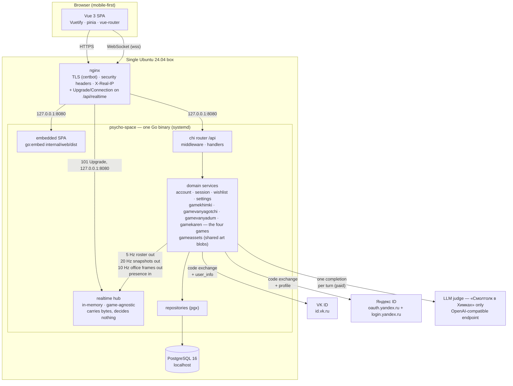

**Why one binary.** The SPA is compiled into the executable, so a deploy is a single file plus a restart, and nginx never needs to know about static asset paths. See [§8 → ADR-001](#adr-001--the-spa-is-embedded-in-the-go-binary) for why, and for what it costs.

**There are two ways in, and only one of them is a request.** Everything except the yard is request/response over `/api`. «Ванягоччи» additionally holds a WebSocket, which nginx must be told about explicitly — an upgrade is not a proxied request and the `Upgrade`/`Connection` headers do not survive a default `proxy_pass`. Inside the binary the hub is deliberately **not** a domain service: it is transport, it knows no game's vocabulary, and a game reaches it through two narrow seams — publish out, query presence in ([§8 → ADR-033](#adr-033--a-game-reads-the-socket-through-a-game-agnostic-handler-and-pulls-presence)). Note also what is **not** in the diagram: no cron, no worker, no queue and no Redis. Three loops do recur, and **none of them ticks anything durable** — which is the rule, rather than "nothing recurs". The yard's 5 Hz broadcast reads an in-memory cache and never the database ([§2.6](#26-one-tick-of-the-yard)), «ВАНЯДУМ» runs a 20 Hz simulation over arenas that live only in memory and touch Postgres exactly twice per run ([§2.7](#27-one-step-of-ванядум--the-first-thing-in-this-system-that-simulates)), and «СИМУЛЯТОР КАРЕНА» runs a 20 Hz simulation over one shared office that touches Postgres once per shift ([§2.8](#28-one-tick-of-the-office--a-dom-game-that-simulates)).

## 2. Runtime views

### 2.1 Login — a confidential backend exchange, at either of two providers

There are two doors, **VK ID** and **Яндекс ID**, and everything behind the moment an identity is established is shared: the consent gate, the CSRF check, the account upsert, the session, the allowlist. Only the exchange differs, which is why `internal/httpapi` holds a narrow `oauthProvider` seam and the two provider packages know nothing of each other ([§8 → ADR-054](#adr-054--an-identity-is-a-provider-and-a-blind-index-and-a-second-provider-is-a-second-account)).

The authorization code is exchanged **on the server**, so no confidential credential — VK's service token, Yandex's client secret — ever reaches the browser. A session cookie is issued even for `pending` and `blocked` accounts: it identifies without authorizing, because `requireAuth` still demands `status == approved`. See [§8 → ADR-007](#adr-007--a-session-cookie-is-issued-even-for-pending-and-blocked-accounts) for why.

**A login is an identity at a provider, not a person.** `accounts` is unique on `(provider, identity_ref)`, so the same numeric user id arriving from both providers is two accounts rather than one — which it must be, since both hand out small integers and the blind index is taken over the raw id. Logging in with Yandex having previously used VK therefore produces a **new** account: there is no linking, deliberately ([ADR-054](#adr-054--an-identity-is-a-provider-and-a-blind-index-and-a-second-provider-is-a-second-account)).

**Yandex's authorize URL is built by the server; VK's cannot be.** VK's SDK constructs its URL in the browser, so the app id and the redirect path must also exist in `web/src/constants.ts` — three copies of a string that must agree byte for byte, and the source of the 405 incident below. Yandex needs no SDK, so `GET /api/auth/yandex/state?code_challenge=…` returns the state **and** the finished `authorize_url`, and the client id and redirect URI live only in the server's environment. Two copies instead of three, and the SPA can never be the stale one ([ADR-055](#adr-055--the-authorize-url-is-built-by-the-server-wherever-the-provider-allows-it)).

**The redirect URL is a page, and the exchange endpoint is not — for both providers.** VK's `redirect_uri` is `https://psycho-space.ru/auth/redirect` and Yandex's is `https://psycho-space.ru/auth/yandex/redirect`; both are routes of the SPA (`AuthRedirectView.vue` serves both, taking the provider from the route rather than from a query parameter, which would be attacker-controlled).

For VK, in the ordinary flow nothing is ever navigated there: the OneTap widget finishes inside a VK-hosted frame and hands `{code, device_id}` to JavaScript, which POSTs to `/api/auth/vk/callback` from the page it is already on. But when the widget cannot finish in place — VK's own in-app WebView, a blocked popup, partitioned third-party storage, or the "войти другим способом" path — VK navigates the whole browser to `redirect_uri?code=…` with **GET**, and that landing must be a page. It used to be `/api/auth/vk/callback`, which is POST-only, so those browsers got a bare **405** and could never log in; `TestVKRedirectTargetIsServedAsAPage` and a full-stack case pin both halves. **For Yandex the navigation is the only path** — there is no widget — so the same trap is pinned again by `TestYandexCallbackRejectsGET` and its full-stack twin, and the Yandex app must carry only the page in its Redirect URI list.

Copies that must agree exactly or every login fails: for **VK**, three — `VK_REDIRECT_PATH` in `web/src/constants.ts` (sent at authorize), `PSYCHOSPACE_VK_REDIRECT_URI` (echoed by the backend at the token exchange, which VK matches byte for byte), and the redirect URL registered on the VK app. For **Yandex**, two — `PSYCHOSPACE_YANDEX_REDIRECT_URI` and the Redirect URI registered on the Yandex app — because the SPA never sees it.

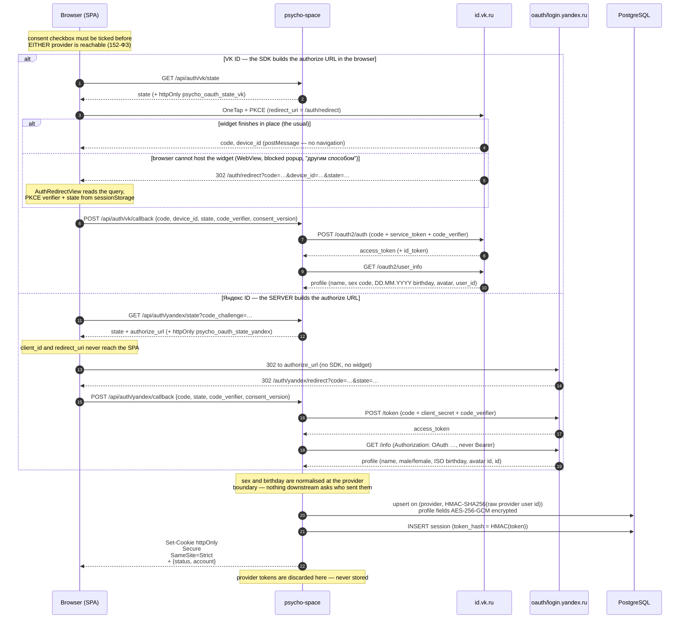

### 2.2 A wishlist upvote (the shape every gated request has)

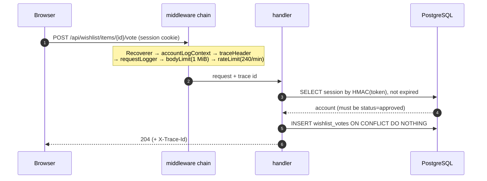

Any non-2xx answers `{error: "<stable_code>", trace_id}` — never `err.Error()` — and the SPA shows the trace id in a copyable modal. See [§8 → ADR-024](#adr-024--errors-carry-a-trace-id-and-never-carry-the-error-text) for why.

### 2.3 A turn in «Смолтолк в Химках» (the only paid path)

**This flow is specific to «Смолтолк в Химках»** — the LLM-judged dialogue game in `internal/gamekhimki/`, served under `/api/game-khimki/*` — and nothing in it generalises to another game. The second game, «Ванягоччи» (realtime, live), makes no LLM call on any path: [§8 → ADR-016](#adr-016--no-realtime-message-may-reach-the-llm) forbids a realtime message from reaching the judge at all, so «Смолтолк в Химках» is the only paid path in the system, not merely the first one.

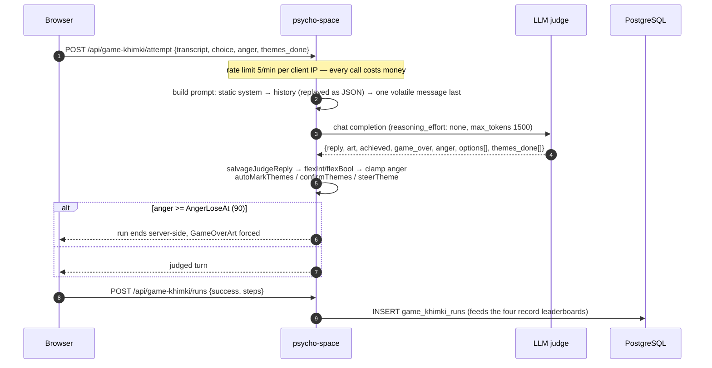

The prompt order is load-bearing, and so is the shape of the history: static system prompt → each past turn replayed as the JSON the judge returned → one volatile message last. See [§8 → ADR-013](#adr-013--the-prompt-is-laid-out-for-prefix-caching-and-history-is-replayed-as-json) for why. Measurements and per-turn costs: `RUNBOOK.md` → *Working on the game*.

### 2.4 The pet in «Ванягоччи» — a GET that writes, and a verb over the socket

**This flow is specific to «Ванягоччи»** and is the shape every time-varying thing in the system takes ([§8 → ADR-038](#adr-038--time-varying-state-is-computed-on-read-never-ticked)). It covers both halves of how a pet changes, because they are two ends of one rule rather than two features — and they arrive over **different transports**, which is itself a decision ([§8 → ADR-043](#adr-043--a-verb-travels-over-the-socket-and-is-answered-with-state)). Nothing runs on a timer, so the **read** is an ordinary `GET` and is what creates the pet, seeds its stats, decays them and records a death — all by the request that happened to look. A **verb** is not a request at all: it travels over the socket as one frame, is folded into the pet by the single `Service.Do` that a replay also goes through, and is followed by *state* rather than answered by a body.

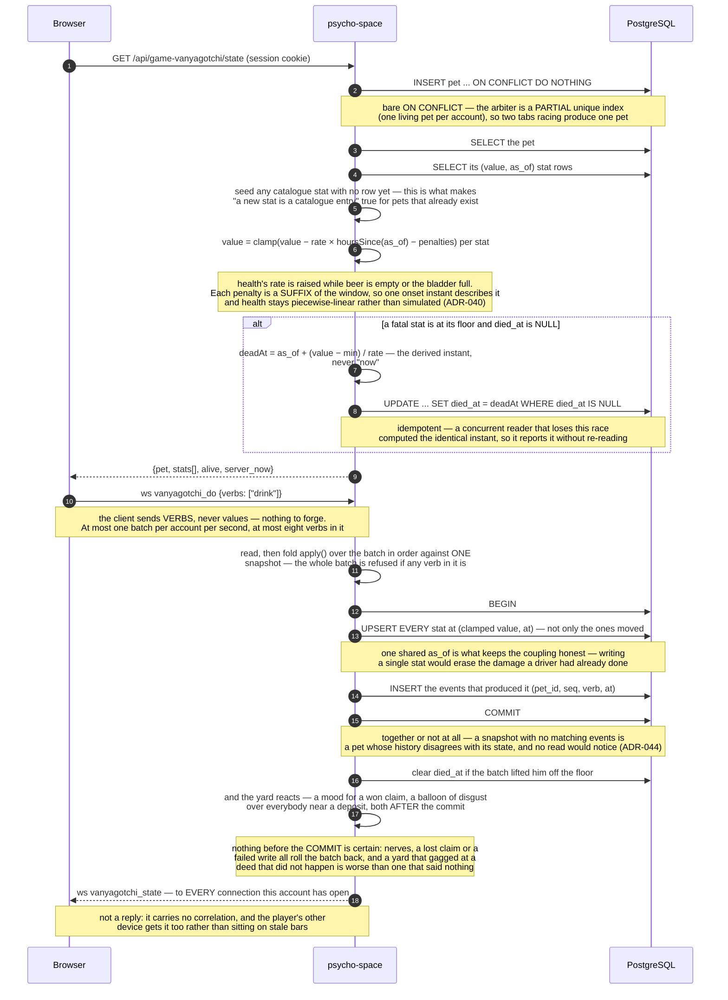

**A verb may be gated on where he is standing**, and that check lives on the live path alone. `Action.NeedsNear` names a world-object kind; `Do` asks the in-memory placement — at the instant the batch is folded, so a walk in progress is judged by where he has actually got to — and refuses with «далековато» if he is not beside it. It is deliberately **not** inside `apply`, which has to stay a pure function of `(Snapshot, Event)`: a replay of last March's drinks has no idea where anybody was standing, and finding out would put a query inside the fold. So the event log records that the drink *happened*, never that it was allowed. It is evaluated immediately after `apply`, per verb, which is what keeps being dead ranked above being far away.

**The world is fuller, and one thing in it wanders.** Every location has regulars now — the cast used to live entirely in the yard, so four of the five places had nobody in them and a player who travelled arrived somewhere that felt switched off. And the **beer crate moves**: a replacement is stood up in a randomly chosen location, where it used to be pinned to one square of двор. It is placed like a key in that the location is drawn at random and unlike one in where it lands — a hidden thing goes to a **hotspot**, because a hotspot is what a player taps to search, and a visible one must stand a full `arrive_within` clear of every one of them. Both came out of the same call briefly, and both consequences turned up: drinking and searching became the same tap, and a deposit left by somebody standing at the shop landed on coordinates a key could later be hidden at, which is the one thing hiding it is for. That reverses an argument its own catalogue entry made — a shop nobody can be told to walk to — and what answers it is that the roster already carries where the shop is, so the yard's readout names the place and the splash says the crate wanders rather than naming one. One consequence is worth stating because it was designed away before and is now accepted: a crate can land far enough from a location's entry that a newly-arrived Ваня may give up on the walk and have to ask again. And one thing the server now has to know about the screen, stated rather than hidden: **the yard's two bottom corners are interface** — the place caption and the verb button — and both swallow the taps that land on them, so nothing may be placed there. It is a placement rule («do not put a thing where nobody can reach it») rather than the server learning CSS, it applies to the catalogue's hiding places as well as to what the server stands up, and it is enforced by an invariant test. It was found the hard way: «подъезд» sat in the button's corner and was untappable for as long as the button existed.

**A deed the yard can see, the yard answers.** Two of them do. Relieving himself puts a line over everybody standing near him in the same location, and **finding the keys puts one over everybody who did not** — envy rather than congratulation, drawn from its own pool, beside the sad face that was previously the entire consequence of losing. A face for four seconds is a small thing to hang a mechanic's payoff on and easily missed by somebody looking at another corner of the yard. Both include **the regulars**, which is the point of them: on a quiet evening the yard is one player and three of them, so a players-only reaction would be invisible in its commonest case. They are the only balloons in this game somebody else's action produces; every other is a Ваня narrating himself. Both are filtered by PLACE first — the room is the whole world, so an unfiltered reaction would gag somebody standing in лифт at something that happened in заброшка — and the deposit is filtered by distance on top, because arriving is about touching a thing and smelling one is about being anywhere near it. Envy needs no distance: a face going sad is already location-wide, and a yard that pulled a face at something it would not comment on would be stranger than one that does both. The line is hashed per witness, so four people object in four different voices rather than in chorus, and it costs the wire nothing — it rides the `say` field the frame already carries.

**And a verb may simply not come off.** `Action.FailChance` is a probability the catalogue attaches to a verb — «покакать» carries a quarter — and it is rolled in `Do`, last of the gates and never inside `apply`, for the same reason the movement gate is not: a coin flip inside the fold would make a replay of one history produce a different pet every time it ran. Losing is a **refusal**, which is what makes it cost nothing to get right — the batch rolls back before the transaction is opened, so no stat moves, no event is appended, no deposit is left and the lifetime tally does not tick, and the log therefore records that he *went* rather than that he was willing to. What reaches the player is a line drawn from a pool in the catalogue and carried out on a **typed** error (`ShyRefusal`), because that sentence is chosen by the same hash as the roll and belongs to that particular loss of nerve; `refusalLine` reads it with `errors.As` where every other refusal maps from a sentinel. The chance is **served** so the splash cheatsheet derives the odds rather than anybody typing them, and it is deliberately the one rule the client does **not** grey a button for — the failure is the joke, and a control that greyed itself at random would read as broken.

**Finding the key is a search, and the key is not on the wire at all.** Its `ObjectKind` is `Hidden`, so the broadcast skips it before it can become an entity — the row keeps its `x`/`y`, and those coordinates never leave the process. What the client is given instead is the location's **hotspots** from `/config`: static, public candidate hiding places. Tapping one walks the Ваня there with an ordinary `vanyagotchi_move`, and on arrival the client sends the claim **naming that spot**. Where the key hides is *stored rather than derived* — `crypto/rand` picks a hotspot when the row is spawned — which is stronger than deriving it under a process-lifetime secret would have been: it is not derivable at all, it survives a restart rather than silently moving the key out from under somebody mid-search, and it invents no second secret. The browser learns *which verb searches* from a derived `needs_spot` capability on the action, never from a key.

**A verb is followed by state, never answered by a body**, and the refusal path is the same path as the confirmation. What the server decided appears as a line over the player's own Ваня, carried in the next 5 Hz roster — so the rest of the yard reads it too, and a Ваня who is dead still carries it, because «он не встаёт» is the server talking to his owner rather than the corpse talking. Nothing on the client waits for any of it: the roster is already the reconciliation channel, so a verb that is dropped is simply pressed again. The reasoning is [§8 → ADR-043](#adr-043--a-verb-travels-over-the-socket-and-is-answered-with-state).

`server_now` is in every read so the SPA can keep the bar creeping between fetches against the **server's** clock rather than the phone's, and each stat carries the **effective rate it is suffering right now** — which is generally not the catalogue's rate, because a penalty may be active. Sending it is what stops the browser needing its own copy of the coupling. That interpolation is display only: the client never sends a value back, and every verb is followed by the state the server computed, so a screen that has drifted is corrected the moment the player does anything.

### 2.5 Realtime connection lifetime

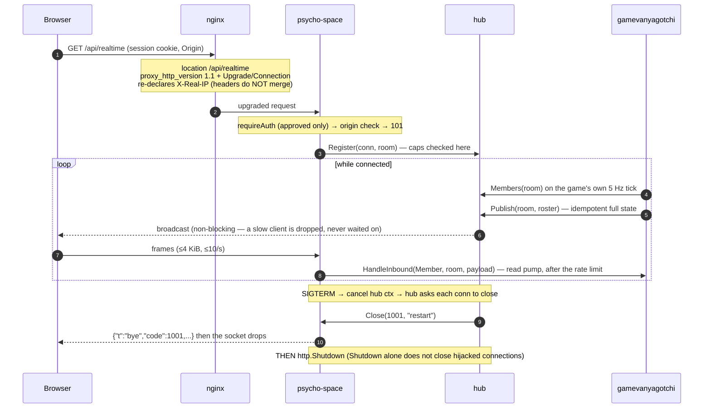

**The hub carries bytes and decides nothing.** A game publishes through it and reads from it across two game-agnostic seams — a `Handler` for inbound frames and a `Members` query for presence — so `internal/realtime` contains no game's vocabulary and «Ванягоччи» owns its own wire types. See [ADR-033](#adr-033--a-game-reads-the-socket-through-a-game-agnostic-handler-and-pulls-presence) and [ADR-034](#adr-034--the-broadcast-tick-is-injected-and-belongs-to-the-game).

**On the browser side** the socket is owned at module scope (`web/src/realtime/socket.ts`), not by a component: the yard is a lazy child route, so a component-owned socket would re-handshake on every navigation and spend another of the three connections the server allows per account. Its lifetime follows a subscription refcount with a grace period rather than the route. The rule that governs everything rendered from a frame is written in that file and in `web/src/lib/vanyagotchiPlane.ts`, and is worth knowing before touching either: **membership is reactive, positions are not.** Who is present goes through pinia and a keyed list; where they are is written straight to two CSS custom properties, because a 5 Hz frame bound to reactivity costs a scheduler pass and a vdom patch per entity to produce a transform the compositor could have been handed directly.

The reason arrives as a **frame**, not as a WebSocket close code — a browser sees `1006` for every disconnect and reads the reason from the last `bye` frame instead. Codes: `1001` planned restart (reconnect promptly), `1013` evicted or over a cap (back off), `4001` session revoked (terminal — stop). See [ADR-018 · *The close reason travels as a frame*](#adr-018--the-close-reason-travels-as-a-frame-not-as-a-close-code) for why, and [ADR-019 · *The read pump must not observe shutdown*](#adr-019--the-read-pump-must-not-observe-shutdown) for the library trap that makes the ordering load-bearing.

### 2.6 One tick of the yard

**This flow is «Ванягоччи»** and it is the other half of the game — [§2.4](#24-the-pet-in-ванягоччи--a-get-that-writes-and-a-verb-over-the-socket) is the pet in Postgres, this is the plane in memory. Three things happen at three different rates, and keeping them apart is the whole design: the **database is read once**, when a client says hello; a **tap** is accepted whenever one arrives; and the **broadcast runs five times a second and touches nothing but memory**.

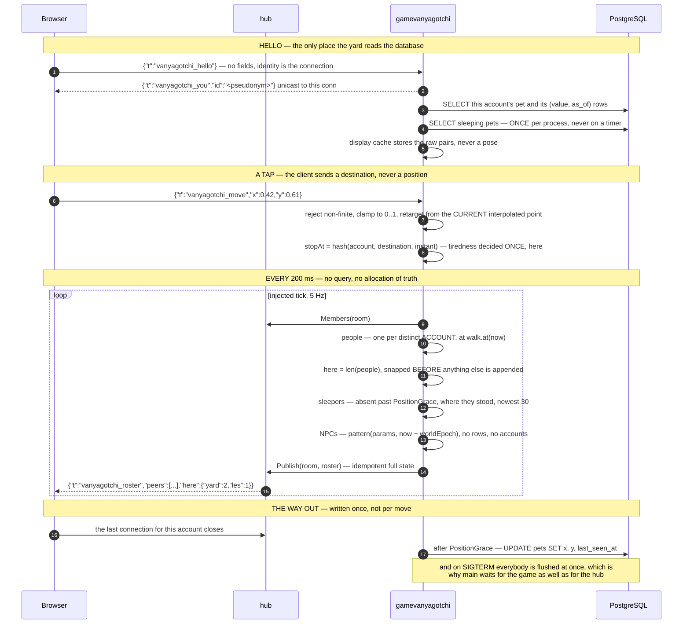

**The tick never touches Postgres, and that is a constraint rather than an optimisation.** At 5 Hz a query per entity per frame would be a self-inflicted load test, so appearance comes from an in-memory cache filled on hello and refreshed whenever that client acts over HTTP. What the cache holds is the **raw `(value, as_of)` pairs, not the pose** — a pose expires, so a cached one would show a healthy Ваня who has been dying since lunchtime, whereas a cached pair stays exact for the same reason the whole decay model does ([§8 → ADR-041](#adr-041--the-broadcast-tick-renders-from-a-cache-and-position-outlives-the-process)).

**Nothing on the plane integrates a velocity.** An NPC is `pattern(params, now − worldEpoch)` and a player is a point along a walk with a known start, so a tick that is late, early, skipped, duplicated, or served to a client that has just reconnected still produces the correct world. That is what makes a GC pause cost nothing and stops two people's yards drifting apart while neither reports a fault ([§8 → ADR-042](#adr-042--everything-that-moves-is-a-function-of-absolute-time)). It is also why an NPC needs no row and no account: there is nothing about one to store, so adding one is a catalogue entry with **no migration and no client deploy**. The same rule reaches past motion to anything that appears and disappears: a Ваня's speech balloon is a phrase pool indexed by hashing (account, time-slot), so it needs no timer, stores nothing, expires by arithmetic rather than by cleanup, and every client independently computes the same words at the same moment.

**The frame is idempotent full state — there are no deltas and no announcements.** A dropped frame therefore costs exactly nothing, because the next one is the truth again, which is what lets the hub drop a slow client's backlog instead of blocking on it. It is also why a world *event* has to be state in the frame rather than a one-shot message: a one-shot arrives once or never, and "never" is indistinguishable from "it did not happen".

**Three kinds of entity, and the client cannot tell them apart on purpose** — connected people, sleepers, and NPCs are the same shape on the wire. So the count of people is sent explicitly as `here` rather than derived by the browser: making the client work it out would mean teaching it what an NPC is, and the point of the envelope is that it does not know. With five places it is a **map** rather than a number, `{"yard":3,"les":1}` — the frame carries every location at once and the client filters on each entity's `loc`, so it could not count its own place by filtering without learning exactly the distinction the envelope withholds ([ADR-045](#adr-045--a-location-is-not-a-room--the-roster-is-filtered-not-split)). An empty room publishes nothing at all — silence, not a roster of NPCs talking to themselves.

**Position is in memory, written down only on the way out.** A place survives a page reload because absence is not departure — it is held for a `PositionGrace` of two minutes after the last socket closes — and survives a *deploy* because the last disconnect (and shutdown, for everyone at once) writes it to `pets.x` / `pets.y`. A crash still loses whatever had not been written, and that is accepted rather than fixed. The reward for making it durable is that an absent player can be drawn asleep where he stood instead of vanishing, which is what keeps the yard from being an empty field when only one person is online.

### 2.7 One step of «ВАНЯДУМ» — the first thing in this system that simulates

**This flow is «ВАНЯДУМ»**, the shooter, and it is the one place in this project where a loop advances state because time passed. It is here rather than folded into the yard's tick because it is a different KIND of thing: [§2.6](#26-one-tick-of-the-yard) renders a world that is a closed-form function of the clock, and this one integrates a world that is not.

**Collision is why.** Every other moving thing in this system is `pattern(params, now − epoch)`, so a tick that is late, early, skipped or duplicated still produces the right answer ([ADR-042](#adr-042--everything-that-moves-is-a-function-of-absolute-time)). Where a player is after walking into a wall depends on every wall he slid along getting there — a path, not an expression — so it has to be stepped at a fixed rate.

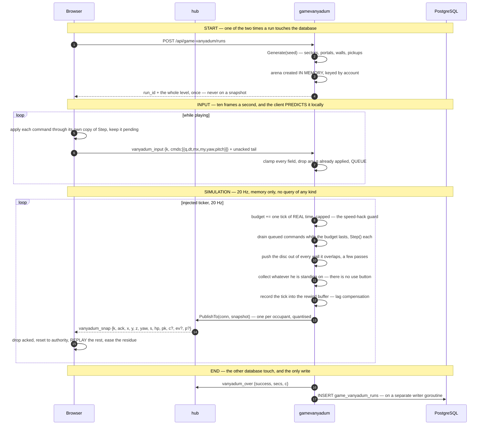

**Nothing about this ticks durable state**, which is what keeps it on the right side of [ADR-038](#adr-038--time-varying-state-is-computed-on-read-never-ticked). An arena lives in a map in one package, Postgres is touched twice per run and never on a tick, and an arena is deliberately lost on restart in the same way the hub's presence is. A run is a few minutes long and a lost one costs a replay.

**An arena is not a room.** Every player has his own world, but the platform knows only that this game listens in the room `vanyadum` and each snapshot is addressed to a **connection**. A room per run was refused for the reason [ADR-045](#adr-045--a-location-is-not-a-room--the-roster-is-filtered-not-split) refused a room per location: it would teach an unprefixed platform file what a run is. What did change is one line's worth — `httpapi` holds a **map of room name to handler**, so the set of valid rooms is exactly what `main` registered, and each game exports its own room name.

**Simulated time is spent, not claimed.** This is the security property that a per-field clamp cannot provide. The socket allows ten frames a second, each carrying four sub-steps of up to 0.2 s, so a client filling every frame asks for eight seconds of simulation per real second — with **every individual field in range**. So each arena accrues a budget at exactly real time and spends it, with a half-second cap so that an honest burst from a phone that was backgrounded can still catch up ([ADR-048](#adr-048--the-simulation-is-a-server-owned-fixed-step-tick-over-in-memory-arenas), [ADR-049](#adr-049--input-is-batched-to-fit-the-sockets-bound-never-to-loosen-it)).

**And `Step` is pure** — a function of `(level, player, command)` with no clock, no randomness and no query. That future arrived the same day: the feel gate failed, so this exact function now **also runs in the browser**, pinned to the Go original by golden vectors in `internal/gamevanyadum/testdata/`. The client predicts its own movement through it and the server reconciles ([ADR-052](#adr-052--the-netcode-is-built-multiplayer-complete-before-there-is-a-second-player)); peers are interpolated in the recent past instead, because their intent cannot be predicted; and the tick's recording above is what lets a shot be resolved against the world the shooter actually saw.

### 2.8 One tick of the office — a DOM game that simulates

**This flow is «СИМУЛЯТОР КАРЕНА»**, and it is a *third* kind of tick rather than a repeat of either above. [§2.6](#26-one-tick-of-the-yard) renders a world that is a closed-form function of the clock. [§2.7](#27-one-step-of-ванядум--the-first-thing-in-this-system-that-simulates) integrates a world that is not, and draws it in WebGL. This one **integrates a world that is not, and draws it in DOM** — which is not a contradiction but two independent decisions taken separately ([ADR-057](#adr-057--a-dom-game-may-own-a-fixed-step-simulation)).

**Pursuit is why.** Лысый's position at *t* is a function of every position the player occupied before *t*, and the money multiplier is an accumulation of the player's own input history rather than an evaluation of elapsed time. Neither can be written as `pattern(params, now − epoch)`, so both have to be stepped.

**And there is one office, not one per player.** Where the shooter keys an arena by account, this game holds a single process-wide world that occupants join and leave, because co-op here means several Карена being chased by the same bald man ([ADR-056](#adr-056--the-office-is-one-process-wide-arena-not-one-per-run)). The frame is still built and addressed **per occupant** — each carries his own salary and his own acknowledged input — so the room is the membership query rather than the fan-out.

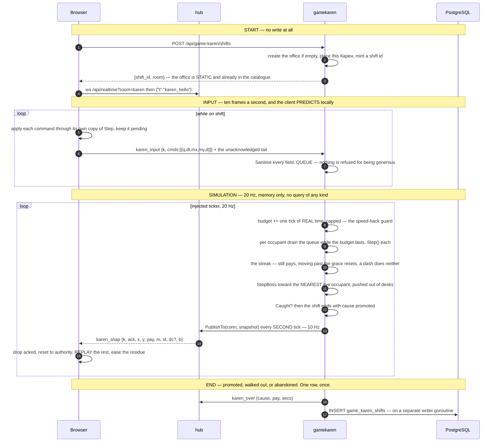

**A shift under a few seconds is dropped rather than written**, so the table is not full of accidental one-second shifts, and an occupant whose socket has been gone for the abandon grace is ended as `left` and written. **The office is torn down when it empties**, and the next shift builds a fresh one — so a restart loses shifts in flight exactly as it loses arenas and presence, which is the same accepted trade [ADR-048](#adr-048--the-simulation-is-a-server-owned-fixed-step-tick-over-in-memory-arenas) made.

### 2.9 Deploy

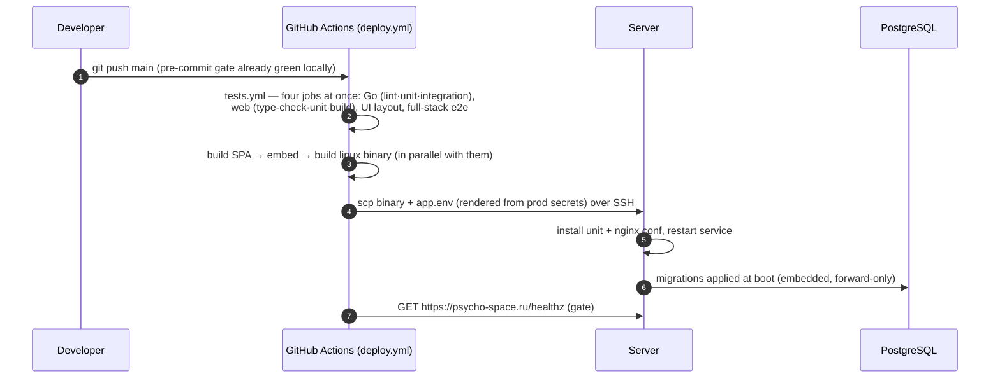

A push to `main` is a deploy, and a red run means production was not updated. See [§8 → ADR-003](#adr-003--push-to-main-deploys-the-gates-are-the-safety-net) for why that is safe without a staging environment.

## 3. Package structure


**The rule:** dependencies point inward and downward — handlers know services, services know repositories, repositories know `db.DBTX`. Nothing in `internal/*` imports `httpapi`. Adding a feature means a new `internal/<domain>/` package with those four files, a `NNN_*.sql` migration, wiring in `main.go` + `httpapi.Deps` + routes, and a case in `test/integration/`.

**Games are the exception to the usual instinct to factor things out.** Each game is a self-contained module: its own package, its own `game_<name>_*` tables, its own routes and views, its own leaderboard code — and **no game imports another, even where the code would be identical.** A game may depend on platform packages (`realtime`, `session`, `account`, `crypto`, `db`, and the `httpapi` plumbing); none of those may know a game exists, which is why the socket is addressed as the game-agnostic `/api/realtime?room=…` and game-specific message types live in the game's own package. The test for the boundary: deleting a game must mean deleting its package, its migration, its routes and its views — and nothing else. See [§8 → ADR-028](#adr-028--games-are-self-contained-modules) for why, and `CLAUDE.md` → *Games are self-contained modules* for the same rule stated as a working rule.

**`gamevanyadum` is the third module, and the first with a loop that integrates.** Its files split by what they know, in the same idiom as the game above: `content.go` is the catalogue (movement constants, pickups, surfaces, generation parameters, and the whole of what `/config` serves); `level.go` generates the sector graph and derives the walls from it; `sim.go` is `Step`, a pure function of `(level, player, command)` with no clock and no query; `arena.go` is one run's world plus the real-time budget that stops a client buying extra simulation; `service.go` owns the arena map, the 20 Hz tick and the single writer goroutine that makes this game's only two database statements. It shares nothing with «Ванягоччи» — not the display cache, not the tick, not the message envelope — and the duplication is the point ([ADR-028](#adr-028--games-are-self-contained-modules)).

**`gamekaren` is the fourth module, and the one that combines the other two.** It integrates like the shooter and draws like the yard ([ADR-057](#adr-057--a-dom-game-may-own-a-fixed-step-simulation)), and its files split the same way: `gamekaren.go` is the package doc plus the rate and step constants; `content.go` is the catalogue — the **static** office, every tuning constant, the phrase pools, the endings, and the whole of what `/config` serves; `sim.go` is `Step`, a pure function of `(desks, player, command)` whose eight operations are in a fixed order because the browser runs the same eight; `boss.go` is the pursuit and the grin, which is where the argument for having a tick at all lives; `office.go` is the one shared world, its occupant map, its per-occupant time budget and its lifecycle; `service.go` owns that office, the 20 Hz tick and the single writer goroutine that makes this game's one database statement. **The office is static and lives in the catalogue**, which is the load-bearing simplification against «ВАНЯДУМ»: a run there is a fresh building, so the level is generated and sent ([ADR-050](#adr-050--the-level-is-generated-on-the-server-and-sent-once)); a shift here is the same office every time, so there is no generator, no seed, no per-run level and nothing about geometry on any frame or in any start response. It shares nothing with either game above — not the arena, not the budget, not the wire envelope, not the leaderboard SQL ([ADR-028](#adr-028--games-are-self-contained-modules)).

**And each game's name is spelled out at every layer**, which is what makes that boundary test executable rather than a judgement call: package `internal/game<name>/`, tables `game_<name>_*`, routes `/api/game-<name>/*`, view `Game<Name>View.vue` at `/app/game-<name>` — so `git grep -il game<name>` enumerates the whole module. «Смолтолк в Химках» is `gamekhimki`; «Ванягоччи» is `gamevanyagotchi`; «ВАНЯДУМ» is `gamevanyadum`; «СИМУЛЯТОР КАРЕНА» is `gamekaren`. Platform packages stay unprefixed on purpose, because the missing prefix is the signal that they are game-agnostic — and the one place a game's name now reaches the platform is a **map key**: `httpapi` holds `map[string]realtime.Handler` and each game exports its own room name, so the composition root is the only file that pairs the two. The fourth game proved that seam rather than widening it: `internal/realtime` and `internal/httpapi/realtime.go` needed no change at all. See [§8 → ADR-030](#adr-030--game-modules-are-named-gamename).

**Its files split by what they know.** `content.go` is the catalogue (stats, actions, skins, locations, NPCs, every tuning constant); `decay.go` is the time arithmetic for stats and `motion.go` the time arithmetic for space — both pure, both closed-form, neither storing anything; `display.go` is the in-memory cache the broadcast draws from; `service.go` holds the verbs and the tick. A new character is a `content.go` entry. A new *way of moving* is one function and one map entry in `motion.go`. Neither is a migration and neither is a client change.

**`gamevanyagotchi` is one package holding two things with deliberately different lifetimes**, and the split is worth knowing before reading it. The **plane** — who is standing where — lives in memory and is published through the hub five times a second. The **pet** — the stats, the death — is in Postgres and outlives every deploy. The plane now *draws* what the database knows, and the way it does that is the load-bearing part: a **display cache** (`display.go`) holds each account's pet fields in memory, filled when a client says hello and refreshed by the HTTP read path, so **the broadcast tick never touches Postgres**. What it caches is the raw `(value, as_of)` pairs rather than a pose — a pose changes with the clock, so a cached one would quietly show a healthy Ваня who has been dying since lunchtime, whereas a cached pair stays exact for the same reason the whole decay model does ([§8 → ADR-041](#adr-041--the-broadcast-tick-renders-from-a-cache-and-position-outlives-the-process)). The same rule now covers a third thing: **world objects** — what is lying about in the yard — are held in their own cache (`world.go`), filled at a hello and after a verb that leaves something behind, and rendered as ordinary entities so the client resolves an object's art exactly as it resolves a pet's and holds no object-kind key at all. Expiry is arithmetic over the cache against the tick's instant, so a deposit vanishes from every screen at the same moment without anybody asking the database. So beyond the usual four files the package carries the six listed above, and the two halves meet in exactly one place — the broadcast, which reads the caches and never the pool. See [§8 → ADR-038](#adr-038--time-varying-state-is-computed-on-read-never-ticked) and [ADR-039](#adr-039--game-content-is-a-go-catalogue-and-the-schema-stores-only-its-keys) for the two rules that shape it, and [§2.6](#26-one-tick-of-the-yard) for the flow.

### The SPA

The browser half is a normal Vue 3 application — until the yard, which has a second data source and a second rendering discipline, and that is the part worth having a diagram for.

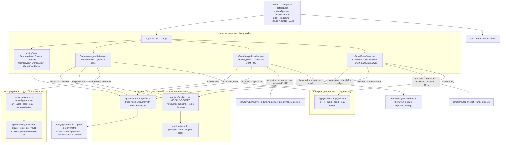

**The socket is owned at module scope, not by a component.** The yard is a lazy child route, so a component-owned socket would re-handshake on every navigation and spend another of the three connections a server allows per account. Its lifetime is a subscription refcount with a ten-second idle grace, so leaving the yard and coming back reuses the connection.

**In the yard, membership is reactive and positions are not.** This is the load-bearing rule of the client and it is enforced structurally rather than by convention, in three places at once: the store has no field a coordinate could go in, the `PeerAppearance` shape that enters reactivity has no `x`/`y`, and the function that writes a position takes an interface narrowed to `style.setProperty` alone — so the position path *cannot* read layout, measure a box, or touch an attribute. Who is present, what they look like and what they are saying go through pinia and a keyed list, behind an equality guard so a frame that changed nothing re-renders nothing. Where they are is written straight to CSS custom properties on the element, and the mapping from `0..1` to pixels happens in the stylesheet against the plane's own container box. The reason is arithmetic: at 5 Hz, binding positions to reactivity costs a scheduler pass and a vdom patch per entity per frame to produce a transform the compositor could have been handed directly — and it would cache a measured size that mobile browser chrome invalidates every time it slides.

**The third game inverts the yard's rendering decision and keeps its testing one.** «ВАНЯДУМ» draws in WebGL through three.js, because it is a first-person shooter with a camera over a world larger than the viewport — every trigger [ADR-046](#adr-046--the-shared-plane-is-dom-and-css-never-a-game-engine) named for re-asking the question, hit at once. What it does **not** do is put anything else on the canvas: the HUD, the movement stick, the fire button, the splash, the rules cheatsheet and the result screen are ordinary DOM, and the engine is reachable from exactly one module (`render/vanyadumScene.ts`), imported dynamically so nobody who never opens the game pays its 176.7 kB gzip. Everything a test needs is therefore moved out of the canvas in two directions — sideways into the DOM, and downwards into `lib/vanyadum*.ts`, where the level's geometry is plain arrays and a texture is a pure `(surface, size, seed) → Uint8Array` rather than something drawn into a 2D context ([ADR-047](#adr-047--ванядум-renders-in-webgl-and-only-the-world-does), [ADR-051](#adr-051--ванядум-stores-no-art-at-all)). The same rule the yard follows about reactivity applies here in a sharper form: the camera is a **plain object**, written by snapshots twenty times a second and read by the render loop sixty, because putting it through Vue would buy a scheduler pass per frame to produce a number only the renderer reads.

**The fourth game takes the yard's renderer and the shooter's clock, which is two decisions rather than one.** «СИМУЛЯТОР КАРЕНА» has no canvas at all — the floor, the desks, you and the bald man are real elements placed by CSS custom properties, so the layout suite reads the game the way a player does and nothing needs a pixel comparison ([ADR-057](#adr-057--a-dom-game-may-own-a-fixed-step-simulation)). What it borrows from «ВАНЯДУМ» is the *update model*: two clocks rather than one repaint, with `requestAnimationFrame` rendering and a `setInterval` at the served input rate sending, and the server's own `Step` ported to `lib/karenStep.ts` and pinned to it by golden vectors, so the player's own movement is predicted locally and reconciled against the office's authority. The yard's structural rule survives intact and matters more here, not less: **membership is reactive, positions are not** — a coordinate goes straight to a CSS custom property, because at animation-frame rate a scheduler pass per figure buys nothing the compositor was not already going to do.

**Everything the client knows about a game's content, it was told.** Stats, actions, skins, locations and characters all arrive from `GET /api/game-<name>/config` and are iterated generically, which is what makes a new stat or a new NPC a backend deploy. The clearest payoff is the splash screen, which is a **rules cheatsheet generated from that catalogue** rather than written out — so retuning a constant in the game's `content.go` changes what the player is told with no client change, and the rules cannot drift from the game the way a hand-typed list would. Only what the server does not publish — walking speed, tiredness, the muttering, who else is in the yard — is hardcoded prose, and it is marked in the source as the part a rules change must come back and edit. What is deliberately still hardcoded is *presentation*: the splash copy, the RU status strings, the pose vocabulary the stylesheet has rules for, and the plane's 3:4 aspect ratio — that last one being a genuine rule of the game rather than a style, because normalised coordinates only mean the same thing on two phones if both draw the same shape.

## 4. Data model

Every table carries `created_at` / `updated_at`, and everything soft-deletable carries `deleted_at` (queries filter `WHERE deleted_at IS NULL`).

```mermaid
erDiagram
    accounts ||--o{ sessions : "has"
    accounts ||--o{ wishlist_items : "authors"
    accounts ||--o{ wishlist_votes : "casts"
    accounts ||--o{ wishlist_comments : "authors"
    accounts ||--o{ wishlist_comment_votes : "casts"
    accounts ||--o{ game_khimki_runs : "plays"
    accounts ||--o{ game_vanyadum_runs : "runs"
    accounts ||--o{ game_karen_shifts : "works"
    accounts ||--|| game_vanyagotchi_pets : "keeps"
    accounts ||--o{ game_vanyagotchi_world_objects : "leaves behind"
    game_vanyagotchi_pets ||--o{ game_vanyagotchi_pet_stats : "has"
    wishlist_items ||--o{ wishlist_votes : "receives"
    wishlist_items ||--o{ wishlist_comments : "has"
    wishlist_comments ||--o{ wishlist_comment_votes : "receives"

    accounts {
        uuid id PK
        text provider UK "vk | yandex — half of the identity"
        bytea identity_ref UK "blind index HMAC-SHA256(raw provider user id)"
        bytea identity_id_enc "AES-256-GCM"
        bytea first_name_enc
        bytea last_name_enc
        bytea avatar_url_enc
        bytea sex_enc
        bytea birthday_enc
        text role "user | admin | superadmin"
        text status "pending | approved | blocked"
        timestamptz consent_at
        text consent_version
        timestamptz forgotten_at "anonymised in place — identity gone, contributions kept"
    }
    sessions {
        uuid id PK
        uuid account_id FK
        bytea token_hash UK "HMAC of the raw cookie value"
        timestamptz expires_at
    }
    wishlist_items {
        uuid id PK
        uuid account_id FK
        text title
        text body
    }
    wishlist_votes {
        uuid id PK
        uuid item_id FK
        uuid account_id FK
    }
    wishlist_comments {
        uuid id PK
        uuid item_id FK
        uuid account_id FK
        text body
    }
    wishlist_comment_votes {
        uuid id PK
        uuid comment_id FK
        uuid account_id FK
    }
    game_khimki_runs {
        uuid id PK
        uuid account_id FK
        text game_key
        text character_key
        boolean success
        integer steps
    }
    game_vanyadum_runs {
        uuid id PK
        uuid account_id FK
        bigint seed "the level is a pure function of this — never stored"
        boolean success
        integer seconds
        integer beer
    }
    game_karen_shifts {
        uuid id PK
        uuid account_id FK
        text cause "promoted | left — text, so a third ending is not a migration"
        float salary "the score, in rubles"
        float seconds "how long the shift lasted"
    }
    game_vanyagotchi_pets {
        uuid id PK
        uuid account_id FK "one living pet per account (partial UK)"
        text name "set in a dialog, NULL until then"
        text skin_key "catalogue key"
        text location_key "catalogue key"
        timestamptz died_at "materialised once, at the derived instant"
        float x "where he stood when his owner last left"
        float y
        timestamptz last_seen_at "written on the LAST disconnect, never per move"
    }
    game_vanyagotchi_pet_stats {
        uuid pet_id PK
        text stat_key PK "catalogue key"
        float value "with as_of, the whole decay engine"
        timestamptz as_of
    }
    game_vanyagotchi_world_objects {
        uuid id PK
        text kind "catalogue key: relief | key | beer_crate"
        text location_key
        float x "normalised 0..1"
        float y
        boolean singleton "participates in one-active-per-kind"
        uuid owner_account_id FK "NULL when the world spawned it"
        uuid claimed_by FK "SingleWinner discipline"
        integer remaining "Stock discipline"
        timestamptz exhausted_at
        timestamptz expires_at "filtered lazily on read, never swept"
    }
    game_assets {
        text game_key PK
        text art_key PK
        text content_type
        bytea bytes "the art image itself"
    }
    app_settings {
        text key PK
        text value
    }
```

`game_assets` and `app_settings` stand apart — neither references an account. The art bytes live in Postgres, not in git and not in the binary. See [§8 → ADR-026](#adr-026--game-art-lives-in-postgres-not-in-git-or-the-binary) for why, and [ADR-031](#adr-031--game-asset-storage-is-shared-infrastructure-not-a-games-property) for why the table stayed unprefixed while every other game table gained its game's name.

The three `game_vanyagotchi_*` tables are **«Ванягоччи»**, and they are shaped by two decisions worth knowing before changing them. **Every `*_key` column is `text` whose meaning lives in the Go catalogue, never a Postgres enum** — an enum makes each new stat, skin, location or object kind an `ALTER TYPE`, i.e. a permanent migration, which is exactly the cost the catalogue exists to remove ([§8 → ADR-039](#adr-039--game-content-is-a-go-catalogue-and-the-schema-stores-only-its-keys)). And **stats are tall while world objects are wide, on purpose**: stats are a homogeneous collection of `(value, as_of)` pairs that one decay expression covers, whereas world objects are heterogeneous rows carrying contended invariants — `claimed_by`, `remaining`, `exhausted_at` — that have to be indexable and `CHECK`-able. The tall shape pays for itself again in the coupling: a stat that raises another's drain is a catalogue entry naming a key, and adding one costs no column ([§8 → ADR-040](#adr-040--a-stat-may-drive-another-stats-rate-and-it-is-still-exact)) — and again in the score, because **a stat whose rate is zero is a lifetime counter**. «выпито пива» and «покакано раз» are rows in this same table, moved only by the verbs that name them, which is why this game has no runs table, no leaderboard schema and no migration for keeping score. They are marked `counter` in the catalogue rather than inferred from the rate, so the client is told they are tallies rather than left to conclude it from a number — a counter is never drawn as a bar and is never "trouble" at any value. It also carries the invariant that coupling depends on — **every write touches every row of a pet, with one shared `as_of`** — so there is deliberately no single-stat write path. There is no JSONB in either. `game_vanyagotchi_world_objects` is written for the first time by the relief deposit: «покакать» leaves a row at the position the SERVER believes the player is standing — the client sends a verb and never a coordinate — inside the same transaction that writes the stats and the events, so a deposit that survived a rolled-back batch cannot exist. Its `expires_at` is **filtered lazily on read and never swept**, exactly as `sessions.expires_at` already is, because a sweeper would be the background timer this design does not have. The **contested claim** is the other half, and it is the first place in this system where the DATABASE rather than the hub decides an outcome: `UPDATE … WHERE claimed_by IS NULL` sets `claimed_by` and `exhausted_at` in one statement, so two players tapping in the same millisecond are resolved by Postgres and a forged client claim cannot beat it — zero rows affected means you lost. The replacement is inserted in that same transaction, so the next frame already carries a fresh hunt rather than an empty yard somebody has to be told about. **Losing costs nothing**: the lost claim returns an error, the whole batch rolls back, and the outcome is a face for a few seconds — no stat moves, and there is no loser-effect hook. The one-active-per-kind invariant is a partial unique index predicated on a **`singleton` boolean the catalogue sets at insert time** rather than on any kind named in DDL — a deposit sets it false, because deposits are never exhausted and many are live at once, and an index keyed on `exhausted_at` alone would have forbidden a second player from relieving himself.

**There are two contest disciplines and the catalogue routes between them**, which is the shape that arrived with the beer store rather than a hierarchy: a verb names the kind it races for, the kind names its discipline (`Contest`), and the service switches on that alone — so a third contested verb is two catalogue entries and no code. `SingleWinner` is the key, above. **`Stock` is the crate**: `UPDATE … SET remaining = remaining − 1 WHERE remaining > 0 RETURNING remaining` **cannot oversell under any concurrency**, and not by being careful — the guard is inside the statement's own `WHERE`, so a second player's statement blocks on the row the first is holding and then re-evaluates that guard against the value the first *committed* rather than the one it read on the way in. Six players pressing in the same millisecond against a crate of two get two beers and four refusals, decided by PostgreSQL. The decrement that reaches nought sets `exhausted_at` **in the same statement**, which is what takes the row out of the partial unique index and lets the replacement crate be inserted inside the same transaction; splitting those would leave a window in which the index still held the empty crate, the insert silently did nothing, and the yard was left with a crate nobody can draw from and nothing that would ever replace it. Both disciplines share the rule that **losing costs nothing**: the refusal rolls the batch back, so no stat moves and nothing is written at all. The crate stands at a fixed pitch from the catalogue (`ObjectKind.At`) while the key is hidden at random — that `nil` is the whole difference between a shop and a lost key — and the vendor beside it is a **stateless NPC with no row**, because everything mutable about a beer store belongs to the thing with a count.

**`game_vanyadum_runs` is the ENTIRE durable footprint of «ВАНЯДУМ»** — one summary row per finished run, and nothing else in the database at all. Everything the game is made of lives for the few minutes it takes to play: the **level** is a pure function of `seed`, so eight bytes reproduce the geometry exactly and storing it would freeze a generator that changes every iteration ([ADR-050](#adr-050--the-level-is-generated-on-the-server-and-sent-once)); the **arena** — where the player is, what he has picked up, which tick it is — is deliberately ephemeral and is lost on restart in the same way the hub's presence is ([ADR-048](#adr-048--the-simulation-is-a-server-owned-fixed-step-tick-over-in-memory-arenas)). `seed` is kept so that two people can compare times over the same заброшка, which is the only thing that would make a leaderboard worth looking at. `beer` is a plain column rather than a bag of counters: there is one pickup today and a JSONB column added in advance of a second would be complexity bought against a requirement that does not exist. There is no `game_key` discriminator (the table name carries the identity), no enum for anything (pickups and surfaces are a Go catalogue), no per-event rows, and **no art table** — this game stores no art at all ([ADR-051](#adr-051--ванядум-stores-no-art-at-all)). An **abandoned** run is dropped without being written: a run somebody walked out of is not a result.

**`game_karen_shifts` is the entire durable footprint of «СИМУЛЯТОР КАРЕНА»** — one summary row per shift, written once when the shift ends, and nothing else in the database at all. Everything the game is made of lives in memory for the few minutes a shift lasts: the office, where everybody is standing, the boss, the streak, the multiplier. There is no level to store, because unlike «ВАНЯДУМ» there is nothing generated — **the office is static and lives in the Go catalogue** ([ADR-039](#adr-039--game-content-is-a-go-catalogue-and-the-schema-stores-only-its-keys)), so it needs neither a seed column nor a table. `cause` is `text` rather than an enum for exactly the reason every other `*_key` column is: the third ending arrives with a later iteration and must not be an `ALTER TYPE`. `salary` and `seconds` are `double precision` because they are integrals of a rate rather than counts, and rounding them at the boundary would make the leaderboard disagree with the screen that produced it. There is no `game_key` discriminator, no JSONB, no per-tick rows, and no meter columns for the meters this iteration does not yet have — a column added in advance of a requirement is the complexity this project declines. A shift **shorter than a few seconds is dropped rather than written**, so an accidental tap does not become a leaderboard row, and an **abandoned** one — the tab closed, the phone locked — is written as `left` after a grace period, because a shift somebody walked away from still happened and still paid.

`game_khimki_runs` and `game_assets` belong to **«Смолтолк в Химках»**, and now say so — they were `game_runs` and `game_assets` until `migrations/007_game_khimki_rename.sql`. A second game gets its own `game_<name>_*` tables rather than rows in these — see [§8 → ADR-028](#adr-028--games-are-self-contained-modules) and [ADR-030](#adr-030--game-modules-are-named-gamename). Their `game_key` **values** did not move with the tables: the column still reads `smalltalk_khimki`, because it is data rather than a name and the art blobs are keyed on it.

## 5. API map

Everything is under `/api`, authenticated by the session cookie. `GET /healthz` sits outside it (the deploy gate polls it).

| Group | Endpoints | Access |
|---|---|---|
| `auth` | `GET vk/state` · `POST vk/callback` · `GET yandex/state` (returns the authorize URL too) · `POST yandex/callback` · `GET me` · `POST logout` | public (30/min per IP on the four login endpoints) |
| `wishlist` | `GET/POST items` · `DELETE items/{id}` · `POST/DELETE items/{id}/vote` · `GET/POST items/{id}/comments` · `DELETE comments/{id}` · `POST/DELETE comments/{id}/vote` | approved |
| `game-khimki` | `GET assets/{game}/{key}` | **public** (art, cacheable) |
| `game-khimki` | `GET config` · `POST attempt` (5/min per IP — paid) · `POST runs` · `GET runs/leaderboard` · `GET runs/me` | approved |
| `game-vanyagotchi` | `GET config` (catalogue: stats · actions — including each one's gates and its `fail_chance` · skins · NPCs · object kinds · locations **with their hotspots** · `arrive_within`) · `GET state` · `GET avatar/{peer}` — reads only; **a verb is not HTTP**. The catalogue serves only what is CONSTANT about the beer store — its picture and its name — because where it stands stopped being one. | approved |
| `game-vanyadum` | `GET config` (catalogue: the player's dimensions · pickups · surfaces the client generates textures from · the rates it must match) · `POST runs` (starts one, returns the **whole level**) · `GET runs/current` (resume after a reload, or 404) · `DELETE runs/current` (give up — writes nothing) · `GET runs/me` | approved |
| `admin` | `GET accounts?status=` · `POST accounts/{id}/approve` · `POST accounts/{id}/block` · `GET settings` | admin+ |
| `admin` | `POST accounts/{id}/promote` · `POST accounts/{id}/demote` · **`POST accounts/{id}/forget`** · `PUT settings/open-registration` | superadmin only |
| `game-karen` | `GET config` (catalogue: the **static** office and its desks · the money ramp · movement and the dash · the boss · the endings and his lines) · `POST shifts` (start one — **no level, no write**) · `GET shifts/current` (resume after a reload, or 404) · `DELETE shifts/current` (walk out — writes the shift) · `GET shifts/me` · `GET shifts/top` (best shift **per account**) | approved |
| `realtime` | `GET realtime?room=` — WebSocket upgrade. The rooms are exactly those the composition root registered a handler for (`yard`, `vanyadum`, `karen`); an unregistered name is refused with 400 rather than opened and ignored. | approved |

The two `game-khimki` rows are **«Смолтолк в Химках»**, the `game-vanyagotchi` row is **«Ванягоччи»**, the `game-vanyadum` row is **«ВАНЯДУМ»** and the `game-karen` row is **«СИМУЛЯТОР КАРЕНА»**; a fifth game gets its own `/api/game-<name>/*` group rather than new keys in any of them, while `realtime` is game-agnostic by design ([§8 → ADR-028](#adr-028--games-are-self-contained-modules), [ADR-030](#adr-030--game-modules-are-named-gamename)).

Two things about the `game-vanyagotchi` row read oddly and are deliberate. **`GET state` writes** — it creates the pet on first sight and records a death the first time one is observed; both are idempotent, and the alternative to writing on read is a background job this system does not have ([§8 → ADR-038](#adr-038--time-varying-state-is-computed-on-read-never-ticked)). And **the group has no write endpoint at all**: a verb arrives as a `vanyagotchi_do` frame on the socket, listed in the wire contract below, because it owes no reply and the 5 Hz roster already reconciles the yard ([§8 → ADR-043](#adr-043--a-verb-travels-over-the-socket-and-is-answered-with-state)). What the catalogue-as-allowlist bought survives the move: the verb is a key checked against the content catalogue rather than a case in a handler, so a new stat-restoring action is still a catalogue entry and nothing else.

**`/api/game/*` no longer answers.** The pre-rename prefix was registered as a second route group on the same handlers for exactly one deploy cycle, so that a browser holding the previous SPA build in cache would not break mid-run; that cycle is over and the registration is deleted. `TestGameKhimkiLegacyPathAliasIsGone` in `test/integration/gamekhimki_test.go` now pins its **absence** — it asserts 404 rather than 401 on a gated path, because 401 would mean the route group had been re-registered and was merely refusing the request. On the client side `/app/game` redirects permanently to `/app/game-khimki`; that redirect is not an alias and stays.

Anything not matching `/api` or `/healthz` is served the embedded SPA, so client-side routes resolve on a hard refresh.

### The realtime wire contract

The table above is HTTP. `GET /api/realtime?room=…` is the other half of the surface, and it is a **protocol rather than an endpoint**, so it is written out here. There are three rooms and therefore three protocols — `yard` for «Ванягоччи» below, `vanyadum` for «ВАНЯДУМ» after it, and `karen` for «СИМУЛЯТОР КАРЕНА» after that. They share the transport and nothing else: no message type, no field name and no convention crosses between them, which is [ADR-028](#adr-028--games-are-self-contained-modules) applied to the wire. Everything in both directions is a JSON **text** frame with a string `t` discriminator, and **both ends ignore an unknown `t`** — that is what lets either side learn a message type without a coordinated deploy.

| Direction | `t` | Payload | Notes |
|---|---|---|---|
| → server | `vanyagotchi_hello` | none | Deliberately empty: identity is the connection, so there is nothing to forge. Sent on **every** open, including reconnects. |
| → server | `vanyagotchi_move` | `x`, `y` — both required, `*float64` | A destination, never a position. Non-finite is rejected; out of range is **clamped** to `0..1`, not refused. |
| → server | `vanyagotchi_goto` | `location` — a catalogue key | A **movement** message beside `move`, deliberately not a verb: it moves no stat, appends no event, and there is nothing for `apply` to fold. The server validates the key against the catalogue, writes `pets.location_key` and places him at that location's entry point. An unknown location is dropped in silence like every other bad frame. It carries **its own rate clock** rather than sharing the verb budget — a rate-refused verb is silent, so sharing would read as a dead control. **An accepted one is followed by `vanyagotchi_state`**, because it moved a pet column and that is what this game sends when a pet changes: the roster moves his *dot*, but the browser reads which place it is *looking at* off the pet, so a journey that pushed nothing left the yard drawing the place he had left — filtering his own Ваня out of it, reporting «здесь никого», and marking the old place as the one he was in, which is the row the travel sheet refuses to send you to because it means "stay". A dropped goto changed nothing and so pushes nothing. |
| → server | `vanyagotchi_do` | `verbs[]` — catalogue keys · `spot?` — a hotspot key | A batch, folded in order against one snapshot and refused whole if any verb in it is refused. **Its own bound**, tighter than the socket's: one batch per account per second, at most eight verbs in a frame — a tap writes nothing and a verb writes a transaction. `spot` is the **first inbound payload the server must JUDGE rather than clamp**: it names the hiding place the player says he searched, and is validated against the catalogue *for the pet's own location* and then against the yard's own in-memory placement. **The client announcing an arrival is a request, never a fact.** The order of those checks is a security property rather than a matter of taste — reach is decided *before* the answer is looked at, so a wrong spot and a right spot he has not reached are indistinguishable; reversed, the refusal becomes an oracle and tapping every hotspot from the middle of the yard would find the key. |
| ← client | `vanyagotchi_you` | `id` | Unicast reply to a hello: which entity in the roster is you. |
| ← client | `vanyagotchi_roster` | `peers[]`, `here`, `hunt?`, `store?` | The full-state frame, 5 Hz, carrying **every location at once**. Per entity: `id`, `x`, `y`, `art`, `pose`, and optional `label` / `say` / `expires` / `loc`. A POSITION IS A TRIPLE — a location plus `x`,`y` normalised **within that location** — so the same coordinates are the beer crate in двор and an empty patch of лес, and every question about nearness asks *where* before *how far*. `loc` is **omitted for the default location**, so the common case of everybody in the yard costs nothing and only a peer elsewhere pays ~12 bytes. `here` is a **map**, `{"yard":3,"les":1}` with zeroes omitted: it counts people per place and is sent rather than derived, because deriving it would mean teaching the browser to tell a person from an NPC ([ADR-045](#adr-045--a-location-is-not-a-room--the-roster-is-filtered-not-split)). `hunt` is the active key hunt's id — **state, never an announcement**, because a one-shot «ключи снова потерялись» is exactly what somebody who opened the app thirty seconds later misses; a client that sees it CHANGE says so, one that has just connected finds a hunt in progress and stays quiet. The **confetti** the browser throws where a key was found is worked out the same way and from a different field: the hunt id names neither the winner nor the place, so the burst is driven off a peer's pose going *to* `happy`, which says who and — through the coordinates on the same frame — where. A peer already wearing the face when a client first sees him won before it was watching, and is celebrated in the same silence a hunt already running is joined in. `store` is the beer store as `{x, y, loc?, left}` — **one shared field, not one per peer**, because it is one fact about the world: ~36 bytes a frame, 180 B/s to each phone however busy the yard is, against 4.3 KB/s if it hung off all twenty-four entities to say the same number twenty-four times. It is a **structure rather than a kind key**, which is what lets the browser draw a shop and measure its own distance to it while holding no content key at all — it could not pick the crate out of the roster by kind, and an e2e forbids it trying. **It is now the ONLY statement of where the shop is.** The crate used to be pinned to двор by a catalogue field, served as `store_location` so the splash could name the place; it is hidden in a random location on every restock now, exactly as a fresh key is, so the static field was removed rather than left serving «двор» about a shop wandering five places. `loc` follows the same omit-for-the-default rule the entities do, so a crate in the yard still costs nothing. **No avatar and no name of a person** — a picture is fetched by `id` over HTTP instead, because a URL here would be re-sent per player per tick per viewer and would be the one durable thing on an ephemeral frame ([ADR-037](#adr-037--one-account-is-one-entity-and-the-wire-carries-a-pseudonym-and-a-face)). |
| ← client | `vanyagotchi_state` | `state` | The owner's own pet after it changed, unicast to **every** connection that account has open. Not an acknowledgement: no correlation, and it also fires for a verb pressed on the player's other device. |
| ← client | `bye` | `code`, `reason` | Transport-owned, not the game's — sent immediately before the socket drops ([ADR-018](#adr-018--the-close-reason-travels-as-a-frame-not-as-a-close-code)). |

Six properties of it are load-bearing, and each one is a decision rather than an accident:

- **The frame is idempotent full state.** No deltas, no one-shot announcements, no join/leave bookkeeping on either side. A dropped frame costs nothing because the next one is the truth again — which is exactly what permits the hub to discard a slow client's backlog rather than block the broadcast on it.
- **`id` is a per-process pseudonym, never `accounts.id`.** It is an HMAC of the account under a key minted from `crypto/rand` at startup and held only in memory, truncated to 12 base64url characters. Stable across every connection and device of one account, meaningless after a restart, and stored nowhere. A roster is fanned out to the whole room, so anything in this field is a handle every other player can record ([ADR-037](#adr-037--one-account-is-one-entity-and-the-wire-carries-a-pseudonym-and-a-face)). Nothing else in the frame identifies a person either, which is what lets a roster be published with no redaction step — and it is why an avatar is fetched by this id rather than carried beside it.
- **`here` is sent, not derived.** It counts distinct connected accounts, snapped before sleepers and NPCs are appended. The browser is not able to tell a person from a character and must not have to.
- **A malformed, unknown or invalid frame gets no reply and no log line.** Silence is the policy: a log per bad frame at the permitted 10/s would be a flood lever handed to any client.
- **Nothing inbound carries an account field.** The account is bound at the upgrade and travels to the game as a `realtime.Member`, so a payload cannot claim to be someone else.
- **No acknowledgement for a move.** The mover learns the outcome from the next roster like everybody else, so there is exactly one source of truth about where he is.

The `bye` codes are `1001` planned restart (reconnect promptly), `1013` evicted, rate-limited or over a cap (back off), and `4001` session revoked (terminal — stop, and do not reconnect). Reason strings are constants because the client branches on the exact text, so changing one is a wire change.

#### «ВАНЯДУМ» — `room=vanyadum`

A different protocol in the same transport. Where the yard broadcasts one roster to everybody, this game **unicasts each player his own world**: an arena is not a room, so every frame below is addressed to a connection through `PublishTo`.

| Direction | `t` | Payload | Notes |
|---|---|---|---|
| → server | `vanyadum_hello` | none | Attaches this connection to whatever run the account already started over HTTP. No fields at all — identity is the connection. Sent on **every** open, including reconnects: an arena outlives a dropped socket, so a reconnecting client has to say hello again to be re-attached to the run it is already in. |
| → server | `vanyadum_input` | `k` last snapshot tick drawn · `cmds[]` of `{q, dt, mx, my, yaw, pitch}` | A batch of sub-steps. `mx`/`my` are the axes in the player's own frame; `yaw`/`pitch` are **absolute** angles, because aim is an input the server clamps rather than a quantity it simulates. Ten frames a second, a third of the socket's allowance ([ADR-049](#adr-049--input-is-batched-to-fit-the-sockets-bound-never-to-loosen-it)). Every field is clamped rather than refused. **`q` is a sequence per COMMAND**, one-based, and it is what reconciliation runs on — the server acknowledges the last one it folded in, and drops anything at or below that, which is what makes **input redundancy** free: a frame carries the fresh commands *plus* the tail of what is still unacknowledged, so one lost packet costs no input at all. **`k` is how the server derives round trip** — the tick rate is fixed, so the gap between the snapshot this client had drawn and the present is the whole loop; deriving beats trusting, because lag compensation rewinds by exactly that number. |
| ← client | `vanyadum_ready` | `run_id` | Which run this socket is now watching. A hello with no run gets **silence** — not an error state, just a socket that opened before the run did. |
| ← client | `vanyadum_snap` | `k` tick · `ack` · `x`,`y`,`z` · `yaw` · `s` sector · `hp` · `pk[]` · `c?` · `ev?` · `p?` peers | The idempotent full-state frame, 20 Hz. **`k` is a timeline** — with a fixed rate, two snapshots and their tick numbers are all a client needs to place an entity between them, which is what entity interpolation runs on. **`ack` is the last command sequence applied**, which the client reconciles its prediction against. **`p` is everybody else**, quantised exactly as self is and identified by a per-process pseudonym rather than an account id; it is empty in every arena today and on the wire anyway, because adding an array to a live protocol is a coordinated deploy and an empty one is two bytes. **Positions are centimetres and angles are thousandths of a radian, as integers** — this frame repeats twenty times a second forever, and a float64 metre serialises to seventeen characters of noise nobody can see. `pk` is which pickups are still lying about; `c` is the counters bag, iterated generically so a second pickup needs no client change; `ev` carries the things that HAPPENED rather than the things that are true (a beer collected), because those drive a sound and cannot be expressed as state. Self is flattened rather than nested — peers arrive with multiplayer as their own array. **The level is never here**: it is sent once over HTTP and referenced by index. |
| ← client | `vanyadum_over` | `success` · `secs` · `c?` | The run ended. Sent once; the client stops sending input. |
| ← client | `bye` | `code`, `reason` | Transport-owned, shared with every room ([ADR-018](#adr-018--the-close-reason-travels-as-a-frame-not-as-a-close-code)). |

Three properties are load-bearing and each is a decision rather than an accident:

- **The client sends intent and never a fact.** No position, no health, no hit claim, and no account field anywhere inbound — the account is bound at the upgrade and travels as a `realtime.Member`.
- **A snapshot is idempotent full state**, so a dropped frame costs nothing and the hub may discard a slow client's backlog. An *event* cannot be expressed that way, which is why `ev` rides the snapshot rather than travelling as its own frame: a missed one costs a sound effect and never a divergence.
- **Nothing is sent when nothing happened.** A player standing still with the screen untouched produces no input frame at all. The naive version ships ten frames a second of "dt of nothing" forever, to a phone on mobile data.

#### «СИМУЛЯТОР КАРЕНА» — `room=karen`

A third protocol, and the third *addressing* model with it. The yard broadcasts one roster to everybody because everybody is looking at the same thing. «ВАНЯДУМ» unicasts because everybody has his own world. This game has **one world and per-occupant frames**: the office is shared ([ADR-056](#adr-056--the-office-is-one-process-wide-arena-not-one-per-run)), but a snapshot carries *your* salary, *your* multiplier and *your* acknowledged input, so it is built per occupant and addressed to a connection through `PublishTo`. The room is the membership query, not the fan-out.

| Direction | `t` | Payload | Notes |
|---|---|---|---|
| → server | `karen_hello` | none | Attaches this connection to whatever shift the account already started over HTTP. No fields — identity is the connection. Sent on **every** open, including reconnects: the office outlives a dropped socket, so a reconnecting client says hello again to be re-attached to the shift it is already in. |
| → server | `karen_input` | `k` last snapshot tick drawn · `cmds[]` of `{q, dt, mx, my, d}` | A batch of sub-steps at ten frames a second, a third of the socket's allowance ([ADR-049](#adr-049--input-is-batched-to-fit-the-sockets-bound-never-to-loosen-it)). `mx`/`my` are the stick's axes and `d` is the dash — **intent, never a fact**: no position, no salary, no claim to have dodged anything. Every field is **clamped rather than refused**, and a frame carrying more commands than the cap **keeps the cap's worth and is still accepted** — refusing a frame for being generous is how a lossy client gets stuck. `q` is a per-command sequence, which is what reconciliation runs on and what makes redundancy free: a frame carries the fresh commands plus the tail of what is still unacknowledged, so one lost packet costs no input. `k` is how round trip is **derived** rather than reported. |
| ← client | `karen_ready` | `shift_id` | Which shift this socket is now watching. A hello with no shift gets **silence** — a socket that opened before the shift did is not an error. |
| ← client | `karen_snap` | `k` tick · `ack` · `x`,`y` · `pay` · `m` · `st` · `dc?` · `b` | The idempotent full-state frame, **10 Hz** — every second tick of the 20 Hz simulation. **Quantised, because this frame repeats forever**: positions are centimetres as integers, `pay` is whole rubles, the multiplier `m` is hundredths, the streak `st` and the dash cooldown `dc` are milliseconds, and the boss `b` carries centimetres plus a grin as a single byte. `dc` is **omitted when the dash is ready**, which is the common case. The **office is never here** — it is static, published once in the catalogue, and referenced by nothing. |
| ← client | `karen_over` | `cause` · `pay` · `secs` | The shift ended — `promoted` because he reached you, or `left` because you walked out. Sent once, and the client stops sending input. |
| ← client | `bye` | `code`, `reason` | Transport-owned, shared with every room ([ADR-018](#adr-018--the-close-reason-travels-as-a-frame-not-as-a-close-code)). |

Three properties are load-bearing here, and the first two are the same rules the shooter has for the same reasons:

- **A snapshot is idempotent full state**, so a dropped frame costs nothing and the hub may discard a slow client's backlog. There is no event array at all in this iteration, because everything that has happened is expressible as state — the one thing that is not, a shift ending, is its own frame.
- **Nothing is sent when nothing happened**, in both directions. A thumb off the glass produces no input frame.
- **A full snapshot is ≤ 140 bytes, and that is a test rather than an aspiration.** At 10 Hz it is 1.4 kB/s per viewer — an order inside the platform's 4 KiB frame limit and comfortably inside the 10 msg/s bound this design fits into rather than loosening. The budget is what forces the quantisation and the one- and two-character keys: this is the one payload in the game that repeats, which is the only place short keys are worth the unreadability.

## 6. Security view

| Concern | Mechanism | Where |
|---|---|---|
| Personal data at rest | AES-256-GCM per field, per-row nonce; key from env, validated at startup | `internal/crypto`, `*_enc` columns |
| Lookup without plaintext | Deterministic `HMAC-SHA256(raw provider user id)` blind index, scoped by provider — the pair is the identity, because two providers both hand out small integers | `accounts.provider` + `accounts.identity_ref` |
| Sessions | 32-byte `crypto/rand` token; only its HMAC is stored; `httpOnly; Secure; SameSite=Strict` | `internal/session` |
| Authorization | `requireAuth` (status must be `approved`) → `requireAdmin` → `requireSuperadmin` | `internal/httpapi/router.go` |
| Revocation | Blocking an account deletes its sessions immediately | `internal/account`, `internal/session` |
| Rate limiting | Per client IP: 30/min login, **5/min `game-khimki/attempt`** (paid), 240/min blanket | `internal/httpapi/router.go` |
| Trusted client IP | `X-Real-IP`, honoured **only** from the loopback proxy; `X-Forwarded-For` is never trusted — see [§8 → ADR-027](#adr-027--the-client-ip-comes-from-x-real-ip-trusted-only-from-a-loopback-peer) | `internal/httpapi/middleware.go` — `clientIP` |
| Request size | 1 MiB body cap on every route | `bodyLimit` |
| Error disclosure | Stable codes + trace id; `err.Error()` never reaches a client | `internal/httpapi/respond.go` |
| Asset content type | Allowlisted image types + `nosniff` | `internal/httpapi/gamekhimki.go` — `imageContentType` |
| Consent (152-ФЗ) | Checkbox gates **both** providers — neither the VK widget nor the Yandex button is reachable until it is ticked; `consent_at` + `consent_version` persisted. Adding a second source bumped the version to `v3` | SPA + `accounts` |
| Data minimisation | Yandex's `default_email`, `emails`, `default_phone`, `psuid` and `display_name` are **not decoded**, let alone stored: the allowlist is not keyed by email, so collecting one would be personal data taken for no purpose | `internal/yandex` — `UserInfo` |
| Login CSRF | Per-provider `state` cookie (`psycho_oauth_state_<provider>`), httpOnly, 10 min, compared in constant time. Per provider so two half-finished logins in two tabs cannot invalidate each other | `internal/httpapi/auth.go` |
| Erasure (152-ФЗ) | `POST /api/admin/accounts/{id}/forget` — superadmin only, irreversible. Overwrites the blind index with `crypto/rand`, empties every `*_enc` field, clears consent, blocks the row and stamps `forgotten_at`, so the person is gone while what they wrote survives with an anonymous author ([ADR-053](#adr-053--forgetting-a-person-is-anonymisation-not-deletion)) | `internal/account` — `Forget` · `internal/httpapi/admin.go` |
| WebSocket origin | Validated at upgrade (library default; never `InsecureSkipVerify`) — the same-origin policy does **not** apply to WebSocket | `internal/httpapi/realtime.go` |
| WebSocket frame size | `SetReadLimit(4096)` — the 1 MiB `bodyLimit` wraps `r.Body` and the hijack bypasses it | `internal/realtime/conn.go` |
| WebSocket message rate | 10/s per connection, burst 20 — the HTTP limiter fires once, at the handshake. Checked **before** the frame reaches a game, so a game inherits the bound rather than having to reimplement it | `internal/realtime/conn.go` |
| Socket identity | The account is bound at upgrade and travels to a game as `realtime.Member`; **no inbound frame has an account field**, so a payload cannot claim to be someone else | `internal/realtime/conn.go` — `readPump` |
| Identity on the wire | A broadcast roster carries a **per-process pseudonym**, never `accounts.id` — a durable cross-session handle must not be published to every other player ([ADR-037](#adr-037--one-account-is-one-entity-and-the-wire-carries-a-pseudonym-and-a-face)) | `internal/gamevanyagotchi` — `pseudonym` |
| Inbound payloads | Text frames only, ≤4 KiB, parsed by the owning game; anything malformed, unknown or non-finite is dropped without a reply and without a log line (a log per bad frame would be a flood lever at 10/s) | `internal/gamevanyagotchi/message.go` |
| Connection caps | 3 per account, 200 per process | `internal/realtime/hub.go` |
| Realtime rooms | A closed set, and it is exactly the rooms the composition root registered a handler for — an unknown name is refused at the handshake with 400 rather than opening a socket nothing reads | `internal/httpapi/realtime.go` — `isKnownRoom` |
| Simulated time («ВАНЯДУМ») | Per-arena **real-time budget**, capped at 0.5 s. Every field of an input frame can be in range while the total asks for eight seconds of simulation per real second; a per-field clamp cannot see that, and this does ([ADR-048](#adr-048--the-simulation-is-a-server-owned-fixed-step-tick-over-in-memory-arenas)) | `internal/gamevanyadum/arena.go` — `TimeBudgetCap` |
| Simulation inputs | Every field clamped, never refused: `dt`, the movement axes and pitch to their ranges, a non-finite yaw to zero, and any sub-step beyond the fourth dropped. Applied inside `Step` rather than at the edge, so no path into the simulation skips it | `internal/gamevanyadum/sim.go` — `Command.Sanitise` |
| Arena capacity | 32 concurrent runs per process, and an arena with nobody connected is dropped after 2 minutes without being recorded | `internal/gamevanyadum/service.go` |
| Simulated time («СИМУЛЯТОР КАРЕНА») | The same guard as the shooter's, re-implemented rather than shared: a **per-occupant real-time budget** accrued at exactly real time and capped, so a client filling every frame with individually-legal values still cannot buy more simulation than the clock gives it ([ADR-057](#adr-057--a-dom-game-may-own-a-fixed-step-simulation)) | `internal/gamekaren/office.go` — `TimeBudgetCap` |
| Office inputs | Every field clamped, never refused: `dt` to its ceiling, the stick's axes to `[-1,1]` and the pair to unit length. Applied in `Sanitise` at the queue's edge, so `Step` stays a pure function of already-valid input and no path into the simulation skips it. A frame carrying more commands than the cap is **truncated, not rejected** | `internal/gamekaren/sim.go` — `Sanitise` |
| Office capacity | A hard cap on simultaneous occupants — a fourth player is refused at `POST /shifts` rather than queued — and an occupant with no connection past the abandon grace is ended and written rather than left ticking | `internal/gamekaren/office.go` — `MaxOccupants` |
| Revocation on a live socket | Two paths, deliberately. Blocking through the admin API kicks in process — instant and deterministic. A **30 s revalidation sweep** is the backstop for the two cases that produce no in-process signal at all: a session reaching its `expires_at`, and a block applied straight in the database. Both close with `bye` code 4001, which the client treats as terminal. A socket is judged on **its own session**, not merely its account, because an expired session is exactly the case an account-level check cannot see. | `internal/realtime/revalidate.go` · `internal/httpapi/admin.go` → `Hub.KickAccount` |
| …and an error is not a revocation | If the check cannot answer — a database blip — the sweep closes **nobody** and tries again next tick. Failing closed here would turn a moment of database trouble into disconnecting every player at once, which is a worse outcome than a revoked session surviving 30 seconds longer. | `internal/realtime/revalidate.go` — `Authorizer` |

## 7. Where things are written down

| Question | File |
|---|---|
| How do I work on this? Conventions, gates, workflow | `../CLAUDE.md` |
| What is the shape of the system? | this file |
| Why is it like that? Decisions and their rationale | this file, [§8](#8-decision-records-adrs) — one paragraph per record, each linking to its file in `adrs/`, and each rewritten in place when the decision moves |
| How do I debug, deploy, or operate it? | `RUNBOOK.md` |
| What is still to do, and the owner's private operational detail | the local living doc (`~/Desktop/psycho-space/psycho-space.md`) |

## 8. Decision records (ADRs)

The code says *what*, and comments say *why this line*. Neither says why the system is shaped the way it is, and that is exactly what gets re-derived — usually wrongly — by whoever touches the project next. Each entry below is a decision, its reasoning, and its consequence.

**The bar is high, and it is about architecture.** A record is for a decision that shapes the *system* — how it is deployed, how it stores and protects data, where a boundary between components falls, what a whole class of future change will cost. Two questions have to be answered yes: is the reasoning unrecoverable from the diff, **and** would somebody redesigning this part need to know it? "Chose server-side sessions over JWT" is a record. "Renamed a variable" is not, and neither is a tuning constant, a UI behaviour, or a bug fix in the test harness — however subtle the reasoning behind it, that reasoning belongs in a comment next to the code it governs, where it will be read by the person actually changing it.

Four records were withdrawn on 2026-07-25 for failing that bar — an animation speed, a nav-drawer flourish, a test-harness race, and a note about defensive code that was correctly absent. Each one's reasoning still exists as a comment beside the code, which is where it was always more useful. **Withdrawal leaves a permanent gap in the numbering:** a number is never reused, so every existing reference keeps meaning what it meant, and `git log` still has the withdrawn text.

Sections 1–7 above are the structural view — what the system is made of and how it behaves. The records below are the other altitude: the durable decisions that produced that shape, each with the reasoning, and where one exists the measurement or the failure that settled it. They are grouped by subject.

**Each record is one paragraph here and a file of its own under [`docs/adrs/`](adrs/).** The paragraph says what was decided and why it matters; the file carries the full reasoning, the measurements, the alternatives that were rejected and the failures that settled it. The split exists because §8 grew to be the bulk of this document and started crowding out the structure that most readers came for — and because a decision's detail is read rarely and deliberately, while its *existence* needs to be visible at a glance.

**A record describes the decision as it stands today, and is rewritten in place when it changes.** This is the opposite of the append-only discipline the log used to carry, and the change is deliberate: a chain of `_Superseded by_` and `_amended by_` breadcrumbs meant that answering "what do we actually do about X?" required reading three records in the right order and working out which parts of the first two were still true. The current answer should be the thing you read first. **The history has not been lost — it moved to where history belongs:** `git log -p docs/adrs/ADR-0NN-*.md` shows every version of a decision with the commit that changed it and the message explaining why, which is a better record of *how the thinking moved* than a status line ever was.

Two rules survive the change, and both are about references:

- **A number is never reused, and gaps are permanent.** A withdrawn record's number stays retired, so every reference that already exists keeps meaning what it meant.
- **A record that no longer applies at all is deleted, not repurposed** — the number goes with it into the gap list rather than being handed to a new decision.

Fixing a typo or a rotted link inside a record is fine. Changing what it decided, or why, is not.

**The status vocabulary is `Accepted`, and nothing else.** There is no `Proposed`, because a record is written in the same commit as the change it describes — by the time one exists the decision has already shipped, and proposals belong in the owner's living doc. There is no `Superseded` either, now that a record is rewritten rather than retired: a record that is still here is current, which is the whole point of the change.

**The date on a record is when the record was written, not when the decision was taken.** They are usually the same day, and when they are not, the record's own commit in `git log` is the authority on the former.

**The numbers are identifiers, not an ordering, and not a sequence.** A new record takes the next globally unused number whichever group it lands in, so numbering within a group is often non-sequential, and a withdrawn record leaves a hole. Both are expected; renumbering to tidy either up would break every existing reference, and a reused number would silently redirect one. Find the next number with:

```bash
grep -o 'ADR-[0-9]\{3\}' docs/ARCHITECTURE.md | sort -u | tail -1
```

Records 001–026 were written on 2026-07-25 when this log was created, from `docs/DESIGN.md`; edits made to that file before the merge are in `git log -- docs/DESIGN.md` and are not reconstructed here. Immutability applies from the merge forward.

**Division of labour with the runbook.** A record owns the durable decision and its reasoning. `RUNBOOK.md` owns the measurements and the operational economics — the game's per-turn cost above all, which is a figure to be re-measured as models and prices move, not a decision to be superseded. A fresh cost measurement is a runbook edit, not a new record here.

### 8.1 Platform and delivery

#### ADR-001 · The SPA is embedded in the Go binary

_Accepted · 2026-07-25_

The built frontend is compiled into the executable with `go:embed`, so a release is one file and nginx never serves an asset or knows a path. The cost is that a CSS-only change still rebuilds and redeploys the binary — cheaper, for one box and one maintainer, than operating a second artifact with its own cache-busting and deploy order.

[Full record → `docs/adrs/ADR-001-the-spa-is-embedded-in-the-go-binary.md`](adrs/ADR-001-the-spa-is-embedded-in-the-go-binary.md)

#### ADR-002 · Provisioning is a one-time manual script; only the app deploys from CI

_Accepted · 2026-07-25_

`scripts/bootstrap.sh` installs the whole box — Postgres, nginx, certbot, systemd, the deploy user and the CI key — and is run once, by hand, over the existing root access. It leaves SSH on both the old and the new port so a mistake cannot lock the operator out; `harden-finalize.sh` closes the old one afterwards. The lockout-sensitive part of provisioning is exactly the part that must not run unattended from a pipeline.

[Full record → `docs/adrs/ADR-002-provisioning-is-a-one-time-manual-script-only.md`](adrs/ADR-002-provisioning-is-a-one-time-manual-script-only.md)

#### ADR-003 · Push to `main` deploys; the gates are the safety net

_Accepted · 2026-07-25_

One environment, one maintainer, no staging: pushing to `main` deploys to production. What makes that safe is that the mandatory pre-commit hook and the deploy workflow run the same suite, followed by an external health check — so a red deploy means production is stale, which is treated as unfinished work rather than as a notification.

[Full record → `docs/adrs/ADR-003-push-to-main-deploys-the-gates-are-the-safety.md`](adrs/ADR-003-push-to-main-deploys-the-gates-are-the-safety.md)

### 8.2 Identity and personal data

#### ADR-004 · Server-side opaque sessions, not JWT

_Accepted · 2026-07-25_

A 32-byte `crypto/rand` token in an `httpOnly; Secure; SameSite=Strict` cookie, stored only as its HMAC. The allowlist needs **instant** revocation — blocking someone must end their access now, not at the next expiry — and a stateless token cannot do that without a revocation list, which is a session table wearing a disguise.

[Full record → `docs/adrs/ADR-004-server-side-opaque-sessions-not-jwt.md`](adrs/ADR-004-server-side-opaque-sessions-not-jwt.md)

#### ADR-005 · Personal data is encrypted at rest, and looked up through a blind index

_Accepted · 2026-07-25_

Profile fields are AES-256-GCM with a per-row nonce, and every equality lookup goes through a deterministic `HMAC-SHA256` blind index over the provider's raw user id rather than plaintext — scoped by provider, since the pair is the identity ([ADR-054](#adr-054--an-identity-is-a-provider-and-a-blind-index-and-a-second-provider-is-a-second-account)). 152-ФЗ minimisation, and its practical form: a database dump on its own should not be a list of who uses the site. The keys are load-bearing — rotating the HMAC key orphans every account and losing the encryption key makes stored profiles unrecoverable — and so is the **input**, which is why adding a second provider did not renamespace it.

[Full record → `docs/adrs/ADR-005-personal-data-is-encrypted-at-rest-and-looked.md`](adrs/ADR-005-personal-data-is-encrypted-at-rest-and-looked.md)

#### ADR-006 · Provider tokens are discarded after the profile fetch

_Accepted · 2026-07-25_

The code exchange happens on the server — with VK's service token or Yandex's client secret, neither of which reaches the browser — and the resulting access and refresh tokens are used once to read the profile and then dropped. We never act on a user's behalf at their provider, so storing a credential that would let us is pure liability.

[Full record → `docs/adrs/ADR-006-vk-tokens-are-discarded-after-the-profile.md`](adrs/ADR-006-vk-tokens-are-discarded-after-the-profile.md)

#### ADR-007 · A session cookie is issued even for pending and blocked accounts

_Accepted · 2026-07-25_

A cookie is issued even to `pending` and `blocked` accounts, because the SPA needs an identity to poll `/api/auth/me` with — so a waiting user's screen comes alive the moment an admin approves them, and a blocked one is told what happened instead of seeing a bare login. It identifies without authorizing: `requireAuth` still demands `approved`.

[Full record → `docs/adrs/ADR-007-a-session-cookie-is-issued-even-for-pending.md`](adrs/ADR-007-a-session-cookie-is-issued-even-for-pending.md)

#### ADR-008 · Consent is a gate, not a checkbox on a form

_Accepted · 2026-07-25_

Neither login affordance is reachable until the consent box is ticked — the VK widget is not mounted and the Yandex button does nothing — and `consent_at` / `consent_version` are recorded server-side. Consent has to precede processing to mean anything; mounting the widget first and recording consent afterwards would reverse that order. The version bumps when the disclosed set changes **or when its source does**, which is why adding Yandex took it to `v3`.

[Full record → `docs/adrs/ADR-008-consent-is-a-gate-not-a-checkbox-on-a-form.md`](adrs/ADR-008-consent-is-a-gate-not-a-checkbox-on-a-form.md)

#### ADR-053 · Forgetting a person is anonymisation, not deletion

_Accepted · 2026-07-28_

Removing somebody destroys their identity **in place** and leaves their contributions standing: `identity_ref` is overwritten with 32 random bytes, every `*_enc` field is emptied, consent is cleared, `forgotten_at` is stamped. Afterwards the same provider account logging in again is a genuinely new one, because the blind index that used to match is gone. A **plain soft delete is broken rather than insufficient** — the login upsert conflicts on `(provider, identity_ref)` without touching `deleted_at` or `status`, so the next login reuses the row, gets a cookie, and is then refused by every read forever, invisibly. A **hard delete works and takes other people's words with it**: comments and votes hang off the deleted user's items by foreign key, so erasing one member would erase another's conversation. `deleted_at` is deliberately left NULL, because author lookup filters on it and setting it would blank an author rather than anonymise them — and the tombstone needed no new vocabulary, since `DisplayName()` already falls back to `psycho-<handle>` and `ProfileURL()` to nothing.

[Full record → `docs/adrs/ADR-053-forgetting-a-person-is-anonymisation-not.md`](adrs/ADR-053-forgetting-a-person-is-anonymisation-not.md)

#### ADR-054 · An identity is a provider and a blind index, and a second provider is a second account

_Accepted · 2026-07-28_

Uniqueness is over the **pair** `(provider, identity_ref)`, not over the blind index alone. Both VK and Yandex hand out small numeric user ids and the index is taken over the raw id, so VK user `12345` and Yandex user `12345` produce identical references — under the old single-column `UNIQUE` they would have been one row, and the second person to log in would have landed inside the first person's account. The obvious alternative, namespacing the index input to `"vk:12345"`, was rejected because **`APP_HMAC_KEY` cannot be rotated and the indexed value is exactly as load-bearing as the key**: changing what goes in orphans every account that already exists, unrecoverably. So the provider is carried in a column and existing rows keep the exact bytes they had. A Yandex login is therefore a **new account**, not a link to a VK one — linking would need a merge policy for two sets of contributions and is not worth it for this audience, and the composite key is precisely the shape that lets it be added later.

[Full record → `docs/adrs/ADR-054-an-identity-is-a-provider-and-a-blind-index.md`](adrs/ADR-054-an-identity-is-a-provider-and-a-blind-index.md)

#### ADR-055 · The authorize URL is built by the server wherever the provider allows it

_Accepted · 2026-07-28_

`GET /api/auth/yandex/state` returns the finished `authorize_url`, so the Yandex client id and redirect URI live only in the server's environment. The most expensive recurring failure this system has had is a string that must agree byte for byte in three places — the SPA's constants, the backend's config and the provider's dashboard — and its symptom was an unexplained `405`. Yandex needs no browser SDK, so that third copy is not required, and a copy that is not required is one that will eventually be stale. VK keeps its three because its SDK builds the URL in the browser; the asymmetry is deliberate and documented at both handlers. The PKCE challenge arrives as a query parameter — public by design, the verifier is the secret half — and is still shape-checked before being echoed into a URL handed to a browser.

[Full record → `docs/adrs/ADR-055-the-authorize-url-is-built-by-the-server.md`](adrs/ADR-055-the-authorize-url-is-built-by-the-server.md)

### 8.3 Roles and access

#### ADR-009 · Three tiers, with promotion reserved to one of them

_Accepted · 2026-07-25_

`user < admin < superadmin`. Admins approve and block, only the superadmin promotes or demotes, and the superadmin cannot be blocked. One unrevokable root is the simplest structure with no state in which an admin locks out the owner or two admins demote each other.

[Full record → `docs/adrs/ADR-009-three-tiers-with-promotion-reserved-to-one-of.md`](adrs/ADR-009-three-tiers-with-promotion-reserved-to-one-of.md)

#### ADR-010 · Open registration is a toggle, not a rebuild

_Accepted · 2026-07-25_

`app_settings.open_registration` auto-approves brand-new accounts when on, and touches nothing that already exists — the login upsert's `ON CONFLICT` never writes `status` or `role`. So the toggle is reversible in both directions with no migration, no redeploy and no existing account moving because it flipped.

[Full record → `docs/adrs/ADR-010-open-registration-is-a-toggle-not-a-rebuild.md`](adrs/ADR-010-open-registration-is-a-toggle-not-a-rebuild.md)

### 8.4 The games

Records 011–014 and 029 are all about **«Смолтолк в Химках»**, the LLM-judged game; ADR-028 and ADR-030 are the rules that govern every game — the first says a game shares nothing with another game, the second says how a game module is named so that the first is checkable with a grep. «Смолтолк в Химках» is documented at length in `RUNBOOK.md` → *Working on the game*, because most of what matters there is operational (what a failure looks like in the log, what a turn costs). The decisions worth stating as decisions:

#### ADR-011 · The judge is an LLM, and there is no mock

_Accepted · 2026-07-25_

An unconfigured LLM answers `503` rather than serving canned replies. A mock judge would be test-only code on a production path — forbidden here — and a fallback that quietly produces worse dialogue is harder to notice than an outage.

[Full record → `docs/adrs/ADR-011-the-judge-is-an-llm-and-there-is-no-mock.md`](adrs/ADR-011-the-judge-is-an-llm-and-there-is-no-mock.md)

#### ADR-012 · Theme progress steers the options but never awards the win

_Accepted · 2026-07-25_

The server tracks which of the character's deep themes the conversation has genuinely opened and aims one answer slot at a still-closed one, but the **win is the judge's reading of the dialogue**, never theme state. Two failures forced both halves: steering at the last remaining theme collapsed the conversation onto one subject, and making theme state the win condition would let a tampering client award itself the ending.

[Full record → `docs/adrs/ADR-012-theme-progress-steers-the-options-but-never.md`](adrs/ADR-012-theme-progress-steers-the-options-but-never.md)

#### ADR-013 · The prompt is laid out for prefix caching, and history is replayed as JSON

_Accepted · 2026-07-25_

Static system prompt → history → one volatile message last, with each past turn replayed as the JSON the judge returned. Both halves were measured: the provider bills a cached prefix at a quarter rate and the first volatile byte invalidates everything after it, and the model imitates whatever format it is shown — given prose history it answered in prose and no JSON at all.

[Full record → `docs/adrs/ADR-013-the-prompt-is-laid-out-for-prefix-caching-and.md`](adrs/ADR-013-the-prompt-is-laid-out-for-prefix-caching-and.md)

#### ADR-014 · The third theme is alcohol, deliberately, and must not become drugs

_Accepted · 2026-07-25_

The third theme is alcohol and must not drift towards drugs: the provider's content filter answered substance-use turns with prose instead of JSON, which players saw as an error. A test guards the whole prompt surface against the regression.

[Full record → `docs/adrs/ADR-014-the-third-theme-is-alcohol-deliberately-and.md`](adrs/ADR-014-the-third-theme-is-alcohol-deliberately-and.md)

#### ADR-028 · Games are self-contained modules

_Accepted · 2026-07-25_

Each game owns its package, its `game_<name>_*` tables, its routes and its views, and **no game imports another even where the code would be identical**. These games are jokes for a small group whose realistic future is deletion, not extension — and premature sharing bills you at exactly the wrong moment, when you want something gone and find it welded to something you are keeping. The boundary test is blunt: deleting a game must be deleting its own files and nothing else.

[Full record → `docs/adrs/ADR-028-games-are-self-contained-modules.md`](adrs/ADR-028-games-are-self-contained-modules.md)

#### ADR-029 · The judge runs on DeepSeek V4 Flash

_Accepted · 2026-07-25_

«Смолтолк в Химках» judges with `deepseek-v4-flash` over the OpenAI-compatible endpoint, with `reasoning_effort: "none"`. It costs more per turn than the model it replaced and visibly plays better; reasoning is off because this model bills thinking at the output rate and twice spent the entire budget on it and returned nothing. The turn cost is why `/api/game-khimki/attempt` is limited to 5/min per IP.

[Full record → `docs/adrs/ADR-029-the-judge-runs-on-deepseek-v4-flash.md`](adrs/ADR-029-the-judge-runs-on-deepseek-v4-flash.md)

#### ADR-030 · Game modules are named `Game<Name>`

_Accepted · 2026-07-25_

Every game module carries its name at every layer — package, tables, routes, view, URL. That turns ADR-028's boundary test from a judgement call into a command: `git grep -il game<name>` enumerates the whole module for someone who has never read the codebase, and the same grep run in reverse says immediately if the boundary is already broken. Shared infrastructure is deliberately left unprefixed, because the missing prefix is the signal that it is game-agnostic.

[Full record → `docs/adrs/ADR-030-game-modules-are-named-gamename.md`](adrs/ADR-030-game-modules-are-named-gamename.md)

#### ADR-031 · Game asset storage is shared infrastructure, not a game's property

_Accepted · 2026-07-25_

Art blobs live in one unprefixed `game_assets` table behind one game-agnostic route, and a game supplies only its `game_key`. This is the line ADR-028 was missing: **a game's state is a rule of that game, but storing bytes under a key is a mechanism any game would want.** The test to apply at the next boundary decision is exactly that — a decay rate is a rule, an asset store is a capability.

[Full record → `docs/adrs/ADR-031-game-asset-storage-is-shared-infrastructure.md`](adrs/ADR-031-game-asset-storage-is-shared-infrastructure.md)

#### ADR-045 · A location is not a room — the roster is filtered, not split

_Accepted · 2026-07-27_

«Ванягоччи» has five places and **none of them is a realtime room**: one room carries the whole game, every entity rides the same 5 Hz frame with a `loc` key, and the *client* filters. One room per location was refused twice over — it would make adding a location edit the unprefixed platform file `internal/httpapi/realtime.go`, which is the boundary violation the naming convention exists to catch, and it would split five to thirty friends across five rooms and empty every one of them. The price is admitted rather than waved away: `Peer.Loc` is omitted for the default location so the common case costs nothing, `worldLimit` became per-location and fell from 24 to 6 so a busy yard cannot starve the place hiding the key, and `here` became a map because a browser must never learn to tell a person from an NPC. The consequence that bites is that coordinates are normalised **per location**, so every question about nearness must ask *where* first — `beside`, `searched` and `settleHunt` each needed one comparison, and each was a live bug the moment the fifth place existed.

[Full record → `docs/adrs/ADR-045-a-location-is-not-a-room-the-roster-is.md`](adrs/ADR-045-a-location-is-not-a-room-the-roster-is.md)

#### ADR-046 · The shared plane is DOM and CSS, never a game engine

_Accepted · 2026-07-27_

«Ванягоччи» draws its shared world in ordinary DOM positioned by CSS — no PixiJS, no Phaser, no `<canvas>` and no render loop. An entity is a `<div>` whose `--x`/`--y`/`--band`/`--depth` are written when a frame arrives, and `container-type: size` maps them to pixels entirely in CSS, so nothing caches a measured box that mobile chrome could invalidate. Originally decided on bundle size, on an engine's scale manager fighting the never-scroll layout, and on 10–20 animated nodes being nowhere near the crossover. **Re-examined once the yard was actually built** — cut-outs, a depth ramp, sprite art, confetti, a death screen — and re-affirmed for stronger reasons than the first ones. Nothing hard about building it was the renderer. Several hundred e2e assertions describe this plane through real layout — stacking via `elementFromPoint`, feet on the ground through every pose, tap targets, reduced motion actually applying — and on a canvas they become pixel comparisons, because a test-only introspection API may not ship ([ADR-021](#adr-021--two-playwright-suites-on-purpose)). Reduced motion, real text and `object-fit: contain` are free here and bespoke there. And the constraint this game actually has is **bytes on the wire, not draw calls** ([ADR-037](#adr-037--one-account-is-one-entity-and-the-wire-carries-a-pseudonym-and-a-face)), which an engine does not touch and whose bundle makes worse. The record names the triggers that would flip it — the sharpest being `vanyagotchiPlane.ts` growing a scene graph, rather than any entity count.

[Full record → `docs/adrs/ADR-046-the-shared-plane-is-dom-and-css-never-a.md`](adrs/ADR-046-the-shared-plane-is-dom-and-css-never-a.md)

#### ADR-047 · «ВАНЯДУМ» renders in WebGL, and only the world does

_Accepted · 2026-07-28_

The third game is a first-person shooter and draws with **three.js over WebGL2**, in a canvas, behind a lazy route. That does not reverse [ADR-046](#adr-046--the-shared-plane-is-dom-and-css-never-a-game-engine) — it is the escape hatch that record names, and every trigger it wrote down is hit at once: a camera over a world larger than the viewport, per-frame motion rather than 5 Hz plus CSS transitions, and a real scene graph. **The canvas holds the world and nothing else**: the HUD, the stick, the fire button, the splash, the rules cheatsheet and the result screen are all DOM, because nothing inside a canvas can be asserted on without pixel comparison and a test-only introspection API may not ship. What a test needs is therefore moved out of it in two directions — down into pure functions (geometry and textures are arrays built in node-testable code) and sideways into the DOM. Measured: three.js is 176.7 kB gzip in its own chunk, 185.4 kB with the view and the scene, against a 200 kB budget, paid once by whoever opens the game and by nobody else.

[Full record → `docs/adrs/ADR-047-vanyadum-renders-in-webgl-and-only-the.md`](adrs/ADR-047-vanyadum-renders-in-webgl-and-only-the.md)

#### ADR-048 · The simulation is a server-owned fixed-step tick over in-memory arenas

_Accepted · 2026-07-28_

«ВАНЯДУМ» runs a **20 Hz fixed-step simulation** in the server — the first thing in this project that ticks — because **collision destroys the closed form** everything else relies on: where a player is depends on every wall he slid along, so there is no `position(t)` to write down ([ADR-042](#adr-042--everything-that-moves-is-a-function-of-absolute-time)). It does not reopen [ADR-038](#adr-038--time-varying-state-is-computed-on-read-never-ticked), which forbids ticking **durable** state: the loop touches memory only, Postgres is read and written exactly twice per run, an arena is ephemeral and lost on restart like the hub's presence, and the ticker is injected so no test sleeps. An arena is **not a room** — snapshots are unicast through `PublishTo`, and `httpapi` gained only a map of room name to handler, so no unprefixed package names a game. `Step` is pure, deliberately, against the day prediction needs it in the browser too. And simulated time is **spent, not claimed**: a per-arena real-time budget is what stops a client filling every frame with legal values and running eight times faster than everybody else.

[Full record → `docs/adrs/ADR-048-the-simulation-is-a-server-owned-fixed-step.md`](adrs/ADR-048-the-simulation-is-a-server-owned-fixed-step.md)

#### ADR-050 · The level is generated on the server and sent once

_Accepted · 2026-07-28_

A level is generated in Go when a run starts and sent whole — a few kilobytes, once, never on a snapshot — and the client only ever builds meshes from it. Shipping the **seed** instead and generating it a second time in TypeScript is smaller on the wire and is the trap: two implementations of a floating-point generator diverge on one seed in a hundred, at one wall, by a centimetre, and the first symptom is somebody walking through geometry another player can see. The model is Doom's — rectangular sectors with their own floor and ceiling heights, joined by portals — which gives steps, doorways and later a locked door while collision stays a circle against axis-aligned segments. Its invariants are tested as properties over 300 seeds, because a hand-picked case proves nothing about a generator.

[Full record → `docs/adrs/ADR-050-the-level-is-generated-on-the-server-and-sent.md`](adrs/ADR-050-the-level-is-generated-on-the-server-and-sent.md)

#### ADR-051 · «ВАНЯДУМ» stores no art at all

_Accepted · 2026-07-28_

This game uses neither the blob store ([ADR-026](#adr-026--game-art-lives-in-postgres-not-in-git-or-the-binary)) nor the shared asset route ([ADR-031](#adr-031--game-asset-storage-is-shared-infrastructure-not-a-games-property)), because it has no authored art: geometry is extruded from the sector graph, textures are generated from five catalogue entries, the shotgun and the bottle are boxes and cylinders, and the lighting is four multipliers baked into vertex colours. The whole appearance of a заброшка costs **zero art bytes**. The load-bearing detail is that a texture is a pure `(surface, size, seed) → Uint8Array` rather than something drawn into a 2D canvas — same pixels, but testable in node, where a canvas is not. This says this game does not need the store, not that it may not have it; the enemies next iteration are the first real test.

[Full record → `docs/adrs/ADR-051-vanyadum-stores-no-art-at-all.md`](adrs/ADR-051-vanyadum-stores-no-art-at-all.md)

#### ADR-056 · The office is one process-wide arena, not one per run

_Accepted · 2026-07-29_

«СИМУЛЯТОР КАРЕНА» holds **one office for the whole process** — created by the first shift, torn down when the last occupant leaves — where «ВАНЯДУМ» gives every run its own private arena ([ADR-048](#adr-048--the-simulation-is-a-server-owned-fixed-step-tick-over-in-memory-arenas)). Both are right for their game: a run is a freshly generated заброшка nobody else is in, and an опенспейс is a place several people are in at once. The whole reason is one line of behaviour — **лысый walks at the nearest occupant** — which turns positioning into a negotiation with no verb, no wire field and no UI, and which a per-run world cannot express at all. Iteration 1 therefore ships solo play on multi-occupant plumbing, for the reason [ADR-052](#adr-052--the-netcode-is-built-multiplayer-complete-before-there-is-a-second-player) gave about netcode: the conversion is not an iteration, it is a rewrite of the state model arriving under the name of a feature. It is a **third addressing model** — one world, but a frame built per occupant and unicast through `PublishTo`, because each carries its own salary and its own acknowledged input — and it costs what an arena costs: a restart loses the office, capacity is a hard cap rather than a queue, and Postgres is still touched once per shift and never on a tick.

[Full record → `docs/adrs/ADR-056-the-office-is-one-process-wide-arena-not-one.md`](adrs/ADR-056-the-office-is-one-process-wide-arena-not-one.md)

#### ADR-057 · A DOM game may own a fixed-step simulation

_Accepted · 2026-07-29_

«СИМУЛЯТОР КАРЕНА» is drawn in **DOM and CSS** and simulated by a **server-owned 20 Hz tick**, which looks like a contradiction of two standing records and is not. «ВАНЯДУМ» flipped both axes at once, accidentally implying that rendering technology and update model are one decision; they are independent, and this game takes the yard's answer on one and the shooter's on the other. The tick is earned by a **different and smaller argument than collision**: pursuit is not closed form (лысый's position at *t* depends on every position you occupied before it), the money streak is an accumulation of input history rather than an evaluation of elapsed time, and both endings are continuous geometric predicates — while every clause of [ADR-038](#adr-038--time-varying-state-is-computed-on-read-never-ticked) survives, since the loop touches memory only and Postgres once per shift. The canvas stays shut because **none** of [ADR-046](#adr-046--the-shared-plane-is-dom-and-css-never-a-game-engine)'s flip triggers fire — no camera, a small moving population — and because its strongest argument applies at full force: everything in the DOM is assertable by Playwright and nothing in a canvas is. What changes against the yard is only the update rate: the client renders from its own animation frame and predicts through the server's own `Step`, pinned by golden vectors, from day one rather than after a failed feel gate.

[Full record → `docs/adrs/ADR-057-a-dom-game-may-own-a-fixed-step-simulation.md`](adrs/ADR-057-a-dom-game-may-own-a-fixed-step-simulation.md)

### 8.5 Realtime

#### ADR-015 · WebSocket, in the same binary, with an in-memory hub

_Accepted · 2026-07-25_

One process, so the hub is a map guarded by a single goroutine, and presence lives only in memory because it is meaningless after a restart. WebSocket rather than SSE is decided by rate limiting rather than by latency: every client→server action over SSE is a fresh HTTP request through the same blanket per-IP limiter that protects the paid LLM endpoint, and loosening that would be loosening exactly the wrong thing.

[Full record → `docs/adrs/ADR-015-websocket-in-the-same-binary-with-an-in.md`](adrs/ADR-015-websocket-in-the-same-binary-with-an-in.md)

#### ADR-016 · No realtime message may reach the LLM

_Accepted · 2026-07-25_

No realtime message may reach the LLM. Its cost is bounded today by human turn-taking behind a per-IP limit, and a broadcast or a timer can multiply one player's action into many calls — unbounded in a way the first game never was. Written in the package doc comment, because it is the sort of rule that erodes silently.

[Full record → `docs/adrs/ADR-016-no-realtime-message-may-reach-the-llm.md`](adrs/ADR-016-no-realtime-message-may-reach-the-llm.md)

#### ADR-017 · Shutdown drains the hub before the HTTP server

_Accepted · 2026-07-25_

SIGTERM drains the hub before `http.Server.Shutdown`, which by its own documentation neither closes nor waits for hijacked connections. This service restarts several times a day, so without an explicit drain every deploy would reset every socket with no warning — and the drain is what lets a client tell a planned restart from a network failure and reconnect promptly instead of backing off.

[Full record → `docs/adrs/ADR-017-shutdown-drains-the-hub-before-the-http-server.md`](adrs/ADR-017-shutdown-drains-the-hub-before-the-http-server.md)

#### ADR-018 · The close *reason* travels as a frame, not as a close code

_Accepted · 2026-07-25_

A server-initiated close writes one last `{"t":"bye",…}` text frame and then drops the socket abruptly, so the browser sees `1006` and reads the reason from the frame. Emitting a real close code means a full close handshake — seconds of stall on the hub goroutine and the 5 s drain, the two paths that must never stall. Nothing safety-critical rests on the frame arriving: a revoked session is refused at `requireAuth` with a 401, and that status is what the client treats as terminal.

[Full record → `docs/adrs/ADR-018-the-close-reason-travels-as-a-frame-not-as-a.md`](adrs/ADR-018-the-close-reason-travels-as-a-frame-not-as-a.md)

#### ADR-019 · The read pump must not observe shutdown

_Accepted · 2026-07-25_

Reads run on `context.WithoutCancel`, because `coder/websocket` installs an `AfterFunc` on the read context that tears down the whole connection when it fires. Handing it the hub context meant the read pump destroyed the socket on every deploy before the write pump could say why. Recorded because it is invisible in the API — nothing in `Read`'s signature suggests the context outlives the call, and the first version passed its test by winning a goroutine race.

[Full record → `docs/adrs/ADR-019-the-read-pump-must-not-observe-shutdown.md`](adrs/ADR-019-the-read-pump-must-not-observe-shutdown.md)

#### ADR-033 · A game reads the socket through a game-agnostic `Handler`, and pulls presence

_Accepted · 2026-07-25_

`internal/realtime` exposes exactly two game-agnostic seams: a `Handler` called on the connection's own read pump, and `Hub.Members` for presence. Inbound dispatch runs on the read pump and never on the hub goroutine, so a slow game handler delays one client rather than freezing the room; the rate check runs before the handler, so a game inherits the socket's bound for free. Presence is **pulled, not pushed**, because a hub that notified a service on join and leave would make presence a thing two components each believe they know.

[Full record → `docs/adrs/ADR-033-a-game-reads-the-socket-through-a-game.md`](adrs/ADR-033-a-game-reads-the-socket-through-a-game.md)

#### ADR-034 · The broadcast tick is injected, and belongs to the game

_Accepted · 2026-07-25_

The 5 Hz broadcast tick is a parameter — `main` passes a `time.Ticker`, tests pass a channel they fire. It is a **render** tick, not the background timer this project rules out: it writes nothing, owns nothing and sends a full-state snapshot, so a late, early, skipped or duplicated tick produces the same correct frame. Injecting it removes every timing sleep from the realtime tests.

[Full record → `docs/adrs/ADR-034-the-broadcast-tick-is-injected-and-belongs-to.md`](adrs/ADR-034-the-broadcast-tick-is-injected-and-belongs-to.md)

#### ADR-037 · One account is one entity, and the wire carries a pseudonym and a face

_Accepted · 2026-07-26 · rewritten 2026-07-27_

A roster carries **one entity per account**, not per connection, and publishes a **per-process pseudonym** rather than `accounts.id`. Signing in on a second device used to produce a second Ваня — an identity bug the game must fix in its own state, leaving `realtime` correct that presence is per connection. The account id is deliberately not used: a roster is broadcast to the whole room, so publishing it would hand every player a permanent handle on every other player for the sake of drawing a circle. **A player is also recognisable by face, and the frame carries nothing about it**: the avatar is read once at hello through a narrow `Profiles` seam, held in the display cache so the tick still never leaves memory ([ADR-041](#adr-041--the-broadcast-tick-renders-from-a-cache-and-position-outlives-the-process)), and served at `GET /api/game-vanyagotchi/avatar/{peer}` under the same pseudonym — a 404 being the ordinary answer for every NPC. **The face annotates the figure rather than replacing it**: the client used to rank `avatar ?? art.image` and draw one picture, which was right for a round token and wrong once entities became cut-out figures standing on the ground, so the sprite is always drawn and the photograph is a badge beside its head. Same request, same 404, one less thing for it to mean. Putting the URL on the roster instead was tried and reversed for two reasons that point the same way: a couple of hundred characters re-sent per player per tick per viewer is about a megabit a second at ten people, on an audience holding phones; and a URL out of Postgres survives a restart while the pseudonym beside it deliberately does not, so it would have made frames linkable across a deploy. Showing the face at all is settled — the consent names it and three other endpoints already serve it to the same audience — but it is fetched, never broadcast.

[Full record → `docs/adrs/ADR-037-one-account-is-one-entity-and-the-wire.md`](adrs/ADR-037-one-account-is-one-entity-and-the-wire.md)

#### ADR-043 · A verb travels over the socket, and is answered with state

_Accepted · 2026-07-26_

A «Ванягоччи» verb arrives as one `vanyagotchi_do` frame and is interpreted only by `Service.Do` — the same function a replay folds over a history ([ADR-044](#adr-044--a-pets-history-is-an-append-only-event-log-and-one-function-interprets-it)) — and **nothing is sent back in reply**. The 5 Hz roster is already the reconciliation channel and is full state rather than a delta ([ADR-034](#adr-034--the-broadcast-tick-is-injected-and-belongs-to-the-game)), so a verb answered with a body would give one fact two ways of being reported, and the two can disagree; the HTTP route that did so is deleted, leaving the group two reads. What the player is owed arrives as **state** instead: a `vanyagotchi_state` push to every connection that account has open, and a line over their own Ваня that the whole yard reads. A refusal is that same line rather than an error, which is what lets it have an expiry instead of a delivery — and **it outranks being dead**, learned the expensive way, because the moment a player most needs «он не встаёт» is the moment his Ваня is a corpse. The **movement gate** this record reserved a place for has arrived with the beer store: `Action.NeedsNear` names a world-object kind, and `Do` checks it against the in-memory placement at the instant the batch is folded — never inside `apply`, which must stay a pure function of `(Snapshot, Event)`, and immediately after it per verb, so being dead outranks being far away.

[Full record → `docs/adrs/ADR-043-a-verb-travels-over-the-socket-and-is.md`](adrs/ADR-043-a-verb-travels-over-the-socket-and-is.md)

#### ADR-049 · Input is batched to fit the socket's bound, never to loosen it

_Accepted · 2026-07-28_

The socket allows ten messages a second per connection and the check runs before a game sees the frame ([ADR-033](#adr-033--a-game-reads-the-socket-through-a-game-agnostic-handler-and-pulls-presence)). A shooter wants input far more often, and **the bound is a security property, so the game fits inside it rather than asking for an exemption**: the client samples on every animation frame and sends one frame per 100 ms carrying up to four sub-steps, each with its own `dt`. Three rules fell out, each a real defect first — a frame that says nothing is not sent (the naive version ships ten frames a second of "dt of nothing" forever), a stall is coalesced rather than truncated so the elapsed time survives, and a surplus is dropped server-side rather than refusing the frame, because the arena's time budget is what actually decides how much simulation anybody gets. The accepted cost is up to 100 ms of input latency on top of the round trip; the answer to that, if it is felt, is client-side prediction — the `seq`/`ack` pair is already on the wire, unused — and never a faster send rate.

[Full record → `docs/adrs/ADR-049-input-is-batched-to-fit-the-sockets-bound.md`](adrs/ADR-049-input-is-batched-to-fit-the-sockets-bound.md)

#### ADR-052 · The netcode is built multiplayer-complete, before there is a second player

_Accepted · 2026-07-28_

Iteration 1 shipped rung one of the Gambetta ladder deliberately, to measure the feel first. **It was measured and it failed** — movement reads as ~20 fps, because the camera only changes when a snapshot lands while the screen redraws at 60. So all four rungs are built together: **client-side prediction, server reconciliation, entity interpolation and lag compensation**, with the target being not "movement feels smooth" but "a second player can be added without changing a load-bearing shape". Each rung individually is cheap to add later; what is expensive to retrofit is the *shape* each needs — a per-command sequence and an acknowledgement, a snapshot timeline and a peers array, a server-side state history that must have been kept all along — and those shapes are shared, so the smaller things sum to more than the whole. The admitted cost is that **`Step` now exists in Go and in TypeScript**, a second implementation of one rule, made safe by golden vectors in the ordinary gate rather than merely permitted. **Authority does not move**: every rung is a rendering or scheduling technique, and the reconciliation path doubles as a free divergence audit. Deliberately still missing, with unreliable transport the biggest structural gap.

[Full record → `docs/adrs/ADR-052-the-netcode-is-built-multiplayer-complete.md`](adrs/ADR-052-the-netcode-is-built-multiplayer-complete.md)

### 8.6 Testing

#### ADR-021 · Two Playwright suites, on purpose

_Accepted · 2026-07-25_

`web/e2e/` stubs `/api` in the browser and asserts layout at the phone width; `web/e2e-stack/` drives the real binary against a real PostgreSQL and asserts that an action persisted. They fail for different reasons and each is bad at the other's job — only stubbing makes awkward states cheap to render, and only the real stack can prove an upvote became a row. The layout suite runs everything at 360 px and replays only its `@wide`-tagged tests at 1440: the phone is the product, and a regression guard above it does not earn a full copy of the suite.

[Full record → `docs/adrs/ADR-021-two-playwright-suites-on-purpose.md`](adrs/ADR-021-two-playwright-suites-on-purpose.md)

#### ADR-022 · The pre-commit hook is the gate, and it is never skipped

_Accepted · 2026-07-25_

`./dev.sh pre-commit` runs build → lint → unit → web → e2e → integration → full-stack e2e, and `--no-verify` is forbidden. Pushing to `main` deploys, so a skipped hook is a broken production site. `dev.sh` re-points `core.hooksPath` on every run, because that setting is per-clone and a fresh clone silently has no hook.

[Full record → `docs/adrs/ADR-022-the-pre-commit-hook-is-the-gate-and-it-is.md`](adrs/ADR-022-the-pre-commit-hook-is-the-gate-and-it-is.md)

#### ADR-023 · Tests are a deliverable, separately from the suite passing

_Accepted · 2026-07-25_

Running the existing suite green proves nothing was broken; it does not prove the change was tested. Every code-touching change extends the suite — unit tests for the logic, and an integration or e2e test wherever there is an end-to-end path.

[Full record → `docs/adrs/ADR-023-tests-are-a-deliverable-separately-from-the.md`](adrs/ADR-023-tests-are-a-deliverable-separately-from-the.md)

### 8.7 Operations

#### ADR-024 · Errors carry a trace id, and never carry the error text

_Accepted · 2026-07-25_

Every non-2xx returns `{error: "<stable_code>", trace_id}` and sets `X-Trace-Id`, and the SPA shows the id in a copyable modal. The user can report something actionable without describing symptoms, and internal error text never reaches a client.

[Full record → `docs/adrs/ADR-024-errors-carry-a-trace-id-and-never-carry-the.md`](adrs/ADR-024-errors-carry-a-trace-id-and-never-carry-the.md)

#### ADR-025 · Tracing is always generated; exporting is opt-in

_Accepted · 2026-07-25_

Spans and trace ids are generated unconditionally; only export is gated on `PSYCHOSPACE_OTLP_ENDPOINT`. Trace ids are the identifier users quote back, so they cannot be conditional — but a collector on a one-box deployment usually is not worth running.

[Full record → `docs/adrs/ADR-025-tracing-is-always-generated-exporting-is-opt.md`](adrs/ADR-025-tracing-is-always-generated-exporting-is-opt.md)

#### ADR-026 · Game art lives in Postgres, not in git or the binary

_Accepted · 2026-07-25_

Image bytes live in Postgres rather than in git or the binary, and the config endpoint advertises a URL only for keys that actually have a blob, everything else falling back to an emoji placeholder. Art would otherwise inflate the repository and the binary forever, and a partial upload degrades into a placeholder instead of a broken image. **A location carries a backdrop the same way**, through `Location.Art` — a catalogue key the config path rewrites into a URL exactly as it does a skin's, so a place with no upload advertises nothing and the plane paints its own gradient. **Both games are wired to it now** — «Ванягоччи» was not for its whole life, which made "a new sprite is an upload and a catalogue entry" false for it: `Skin.Image` existed, was typed on the client and was read by the renderer, and nothing ever filled it in. Each game declares its own narrow `AssetPresence` interface and the shared service satisfies it, so the dependency points from a game at infrastructure and never back.

[Full record → `docs/adrs/ADR-026-game-art-lives-in-postgres-not-in-git-or-the.md`](adrs/ADR-026-game-art-lives-in-postgres-not-in-git-or-the.md)

#### ADR-027 · The client IP comes from `X-Real-IP`, trusted only from a loopback peer

_Accepted · 2026-07-25_

Per-IP rate limits are keyed on `X-Real-IP`, and **only** when the request's own TCP peer is loopback. `X-Forwarded-For` is never consulted and chi's `middleware.RealIP` is deliberately not installed — it trusted the leftmost, attacker-controlled entry and overwrote `RemoteAddr` with it, which made every per-IP limit forgeable by varying one header, the paid LLM endpoint included. Both halves are pinned by tests, because the failure is silent.

[Full record → `docs/adrs/ADR-027-the-client-ip-comes-from-x-real-ip-trusted.md`](adrs/ADR-027-the-client-ip-comes-from-x-real-ip-trusted.md)

### 8.8 The pet

#### ADR-038 · Time-varying state is computed on read, never ticked

_Accepted · 2026-07-25_

Anything that changes with the clock is stored as `(value, as_of)` and evaluated on read; a fact that time *creates*, such as a death, is materialised lazily and idempotently at the instant derived from the pair rather than when somebody happened to look. There is no cron, no background goroutine and no scheduler anywhere. The alternative — a job walking every pet every minute — costs a leader problem, a write rate proportional to the population, and a class of bug where the job stops and the world silently freezes; the closed form costs one subtraction, and offline progression is not a feature anybody built but simply what the expression already means.

[Full record → `docs/adrs/ADR-038-time-varying-state-is-computed-on-read-never.md`](adrs/ADR-038-time-varying-state-is-computed-on-read-never.md)

#### ADR-039 · Game content is a Go catalogue, and the schema stores only its keys

_Accepted · 2026-07-25_

A game's content lives in one Go file in that game's package and is served whole to the SPA; the database stores **`text` keys and none of the meaning**, never Postgres enums. Migrations here are immutable, so this is a permanent decision about the cost of a class of change: with enums every new stat or skin is an `ALTER TYPE` forever, whereas the catalogue makes it a Go-file edit with no migration and no client deploy. The homogeneous half gets rows and the heterogeneous half gets columns — stats are tall, world objects are explicit.

[Full record → `docs/adrs/ADR-039-game-content-is-a-go-catalogue-and-the-schema.md`](adrs/ADR-039-game-content-is-a-go-catalogue-and-the-schema.md)

#### ADR-040 · A stat may drive another stat's rate, and it is still exact

_Accepted · 2026-07-25_

A stat's drain may be raised while **another** stat sits in a named range, and it stays exact rather than becoming an approximation — but only inside three conditions, all required: the coupling is one-directional and one layer deep, every driver is linear and monotone between writes, and **every write re-stamps every stat with one shared `as_of`**. Each penalty is then a suffix of the window described by a single onset instant, so the penalised stat is piecewise-linear and both its value and its death instant are computed by walking segments. Outside those conditions ADR-038's warning applies unchanged, and the third is the one that silently corrupts the arithmetic if skipped.

[Full record → `docs/adrs/ADR-040-a-stat-may-drive-another-stats-rate-and-it-is.md`](adrs/ADR-040-a-stat-may-drive-another-stats-rate-and-it-is.md)

#### ADR-041 · The broadcast tick renders from a cache, and position outlives the process

_Accepted · 2026-07-25_

The roster carries every entity's appearance so all players see each other properly, and the 5 Hz tick is **not allowed to read the database** for it — appearance comes from an in-memory cache filled at hello and refreshed by the HTTP path. What is cached is the raw `(value, as_of)` pairs and **not the pose**, which is the whole subtlety: a pose expires, so a cached one would keep drawing a comfortable Ваня who has been at death's door since lunchtime. Separately, position became durable, written on the owner's last disconnect and on shutdown, so a deploy no longer teleports the yard to the middle.

[Full record → `docs/adrs/ADR-041-the-broadcast-tick-renders-from-a-cache-and.md`](adrs/ADR-041-the-broadcast-tick-renders-from-a-cache-and.md)

#### ADR-042 · Everything that moves is a function of absolute time

_Accepted · 2026-07-26 · rewritten 2026-07-27_

Nothing that MOVES on the plane accumulates: an NPC's position is `pattern(params, now − epoch)`, a player's is a point along a walk with a known start, and idle muttering is a phrase pool indexed by a time slot. The alternative — advancing everything by a velocity each tick — fails invisibly, because a GC pause or a missed tick would permanently displace the world and two players would slowly stop seeing the same yard with nothing reporting a fault. It is ADR-038's self-correcting shape applied to space, and it is why an NPC needs no row, no account and no client deploy. The one thing a regular remembers is what he is **saying**: the yard objecting out loud to somebody relieving himself in it has a cause outside the clock, so there is no `f(now)` for it — it is a line with an expiry, held in memory and dropped by the tick that finds it stale. Position stays closed-form, which is the property the record is about.

[Full record → `docs/adrs/ADR-042-everything-that-moves-is-a-function-of.md`](adrs/ADR-042-everything-that-moves-is-a-function-of.md)

#### ADR-044 · A pet's history is an append-only event log, and one function interprets it

_Accepted · 2026-07-26_

A pet used to exist only as its stat rows, overwritten by every action — which answers "what is he now" and nothing else, so a retuned constant could not be applied retroactively and no pet could be replayed to reproduce a bug. `game_vanyagotchi_events` is the missing half: append-only `(pet_id, seq, verb, at)`, stamped by the **server** because everything here is integrated against timestamps, and ordered by `seq` because a batch shares one instant and drink-then-relieve is a different pet from relieve-then-drink. The **stat rows stay the snapshot and stay authoritative for a read**, written in the same transaction as the events that produced them — so a read is still one indexed query and one subtraction, every existing pet keeps its state with no backfill, and persistence becomes a policy question rather than a correctness one. The load-bearing property is that **one function interprets a verb**: the live path loops it over a batch and a replay loops it over history, so the two cannot diverge. The closed form stays inside it ([ADR-038](#adr-038--time-varying-state-is-computed-on-read-never-ticked) is unchanged); the prize is retro-tuning, and the cost is a second thing to keep consistent and a log that grows unpruned.

[Full record → `docs/adrs/ADR-044-a-pets-history-is-an-append-only-event-log.md`](adrs/ADR-044-a-pets-history-is-an-append-only-event-log.md)
