# psycho-space — Architecture

## LLM Continuation Context

_Machine-oriented recap for an LLM continuing this work. Written for agents, not humans — optimise for hand-off, not prose. Keep current with the doc._

- **topic:** psycho-space at two altitudes — the structural view (§1–7: logical containers, runtime flows, package layout, data model, API map, security) and, in §8, a one-paragraph summary of every decision that produced that shape, each linking to its full record in `docs/adrs/`. `CLAUDE.md` carries the *rules*; this file carries the *shape* and the *why*.
- **status:** a current-state snapshot, deliberately not a history — `git log` holds how it got here. **One Go binary** (embedded Vue SPA + `/api` + a WebSocket) behind nginx on one Ubuntu box, PostgreSQL 16 local, no Redis, no cron, no worker and no queue. Login is **VK ID or Яндекс ID** — two providers behind one identity model, where an identity is the pair `(provider, blind index)` and a second provider means a second account rather than a link (ADR-054); access is allowlist-gated. Live sections: **wishlist** (items + threaded comments, both upvotable), **admin/settings**, and **four games**. **«Смолтолк в Химках»** (`internal/gamekhimki/`) is LLM-judged dialogue and the only paid path. **«Ванягоччи»** (`internal/gamevanyagotchi/`) is realtime with **no LLM on any path**: a shared plane broadcast at 5 Hz over the hub, a Postgres-backed **pet** whose stats decay lazily from `(value, as_of)`, **seven regulars** — at least one in every place — whose POSITIONS are closed-form though their speech is not, walking with server-decided tiredness, absent players drawn asleep where they stood, and speech balloons. The yard is drawn **2.5D**: painted backdrops, cut-out figures anchored at the feet, four depth bands, the hashed identity colour as a ground shadow and the player's VK photograph as a badge beside the head. Its controls are **on the plane** rather than under it — the crate is what you tap to drink, a death screen is the only way back up, and one floating button carries whatever verb has nowhere better to be. The yard also holds **world objects** — relief deposits with a TTL, a lost key exactly one player wins, and a crate of beer drawn down one at a time — contested by two disciplines the catalogue routes between, both settled by a conditional `UPDATE` in PostgreSQL rather than by hub ordering. **Both singletons wander**: a fresh key hides at a hotspot, a fresh crate stands on ordinary ground clear of them, each in a location drawn at random — and **nothing may be placed in the plane's two bottom corners**, which are interface and swallow the taps that land on them. There are **five places** — двор, лес, лифт, кусты, заброшка — and none of them is a realtime room: one room carries the whole game and the client filters on each entity's location, so **a position is a triple** (a place plus `x`,`y` within it) and adding a place costs nothing at the transport layer (ADR-045). Two verbs are **gated on where a Ваня is standing**: drinking, on arrival at the crate, and finding the key, which is a **search** — the key is never drawn, its hiding place is stored and unpublished, and a claim must name a catalogue hotspot the player has actually walked to. **A verb travels over the socket, not over HTTP**, and is followed by state rather than answered by a body — the pet's whole HTTP surface is two reads (ADR-043). Its splash screen is a **rules cheatsheet generated from the served catalogue**. The realtime transport carries a `bye` frame, exposes three game seams (`Handler`, `Hub.Members`, `Hub.PublishTo`), and revalidates sessions every 30 s so a socket cannot outlive its own. **«ВАНЯДУМ»** (`internal/gamevanyadum/`) is game three and the first in 3D: a first-person shooter on a generated заброшка, rendered with **three.js in a canvas that holds the world and nothing else** — every readout and control stays DOM, which is what keeps both Playwright suites alive (ADR-047). It is also the first thing in this project that **simulates**: collision destroys the closed-form motion model everything else uses, so a **20 Hz fixed-step loop** advances an in-memory world, while Postgres is touched once per visit and never on a tick, which is what keeps it on the right side of ADR-038 (ADR-048). **There is ONE заброшка for the whole process and everybody is in it** — no matchmaking, no rooms, no runs and no objective: `GET /world` serves the level once, a `vanyadum_hello` on the socket IS the join, the pickups come back thirty seconds after they are taken, and you leave by closing the tab, which writes a **visit** row two minutes later. The building holds **three people and two нейрослопы** — `MaxOccupants` and `SlopPopulation`, derived together rather than chosen, from an **8 kB/s per-viewer** ceiling taken over *both* outbound frames at their worst quantisation — one arrival past that is refused with a `vanyadum_full` frame rather than queued, and the building is torn down by the tick that removes the **last** occupant so the next arrival generates a fresh seed — `world_id` on the ready frame is the only geometry-invalidation signal there is (ADR-060; this reversed ADR-048's arena-per-run half onto ADR-056's shape). **Two frames go out and they answer different questions.** The 20 Hz **snapshot** is what one reader can SEE — built per occupant, naming everybody except him, and filtered to his own sector and the sectors joined to it by a portal (an adjacency table built once per building, symmetric by construction, wrong by at most a room in either direction, and **held for `visibleHold` on the way out** because a sector is derived from a position, so a man in a doorway changes rooms without walking and would otherwise strobe the whole visible set at the tick rate) — and its peers are addressed by a **slot**, 49 bytes an entry at rest against 71 before, plus 7 for `st` whenever there is anything to say about him: the pseudonym became that slot, the eye height a sector index the client turns into a height against the level it already holds, and a pose enum that was zero in every frame ever sent simply went. The 1 Hz **standings** are what is TRUE of the building — everybody in it with seconds inside and the collected bag, unfiltered and including the reader — so it is marshalled once and the identical bytes go to every connection, and it doubles as the **slot directory**, which is why a roster change publishes one out of turn ahead of that tick's snapshots. The reader is told his own slot on the ready frame, since no snapshot ever names him. **Interest management bought no capacity at all** — the worst case is everybody standing in one room with every слоп converging on them, where the filter removes nothing — the fifth place was bought by the peer shrink alone, **damage spent it again** (`st`, 7 bytes on every peer on every tick), and **the нейрослопы spent the fourth**: a viewer at three-and-two pays **7929 B/s of 8000**, where four-and-one would pay 8396. The building was over the ceiling before the antagonist arrived, so that was a smaller building rather than a trimmed field. **71 B/s of headroom is three and a half bytes of a snapshot, and JSON is exhausted** — the next field of any size on any of the three frames costs the third occupant, and a fourth place or a third слоп now costs the binary codec. The rewind buffer records everybody regardless of what was sent, though a shot may only LAND on somebody the shooter was actually sent. Input is **batched to ten frames a second carrying four sub-steps**, fitting inside the socket's existing rate limit rather than loosening it, and a per-**occupant** real-time budget is what stops a client filling every frame with legal values and running eight times faster than everybody else (ADR-049). Determinism with several people in one world needs **two orders, never map order** — **slot order** for the wire and the rewind ring, which is stable by construction and is the order the standings list the same people in, and the **account order rotated by the tick** for the step loop, so a contested bottle does not belong to the lexicographically smaller account for ever. The **level** is a Doom-style sector graph generated in Go from a seed and sent once (ADR-050); the game **stores no art at all** — geometry, textures and props are generated from that seed, with textures as pure typed-array functions specifically so they are testable (ADR-051). Netcode is **all four Gambetta rungs** — client-side prediction, server reconciliation, entity interpolation and lag compensation — built together after the feel gate came back "looks like low fps"; the client runs the server's own `Step`, pinned to it by golden vectors, and authority never moves (ADR-052). **Entity interpolation is keyed on the snapshot's tick and never on arrival**, with a clock-offset estimate on the client, and its interpolation delay is a multiple of the snapshot period rather than a duration typed out on both ends — so the instant a client draws is the one the world rewinds to. That rewind is the **whole** derived staleness plus that delay, bounded by `RewindMax`, which is stated in metres; `HistoryWindow` is only the ring's capacity. The snapshot's `pk` is a **`uint32` bitmask over the index into the level's pickups** rather than a list of remaining ids — one word that cannot grow with the level, 32 bits because a JSON number is an IEEE754 double, and it is also the **whole** of how a respawn is announced (a bit going 0 → 1, diffed against the previous frame, never an event). Its input queue lives by the first two of the three rules §2.8.5 states for the office, because both games hit the same two defects: **a repeat is dropped against what has been ACCEPTED and not against what has been applied** (`Occupant.highSeq`, not `State.LastSeq` — 1.25 m walked where 1.00 m was asked for, and it compounds), and **a command is simulated whole or it waits** (truncating one and acknowledging it in full is permanent client divergence). **The office's third rule, the idle fill, now HAS a counterpart here** — this line used to read *must not grow one*, on the reasoning that nothing accrues from elapsed time, and the обрез ended that premise: a cadence and a reload run down because time passed, and a still player sends nothing at all. So the part of a tick no command claimed is stepped as stillness (with the player's own angles, since `Step` assigns them unconditionally), guarded on the client having claimed **nothing at all**, the queue being empty and a timer actually running (`Player.ticking`), and **charged to the time budget** so that banked stillness cannot advance a reload twice. **The обрез itself is the first read-modify-write state on `Player`**: two barrels, a 0.35 s cadence, a 1.5 s reload that only a trigger pull on an empty gun starts, and beer as the ammunition — predicted in the browser and therefore in the port, in the golden vectors and in the reconcile spread (ADR-058), because a muzzle flash drawn the instant a thumb lands is honest only if the client has already run the refusal the server is about to run. Its countdowns are **seconds off the command's `dt`, not tick deadlines** like the respawn, because `Step` is pure and knows no tick. The trigger is a bit on an ordinary command, omitted at rest; the frame carries `b` barrels plus `d`/`r` timers, which can never both be set, and **your own shot is announced by `b` falling rather than by an event**. A **peer** is the one place a dedicated field won the argument — `p[].st`, one integer holding four mutually exclusive values (`1` fired · `2` hit · `3` down · `4` protected, with the precedence the other way round — the two durations outrank the two instants, and being hit outranks firing), omitted for a man who is alive, unprotected and idle — because a peer carries no barrel count, and being hit or killed **moves nobody**, so unlike a shot it cannot be read off anything the frame already carries. Its sound is Web Audio synthesised in `lib/vanyadumSound.ts` — no `.wav` anywhere — with a mute on the play surface, and the muzzle flash is counted in **drawn frames** rather than seconds (`lib/vanyadumFlash.ts`) so it cannot expire inside the frame that was going to draw it; neither is gated on `prefers-reduced-motion`, deliberately. **Friendly fire is ON** — one pure hitscan ray (`hit.go`, deliberately NOT in the port, because whether you hit somebody is a question about somebody else), a body that is the collision disc `BodyHeight` tall, occlusion measured in plan and exact because walls run floor to ceiling, 50 damage against 100 health so a full gun is one kill, three seconds on the floor keeping your bag and your angles, then the spawn with two seconds in which you can neither be hurt nor shoot. A friend shot scores nothing and is published as a **betrayal**; killing a слоп is what the **kills** column counts, so the standings say in two columns what the game thinks of what you have been doing. **And there is now something in the building that is not a person**: the нейрослоп walks at the nearest man, dies to exactly one barrel (`SlopHealth` == `BarrelDamage`, which is what lets absence from the array be the whole acknowledgement of a hit), takes `SlopDamage` off whoever it reaches once per `SlopTouchInterval` through the same `hurt` the обрез already wrote, and has no other behaviour at all — no line of sight, no aggro radius, no memory, no retreat. It routes room to room down an all-pairs BFS table built once per building (`slop.go`, `buildRoutes`), is stepped AFTER every man has moved and then tested for contact in a second pass, is spawned one at a time on `SlopSpawnInterval` into a room nobody alive can see into, and never spawns into an empty building. On the wire it is `f[]` — **four integers**, `n`/`x`/`y`/`s`, a separate array rather than a kind flag (a discriminator would be 7 bytes on every entry of both kinds), no yaw (its facing IS its travel), no state, no health — 37 bytes against a peer's 56, filtered by the same `canSee` + hold, recorded in the rewind ring like everybody else, and its id is **reused** after death, which is why the ring is keyed by a `(kind, id)` pair rather than a bare int. This is where **rung four finally has a caller**: `World.resolveShot` rewinds by the shooter's smoothed round trip plus the served interpolation delay, clamped to `RewindMax` — the shooter and his aim are NOT rewound — and the past decides *where* a target is while the present decides *whether* he is one. **A shot may only reach the people the shooter was sent**, which turns the visible set's symmetry into a security property, and the pickup mask is now cut to the reader's rooms as well, closing the residual that was accepted only while nothing could be hit. The eye is drawn over the emitter's **residual carry**, the elapsed time not yet turned into a command, because commands exist at 40 Hz and the display refreshes faster — in first person that gap moves the whole viewport, and `look` already ran every frame, which is why only walking juddered. Controls are thumbs on glass, and on a desktop a click captures the pointer so the mouse can look. **«СИМУЛЯТОР ФИНТЕХА»** (`internal/gamefintech/`) is game four, and the first to take one answer from each of the two above: it **simulates like the shooter and draws like the yard** — a 20 Hz server-owned tick over a world made of real DOM elements, with no canvas anywhere (ADR-057). There is a **bottle per person** on the floor — each in one of several catalogue spots, moving to a different one ten seconds after each drink, because one prop in a shared room is a race the nearest man always wins: walk to one and the лысый drinks, turns green and staggers — slower and weaving, but still coming, because a boss who freezes is a boss you ignore. You are Карен, and your salary accrues **only while you stand perfectly still**, on a multiplier that ramps ×1→×3 and resets when you move — so the premise that pays you for doing nothing becomes a game about dodging at the last possible instant, and the dash is the skill ceiling because it is the one movement that keeps the streak. A smiling лысый walks at the nearest occupant and contact ends the shift. There is a **router** on the floor in the metaphorical sense: one button, pressable by anybody, that takes **Claude Code off the field** for a few seconds and then cannot be pressed again by *anyone* until its office-wide wait is over — a reprieve from the man who slows you, priced in time rather than in the walk the bottle and the кальян charge. **The office speeds up as it runs** — both chasers gain 10 % of their base speed every 20 seconds, for ever, and drop back only when the last occupant leaves and the office is torn down: without it a player willing to keep moving outruns 4.0 m/s indefinitely and the leaderboard measures patience rather than nerve. None of that ramp is on the wire; the client derives it from the office tick every snapshot already carries. The tick is earned by **pursuit** rather than by collision, and the office is **one process-wide arena** rather than one per run, because co-op here means several Карена in the same опенспейс (ADR-056) — so iteration 1 ships solo play on multi-occupant plumbing. The office is **static and lives in the catalogue**: no generator, no seed, nothing about geometry on any frame. Postgres holds one summary row per shift and nothing else. **The лысый routes around the furniture** — a coarse grid over the static office, one breadth-first flood fill from the target per tick, and a boss who walks downhill through it, with a straight line taken whenever one exists. He used to be pure pursuit, which in a room with desks is not cover but a wall he grinds along: measured against a still player, a point in a desk's shadow took **90 seconds** where one he could see took under five. It is **10.35 s worst case** over the whole floor now, and nothing is unreachable. **Where a shift starts is drawn rather than fixed** — inside the walls, out of the furniture, clear of whoever is already working, and far enough from him to outlast the shortest recordable shift. Occupants **see each other**: the snapshot carries the others as pseudonyms with positions, drawn from the same interpolation buffer the bald man uses.
- **code:** `cmd/psycho-space/main.go` (DI root — read this first), `internal/httpapi/router.go` (every route and middleware), `migrations/` (schema, forward-only, immutable once shipped). For the shooter: `internal/gamevanyadum/{sim,hit,slop,level,world,service}.go` — `sim.go` holds `Step` and `stepGun`, `hit.go` holds the pure ray and the body model, `slop.go` holds the нейрослоп, `nearestPrey`, `buildRoutes` and `stepSlop` (all pure), `history.go` holds the rewind ring keyed by `ref{Slop, N}` and composes the rewind, `world.go` holds the one заброшка, its occupants, the slot table, the слоп pool and its spawner, the visible set, the standings, the respawn deadlines, the abandon grace, the `Advance` idle fill that keeps a still player's gun running, and `resolveShot`/`targetsFor`/`wound`/`hurt`/`hitSlop`, which are the whole of who dies — and on the client `web/src/views/GameVanyadumView.vue` + `web/src/lib/vanyadum{Level,Texture,Slop,Input,Rules,Step,Predict,Interp,Roster,Sound,Flash}.ts` + `web/src/render/vanyadumScene.ts` (the only module importing three.js). For the yard: `internal/gamevanyagotchi/service.go` (the verbs and the tick), `message.go` (the wire contract in §5), `content.go` (every tuning constant, character and phrase), and on the client `web/src/views/GameVanyagotchiView.vue` + `web/src/lib/vanyagotchi{Plane,Pet,Rules}.ts` + `web/src/realtime/socket.ts`. For the office: `internal/gamefintech/{sim,office,boss,chaser,service}.go` — `office.go` holds the input queue, the rewind ring and both hit tests — and on the client `web/src/views/GameFintechView.vue` + `web/src/lib/fintech{Step,Predict,Interp,Plane,Rules}.ts`. The whole client-and-server loop, its four clocks and its latency ledger are §2.8.
- **relocate:** `grep -rn "func (s \*Server) handle" internal/httpapi` lists every handler; `internal/*/service.go` is each domain's entry point; `ls docs/adrs/` lists every decision record; `grep -n 'TypeHello\|TypeMove\|TypeDo\|TypeRoster\|TypeYou\|TypeStateFrame' internal/gamevanyagotchi/message.go` re-finds the wire types if §5 drifts, and `grep -n 'TypeReady\|TypeSnapshot\|TypeStandings\|TypeFull' internal/gamevanyadum/message.go` does the same for the shooter.
- **adr:** §8 is a **summary layer**; the records themselves are one file each in `docs/adrs/ADR-0NN-<slug>.md`. **A record states the decision as it stands TODAY and is rewritten in place when it changes** — there is no append-only rule any more, no `Superseded by`, and no amendment chains. The history of a decision lives in `git log -p docs/adrs/ADR-0NN-*.md`, which is a better record of how the thinking moved than a status line was. Adding one: create the file, add a one-paragraph summary + link under the right `### 8.x` group, take the **next global number** wherever the group. **Numbers are never reused and gaps are permanent**, so existing references never shift. Status vocabulary is `Accepted` and nothing else. **The bar is architecture** — deployment, data, a component boundary, or the cost of a whole class of change; a tuning constant, a UI behaviour or a test-harness fix gets a comment beside the code instead. Highest record: **ADR-060** — confirm with `ls docs/adrs/ | tail -1`. The unused numbers are **020, 032, 035, 036**, all permanent gaps left by records withdrawn for failing the architecture bar. **061 was weighed and not taken**: «ВАНЯДУМ»'s JSON wire budget reaching exhaustion is ADR-060's own derivation arriving at its floor rather than a second decision, and it binds one game rather than the system — the argument both ways is written into that record so nobody has to re-run it, and the number genuinely owed is the binary codec's, when one is designed. `./scripts/check-docs.sh` (in the lint gate) rejects a duplicate id, a summary with no file, a file with no summary, and a dead link.
- **next:** keep this file in step with the code — a new domain package, route group, table, or runtime flow updates the matching section here in the same change, and a decision whose reasoning is not recoverable from the diff gets a record (`CLAUDE.md` → *Task workflow* step 7 makes both a gate).
- **related:** `../CLAUDE.md` (rules), `RUNBOOK.md` (operations, and the owner of measurements and operational economics — notably the game's per-turn cost, which is re-measured rather than recorded here), `adrs/` (the records), the owner's local living doc (roadmap, TODO, private operational detail).
- **decisions / constraints:** SPA embedded in the binary, not separately hosted; sessions are server-side opaque tokens, never JWT; personal data is encrypted at rest and looked up through a blind index, never plaintext, and **what is fed to that index never changes** — it is as unrotatable as the key (ADR-005/054); **migrations are immutable once shipped**; no test-only code in production paths; **nothing runs on a timer** — time-varying state is computed on read (ADR-038) and everything that moves is a function of absolute time (ADR-042); the 5 Hz tick renders from an in-memory cache and never touches Postgres (ADR-041); **each game is a self-contained module** sharing no DB or service code with any other, named `Game<Name>` at every layer, with shared *capabilities* unprefixed (ADR-028/030/031). Each has a record carrying its reasoning — read it before arguing with the rule.
- **diagram authoring constraint:** the Mermaid blocks here must parse on GitHub, and a `;` anywhere in sequence-diagram message or note text is a **statement separator**, not punctuation — it silently breaks the whole diagram (`Parse error … got 'NEWLINE'`). Use `<br/>` or an em dash instead. Quotes, braces, `=`, and parentheses (including in a `participant X as Name (alias)`) are all safe. Validate a diagram change by rendering it, not by eye: extract each mermaid fence to its own `.mmd` file and run `npx -y @mermaid-js/mermaid-cli@latest -p pconf.json -i b.mmd -o b.svg`, where `pconf.json` is `{"args":["--no-sandbox"]}` (Chrome cannot sandbox in this environment).

---

## 1. Logical view

One process serves everything. nginx terminates TLS and proxies to it; PostgreSQL holds all state (there is no Redis — TTLs are `expires_at` columns).

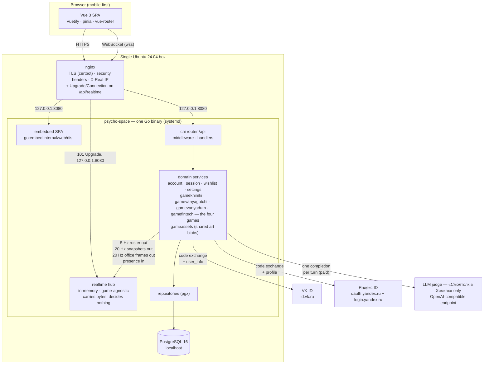

**Why one binary.** The SPA is compiled into the executable, so a deploy is a single file plus a restart, and nginx never needs to know about static asset paths. See [§8 → ADR-001](#adr-001--the-spa-is-embedded-in-the-go-binary) for why, and for what it costs.

**There are two ways in, and only one of them is a request.** Everything except the yard is request/response over `/api`. «Ванягоччи» additionally holds a WebSocket, which nginx must be told about explicitly — an upgrade is not a proxied request and the `Upgrade`/`Connection` headers do not survive a default `proxy_pass`. Inside the binary the hub is deliberately **not** a domain service: it is transport, it knows no game's vocabulary, and a game reaches it through two narrow seams — publish out, query presence in ([§8 → ADR-033](#adr-033--a-game-reads-the-socket-through-a-game-agnostic-handler-and-pulls-presence)). Note also what is **not** in the diagram: no cron, no worker, no queue and no Redis. Three loops do recur, and **none of them ticks anything durable** — which is the rule, rather than "nothing recurs". The yard's 5 Hz broadcast reads an in-memory cache and never the database ([§2.6](#26-one-tick-of-the-yard)), «ВАНЯДУМ» runs a 20 Hz simulation over one shared заброшка that lives only in memory and touches Postgres once per visit ([§2.7](#27-one-step-of-ванядум--the-first-thing-in-this-system-that-simulates)), and «СИМУЛЯТОР ФИНТЕХА» runs a 20 Hz simulation over one shared office that touches Postgres once per shift ([§2.8](#28-the-office-loop--the-whole-of-it-both-ends-with-the-latency-ledger)).

## 2. Runtime views

### 2.1 Login — a confidential backend exchange, at either of two providers

There are two doors, **VK ID** and **Яндекс ID**, and everything behind the moment an identity is established is shared: the consent gate, the CSRF check, the account upsert, the session, the allowlist. Only the exchange differs, which is why `internal/httpapi` holds a narrow `oauthProvider` seam and the two provider packages know nothing of each other ([§8 → ADR-054](#adr-054--an-identity-is-a-provider-and-a-blind-index-and-a-second-provider-is-a-second-account)).

The authorization code is exchanged **on the server**, so no confidential credential — VK's service token, Yandex's client secret — ever reaches the browser. A session cookie is issued even for `pending` and `blocked` accounts: it identifies without authorizing, because `requireAuth` still demands `status == approved`. See [§8 → ADR-007](#adr-007--a-session-cookie-is-issued-even-for-pending-and-blocked-accounts) for why.

**A login is an identity at a provider, not a person.** `accounts` is unique on `(provider, identity_ref)`, so the same numeric user id arriving from both providers is two accounts rather than one — which it must be, since both hand out small integers and the blind index is taken over the raw id. Logging in with Yandex having previously used VK therefore produces a **new** account: there is no linking, deliberately ([ADR-054](#adr-054--an-identity-is-a-provider-and-a-blind-index-and-a-second-provider-is-a-second-account)).

**Yandex's authorize URL is built by the server; VK's cannot be.** VK's SDK constructs its URL in the browser, so the app id and the redirect path must also exist in `web/src/constants.ts` — three copies of a string that must agree byte for byte, and the source of the 405 incident below. Yandex needs no SDK, so `GET /api/auth/yandex/state?code_challenge=…` returns the state **and** the finished `authorize_url`, and the client id and redirect URI live only in the server's environment. Two copies instead of three, and the SPA can never be the stale one ([ADR-055](#adr-055--the-authorize-url-is-built-by-the-server-wherever-the-provider-allows-it)).

**The redirect URL is a page, and the exchange endpoint is not — for both providers.** VK's `redirect_uri` is `https://psycho-space.ru/auth/redirect` and Yandex's is `https://psycho-space.ru/auth/yandex/redirect`; both are routes of the SPA (`AuthRedirectView.vue` serves both, taking the provider from the route rather than from a query parameter, which would be attacker-controlled).

For VK, in the ordinary flow nothing is ever navigated there: the OneTap widget finishes inside a VK-hosted frame and hands `{code, device_id}` to JavaScript, which POSTs to `/api/auth/vk/callback` from the page it is already on. But when the widget cannot finish in place — VK's own in-app WebView, a blocked popup, partitioned third-party storage, or the "войти другим способом" path — VK navigates the whole browser to `redirect_uri?code=…` with **GET**, and that landing must be a page. It used to be `/api/auth/vk/callback`, which is POST-only, so those browsers got a bare **405** and could never log in; `TestVKRedirectTargetIsServedAsAPage` and a full-stack case pin both halves. **For Yandex the navigation is the only path** — there is no widget — so the same trap is pinned again by `TestYandexCallbackRejectsGET` and its full-stack twin, and the Yandex app must carry only the page in its Redirect URI list.

Copies that must agree exactly or every login fails: for **VK**, three — `VK_REDIRECT_PATH` in `web/src/constants.ts` (sent at authorize), `PSYCHOSPACE_VK_REDIRECT_URI` (echoed by the backend at the token exchange, which VK matches byte for byte), and the redirect URL registered on the VK app. For **Yandex**, two — `PSYCHOSPACE_YANDEX_REDIRECT_URI` and the Redirect URI registered on the Yandex app — because the SPA never sees it.

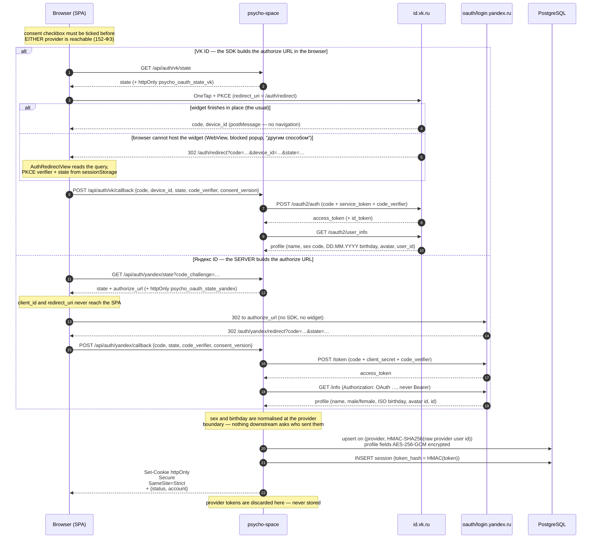

### 2.2 A wishlist upvote (the shape every gated request has)

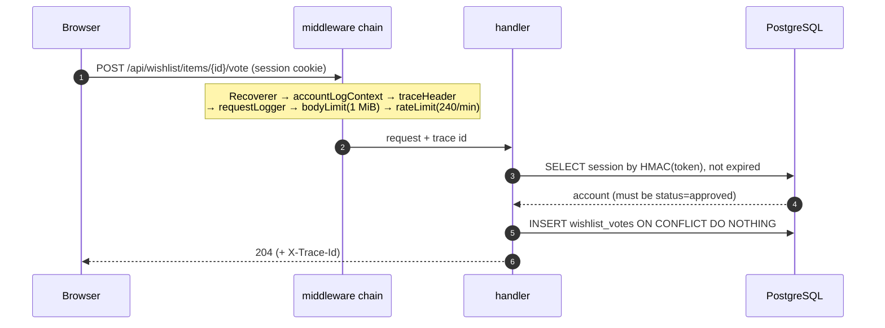

Any non-2xx answers `{error: "<stable_code>", trace_id}` — never `err.Error()` — and the SPA shows the trace id in a copyable modal. See [§8 → ADR-024](#adr-024--errors-carry-a-trace-id-and-never-carry-the-error-text) for why.

### 2.3 A turn in «Смолтолк в Химках» (the only paid path)

**This flow is specific to «Смолтолк в Химках»** — the LLM-judged dialogue game in `internal/gamekhimki/`, served under `/api/game-khimki/*` — and nothing in it generalises to another game. The second game, «Ванягоччи» (realtime, live), makes no LLM call on any path: [§8 → ADR-016](#adr-016--no-realtime-message-may-reach-the-llm) forbids a realtime message from reaching the judge at all, so «Смолтолк в Химках» is the only paid path in the system, not merely the first one.

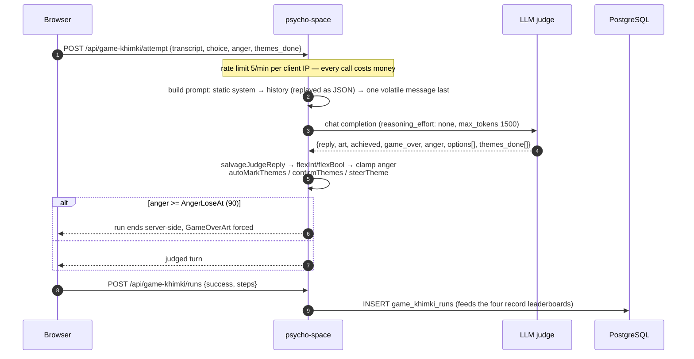

The prompt order is load-bearing, and so is the shape of the history: static system prompt → each past turn replayed as the JSON the judge returned → one volatile message last. See [§8 → ADR-013](#adr-013--the-prompt-is-laid-out-for-prefix-caching-and-history-is-replayed-as-json) for why. Measurements and per-turn costs: `RUNBOOK.md` → *Working on the game*.

### 2.4 The pet in «Ванягоччи» — a GET that writes, and a verb over the socket

**This flow is specific to «Ванягоччи»** and is the shape every time-varying thing in the system takes ([§8 → ADR-038](#adr-038--time-varying-state-is-computed-on-read-never-ticked)). It covers both halves of how a pet changes, because they are two ends of one rule rather than two features — and they arrive over **different transports**, which is itself a decision ([§8 → ADR-043](#adr-043--a-verb-travels-over-the-socket-and-is-answered-with-state)). Nothing runs on a timer, so the **read** is an ordinary `GET` and is what creates the pet, seeds its stats, decays them and records a death — all by the request that happened to look. A **verb** is not a request at all: it travels over the socket as one frame, is folded into the pet by the single `Service.Do` that a replay also goes through, and is followed by *state* rather than answered by a body.

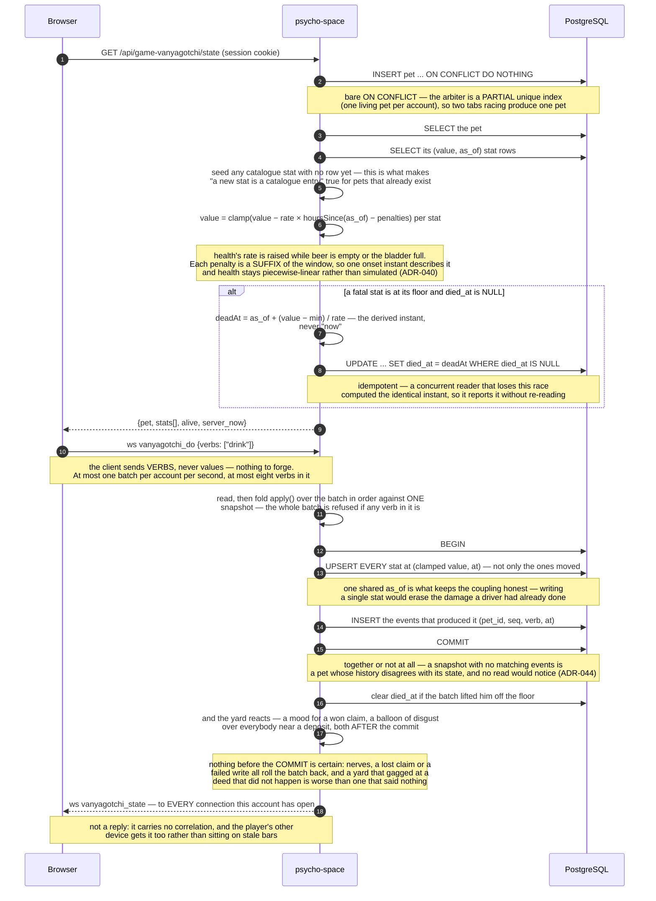

**A verb may be gated on where he is standing**, and that check lives on the live path alone. `Action.NeedsNear` names a world-object kind; `Do` asks the in-memory placement — at the instant the batch is folded, so a walk in progress is judged by where he has actually got to — and refuses with «далековато» if he is not beside it. It is deliberately **not** inside `apply`, which has to stay a pure function of `(Snapshot, Event)`: a replay of last March's drinks has no idea where anybody was standing, and finding out would put a query inside the fold. So the event log records that the drink *happened*, never that it was allowed. It is evaluated immediately after `apply`, per verb, which is what keeps being dead ranked above being far away.

**The world is fuller, and one thing in it wanders.** Every location has regulars now — the cast used to live entirely in the yard, so four of the five places had nobody in them and a player who travelled arrived somewhere that felt switched off. And the **beer crate moves**: a replacement is stood up in a randomly chosen location, where it used to be pinned to one square of двор. It is placed like a key in that the location is drawn at random and unlike one in where it lands — a hidden thing goes to a **hotspot**, because a hotspot is what a player taps to search, and a visible one must stand a full `arrive_within` clear of every one of them. Both came out of the same call briefly, and both consequences turned up: drinking and searching became the same tap, and a deposit left by somebody standing at the shop landed on coordinates a key could later be hidden at, which is the one thing hiding it is for. That reverses an argument its own catalogue entry made — a shop nobody can be told to walk to — and what answers it is that the roster already carries where the shop is, so the yard's readout names the place and the splash says the crate wanders rather than naming one. One consequence is worth stating because it was designed away before and is now accepted: a crate can land far enough from a location's entry that a newly-arrived Ваня may give up on the walk and have to ask again. And one thing the server now has to know about the screen, stated rather than hidden: **the yard's two bottom corners are interface** — the place caption and the verb button — and both swallow the taps that land on them, so nothing may be placed there. It is a placement rule («do not put a thing where nobody can reach it») rather than the server learning CSS, it applies to the catalogue's hiding places as well as to what the server stands up, and it is enforced by an invariant test. It was found the hard way: «подъезд» sat in the button's corner and was untappable for as long as the button existed.

**A deed the yard can see, the yard answers.** Two of them do. Relieving himself puts a line over everybody standing near him in the same location, and **finding the keys puts one over everybody who did not** — envy rather than congratulation, drawn from its own pool, beside the sad face that was previously the entire consequence of losing. A face for four seconds is a small thing to hang a mechanic's payoff on and easily missed by somebody looking at another corner of the yard. Both include **the regulars**, which is the point of them: on a quiet evening the yard is one player and three of them, so a players-only reaction would be invisible in its commonest case. They are the only balloons in this game somebody else's action produces; every other is a Ваня narrating himself. Both are filtered by PLACE first — the room is the whole world, so an unfiltered reaction would gag somebody standing in лифт at something that happened in заброшка — and the deposit is filtered by distance on top, because arriving is about touching a thing and smelling one is about being anywhere near it. Envy needs no distance: a face going sad is already location-wide, and a yard that pulled a face at something it would not comment on would be stranger than one that does both. The line is hashed per witness, so four people object in four different voices rather than in chorus, and it costs the wire nothing — it rides the `say` field the frame already carries.

**And a verb may simply not come off.** `Action.FailChance` is a probability the catalogue attaches to a verb — «покакать» carries a quarter — and it is rolled in `Do`, last of the gates and never inside `apply`, for the same reason the movement gate is not: a coin flip inside the fold would make a replay of one history produce a different pet every time it ran. Losing is a **refusal**, which is what makes it cost nothing to get right — the batch rolls back before the transaction is opened, so no stat moves, no event is appended, no deposit is left and the lifetime tally does not tick, and the log therefore records that he *went* rather than that he was willing to. What reaches the player is a line drawn from a pool in the catalogue and carried out on a **typed** error (`ShyRefusal`), because that sentence is chosen by the same hash as the roll and belongs to that particular loss of nerve; `refusalLine` reads it with `errors.As` where every other refusal maps from a sentinel. The chance is **served** so the splash cheatsheet derives the odds rather than anybody typing them, and it is deliberately the one rule the client does **not** grey a button for — the failure is the joke, and a control that greyed itself at random would read as broken.

**Finding the key is a search, and the key is not on the wire at all.** Its `ObjectKind` is `Hidden`, so the broadcast skips it before it can become an entity — the row keeps its `x`/`y`, and those coordinates never leave the process. What the client is given instead is the location's **hotspots** from `/config`: static, public candidate hiding places. Tapping one walks the Ваня there with an ordinary `vanyagotchi_move`, and on arrival the client sends the claim **naming that spot**. Where the key hides is *stored rather than derived* — `crypto/rand` picks a hotspot when the row is spawned — which is stronger than deriving it under a process-lifetime secret would have been: it is not derivable at all, it survives a restart rather than silently moving the key out from under somebody mid-search, and it invents no second secret. The browser learns *which verb searches* from a derived `needs_spot` capability on the action, never from a key.

**A verb is followed by state, never answered by a body**, and the refusal path is the same path as the confirmation. What the server decided appears as a line over the player's own Ваня, carried in the next 5 Hz roster — so the rest of the yard reads it too, and a Ваня who is dead still carries it, because «он не встаёт» is the server talking to his owner rather than the corpse talking. Nothing on the client waits for any of it: the roster is already the reconciliation channel, so a verb that is dropped is simply pressed again. The reasoning is [§8 → ADR-043](#adr-043--a-verb-travels-over-the-socket-and-is-answered-with-state).

`server_now` is in every read so the SPA can keep the bar creeping between fetches against the **server's** clock rather than the phone's, and each stat carries the **effective rate it is suffering right now** — which is generally not the catalogue's rate, because a penalty may be active. Sending it is what stops the browser needing its own copy of the coupling. That interpolation is display only: the client never sends a value back, and every verb is followed by the state the server computed, so a screen that has drifted is corrected the moment the player does anything.

### 2.5 Realtime connection lifetime

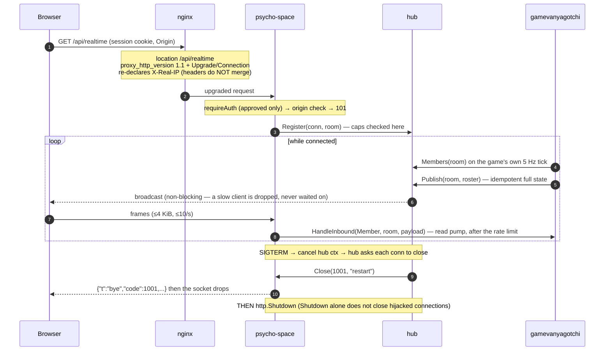

**The hub carries bytes and decides nothing.** A game publishes through it and reads from it across two game-agnostic seams — a `Handler` for inbound frames and a `Members` query for presence — so `internal/realtime` contains no game's vocabulary and «Ванягоччи» owns its own wire types. See [ADR-033](#adr-033--a-game-reads-the-socket-through-a-game-agnostic-handler-and-pulls-presence) and [ADR-034](#adr-034--the-broadcast-tick-is-injected-and-belongs-to-the-game).

**On the browser side** the socket is owned at module scope (`web/src/realtime/socket.ts`), not by a component: the yard is a lazy child route, so a component-owned socket would re-handshake on every navigation and spend another of the three connections the server allows per account. Its lifetime follows a subscription refcount with a grace period rather than the route. The rule that governs everything rendered from a frame is written in that file and in `web/src/lib/vanyagotchiPlane.ts`, and is worth knowing before touching either: **membership is reactive, positions are not.** Who is present goes through pinia and a keyed list; where they are is written straight to two CSS custom properties, because a 5 Hz frame bound to reactivity costs a scheduler pass and a vdom patch per entity to produce a transform the compositor could have been handed directly.

The reason arrives as a **frame**, not as a WebSocket close code — a browser sees `1006` for every disconnect and reads the reason from the last `bye` frame instead. Codes: `1001` planned restart (reconnect promptly), `1013` evicted or over a cap (back off), `4001` session revoked (terminal — stop). See [ADR-018 · *The close reason travels as a frame*](#adr-018--the-close-reason-travels-as-a-frame-not-as-a-close-code) for why, and [ADR-019 · *The read pump must not observe shutdown*](#adr-019--the-read-pump-must-not-observe-shutdown) for the library trap that makes the ordering load-bearing.

### 2.6 One tick of the yard

**This flow is «Ванягоччи»** and it is the other half of the game — [§2.4](#24-the-pet-in-ванягоччи--a-get-that-writes-and-a-verb-over-the-socket) is the pet in Postgres, this is the plane in memory. Three things happen at three different rates, and keeping them apart is the whole design: the **database is read once**, when a client says hello; a **tap** is accepted whenever one arrives; and the **broadcast runs five times a second and touches nothing but memory**.

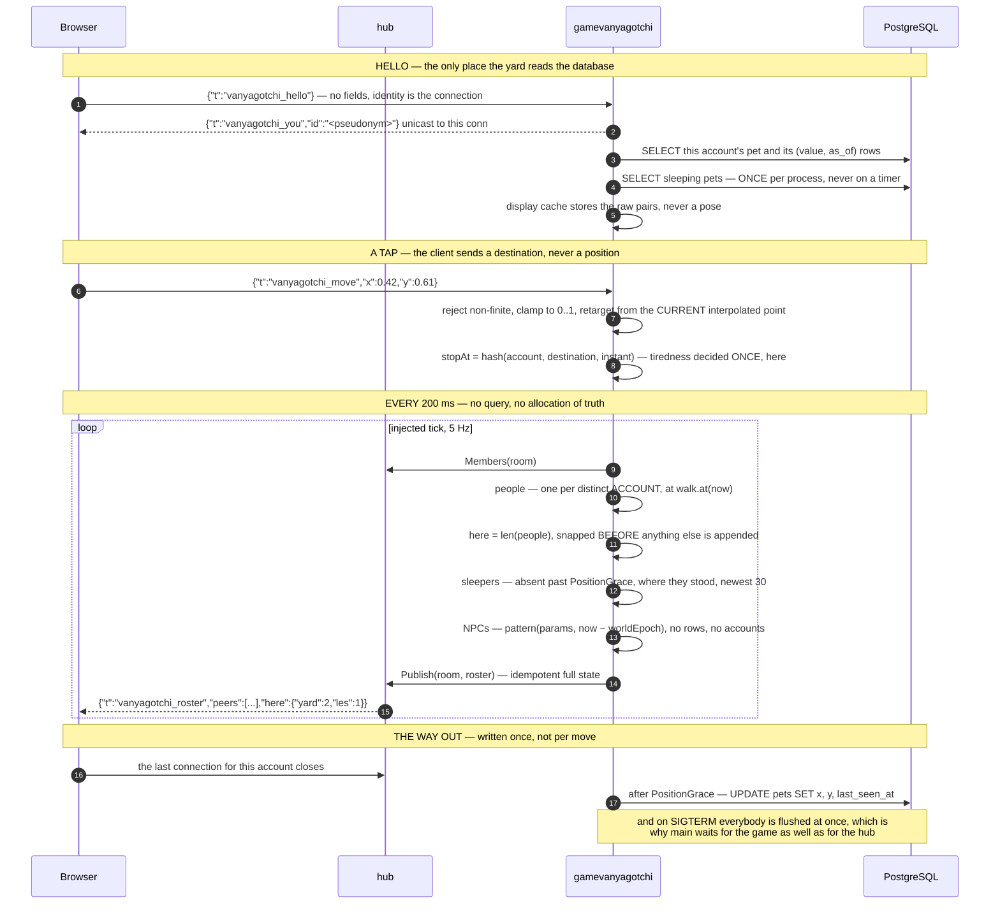

**The tick never touches Postgres, and that is a constraint rather than an optimisation.** At 5 Hz a query per entity per frame would be a self-inflicted load test, so appearance comes from an in-memory cache filled on hello and refreshed whenever that client acts over HTTP. What the cache holds is the **raw `(value, as_of)` pairs, not the pose** — a pose expires, so a cached one would show a healthy Ваня who has been dying since lunchtime, whereas a cached pair stays exact for the same reason the whole decay model does ([§8 → ADR-041](#adr-041--the-broadcast-tick-renders-from-a-cache-and-position-outlives-the-process)).

**Nothing on the plane integrates a velocity.** An NPC is `pattern(params, now − worldEpoch)` and a player is a point along a walk with a known start, so a tick that is late, early, skipped, duplicated, or served to a client that has just reconnected still produces the correct world. That is what makes a GC pause cost nothing and stops two people's yards drifting apart while neither reports a fault ([§8 → ADR-042](#adr-042--everything-that-moves-is-a-function-of-absolute-time)). It is also why an NPC needs no row and no account: there is nothing about one to store, so adding one is a catalogue entry with **no migration and no client deploy**. The same rule reaches past motion to anything that appears and disappears: a Ваня's speech balloon is a phrase pool indexed by hashing (account, time-slot), so it needs no timer, stores nothing, expires by arithmetic rather than by cleanup, and every client independently computes the same words at the same moment.

**The frame is idempotent full state — there are no deltas and no announcements.** A dropped frame therefore costs exactly nothing, because the next one is the truth again, which is what lets the hub drop a slow client's backlog instead of blocking on it. It is also why a world *event* has to be state in the frame rather than a one-shot message: a one-shot arrives once or never, and "never" is indistinguishable from "it did not happen".

**Three kinds of entity, and the client cannot tell them apart on purpose** — connected people, sleepers, and NPCs are the same shape on the wire. So the count of people is sent explicitly as `here` rather than derived by the browser: making the client work it out would mean teaching it what an NPC is, and the point of the envelope is that it does not know. With five places it is a **map** rather than a number, `{"yard":3,"les":1}` — the frame carries every location at once and the client filters on each entity's `loc`, so it could not count its own place by filtering without learning exactly the distinction the envelope withholds ([ADR-045](#adr-045--a-location-is-not-a-room--the-roster-is-filtered-not-split)). An empty room publishes nothing at all — silence, not a roster of NPCs talking to themselves.

**Position is in memory, written down only on the way out.** A place survives a page reload because absence is not departure — it is held for a `PositionGrace` of two minutes after the last socket closes — and survives a *deploy* because the last disconnect (and shutdown, for everyone at once) writes it to `pets.x` / `pets.y`. A crash still loses whatever had not been written, and that is accepted rather than fixed. The reward for making it durable is that an absent player can be drawn asleep where he stood instead of vanishing, which is what keeps the yard from being an empty field when only one person is online.

### 2.7 One step of «ВАНЯДУМ» — the first thing in this system that simulates

**This flow is «ВАНЯДУМ»**, the shooter, and it is the one place in this project where a loop advances state because time passed. It is here rather than folded into the yard's tick because it is a different KIND of thing: [§2.6](#26-one-tick-of-the-yard) renders a world that is a closed-form function of the clock, and this one integrates a world that is not.

**Collision is why.** Every other moving thing in this system is `pattern(params, now − epoch)`, so a tick that is late, early, skipped or duplicated still produces the right answer ([ADR-042](#adr-042--everything-that-moves-is-a-function-of-absolute-time)). Where a player is after walking into a wall depends on every wall he slid along getting there — a path, not an expression — so it has to be stepped at a fixed rate.

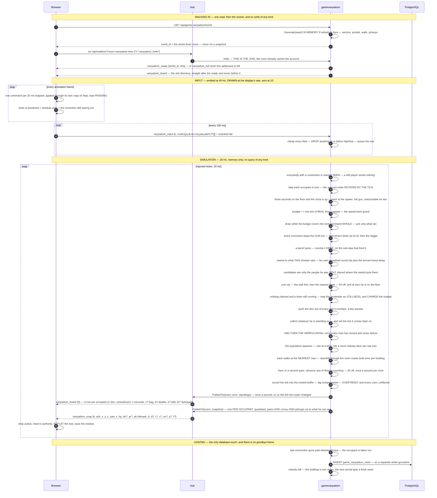

**There is one заброшка and everybody is in it**, which is the shape this game arrived at second and the office arrived at first ([ADR-060](#adr-060--there-is-one-заброшка-nothing-ends-and-a-run-became-a-visit), [ADR-056](#adr-056--the-office-is-one-process-wide-arena-not-one-per-run)). Nothing ends, so there is no run, no objective and no result: you open a socket, you are in the building, and you leave by closing the tab. The building is generated on demand, **torn down by the tick that removes the last occupant**, and regenerated fresh by the next arrival — so nothing is ever replaced under somebody's feet and the level is never re-sent mid-session. A client holding a level it fetched earlier finds out from the `world_id` on its ready frame, which is the only invalidation signal there is. It holds `MaxOccupants`, and one arrival past that is told so with a `vanyadum_full` frame rather than being left watching an empty screen.

**Nothing about this ticks durable state**, which is what keeps it on the right side of [ADR-038](#adr-038--time-varying-state-is-computed-on-read-never-ticked). The world lives behind one pointer in one package, Postgres is written **once per visit** — when somebody's last connection has been gone past the grace — and never on a tick, and the building is deliberately lost on restart in the same way the hub's presence is. What a restart costs is the заброшка everybody was standing in, and the next hello builds another.

**The world is not a room, even now that it is shared.** Membership of the room and presence in the building are the same fact, so the hello *is* the join — but the platform still knows only that this game listens in `vanyadum`, and each snapshot is addressed to a **connection** rather than broadcast, because a frame names everybody except its own reader. A room per run was refused for the reason [ADR-045](#adr-045--a-location-is-not-a-room--the-roster-is-filtered-not-split) refused a room per location: it would teach an unprefixed platform file what a run is. There are no runs left to make rooms of, and what survived is one line's worth — `httpapi` holds a **map of room name to handler**, so the set of valid rooms is exactly what `main` registered, and each game exports its own room name. Carrying one shared world instead of several private ones needed no change to `internal/realtime` at all.

**Two frames go out, and they answer deliberately different questions.** A **snapshot** is what one person can SEE — built per occupant twenty times a second, naming everybody except its own reader **and every нейрослоп on the same terms**, and cut to that reader's own sector and the sectors joined to it by a portal. The sector graph already carries that adjacency, so the filter is a table of booleans built once per building rather than a line-of-sight sweep over every wall for every pair on every tick; it over-sends and under-sends by at most a room, which is the trade every adjacency-based visible set makes, and it is **symmetric by construction** — which stopped being tidiness the day the обрез started landing, because the hit test is now confined to exactly this set, so nobody is killed by a man his own client was never told about. **Leaving the set is held for `visibleHold` rather than being instant**, and that hysteresis is not a polish item: a sector is *derived from a position*, so a man standing in a doorway belongs to whichever room the last sub-centimetre of movement put him in and crosses back at up to the tick rate without walking anywhere — which drags the whole visible set with him, and a third room adjacent to one of the two joins and leaves the frame twenty times a second while the people in it strobe. It happens at both ends, a jittering *reader* as much as a jittering peer, and the answer is a memory rather than a smoothed position: sent while visible **or** visible recently, so a set that keeps coming back never goes away. A hold can only **add** to a filtered set, so it cannot exceed the unfiltered one the wire budget is taken on. **The rewind buffer records everybody and every слоп regardless**, filtered or not: what is sent is a view, and a shot is resolved against the world as it actually was. The **standings** are what is TRUE of the building — everybody in it, how long each has been inside, what each is carrying — unfiltered, including the reader, and therefore identical for every reader, so it is marshalled once and the same bytes are written to every connection. It is the only frame in this game addressed to nobody in particular. It goes out once a second **and on the tick the roster changed**, ahead of that tick's snapshots, because a snapshot addresses a peer by a **slot** and a slot is handed to somebody else once its holder leaves: a client that has not yet been told whose slot it now is would label the newcomer with the last holder's name and interpolate him from where that man was standing, drawing one figure sliding across the building into another's position. Interest management is why the typical frame is small; it is **not** why the building holds the number it holds, since capacity is derived from the worst frame — everybody in one room, where the filter removes nothing. Shrinking the peer entry from 71 bytes to 49 bought a fifth place ([ADR-060](#adr-060--there-is-one-заброшка-nothing-ends-and-a-run-became-a-visit)), damage spent it again on the peer's 7-byte state field, and **the нейрослопы spent the fourth**: the building now holds **three people and two слопы**, with 71 B/s of headroom against the 8 kB/s ceiling. That last trade was not a field being trimmed until it fitted — four people and *one* слоп are already over — so the honest choices were a smaller building or a different encoding, and this is the smaller building.

**Two people in one building need two orders, and collapsing them into one breaks something either way.** The wire is filled in **slot order**, which is stable by construction — a slot does not move while its holder is in the building — and is the order the standings lists the same people in, so a client reading the two frames together never has to sort either. The rewind buffer is keyed by that same slot, because a rewound world and a published one have to name the same things and a slot is the only name a client has for anybody. The step loop runs the occupants in account order **rotated by the tick**, because collecting mutates world-wide state, so whoever steps first takes a contested bottle, and any one fixed order would hand that to the lexicographically smaller account for the life of both accounts. Determinism survives the rotation exactly, since the tick is part of the world's state: the same seed and the same transcript still replay frame for frame. Neither order is ever Go's map order, which is randomised per range and would quietly cost both properties at once.

**Nothing ends, so the building has to refill itself.** A collected pickup comes back where it stood, thirty seconds later, and the whole mechanism is a **deadline in ticks** indexed by position in the level's own list — the same key the snapshot's remaining-mask uses, so the two cannot disagree, and an integer where a float countdown would drift by the step's binary expansion. **A respawn travels on that mask and nothing else:** the mask is idempotent full state, so a bit going from clear to set *is* the announcement, and a client marking the moment diffs it against the previous frame. An "it came back" event would be bytes on a payload repeating twenty times a second, per viewer, to say nothing almost every time it was sent.

**Simulated time is spent, not claimed.** This is the security property that a per-field clamp cannot provide. The socket allows ten frames a second, each carrying four sub-steps of up to 0.2 s, so a client filling every frame asks for eight seconds of simulation per real second — with **every individual field in range**. So each **occupant** accrues a budget at exactly real time and spends it, with a half-second cap so that an honest burst from a phone that was backgrounded can still catch up ([ADR-048](#adr-048--the-simulation-is-a-server-owned-fixed-step-tick-over-one-in-memory-world), [ADR-049](#adr-049--input-is-batched-to-fit-the-sockets-bound-never-to-loosen-it)).

**Two rules govern that queue, and they are the first two of the three [§2.8.5](#285-the-three-rules-the-input-path-lives-by) states for the office.** They are the same two defects at both ends: the office is where they were found, and this is the game that had shipped them first.

- **A repeat is dropped against what has been ACCEPTED, not against what has been applied.** A frame carries four sub-steps of 25 ms where one 50 ms tick affords two, so about half the queue is always accepted-but-not-yet-simulated, and deduplicating on the acknowledgement lets exactly those through a second time — the redundancy window then buys distance instead of insurance. Measured here: **1.25 m walked where 1.00 m was asked for**, a quarter more than anybody pressed anything for. It compounds, because a duplicate lengthens the queue and a longer queue duplicates more of the window — which is why the numbers recorded for the office are different ones: the same defect measured at a different queue depth, rather than a different bug. Pinned by `TestEightSubStepsWalkExactlyEightSubSteps` on the world and by `TestVanyadumRedundantInputBuysInsuranceAndNotDistance` over a real socket.
- **A command is simulated whole or it waits.** The acknowledgement is one sequence number and the client drops everything at or below it, so a command run in part and acknowledged in full leaves the client holding movement the world never simulated, permanently. That is expensive in a shooter specifically: the player is drawn further down the corridor than the server has him, so he slides along a wall the server says he already cleared and every step afterwards is resolved against different geometry. Pinned by `TestACommandLargerThanTheBudgetWaitsWholeRatherThanBeingTruncated`, which also rests on `MaxStepSeconds` staying below `TimeBudgetCap` — retune one past the other and an occupant who sends a maximal command freezes for ever, so that relationship has a test of its own.

**The обрез is the first state on `Player` that is read-modify-write**, and it is what the paragraphs below exist for. Two barrels, a 0.35 s cadence between them, a 1.5 s reload that **only a trigger pull on an empty gun starts** — so pulling on an empty gun is always answered, with a shot or a reload or nothing at all when there is no beer, and the whole weapon is one rule read top to bottom rather than a rule plus an "and also, when it happens to empty" clause. Beer is what it spends, which is what finally makes walking to a bottle worth the walk. Its countdowns are **seconds decremented by the command's own `dt`, not deadlines in ticks** — the exact opposite of the respawn above, and the difference is worth stating so it does not read as an inconsistency: a respawn belongs to the *world*, which owns the tick, while the gun belongs to the *player*, and a player is advanced by `Step`, which is pure and knows no tick because the browser runs it too. Both ends fold the same commands in the same order in IEEE754 binary64, so the accumulated countdown is not approximately equal on the two sides, it is bit-for-bit equal. **And it now hits people, which is the four paragraphs below.**

**A shot is resolved on the sub-step that fired it, and the barrel count is what says one did.** Nothing else in the simulation lowers `Loaded` — a reload only ever raises it — so the world watches for that fall rather than being told separately, which is the same reading the client makes of its own frame instead of a second definition kept in step with it by hand. It is resolved *there*, inside the drain loop, and not once at the end of the tick, because a frame carries four sub-steps: a player who pulls the trigger on the first and walks through the other three was aiming from somewhere the tick's final position is not. **The ray itself is pure** (`hit.go`) — a function of the level, an origin, two angles and a list of bodies, with no clock, no world and no map iteration — for the same reason `Step` is: a shot is then table-testable and cannot depend on which occupant happened to be ranged over first. A body is the **same disc the collision resolver uses**, standing on the floor of its own sector and `BodyHeight` tall, so what you can be hit through is what you can walk through; occlusion is measured in plan and that is **exact rather than a simplification**, because a wall spans its room floor to ceiling and a doorway is a full-height gap cut out of the wall list itself, so there is nothing to shoot over and nothing to shoot under. The nearest body strictly nearer than the nearest wall wins, and only one — a spread would be several rays and a damage split, which is more rules than "the shot went where you aimed it" needs. There is **no range limit**, deliberately: what bounds a shot is the paragraph below, and that leash is shorter than any number typed into the file.

**You can hit exactly what you were sent, and this is where rung four finally has a caller.** The rewind is composed in `history.go` and not re-derived at the call site — this shooter's own smoothed round trip plus the served interpolation delay, clamped to `RewindMax` — and it places everybody *else*: **the shooter is not rewound and neither is his aim**, because his position is what his own client predicted and has just been acknowledged, and his yaw and pitch arrived with this very command. Both are already current, and rewinding either would fire from a place he was not standing, pointing somewhere he was not looking. That is [ADR-059](#adr-059--the-catch-is-resolved-in-the-victims-timeframe-because-being-caught-is-a-hit-test)'s split transferred whole even though none of its code is; the sibling game reached it first, from a catch rather than a bullet. Two rules then narrow the candidates, and both are load-bearing. **The past decides where, the present decides whether**: a target is *placed* by the rewound frame and *disqualified* by the world as it is now, so somebody who has since died is not killed twice and somebody who has since got up is untouchable for as long as his protection lasts. And **a shot may only land on somebody the shooter was actually sent** — the geometry would happily carry a ray through two lined-up doorways into a room the visible-set approximation does not consider adjacent, and the man standing there was never on the shooter's screen, so it would be a kill nobody could see coming and nobody could see happen. That is why the symmetry of `buildVisibility` above is a security property rather than a nicety, and it is why the rewind buffer records everybody while the hit test reaches only the filtered set.

**Death is three seconds and nothing else.** Fifty off a hundred means a full gun is exactly one kill, so a fight is decided by whether the two shots you already have land rather than by who walked over more bottles. At zero the gun's timers are cleared with him — a reload finishing under a corpse would hand him a weapon still busy for something he did three seconds and one death ago — and a deadline in ticks says when he gets up, at the level's one spawn, with a full gun, **his bag intact** (taking the beer as well would make one unlucky corner cost a second walk and would compound whoever is already winning) and **his own angles untouched**, because snapping a first-person view somewhere the player did not point it is the one thing this game may never do. He comes back with `SpawnProtectSeconds` in which he can neither be hurt **nor shoot** — both halves, or one заброшка with one spawn point and killable friends makes standing on it with a loaded обрез the obvious grief, and protection you can fire from hands that grief to whoever died last. Which of two men who shot each other on the same tick dies is decided by the step order, which rotates by the tick for exactly this reason; the loser's own trigger is then refused because a man with no health does nothing at all. **Friendly fire is on**, so shooting a friend is possible and scores nothing: it is counted as a **betrayal** on the standings, on its own line beside the kills, and increases no total anywhere. That column used to be the only one there was, because there was nothing else in the заброшка to shoot; the нейрослоп below is what gave the board a second column to say what the game thinks of what you have been doing.

**It is not predicted, and that is a deliberate asymmetry with everything else here.** The client predicts its own movement and its own gun because a camera that waits for a round trip is unusable and a muzzle flash is honest only if the browser already ran the refusal the server is about to run. It does **not** predict whether it hit anybody, because that is a question about somebody else and the only honest answer is the server's — so `hit.go` is the one part of this simulation with no counterpart in the port. The browser draws the flash immediately and learns the rest a round trip later, from the state on the next frames: **a hit moves nobody**, so it cannot be derived from a position the way a shot is derived from a falling barrel count, and it is the one thing here that had to buy a field. One field serves the whole room — the victim is marked, and the shooter reads "I connected" off that same mark, since he knows he fired and the man he aimed at lights up on the same frame — which is what keeps it to seven bytes and no shooter-side field at all.

**And there is now something in the building that is not a person.** The **нейрослоп** walks at the nearest man, dies to one barrel, and has no other behaviour at all: no line of sight, no aggression radius, no memory, no retreat and nothing ranged. That flatness is deliberate rather than unfinished — every rule an antagonist has is a rule the splash cheatsheet has to state, and this one is stated in two lines. It is the **same disc as a man**, walked by the player's own collision resolver at `PlayerRadius` and shot with the player's own body model, so what fits through a doorway is what can be shot through it and what can follow you through it. Its whole simulation is pure (`slop.go`), for the reasons `Step` and the ray are: a table test can state it, and a transcript replays to the same building. It is **not in the client port and never will be** — a player's own movement is predicted because a camera cannot wait for a round trip, and a creature's intent is not the player's to know, so it is interpolated in the recent past exactly as a peer is, which is also what makes the ordinary rewind the right thing to resolve a shot at one against.

**How it finds you is a table, and the table is built once per building.** Straight at the man when they share a room — rooms are rectangles with nothing standing in them — and otherwise at the middle of the doorway that leads towards him, re-planned every tick because the thing it is walking at moves. What makes that affordable is `buildRoutes`: a breadth-first flood from every room, all pairs, computed when the заброшка is generated and read twice a tick with no allocation — the same shape as the visibility table beside it, and the same argument, because a building is a dozen rooms. The sibling office's antagonists have the same *shape* and none of the same code: an опенспейс is one open floor with furniture in it, so its navigator is a grid, and re-implementing rather than sharing is [ADR-028](#adr-028--games-are-self-contained-modules) working as intended. Ties everywhere are broken by something fixed — the nearest man is the first of the closest in the stable key order, the doorway is the lowest portal index — because a tie settled by Go's map order is a world that stops replaying.

**Where the слопы run in the tick is the fairness, and it is two passes rather than one.** They are stepped **after every man has moved and never before**: a creature that walks at where somebody *was* is permanently 50 ms behind, which at `WalkSpeed` is a quarter of a metre of free ground every tick for the whole chase. Then, in a **second** pass, contact is tested — everything moves, and only afterwards does anything land, because a touch resolved inside the movement loop would test the first слоп against a position the second is about to be pushed out of, and which of two touching creatures hurt you would depend on the order they were stepped in. The spawner runs **before both** of those passes, so a слоп arriving on this tick is stepped and can be reached on it rather than standing still for one frame for no reason a player could see. **And inside the walking pass they are pushed apart**, because they converge by construction rather than by accident: every one of them walks at the nearest man through the same table at the same speed, so two whose paths have met compute an identical heading for ever and lock into one figure — a player then takes contact damage from two creatures on two independent cooldowns while seeing one, and a ray through coincident bodies is undefined about which it hit. **The lower id never yields**, which is the design rather than a detail: splitting the overlap would make each one's position a function of the other's, so a shot resolved at one, and everything the rewind ring recorded about it, would shift because a second creature happened to walk into it. It is the same rule as the sibling office's `Separate`, re-implemented rather than shared ([ADR-028](#adr-028--games-are-self-contained-modules)). **Reaching somebody takes `SlopDamage` off him once per `SlopTouchInterval`**, and that is the whole of the new rule: it is not given a way of killing anybody, it is given a way of taking health off, and everything about being on the floor, getting up, the spawn and the protection is whatever the обрез already made happen. One man per touch, because the cooldown belongs to the creature and one standing between two people is not hitting both twenty times a second. **A man on the floor and a man inside his spawn protection are not targets** — the second because a window that stops a barrel and not a слоп would make getting up at the building's one spawn survivable against friends and fatal against the building, at exactly the two seconds you cannot shoot back.

**The population is kept rather than scattered, and nothing appears where anybody is looking.** A заброшка stocked at generation time is one that is permanently cleared the first time somebody with a full gun tours it, and nothing here ends — so a spawner tops the building up **one at a time** on `SlopSpawnInterval`, which makes the interval the whole of the difficulty and makes clearing both buy two of them rather than one. It picks a room **nobody alive can see into**, reusing the visible set as a table lookup: everything else in this world arrives by walking through a doorway, and a creature that materialises in the room you are standing in is one you could not have avoided and cannot explain. **Nothing spawns into an empty building**, which is what makes "no leak when everybody leaves" true by construction rather than by the service happening to stop ticking. On the wire a слоп is its own array rather than a kind flag on the peers — merged, every entry of both kinds would carry a discriminator to say what the array it is in already says — and **absence is the whole of dying**, exactly as absence is the whole of leaving the visible set: `SlopHealth` is exactly `BarrelDamage`, so there is no hit-that-did-not-kill to report, and that relationship is a load-bearing constraint rather than a tuning choice. **The acknowledgement is therefore derived rather than sent** (`lib/vanyadumFlash.ts`, `createSlopMarks`): an id that was in the array on the previous drawn frame and is not in this one leaves a mark where it stood, which costs nothing on the wire and is the same mark for every viewer, because everybody's array loses the creature on the same tick. Emptying a barrel into something has to answer, and with 71 B/s left a field saying so was never available. The price is stated rather than hidden — a слоп also leaves the array by walking out of the reader's rooms, so a departure is marked like a death — and three things keep that cheap: `visibleHold` means the last position anybody was given is already inside a room he cannot see into, the mark is drawn in the world with depth testing so the wall that hid the creature hides the mark, and the standings' kill count is what actually says whether anything died. Killing one is the first thing in this game that scores, so the standings grew a **kills** column beside the betrayals — the board now says in two columns what the game thinks of what you have been doing.

**The office's third rule now has a counterpart here, and this passage used to say it must never grow one.** That reasoning was sound for exactly as long as its premise held: everything the simulation carried was a *position*, a player who sends nothing has not moved, and simulating him correctly meant not stepping him at all. The обрез ended the premise rather than refuting the argument. A cadence and a reload run down **because time passed**, not because anybody pressed anything — and the client sends nothing at all while the thumb is off the glass, which is precisely the state somebody aiming at something is in. A gun advanced only by commands would therefore be a gun that works only while you are walking. So whatever part of a tick no command claimed is now stepped as perfect stillness, carrying the player's **own** yaw and pitch rather than the zero value, because `Step` assigns both unconditionally and a bare command would snap the view due north and level every time somebody stopped moving.

**It is guarded three ways, and each guard is load-bearing.** It runs **only when the client claimed nothing at all** — a client that is sending has merely under-filled the tick by a millisecond or two of ordinary browser timer drift, and fabricating stillness in that gap is inventing input the player never gave, which the office learned the expensive way with a fill that added slivers of dash nobody had predicted. It runs **only while the queue is empty**, because the fill consumes budget and one that ran while a command sat waiting for budget would eat exactly the budget that command was waiting for, deadlocking the two for ever. And it runs **only while something is actually counting down** (`Player.ticking`, which every countdown added to `Player` has to be named in), because a still step against a cold gun provably changes nothing at all — zero axes move no position, sector or angle, and both timers are already at rest — so paying budget for it would buy back the state it started from, at the expense of the honest client's catch-up cushion after a stall.

**And it charges the time budget**, which is what keeps the security property above intact rather than half-repealing it. Left free, a player could stand still for half a second with his gun cooling at real time, bank that half second as unspent budget, and then burst-send it as still commands to cool the gun by another half — close to double the fire rate and a third off every reload, with every field in range everywhere. Charged, the arithmetic closes: every second granted to the gun is a second the budget paid for, and the budget is bought at exactly real time. The exploit is closed rather than merely narrowed, and the argument is worth following once — the only ticks that still bank are ticks on which no gun time was granted, so a banked second is a second the gun stood still for, and spending it later moves *when* the gun advanced without creating any. What is left is a one-off head start of `TimeBudgetCap`, the same bounded cushion movement has always had, from the same cap.

**And `Step` is pure** — a function of `(level, player, command)` with no clock, no randomness and no query, the gun included: it reads the command's `dt` and never the wall clock, which is the whole reason a countdown in seconds is portable at all. That future arrived the same day: the feel gate failed, so this exact function now **also runs in the browser**, pinned to the Go original by golden vectors in `internal/gamevanyadum/testdata/` — the positions, and since the обрез the shell count, both timers and the ammunition too. The client predicts its own movement **and its own gun** through it and the server reconciles ([ADR-052](#adr-052--the-netcode-is-built-multiplayer-complete-before-there-is-a-second-player), [ADR-058](#adr-058--a-predicted-effect-lives-on-player-an-unpredicted-one-lives-on-the-occupant)); peers are interpolated in the recent past instead, because their intent cannot be predicted; and the tick's recording above is what lets a shot be resolved against the world the shooter actually saw. The gun is predicted for a reason movement never raised — a muzzle flash is drawn the instant a thumb lands, and it is honest only if the browser has already run the same refusal the server is about to run — and it is the first thing here that is **decremented rather than replaced**, which is why every predicted duration is taken from the **snapshot** on every reconcile and the pending commands are replayed on top of that, never on top of the client's own memory of the timer.

**Both ends measure that past on the same clock, which is the whole of what makes the rewind mean anything.** The client's interpolation buffer is keyed on the **snapshot's tick**, never on the instant the frame arrived: an arrival timeline inherits the network's jitter directly as rendered velocity, and it collapses outright when a stalled tab is handed a burst of buffered frames at once, since on that timeline everything happened in the same few milliseconds. Keying on the tick does not merely shrink the disagreement with the server, it removes it — the world rewinds on the assumption that the client drew `serverTick − InterpolationDelay`, so an instant that drifts with the one-way delay is a player shot for standing where he was never displayed. The delay itself is **a multiple of the snapshot period rather than a duration typed out on both ends** (`InterpolationDelayPeriods`), so changing the publish rate carries it along instead of quietly leaving the buffer under one period plus jitter, which is a peer visibly stuttering between frames.

**And the rewind is the WHOLE staleness plus that delay, never half of it.** The gap between the tick a client echoes back and the present already counts the frame's journey out, the client's own frame and the answer's journey home — it is not a ping, so halving it resolves an honest shot against a moment between what he saw and what the server sees, a world nobody was looking at. It is bounded by `RewindMax`, which is **stated in metres rather than in milliseconds**, because the only question a ceiling answers is what a client lying about its staleness actually buys: being resolved against where you stood a few body-widths ago, which is irritating, rather than around a corner, which is the shooter's oldest complaint. `HistoryWindow` is then the ring's **capacity** and nothing else, sized a little longer than `RewindMax` so the deepest legal rewind is bracketed by two recorded frames instead of clamped to the oldest one — two jobs for one number was the wrong answer for both.

**The eye is drawn ahead of the last command, over the time that has not become one yet.** Commands exist at forty a second because prediction forbids merging them ([§2.8.1](#281-the-four-clocks) is the same arithmetic), while the display refreshes at sixty, ninety or a hundred and forty-four — so drawing at the last command's endpoint holds the camera still for one to three frames and then jumps it a whole sub-step, 12.5 cm at a walk, forty times a second, for ever. The renderer is therefore handed the emitter's **residual carry** — the elapsed time that has not yet been turned into a command, and that the very next one will claim — and steps a *copy* of the predicted player over it, capped at one command's worth because a single command is the most that can be owed. It is not extrapolation and it cannot drift: the step is over time that has genuinely passed, using the axes the thumb is on now, and the real command arriving a moment later starts from the untouched original and lands exactly where the carry had already drawn. **In first person that gap moves the whole viewport**, which is also why the fault had so specific a signature — `look` already ran on every drawn frame, so turning was always smooth and only walking juddered.

### 2.8 The office loop — the whole of it, both ends, with the latency ledger

**This flow is «СИМУЛЯТОР ФИНТЕХА»**, and it is a *third* kind of tick rather than a repeat of either above. [§2.6](#26-one-tick-of-the-yard) renders a world that is a closed-form function of the clock. [§2.7](#27-one-step-of-ванядум--the-first-thing-in-this-system-that-simulates) integrates a world that is not, and draws it in WebGL. This one **integrates a world that is not, and draws it in DOM** — which is not a contradiction but two independent decisions taken separately ([ADR-057](#adr-057--a-dom-game-may-own-a-fixed-step-simulation)).

**Pursuit is why.** Лысый's position at *t* is a function of every position the player occupied before *t*, and the money multiplier is an accumulation of the player's own input history rather than an evaluation of elapsed time. Neither can be written as `pattern(params, now − epoch)`, so both have to be stepped.

**And there is one office, not one per player.** This game holds a single process-wide world that occupants join and leave, because co-op here means several Карена being chased by the same bald man ([ADR-056](#adr-056--the-office-is-one-process-wide-arena-not-one-per-run)) — the shape the shooter arrived at later and from the other direction ([ADR-060](#adr-060--there-is-one-заброшка-nothing-ends-and-a-run-became-a-visit)). The frame is still built and addressed **per occupant** — each carries his own salary, his own acknowledged input and his own rewind — so the room is the membership query rather than the fan-out.

#### 2.8.1 The four clocks

Nothing about this loop makes sense until you know which of these a given line of code is running on. They are deliberately independent, and no two of them are the same rate.

| Clock | Rate | Whose | What runs on it |
|---|---|---|---|
| **Draw** | the display's, 30–120 Hz | browser | `requestAnimationFrame`: predict, ease the correction, interpolate everybody else, write CSS custom properties |
| **Emit** | 40 Hz (`input_hz × max_commands`) | browser | turn the elapsed time and the current axes into one command, apply it locally, queue it |
| **Send** | 10 Hz (`input_hz`) | browser | one frame carrying the commands emitted since the last one, plus the unacknowledged tail |
| **Simulate** | 20 Hz (`sim.hz`) | server | drain each occupant's queue, step both men, resolve the hit tests, publish a snapshot per occupant |

The emit rate is fixed at forty a second *because prediction exists*: the client has to predict exactly what it sends, so commands may never be merged — a merged command would be simulated as one thing on the server and as several on the client, and the correction would never settle. The send rate is ten because the socket permits ten messages a second and that is a security property this game fits inside rather than loosens ([ADR-049](#adr-049--input-is-batched-to-fit-the-sockets-bound-never-to-loosen-it)).

#### 2.8.2 The loop

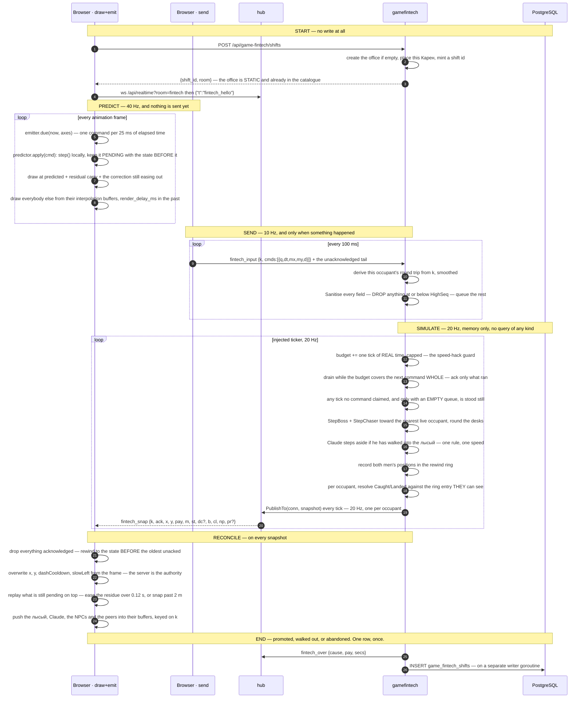

#### 2.8.3 What is predicted, what is interpolated, and why the difference matters

**Your own Карен is predicted.** The client runs the same `Step` the office does — the Go original and its TypeScript port, pinned to each other by golden vectors ([ADR-052](#adr-052--the-netcode-is-built-multiplayer-complete-before-there-is-a-second-player)) — so movement answers the thumb in zero milliseconds and redraws at frame rate rather than at the snapshot rate. **The money is not predicted**: the salary, the multiplier and the streak are read straight off the frame, because they are the score and a score flickering between a guess and the truth is worse than one that is merely 20 Hz.

**Everything else is interpolated**, because another mind's intent is not ours to guess. The лысый, Claude Code, Серега and Тёма and every colleague are buffered and drawn **`sim.render_delay_ms` in the past**, between the two samples that bracket that instant, so jitter and a dropped frame cost nothing — the renderer is never waiting on anything. **The buffer's timeline is the office's tick, not the arrival time**: keyed on arrival, two frames sent 50 ms apart that arrive 20 ms and 80 ms apart make the лысый appear to walk at two and a half times his speed and then at three fifths of it, and a burst delivered after a stall collapses the whole span to nothing.

**Three timers are folded in from the frame on every reconcile** — the dash cooldown, Claude's slow, and the position itself. A predicted timer only advances when a command is emitted, and *this game's default state is a player standing perfectly still emitting nothing*, so a locally-held timer would still be running long after the office had let it expire ([ADR-058](#adr-058--a-predicted-effect-lives-on-player-an-unpredicted-one-lives-on-the-occupant)).

#### 2.8.4 The latency ledger, and why the catch is rewound

Predicting yourself and interpolating everybody else means **you are drawn in the present and he is drawn in the past**. Resolving a hit test between them in the office's present compares two different instants, and the errors **add** in the one situation the game is about — running away.

| | drawn at | error while fleeing |
|---|---|---|
| your own Карен | predicted now, plus up to 25 ms of carry | — |
| the office's copy of you | now − (send batching + uplink + queue) | you are **0.6–1.0 m** nearer him than drawn |
| the лысый on your screen | office truth − (render delay + downlink) | he is **0.6–0.9 m** nearer you than drawn |

`CatchRadius + PlayerRadius` is 1.2 m and the accumulated error is **1.4–1.8 m** — larger than the thing it is an error in, and scaling with the connection rather than with the geometry, so no radius fixes it. So the office keeps a short **ring of both men's positions**, one entry per tick, and resolves each occupant's `Caught` and `Landed` against the entry *their* screen is showing: their derived round trip plus the served render delay, capped at `CatchRewindMax` ([ADR-059](#adr-059--the-catch-is-resolved-in-the-victims-timeframe-because-being-caught-is-a-hit-test)). Pursuit — *who* he walks at — is deliberately **not** rewound, because it is a decision rather than a hit test.

#### 2.8.5 The three rules the input path lives by

Each of these was a defect before it was a rule, and each is pinned by a named test.

- **A repeat is dropped against what has been ACCEPTED, not against what has been applied.** A frame carries four sub-steps where a tick affords two, so about half the queue is always accepted-but-not-yet-simulated; deduplicating on the acknowledgement lets every one of those through a second time. Measured over a real socket: 168 cm walked where 128 cm was sent. It compounds, because duplicates grow the queue and a longer queue duplicates more of the redundancy window.
- **A command is simulated whole or it waits.** The acknowledgement is one sequence number and the client drops everything at or below it, so a command simulated in part and acknowledged in full leaves the client holding movement the office never ran, permanently.
- **The idle fill runs only when the queue is empty.** Standing perfectly still sends nothing at all, so any part of a tick no command claimed is simulated as stillness — that is what accrues the salary and is the whole game. But the fill *consumes the budget*, so a fill running while a command waited for budget would consume exactly the budget it was waiting for, for ever.

**A shift under a few seconds is dropped rather than written**, so the table is not full of accidental one-second shifts, and an occupant whose socket has been gone for the abandon grace is ended as `left` and written. **The office is torn down when it empties**, and the next shift builds a fresh one — so a restart loses shifts in flight exactly as it loses arenas and presence, which is the same accepted trade [ADR-048](#adr-048--the-simulation-is-a-server-owned-fixed-step-tick-over-one-in-memory-world) made.

### 2.9 Deploy

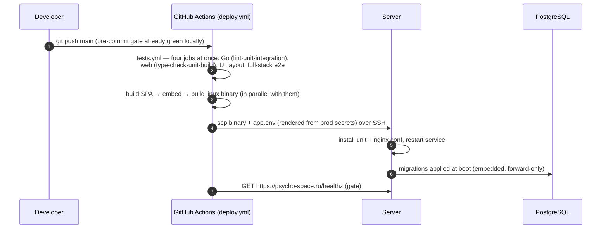

A push to `main` is a deploy, and a red run means production was not updated. See [§8 → ADR-003](#adr-003--push-to-main-deploys-the-gates-are-the-safety-net) for why that is safe without a staging environment.

## 3. Package structure

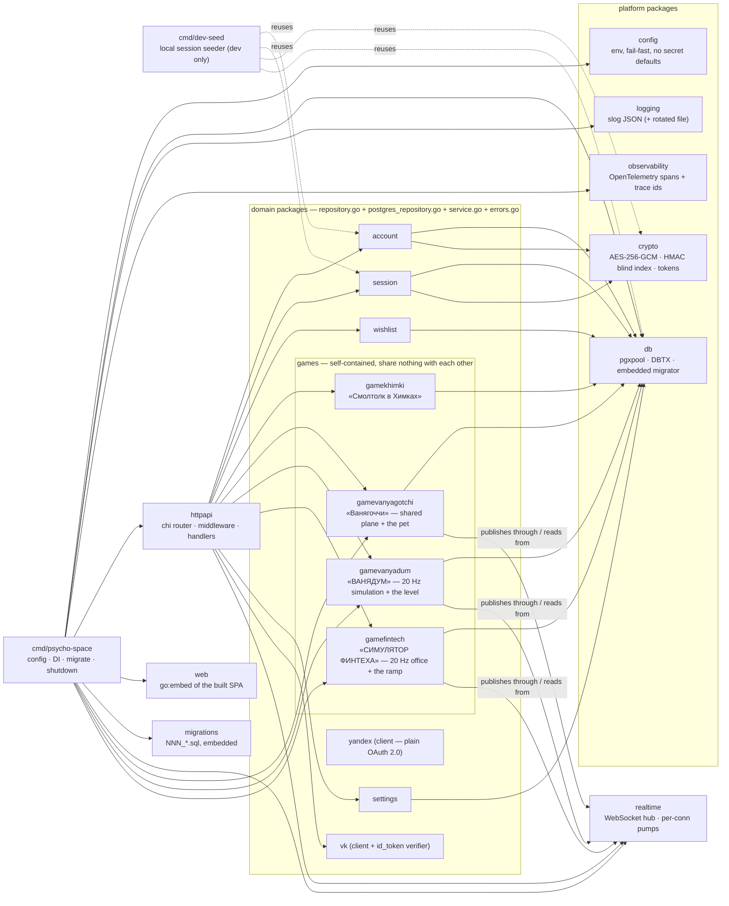

**The rule:** dependencies point inward and downward — handlers know services, services know repositories, repositories know `db.DBTX`. Nothing in `internal/*` imports `httpapi`. Adding a feature means a new `internal/<domain>/` package with those four files, a `NNN_*.sql` migration, wiring in `main.go` + `httpapi.Deps` + routes, and a case in `test/integration/`.

**Games are the exception to the usual instinct to factor things out.** Each game is a self-contained module: its own package, its own `game_<name>_*` tables, its own routes and views, its own leaderboard code — and **no game imports another, even where the code would be identical.** A game may depend on platform packages (`realtime`, `session`, `account`, `crypto`, `db`, and the `httpapi` plumbing); none of those may know a game exists, which is why the socket is addressed as the game-agnostic `/api/realtime?room=…` and game-specific message types live in the game's own package. The test for the boundary: deleting a game must mean deleting its package, its migration, its routes and its views — and nothing else. See [§8 → ADR-028](#adr-028--games-are-self-contained-modules) for why, and `CLAUDE.md` → *Games are self-contained modules* for the same rule stated as a working rule.

**`gamevanyadum` is the third module, and the first with a loop that integrates.** Its files split by what they know, in the same idiom as the game above: `content.go` is the catalogue (movement constants, the обрез's barrels, cadence, reload and what a reload spends, pickups, surfaces, generation parameters, the building's capacity and respawn interval, and the whole of what `/config` serves); `level.go` generates the sector graph and derives the walls from it; `sim.go` is `Step`, a pure function of `(level, player, command)` with no clock and no query, holding the movement and the gun; `hit.go` is the pure hitscan ray and the body model, kept out of `sim.go` because whether you hit somebody is a question about somebody *else* and so is the one part with no counterpart in the client port; `slop.go` is the нейрослоп — the creature, who it walks at, the room-to-room routes and what touching somebody means — pure for the same reason `sim.go` and `hit.go` are, with the world owning the clock, the pool and the randomness and this file owning only the walking; `world.go` is **the one заброшка everybody is standing in** — its occupants, their per-occupant real-time budgets, the idle fill that keeps a still player's gun running, what each of them has collected over the visit as distinct from what is still in the bag, the слоп pool and its spawner, the respawn deadlines and the grace that decides somebody has left; `history.go` is the rewind ring lag compensation reads, keyed by a `(kind, id)` pair because a slot and a слоп id are both small integers counting from zero and both are reused; `service.go` owns the world pointer, the 20 Hz tick and the single writer goroutine that makes this game's one database statement. It shares nothing with «Ванягоччи» — not the display cache, not the tick, not the message envelope — and the duplication is the point ([ADR-028](#adr-028--games-are-self-contained-modules)).

**`gamefintech` is the fourth module, and the one that combines the other two.** It integrates like the shooter and draws like the yard ([ADR-057](#adr-057--a-dom-game-may-own-a-fixed-step-simulation)), and its files split the same way: `gamefintech.go` is the package doc plus the rate and step constants; `content.go` is the catalogue — the **static** office, every tuning constant, the phrase pools, the endings, and the whole of what `/config` serves; `sim.go` is `Step`, a pure function of `(desks, player, command)` whose eight operations are in a fixed order because the browser runs the same eight; `boss.go` is the pursuit and the grin, which is where the argument for having a tick at all lives; `navigate.go` is how he gets round a desk — a coarse grid over the static office and a flood fill from the target, kept apart from `boss.go` because one is *where he is going* and the other is *how he walks*; `office.go` is the one shared world, its occupant map, its per-occupant time budget and its lifecycle; `service.go` owns that office, the 20 Hz tick and the single writer goroutine that makes this game's one database statement. **The office is static and lives in the catalogue**, which is the load-bearing simplification against «ВАНЯДУМ»: the заброшка there is generated from a seed and regenerated whenever it empties, so the level is generated and sent ([ADR-050](#adr-050--the-level-is-generated-on-the-server-and-sent-once)); the office here is the same one every time, so there is no generator, no seed, no per-run level and nothing about geometry on any frame or in any start response. It shares nothing with either game above — not the arena, not the budget, not the wire envelope, not the leaderboard SQL ([ADR-028](#adr-028--games-are-self-contained-modules)).

**And each game's name is spelled out at every layer**, which is what makes that boundary test executable rather than a judgement call: package `internal/game<name>/`, tables `game_<name>_*`, routes `/api/game-<name>/*`, view `Game<Name>View.vue` at `/app/game-<name>` — so `git grep -il game<name>` enumerates the whole module. «Смолтолк в Химках» is `gamekhimki`; «Ванягоччи» is `gamevanyagotchi`; «ВАНЯДУМ» is `gamevanyadum`; «СИМУЛЯТОР ФИНТЕХА» is `gamefintech`. Platform packages stay unprefixed on purpose, because the missing prefix is the signal that they are game-agnostic — and the one place a game's name now reaches the platform is a **map key**: `httpapi` holds `map[string]realtime.Handler` and each game exports its own room name, so the composition root is the only file that pairs the two. The fourth game proved that seam rather than widening it: `internal/realtime` and `internal/httpapi/realtime.go` needed no change at all. See [§8 → ADR-030](#adr-030--game-modules-are-named-gamename).

**Its files split by what they know.** `content.go` is the catalogue (stats, actions, skins, locations, NPCs, every tuning constant); `decay.go` is the time arithmetic for stats and `motion.go` the time arithmetic for space — both pure, both closed-form, neither storing anything; `display.go` is the in-memory cache the broadcast draws from; `service.go` holds the verbs and the tick. A new character is a `content.go` entry. A new *way of moving* is one function and one map entry in `motion.go`. Neither is a migration and neither is a client change.

**`gamevanyagotchi` is one package holding two things with deliberately different lifetimes**, and the split is worth knowing before reading it. The **plane** — who is standing where — lives in memory and is published through the hub five times a second. The **pet** — the stats, the death — is in Postgres and outlives every deploy. The plane now *draws* what the database knows, and the way it does that is the load-bearing part: a **display cache** (`display.go`) holds each account's pet fields in memory, filled when a client says hello and refreshed by the HTTP read path, so **the broadcast tick never touches Postgres**. What it caches is the raw `(value, as_of)` pairs rather than a pose — a pose changes with the clock, so a cached one would quietly show a healthy Ваня who has been dying since lunchtime, whereas a cached pair stays exact for the same reason the whole decay model does ([§8 → ADR-041](#adr-041--the-broadcast-tick-renders-from-a-cache-and-position-outlives-the-process)). The same rule now covers a third thing: **world objects** — what is lying about in the yard — are held in their own cache (`world.go`), filled at a hello and after a verb that leaves something behind, and rendered as ordinary entities so the client resolves an object's art exactly as it resolves a pet's and holds no object-kind key at all. Expiry is arithmetic over the cache against the tick's instant, so a deposit vanishes from every screen at the same moment without anybody asking the database. So beyond the usual four files the package carries the six listed above, and the two halves meet in exactly one place — the broadcast, which reads the caches and never the pool. See [§8 → ADR-038](#adr-038--time-varying-state-is-computed-on-read-never-ticked) and [ADR-039](#adr-039--game-content-is-a-go-catalogue-and-the-schema-stores-only-its-keys) for the two rules that shape it, and [§2.6](#26-one-tick-of-the-yard) for the flow.

### The SPA

The browser half is a normal Vue 3 application — until the yard, which has a second data source and a second rendering discipline, and that is the part worth having a diagram for.

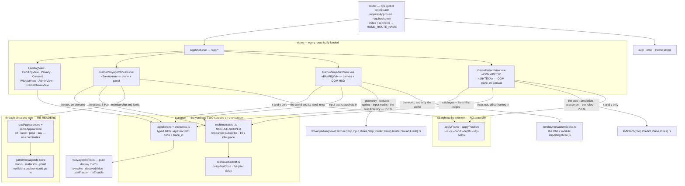

**The socket is owned at module scope, not by a component.** The yard is a lazy child route, so a component-owned socket would re-handshake on every navigation and spend another of the three connections a server allows per account. Its lifetime is a subscription refcount with a ten-second idle grace, so leaving the yard and coming back reuses the connection.

**In the yard, membership is reactive and positions are not.** This is the load-bearing rule of the client and it is enforced structurally rather than by convention, in three places at once: the store has no field a coordinate could go in, the `PeerAppearance` shape that enters reactivity has no `x`/`y`, and the function that writes a position takes an interface narrowed to `style.setProperty` alone — so the position path *cannot* read layout, measure a box, or touch an attribute. Who is present, what they look like and what they are saying go through pinia and a keyed list, behind an equality guard so a frame that changed nothing re-renders nothing. Where they are is written straight to CSS custom properties on the element, and the mapping from `0..1` to pixels happens in the stylesheet against the plane's own container box. The reason is arithmetic: at 5 Hz, binding positions to reactivity costs a scheduler pass and a vdom patch per entity per frame to produce a transform the compositor could have been handed directly — and it would cache a measured size that mobile browser chrome invalidates every time it slides.

**The third game inverts the yard's rendering decision and keeps its testing one.** «ВАНЯДУМ» draws in WebGL through three.js, because it is a first-person shooter with a camera over a world larger than the viewport — every trigger [ADR-046](#adr-046--the-shared-plane-is-dom-and-css-never-a-game-engine) named for re-asking the question, hit at once. What it does **not** do is put anything else on the canvas: the HUD, the movement stick, the fire button, the standings board, the splash and the rules cheatsheet are ordinary DOM, and the engine is reachable from exactly one module (`render/vanyadumScene.ts`), imported dynamically so nobody who never opens the game pays its 176.7 kB gzip. Everything a test needs is therefore moved out of the canvas in two directions — sideways into the DOM, and downwards into `lib/vanyadum*.ts`, where the level's geometry is plain arrays and a texture is a pure `(surface, size, seed) → Uint8Array` rather than something drawn into a 2D context ([ADR-047](#adr-047--ванядум-renders-in-webgl-and-only-the-world-does), [ADR-051](#adr-051--ванядум-stores-no-art-at-all)). **The обрез's sound follows both rules at once.** It is Web Audio synthesised in `lib/vanyadumSound.ts` and not a file — a `.wav` would be the only authored asset in this game, the largest thing on the route, and downloaded by everybody who opened it whether or not they ever pulled the trigger, where a shotgun is a burst of noise through a filter that shuts and costs four nodes and no bytes. It sits in `lib/` rather than `render/` because it holds no GPU context and no scene graph, which is what makes the tests a stubbed `window.AudioContext` rather than a seam cut into the file for their benefit. And its mute is a control **on the play surface next to the trigger**, because the sound is deliberately *not* gated on `prefers-reduced-motion` — that setting is about motion, and somebody who asked for less of it did not ask for less sound. **The muzzle flash beside it is counted in DRAWN FRAMES rather than in seconds** (`lib/vanyadumFlash.ts`), which is the same instinct applied to the eye: a mark decremented by a frame's own `dt` can expire inside the very frame that was going to draw it, so a 0.05 s flash is drawn zero times on a phone managing twenty frames a second — exactly the phone this game is played on. A mark spent by *being drawn* always survives at least one draw, and the frame rate then decides its duration in the useful direction: about 21 ms at 144 Hz, 150 ms at twenty, all well inside the half-second this project's acknowledgement rule allows. It survives `prefers-reduced-motion` for the same structural reason the rule demands — nothing animates, so nothing is cleared by an `animationend` that never fires. The same rule the yard follows about reactivity applies here in a sharper form: the camera is a **plain object**, written by snapshots twenty times a second and read by the render loop sixty, because putting it through Vue would buy a scheduler pass per frame to produce a number only the renderer reads.

**The fourth game takes the yard's renderer and the shooter's clock, which is two decisions rather than one.** «СИМУЛЯТОР ФИНТЕХА» has no canvas at all — the floor, the desks, you and the bald man are real elements placed by CSS custom properties, so the layout suite reads the game the way a player does and nothing needs a pixel comparison ([ADR-057](#adr-057--a-dom-game-may-own-a-fixed-step-simulation)). What it borrows from «ВАНЯДУМ» is the *update model*: two clocks rather than one repaint, with `requestAnimationFrame` rendering and a `setInterval` at the served input rate sending, and the server's own `Step` ported to `lib/fintechStep.ts` and pinned to it by golden vectors, so the player's own movement is predicted locally and reconciled against the office's authority. The yard's structural rule survives intact and matters more here, not less: **membership is reactive, positions are not** — a coordinate goes straight to a CSS custom property, because at animation-frame rate a scheduler pass per figure buys nothing the compositor was not already going to do. It is **playable at a desk as well as on glass** — WASD or the arrows and space, written into the same one `axes` value the thumb-stick feeds, so the emitter, the prediction and the wire cannot tell the two apart and none of the netcode learned about keyboards; «ВАНЯДУМ» has the same function with the opposite Y sign, and it is re-implemented rather than shared ([ADR-028](#adr-028--games-are-self-contained-modules)). And it takes the yard's answer on where a control goes as well: **the office is the whole screen and everything else is drawn on top of it** — the stage fills the play box, the readouts sit over its top edge and the two thumbs over its bottom one, each turning `pointer-events` back on only for itself. A column of readouts, then office, then a band of controls left a portrait 16×22 room bounded by whatever height the other two did not want, which on an ordinary phone is a plane a fifth narrower than the screen with dead space down both sides ([ADR-046](#adr-046--the-shared-plane-is-dom-and-css-never-a-game-engine) puts controls on the plane; «ВАНЯДУМ» does the same over a canvas).

**Everything the client knows about a game's content, it was told.** Stats, actions, skins, locations and characters all arrive from `GET /api/game-<name>/config` and are iterated generically, which is what makes a new stat or a new NPC a backend deploy. The clearest payoff is the splash screen, which is a **rules cheatsheet generated from that catalogue** rather than written out — so retuning a constant in the game's `content.go` changes what the player is told with no client change, and the rules cannot drift from the game the way a hand-typed list would. Only what the server does not publish — walking speed, tiredness, the muttering, who else is in the yard — is hardcoded prose, and it is marked in the source as the part a rules change must come back and edit. What is deliberately still hardcoded is *presentation*: the splash copy, the RU status strings, the pose vocabulary the stylesheet has rules for, and the plane's 3:4 aspect ratio — that last one being a genuine rule of the game rather than a style, because normalised coordinates only mean the same thing on two phones if both draw the same shape.

## 4. Data model

Every table carries `created_at` / `updated_at`, and everything soft-deletable carries `deleted_at` (queries filter `WHERE deleted_at IS NULL`).

```mermaid
erDiagram
    accounts ||--o{ sessions : "has"
    accounts ||--o{ wishlist_items : "authors"
    accounts ||--o{ wishlist_votes : "casts"
    accounts ||--o{ wishlist_comments : "authors"
    accounts ||--o{ wishlist_comment_votes : "casts"
    accounts ||--o{ game_khimki_runs : "plays"
    accounts ||--o{ game_vanyadum_visits : "visits"
    accounts ||--o{ game_fintech_shifts : "works"
    accounts ||--|| game_vanyagotchi_pets : "keeps"
    accounts ||--o{ game_vanyagotchi_world_objects : "leaves behind"
    game_vanyagotchi_pets ||--o{ game_vanyagotchi_pet_stats : "has"
    wishlist_items ||--o{ wishlist_votes : "receives"
    wishlist_items ||--o{ wishlist_comments : "has"
    wishlist_comments ||--o{ wishlist_comment_votes : "receives"

    accounts {
        uuid id PK
        text provider UK "vk | yandex — half of the identity"
        bytea identity_ref UK "blind index HMAC-SHA256(raw provider user id)"
        bytea identity_id_enc "AES-256-GCM"
        bytea first_name_enc
        bytea last_name_enc
        bytea avatar_url_enc
        bytea sex_enc
        bytea birthday_enc
        text role "user | admin | superadmin"
        text status "pending | approved | blocked"
        timestamptz consent_at
        text consent_version
        timestamptz forgotten_at "anonymised in place — identity gone, contributions kept"
    }
    sessions {
        uuid id PK
        uuid account_id FK
        bytea token_hash UK "HMAC of the raw cookie value"
        timestamptz expires_at
    }
    wishlist_items {
        uuid id PK
        uuid account_id FK
        text title
        text body
    }
    wishlist_votes {
        uuid id PK
        uuid item_id FK
        uuid account_id FK
    }
    wishlist_comments {
        uuid id PK
        uuid item_id FK
        uuid account_id FK
        text body
    }
    wishlist_comment_votes {
        uuid id PK
        uuid comment_id FK
        uuid account_id FK
    }
    game_khimki_runs {
        uuid id PK
        uuid account_id FK
        text game_key
        text character_key
        boolean success
        integer steps
    }
    game_vanyadum_visits {
        uuid id PK
        uuid account_id FK
        bigint seed "WHICH building — the level is a pure function of this, never stored"
        timestamptz joined_at
        integer seconds "measured to the last seen connection, never to the grace expiring"
        integer beer
    }
    game_fintech_shifts {
        uuid id PK
        uuid account_id FK
        text cause "promoted | left — text, so a third ending is not a migration"
        float salary "the score, in rubles"
        float seconds "how long the shift lasted"
    }
    game_vanyagotchi_pets {
        uuid id PK
        uuid account_id FK "one living pet per account (partial UK)"
        text name "set in a dialog, NULL until then"
        text skin_key "catalogue key"
        text location_key "catalogue key"
        timestamptz died_at "materialised once, at the derived instant"
        float x "where he stood when his owner last left"
        float y
        timestamptz last_seen_at "written on the LAST disconnect, never per move"
    }
    game_vanyagotchi_pet_stats {
        uuid pet_id PK
        text stat_key PK "catalogue key"
        float value "with as_of, the whole decay engine"
        timestamptz as_of
    }
    game_vanyagotchi_world_objects {
        uuid id PK
        text kind "catalogue key: relief | key | beer_crate"
        text location_key
        float x "normalised 0..1"
        float y
        boolean singleton "participates in one-active-per-kind"
        uuid owner_account_id FK "NULL when the world spawned it"
        uuid claimed_by FK "SingleWinner discipline"
        integer remaining "Stock discipline"
        timestamptz exhausted_at
        timestamptz expires_at "filtered lazily on read, never swept"
    }
    game_assets {
        text game_key PK
        text art_key PK
        text content_type
        bytea bytes "the art image itself"
    }
    app_settings {
        text key PK
        text value
    }
```

`game_assets` and `app_settings` stand apart — neither references an account. The art bytes live in Postgres, not in git and not in the binary. See [§8 → ADR-026](#adr-026--game-art-lives-in-postgres-not-in-git-or-the-binary) for why, and [ADR-031](#adr-031--game-asset-storage-is-shared-infrastructure-not-a-games-property) for why the table stayed unprefixed while every other game table gained its game's name.

The three `game_vanyagotchi_*` tables are **«Ванягоччи»**, and they are shaped by two decisions worth knowing before changing them. **Every `*_key` column is `text` whose meaning lives in the Go catalogue, never a Postgres enum** — an enum makes each new stat, skin, location or object kind an `ALTER TYPE`, i.e. a permanent migration, which is exactly the cost the catalogue exists to remove ([§8 → ADR-039](#adr-039--game-content-is-a-go-catalogue-and-the-schema-stores-only-its-keys)). And **stats are tall while world objects are wide, on purpose**: stats are a homogeneous collection of `(value, as_of)` pairs that one decay expression covers, whereas world objects are heterogeneous rows carrying contended invariants — `claimed_by`, `remaining`, `exhausted_at` — that have to be indexable and `CHECK`-able. The tall shape pays for itself again in the coupling: a stat that raises another's drain is a catalogue entry naming a key, and adding one costs no column ([§8 → ADR-040](#adr-040--a-stat-may-drive-another-stats-rate-and-it-is-still-exact)) — and again in the score, because **a stat whose rate is zero is a lifetime counter**. «выпито пива» and «покакано раз» are rows in this same table, moved only by the verbs that name them, which is why this game has no runs table, no leaderboard schema and no migration for keeping score. They are marked `counter` in the catalogue rather than inferred from the rate, so the client is told they are tallies rather than left to conclude it from a number — a counter is never drawn as a bar and is never "trouble" at any value. It also carries the invariant that coupling depends on — **every write touches every row of a pet, with one shared `as_of`** — so there is deliberately no single-stat write path. There is no JSONB in either. `game_vanyagotchi_world_objects` is written for the first time by the relief deposit: «покакать» leaves a row at the position the SERVER believes the player is standing — the client sends a verb and never a coordinate — inside the same transaction that writes the stats and the events, so a deposit that survived a rolled-back batch cannot exist. Its `expires_at` is **filtered lazily on read and never swept**, exactly as `sessions.expires_at` already is, because a sweeper would be the background timer this design does not have. The **contested claim** is the other half, and it is the first place in this system where the DATABASE rather than the hub decides an outcome: `UPDATE … WHERE claimed_by IS NULL` sets `claimed_by` and `exhausted_at` in one statement, so two players tapping in the same millisecond are resolved by Postgres and a forged client claim cannot beat it — zero rows affected means you lost. The replacement is inserted in that same transaction, so the next frame already carries a fresh hunt rather than an empty yard somebody has to be told about. **Losing costs nothing**: the lost claim returns an error, the whole batch rolls back, and the outcome is a face for a few seconds — no stat moves, and there is no loser-effect hook. The one-active-per-kind invariant is a partial unique index predicated on a **`singleton` boolean the catalogue sets at insert time** rather than on any kind named in DDL — a deposit sets it false, because deposits are never exhausted and many are live at once, and an index keyed on `exhausted_at` alone would have forbidden a second player from relieving himself.

**There are two contest disciplines and the catalogue routes between them**, which is the shape that arrived with the beer store rather than a hierarchy: a verb names the kind it races for, the kind names its discipline (`Contest`), and the service switches on that alone — so a third contested verb is two catalogue entries and no code. `SingleWinner` is the key, above. **`Stock` is the crate**: `UPDATE … SET remaining = remaining − 1 WHERE remaining > 0 RETURNING remaining` **cannot oversell under any concurrency**, and not by being careful — the guard is inside the statement's own `WHERE`, so a second player's statement blocks on the row the first is holding and then re-evaluates that guard against the value the first *committed* rather than the one it read on the way in. Six players pressing in the same millisecond against a crate of two get two beers and four refusals, decided by PostgreSQL. The decrement that reaches nought sets `exhausted_at` **in the same statement**, which is what takes the row out of the partial unique index and lets the replacement crate be inserted inside the same transaction; splitting those would leave a window in which the index still held the empty crate, the insert silently did nothing, and the yard was left with a crate nobody can draw from and nothing that would ever replace it. Both disciplines share the rule that **losing costs nothing**: the refusal rolls the batch back, so no stat moves and nothing is written at all. The crate stands at a fixed pitch from the catalogue (`ObjectKind.At`) while the key is hidden at random — that `nil` is the whole difference between a shop and a lost key — and the vendor beside it is a **stateless NPC with no row**, because everything mutable about a beer store belongs to the thing with a count.

**`game_vanyadum_visits` is the ENTIRE durable footprint of «ВАНЯДУМ»** — one summary row per stay in the building, and nothing else in the database at all. Everything the game is made of lives in memory: the **level** is a pure function of `seed`, so eight bytes reproduce the geometry exactly and storing it would freeze a generator that changes every iteration ([ADR-050](#adr-050--the-level-is-generated-on-the-server-and-sent-once)); the **world** — who is standing where, what has been picked up, which tick it is — is deliberately ephemeral and is lost on restart in the same way the hub's presence is ([ADR-048](#adr-048--the-simulation-is-a-server-owned-fixed-step-tick-over-one-in-memory-world)). The row is written **once, when somebody's last connection has been gone past the grace**, on a separate writer goroutine, and never on a tick — walking in writes nothing at all. `seed` says **which** building, because the заброшка is regenerated whenever it empties and *were we in that one together* is the only question anybody has asked of these rows; `seconds` is measured to the last seen connection rather than to the grace expiring, so two minutes spent waiting for somebody who never came back are not counted as time in the building. `beer` is a plain column rather than a bag of counters: there is one pickup today and a JSONB column added in advance of a second would be complexity bought against a requirement that does not exist. It records what was **collected** over the visit and not what was still in the bag at the end — the two were the same number until the обрез started spending beer, and `migrations/015` is immutable, so it is the code that had to agree with the column: the occupant carries a separate `collected` tally, kept on the in-memory `Occupant` rather than on `Player` because `Step` never reads it ([ADR-058](#adr-058--a-predicted-effect-lives-on-player-an-unpredicted-one-lives-on-the-occupant)), and counting what the bag actually *gained* keeps "collected" an upper bound on "carrying" for the whole visit. There is **no `success` column and there never will be** — the field it replaced was `true` in every row ever written, which is another way of saying it recorded nothing ([ADR-060](#adr-060--there-is-one-заброшка-nothing-ends-and-a-run-became-a-visit)). There is no `game_key` discriminator (the table name carries the identity), no enum for anything (pickups and surfaces are a Go catalogue), **no deaths, betrayals or streak columns** — the first two now exist and are deliberately not here: they live on the in-memory occupant, ride the standings, and go with the building when it empties, because nothing here ends and what a durable body count would be *of* is a question nobody has asked. Making one durable is a migration and a decision, and neither has been taken — no per-event rows, and **no art table** — this game stores no art at all ([ADR-051](#adr-051--ванядум-stores-no-art-at-all)). It replaced `game_vanyadum_runs`, which `migrations/015_game_vanyadum_visits.sql` **drops in the same file that creates this one**: the old rows record a mode nobody can play any more, so they are not translated. `010_game_vanyadum.sql` is neither edited nor deleted — the migrator keys on the filename, so it stays as the record of what happened, exactly as `013` did when `014` renamed its table.

**`game_fintech_shifts` is the entire durable footprint of «СИМУЛЯТОР ФИНТЕХА»** — one summary row per shift, written once when the shift ends, and nothing else in the database at all. Everything the game is made of lives in memory for the few minutes a shift lasts: the office, where everybody is standing, the boss, the streak, the multiplier. There is no level to store, because unlike «ВАНЯДУМ» there is nothing generated — **the office is static and lives in the Go catalogue** ([ADR-039](#adr-039--game-content-is-a-go-catalogue-and-the-schema-stores-only-its-keys)), so it needs neither a seed column nor a table. `cause` is `text` rather than an enum for exactly the reason every other `*_key` column is: the third ending arrives with a later iteration and must not be an `ALTER TYPE`. `salary` and `seconds` are `double precision` because they are integrals of a rate rather than counts, and rounding them at the boundary would make the leaderboard disagree with the screen that produced it. **Both are scored**, on two boards rather than one sorted two ways: money rewards standing still through the ramp and length rewards surviving a floor that speeds up every twenty seconds, so a single board would quietly declare one of them the point. There is **no index for the second ordering** — the table holds one row per finished shift for a handful of friends, and a migration is forever. There is no `game_key` discriminator, no JSONB, no per-tick rows, and no meter columns for the meters this iteration does not yet have — a column added in advance of a requirement is the complexity this project declines. A shift **shorter than a few seconds is dropped rather than written**, so an accidental tap does not become a leaderboard row, and an **abandoned** one — the tab closed, the phone locked — is written as `left` after a grace period, because a shift somebody walked away from still happened and still paid.

`game_khimki_runs` and `game_assets` belong to **«Смолтолк в Химках»**, and now say so — they were `game_runs` and `game_assets` until `migrations/007_game_khimki_rename.sql`. A second game gets its own `game_<name>_*` tables rather than rows in these — see [§8 → ADR-028](#adr-028--games-are-self-contained-modules) and [ADR-030](#adr-030--game-modules-are-named-gamename). Their `game_key` **values** did not move with the tables: the column still reads `smalltalk_khimki`, because it is data rather than a name and the art blobs are keyed on it.

## 5. API map

Everything is under `/api`, authenticated by the session cookie. `GET /healthz` sits outside it (the deploy gate polls it).

| Group | Endpoints | Access |
|---|---|---|
| `auth` | `GET vk/state` · `POST vk/callback` · `GET yandex/state` (returns the authorize URL too) · `POST yandex/callback` · `GET me` · `POST logout` | public (30/min per IP on the four login endpoints) |
| `wishlist` | `GET/POST items` · `DELETE items/{id}` · `POST/DELETE items/{id}/vote` · `GET/POST items/{id}/comments` · `DELETE comments/{id}` · `POST/DELETE comments/{id}/vote` | approved |
| `game-khimki` | `GET assets/{game}/{key}` | **public** (art, cacheable) |
| `game-khimki` | `GET config` · `POST attempt` (5/min per IP — paid) · `POST runs` · `GET runs/leaderboard` · `GET runs/me` | approved |
| `game-vanyagotchi` | `GET config` (catalogue: stats · actions — including each one's gates and its `fail_chance` · skins · NPCs · object kinds · locations **with their hotspots** · `arrive_within`) · `GET state` · `GET avatar/{peer}` — reads only; **a verb is not HTTP**. The catalogue serves only what is CONSTANT about the beer store — its picture and its name — because where it stands stopped being one. | approved |
| `game-vanyadum` | **Three reads and nothing else** — there is no join endpoint, because the socket is the door ([ADR-060](#adr-060--there-is-one-заброшка-nothing-ends-and-a-run-became-a-visit)). `GET config` (catalogue: the player's dimensions, including `body_height` — how tall a man is *to be shot at*, so a client cannot draw a figure shorter than the server aims at — and `max_health` · **the gun** — `barrels`, `fire_cooldown_seconds`, `reload_seconds`, `reload_cost`, `damage`, and `ammo`, which is the **name of the counter a reload spends** rather than a description, so the splash cheatsheet *joins* it against the pickup whose `grants` matches and reuses that entry's title, icon and blurb rather than being told the same thing twice, and a second ammunition is one catalogue line with no client change · pickups · surfaces the client generates textures from · the rates it must match, `interp_delay_ms` among them, because lag compensation rewinds by exactly that number and a client choosing its own would be choosing an advantage · the building's own rules — `max_occupants`, `respawn_seconds`, `down_seconds`, `protect_seconds`, and `betrayals_title`, which is the Russian for the standings column that counts the friends you have shot, published here rather than typed into the client because the cheatsheet is generated from what is served · **the нейрослоп**, as `slop` — `title`, `blurb`, `population`, `health`, `damage`, `touch_seconds`, `speed`, `spawn_seconds` and `kills_title`, for the same reason and with one deliberate absence: **how many barrels one takes is not published**, because it is `slop.health` divided by `gun.damage` and both are already here, so the cheatsheet divides rather than being told the same thing a third time. `speed` is published so the cheatsheet can say the only thing about it that matters — it is below `player.walk_speed`, so you can always leave) · `GET world` (the one заброшка everybody is in — `{world_id, seed, level, room}` with the **whole level**, generating one if nobody has been here yet, so it never answers 404) · `GET visits/me` (the caller's own last five, `{seed, seconds, beer, joined_at}` — no `success`) | approved |
| `admin` | `GET accounts?status=` · `POST accounts/{id}/approve` · `POST accounts/{id}/block` · `GET settings` | admin+ |
| `admin` | `POST accounts/{id}/promote` · `POST accounts/{id}/demote` · **`POST accounts/{id}/forget`** · `PUT settings/open-registration` | superadmin only |
| `game-fintech` | `GET config` (catalogue: the **static** office and its desks · the money ramp · movement and the dash · the boss · **the tempo ramp**, which the client computes from the snapshot's own tick rather than being told · **both verbs** with their labels and timers · the endings · **both balloon pools**, which the snapshot indexes into rather than quoting) · `POST shifts` (start one — **no level, no write**) · `GET shifts/current` (resume after a reload, or 404) · `DELETE shifts/current` (walk out — writes the shift) · `GET shifts/me` · `GET shifts/top` (**both boards in one response**, keyed by the metric each is scored on — `salary` and `seconds` — each the best shift **per account**, because the splash draws them side by side and a screen that needed two requests to render is the chattiness the client–server rule forbids) · `GET avatar/{peer}` (the face to draw on a colleague, by the **pseudonym his frame carried** — a 302 or a 404, never a URL on the socket) | approved |
| `realtime` | `GET realtime?room=` — WebSocket upgrade. The rooms are exactly those the composition root registered a handler for (`yard`, `vanyadum`, `fintech`); an unregistered name is refused with 400 rather than opened and ignored. | approved |

The two `game-khimki` rows are **«Смолтолк в Химках»**, the `game-vanyagotchi` row is **«Ванягоччи»**, the `game-vanyadum` row is **«ВАНЯДУМ»** and the `game-fintech` row is **«СИМУЛЯТОР ФИНТЕХА»**; a fifth game gets its own `/api/game-<name>/*` group rather than new keys in any of them, while `realtime` is game-agnostic by design ([§8 → ADR-028](#adr-028--games-are-self-contained-modules), [ADR-030](#adr-030--game-modules-are-named-gamename)).

Two things about the `game-vanyagotchi` row read oddly and are deliberate. **`GET state` writes** — it creates the pet on first sight and records a death the first time one is observed; both are idempotent, and the alternative to writing on read is a background job this system does not have ([§8 → ADR-038](#adr-038--time-varying-state-is-computed-on-read-never-ticked)). And **the group has no write endpoint at all**: a verb arrives as a `vanyagotchi_do` frame on the socket, listed in the wire contract below, because it owes no reply and the 5 Hz roster already reconciles the yard ([§8 → ADR-043](#adr-043--a-verb-travels-over-the-socket-and-is-answered-with-state)). What the catalogue-as-allowlist bought survives the move: the verb is a key checked against the content catalogue rather than a case in a handler, so a new stat-restoring action is still a catalogue entry and nothing else.

**`/api/game/*` no longer answers.** The pre-rename prefix was registered as a second route group on the same handlers for exactly one deploy cycle, so that a browser holding the previous SPA build in cache would not break mid-run; that cycle is over and the registration is deleted. `TestGameKhimkiLegacyPathAliasIsGone` in `test/integration/gamekhimki_test.go` now pins its **absence** — it asserts 404 rather than 401 on a gated path, because 401 would mean the route group had been re-registered and was merely refusing the request. On the client side `/app/game` redirects permanently to `/app/game-khimki`; that redirect is not an alias and stays.

Anything not matching `/api` or `/healthz` is served the embedded SPA, so client-side routes resolve on a hard refresh.

### The realtime wire contract

The table above is HTTP. `GET /api/realtime?room=…` is the other half of the surface, and it is a **protocol rather than an endpoint**, so it is written out here. There are three rooms and therefore three protocols — `yard` for «Ванягоччи» below, `vanyadum` for «ВАНЯДУМ» after it, and `fintech` for «СИМУЛЯТОР ФИНТЕХА» after that. They share the transport and nothing else: no message type, no field name and no convention crosses between them, which is [ADR-028](#adr-028--games-are-self-contained-modules) applied to the wire. Everything in both directions is a JSON **text** frame with a string `t` discriminator, and **both ends ignore an unknown `t`** — that is what lets either side learn a message type without a coordinated deploy.

| Direction | `t` | Payload | Notes |
|---|---|---|---|
| → server | `vanyagotchi_hello` | none | Deliberately empty: identity is the connection, so there is nothing to forge. Sent on **every** open, including reconnects. |
| → server | `vanyagotchi_move` | `x`, `y` — both required, `*float64` | A destination, never a position. Non-finite is rejected; out of range is **clamped** to `0..1`, not refused. |
| → server | `vanyagotchi_goto` | `location` — a catalogue key | A **movement** message beside `move`, deliberately not a verb: it moves no stat, appends no event, and there is nothing for `apply` to fold. The server validates the key against the catalogue, writes `pets.location_key` and places him at that location's entry point. An unknown location is dropped in silence like every other bad frame. It carries **its own rate clock** rather than sharing the verb budget — a rate-refused verb is silent, so sharing would read as a dead control. **An accepted one is followed by `vanyagotchi_state`**, because it moved a pet column and that is what this game sends when a pet changes: the roster moves his *dot*, but the browser reads which place it is *looking at* off the pet, so a journey that pushed nothing left the yard drawing the place he had left — filtering his own Ваня out of it, reporting «здесь никого», and marking the old place as the one he was in, which is the row the travel sheet refuses to send you to because it means "stay". A dropped goto changed nothing and so pushes nothing. |
| → server | `vanyagotchi_do` | `verbs[]` — catalogue keys · `spot?` — a hotspot key | A batch, folded in order against one snapshot and refused whole if any verb in it is refused. **Its own bound**, tighter than the socket's: one batch per account per second, at most eight verbs in a frame — a tap writes nothing and a verb writes a transaction. `spot` is the **first inbound payload the server must JUDGE rather than clamp**: it names the hiding place the player says he searched, and is validated against the catalogue *for the pet's own location* and then against the yard's own in-memory placement. **The client announcing an arrival is a request, never a fact.** The order of those checks is a security property rather than a matter of taste — reach is decided *before* the answer is looked at, so a wrong spot and a right spot he has not reached are indistinguishable; reversed, the refusal becomes an oracle and tapping every hotspot from the middle of the yard would find the key. |
| ← client | `vanyagotchi_you` | `id` | Unicast reply to a hello: which entity in the roster is you. |
| ← client | `vanyagotchi_roster` | `peers[]`, `here`, `hunt?`, `store?` | The full-state frame, 5 Hz, carrying **every location at once**. Per entity: `id`, `x`, `y`, `art`, `pose`, and optional `label` / `say` / `expires` / `loc`. A POSITION IS A TRIPLE — a location plus `x`,`y` normalised **within that location** — so the same coordinates are the beer crate in двор and an empty patch of лес, and every question about nearness asks *where* before *how far*. `loc` is **omitted for the default location**, so the common case of everybody in the yard costs nothing and only a peer elsewhere pays ~12 bytes. `here` is a **map**, `{"yard":3,"les":1}` with zeroes omitted: it counts people per place and is sent rather than derived, because deriving it would mean teaching the browser to tell a person from an NPC ([ADR-045](#adr-045--a-location-is-not-a-room--the-roster-is-filtered-not-split)). `hunt` is the active key hunt's id — **state, never an announcement**, because a one-shot «ключи снова потерялись» is exactly what somebody who opened the app thirty seconds later misses; a client that sees it CHANGE says so, one that has just connected finds a hunt in progress and stays quiet. The **confetti** the browser throws where a key was found is worked out the same way and from a different field: the hunt id names neither the winner nor the place, so the burst is driven off a peer's pose going *to* `happy`, which says who and — through the coordinates on the same frame — where. A peer already wearing the face when a client first sees him won before it was watching, and is celebrated in the same silence a hunt already running is joined in. `store` is the beer store as `{x, y, loc?, left}` — **one shared field, not one per peer**, because it is one fact about the world: ~36 bytes a frame, 180 B/s to each phone however busy the yard is, against 4.3 KB/s if it hung off all twenty-four entities to say the same number twenty-four times. It is a **structure rather than a kind key**, which is what lets the browser draw a shop and measure its own distance to it while holding no content key at all — it could not pick the crate out of the roster by kind, and an e2e forbids it trying. **It is now the ONLY statement of where the shop is.** The crate used to be pinned to двор by a catalogue field, served as `store_location` so the splash could name the place; it is hidden in a random location on every restock now, exactly as a fresh key is, so the static field was removed rather than left serving «двор» about a shop wandering five places. `loc` follows the same omit-for-the-default rule the entities do, so a crate in the yard still costs nothing. **No avatar and no name of a person** — a picture is fetched by `id` over HTTP instead, because a URL here would be re-sent per player per tick per viewer and would be the one durable thing on an ephemeral frame ([ADR-037](#adr-037--one-account-is-one-entity-and-the-wire-carries-a-pseudonym-and-a-face)). |
| ← client | `vanyagotchi_state` | `state` | The owner's own pet after it changed, unicast to **every** connection that account has open. Not an acknowledgement: no correlation, and it also fires for a verb pressed on the player's other device. |
| ← client | `bye` | `code`, `reason` | Transport-owned, not the game's — sent immediately before the socket drops ([ADR-018](#adr-018--the-close-reason-travels-as-a-frame-not-as-a-close-code)). |

Six properties of it are load-bearing, and each one is a decision rather than an accident:

- **The frame is idempotent full state.** No deltas, no one-shot announcements, no join/leave bookkeeping on either side. A dropped frame costs nothing because the next one is the truth again — which is exactly what permits the hub to discard a slow client's backlog rather than block the broadcast on it.
- **`id` is a per-process pseudonym, never `accounts.id`.** It is an HMAC of the account under a key minted from `crypto/rand` at startup and held only in memory, truncated to 12 base64url characters. Stable across every connection and device of one account, meaningless after a restart, and stored nowhere. A roster is fanned out to the whole room, so anything in this field is a handle every other player can record ([ADR-037](#adr-037--one-account-is-one-entity-and-the-wire-carries-a-pseudonym-and-a-face)). Nothing else in the frame identifies a person either, which is what lets a roster be published with no redaction step — and it is why an avatar is fetched by this id rather than carried beside it.
- **`here` is sent, not derived.** It counts distinct connected accounts, snapped before sleepers and NPCs are appended. The browser is not able to tell a person from a character and must not have to.
- **A malformed, unknown or invalid frame gets no reply and no log line.** Silence is the policy: a log per bad frame at the permitted 10/s would be a flood lever handed to any client.
- **Nothing inbound carries an account field.** The account is bound at the upgrade and travels to the game as a `realtime.Member`, so a payload cannot claim to be someone else.
- **No acknowledgement for a move.** The mover learns the outcome from the next roster like everybody else, so there is exactly one source of truth about where he is.

The `bye` codes are `1001` planned restart (reconnect promptly), `1013` evicted, rate-limited or over a cap (back off), and `4001` session revoked (terminal — stop, and do not reconnect). Reason strings are constants because the client branches on the exact text, so changing one is a wire change.

#### «ВАНЯДУМ» — `room=vanyadum`

A different protocol in the same transport, and the one place in this game where **joining happens** — the hello below is the whole of it ([ADR-060](#adr-060--there-is-one-заброшка-nothing-ends-and-a-run-became-a-visit)). There is one заброшка and everybody is in it, and the two outbound frames of the world split along exactly that line: a **snapshot** names everybody except its own reader and is cut to what that reader can see, so it is built per occupant and addressed to a connection through `PublishTo`, exactly as the office's are; the **standings** describe the building rather than anybody's view of it, so they are marshalled once and the identical bytes go out to every connection.

**Before adding a field here, know that a key collision is silent and deletes both fields.** `encoding/json` resolves two fields at the same level carrying the same tag by emitting **neither** — no error, no panic, no log line, just a frame that comes out short. These keys are one and two characters precisely because the frame repeats twenty times a second, which is exactly the regime in which a collision is easy to write: the слоп array shipped as `"z"` for as long as it took to measure it, and `z` was already the eye height, so that cut silently dropped every player to the floor of sector zero *and* removed every слоп. `TestNoTwoFieldsOnAFrameShareAWireKey` (`message_test.go`) now walks the struct tags of every type in the package that reaches the wire and refuses a duplicate, so the next one fails a test rather than shipping.

| Direction | `t` | Payload | Notes |
|---|---|---|---|
| → server | `vanyadum_hello` | none | **This is the join** — the only one there is. No fields at all: the account is bound at the upgrade and travels as a `realtime.Member`, so being in the room is being in the building and there is nothing to forge. Sent on **every** open, including reconnects, and a second hello is a **reconnect rather than a second person**: the occupant is still standing where he was and only his "last seen" moves, which is what stops `AbandonGrace` expiring under a socket that has just come back. It is what eventually produces a visit row, so a client sends it when the player is entering the building and never on the splash screen — there is no minimum length, and a hello that is immediately abandoned writes a zero-second visit. |
| → server | `vanyadum_input` | `k` last snapshot tick drawn · `cmds[]` of `{q, dt, mx, my, yaw, pitch, f?}` | A batch of sub-steps. `mx`/`my` are the axes in the player's own frame; `yaw`/`pitch` are **absolute** angles, because aim is an input the server clamps rather than a quantity it simulates. **`f` is the trigger, and it is a request rather than a claim** — «I pulled», never «I fired» and certainly not «I hit somebody»: whether anything comes of it is the server's to decide against a gun state it owns. It is **omitted rather than sent false**, which on this frame is not a rounding error — forty sub-steps a second go out for as long as somebody is walking, and `"f":false` on every one of them would be nine bytes forty times a second **uplink**, the worse half of a mobile connection, to say that nothing happened, while a player firing as fast as the gun allows pulls three times in that second. It rides an **ordinary command rather than a frame of its own**, which is what makes the shot resolve at exactly the sub-step the browser predicted it at: a separate fire-and-forget message would be applied somewhere between two commands, and the client has no way to guess which two. A **bool and not a button bitfield** — there is one button today, and a bitfield with one bit set in it is a seam bought against a second button nobody can name. Ten frames a second, a third of the socket's allowance ([ADR-049](#adr-049--input-is-batched-to-fit-the-sockets-bound-never-to-loosen-it)). Every field is clamped rather than refused. **`q` is a sequence per COMMAND**, one-based, and it is what reconciliation runs on — the server acknowledges the last one it folded in **whole**, and drops anything at or below the highest it has **accepted**, which includes the ones still waiting in its queue. Those are two different numbers, and the difference is what makes **input redundancy** free rather than expensive: a frame carries the fresh commands *plus* the tail of what is still unacknowledged, so one lost packet costs no input at all — while deduplicating on the acknowledgement instead admits every queued command a second time, because a frame carries four sub-steps where a tick affords two ([§2.7](#27-one-step-of-ванядум--the-first-thing-in-this-system-that-simulates)). **`k` is how the server derives staleness** — the tick rate is fixed, so the gap between the snapshot this client had drawn and the present is the **whole** loop: the frame's journey out, the client's own frame, and this answer's journey back. Lag compensation rewinds by that gap **plus the served interpolation delay**, the two of them clamped together to `RewindMax` — never half the gap, which would resolve an honest shot against an instant nobody was ever looking at. Deriving beats trusting, but it narrows the lie rather than ending it: a client cannot invent a latency out of nothing, yet it chooses which tick to echo and so can claim to be further behind than it is. That is what the ceiling is for, and why the ceiling is chosen in metres. |
| ← client | `vanyadum_ready` | `world_id` · `slot` | Which building this socket has been let into, and **the cache key for the geometry**. The заброшка is regenerated whenever it empties, so a client holding a level it fetched earlier has no other way to know whether that level is still the one everybody is walking around in: it compares, and re-fetches `GET /api/game-vanyadum/world` when the two disagree. That is the **only** invalidation signal in this game. Sent once per attach, so a UUID's thirty-six characters cost nothing that repeats. **`slot` is which place in the building this reader has been given**, and it is here for the same reason and at the same price: it cannot change while he is in the заброшка, and nothing else would ever tell him — a snapshot names everybody *except* its own reader, so without it he could read the whole standings and not know which row was his. A reconnect is answered with the same number, because a second hello is the same person walking back to the place he was holding. |
| ← client | `vanyadum_snap` | `k` tick · `ack` · `x`,`y`,`z` · `yaw` · `s` sector · `hp` · `dn?` · `pr?` · `pk` mask · `b` barrels · `d?` · `r?` · `c?` · `ev?` · `p?` peers · `f?` слопы | The idempotent full-state frame, 20 Hz. **`k` is a timeline** — with a fixed rate, two snapshots and their tick numbers are all a client needs to place an entity between them, which is what entity interpolation runs on, and the buffer is keyed on this number rather than on the instant the frame arrived, so the instant the client draws is exactly the one the server rewinds to ([§2.7](#27-one-step-of-ванядум--the-first-thing-in-this-system-that-simulates)). **`ack` is the last command sequence applied WHOLE** — never a partial one, because there is no way to acknowledge a fraction of a command — and it is what the client reconciles its prediction against, and what a predictor rebuilt mid-visit (a reload, a socket that came back) adopts as its sequence floor, because counting on from one again would have the world drop every command as stale. **`p` is everybody else the reader could plausibly SEE** — filtered to his own sector and the sectors joined to it by a portal, so a man two rooms away is simply not in it, and **held on the frame for `visibleHold` after he leaves that set**, because a sector is derived from a position: a man in a doorway changes rooms without walking, at up to the tick rate, and the set moves with him unless leaving it is remembered rather than instant. An entry is `n`, `x`, `y`, `s`, `yaw` and `st?`, quantised exactly as self is and addressed by a **slot** rather than by a name: `n` is a place in the building, published against its holder's pseudonym on the standings frame below, and handed to somebody else once that holder leaves. `s` is the sector he is standing in, from which the client — which holds the level already — looks up the floor to draw him at, rather than being sent a height. That entry is **49 bytes** at rest and at the widest quantisation the wire can carry, against 71 before: the 12-character pseudonym went for the slot, the eye height for the sector, and a pose enum went because it was zero in every frame ever sent. **`st` is everything a viewer must be told about this peer beyond where he is standing** — `1` his gun went off, `2` a shot landed on him, `3` he is on the floor, `4` he has just got up and is untouchable — omitted for a man who is alive, unprotected and did nothing, which is almost every peer on almost every frame. **One field for four values**, because the rules make them mutually exclusive: a man on the floor can neither fire nor be hit again, and a protected man can do neither either. The single genuine collision is firing and being shot on the same tick, and being shot wins — the viewer is told the thing that changed the building. It says **where**, not what: no numbers, no names, no damage, told apart by colour and shape, which is this project's rule for an acknowledgement. **It replaced `,"f":true`**, a bool that rode only the tick a trigger was pulled at 9 bytes and three shots a second — 108 B/s at the old capacity — and the replacement is priced completely differently, which is the whole reason the building shrank. Two of the four values are **durations**: a man is down for `DownTime` and protected for `SpawnProtectSeconds`, both non-zero on every tick they run, so `st` is priced at the snapshot rate exactly as a position is, and there is no honest duty cycle to discount by (somebody killed the instant his protection expires is flagged essentially always). That is the shape the muzzle flash's own comment measured at 640 B/s and refused — and the reason the answer is different now is that there is no cheaper one: **a hit moves nobody**, so unlike a shot it cannot be read off a value the frame already carries. `,"st":1` is 7 bytes, the floor for a JSON field, and at 20 Hz on every peer it is what took `MaxOccupants` from five to four. The shooter gets **no field of his own** — he knows he fired, because his own `b` fell, and the man he aimed at is marked on that same frame, so "I connected" is a join the client already has everything for. The one gap is named rather than papered over: a victim who leaves the shooter's visible set inside the rewound interval is hit and not marked on the shooter's frame, which costs a marker and never a hit. **Omitted entirely when there is nobody to draw**, which is the common case and the one that should cost nothing. **Absence is the whole of leaving the set**, exactly as a cleared bit is the whole of a pickup being taken — the array is idempotent full state, so somebody who has walked out of view simply stops being in it, there is no "he went away" event, and a client that kept a figure alive because nothing told it to remove one would be drawing a ghost standing where somebody used to be. **`f` is every нейрослоп the reader could plausibly see**, on the same terms and through the same filter, and it is **a second array rather than a kind flag on `p`** — merged, every entry of *both* kinds would carry a discriminator at the JSON floor of 7 bytes, twenty times a second, to say what the array it is in already says; separated, the cost is `,"f":[]` once per frame that has any and each kind carries only its own fields. An entry is **four integers and nothing else** — `n` its id, `x`,`y` and `s` — and each omission against a peer is a decision: **no yaw**, because a слоп walks at the man it is chasing and does nothing else, so its facing *is* its direction of travel and two consecutive frames give it free (a player's yaw is not like that — standing still and looking elsewhere is most of what aiming is); **no state**, because the four things `st` exists to say are firing, being hit, being down and being protected, and it does none of them; and **no health**, which is the load-bearing one — `SlopHealth` is exactly `BarrelDamage`, so "gone from the array" is the whole acknowledgement a hit gets and there is no hit-that-did-not-kill to report. 37 bytes against a peer's 56, and `n` is **reused after death** like a slot, which is why the rewind ring is keyed by a `(kind, id)` pair rather than a bare integer. It and `p` together are one half of what bounds the building's capacity and the standings are the other: the sum of both frames against **8 kB/s per viewer** is what `MaxOccupants` and `SlopPopulation` are *jointly* derived from, pinned by `TestEverythingAFullBuildingSendsAViewerFitsTheCeiling` ([ADR-060](#adr-060--there-is-one-заброшка-nothing-ends-and-a-run-became-a-visit)). **Positions are centimetres and angles are thousandths of a radian, as integers** — this frame repeats twenty times a second forever, and a float64 metre serialises to seventeen characters of noise nobody can see. `pk` is which pickups are lying on the floor **right now**, as a **bitmask over the index into the level's own list** — bit *i* set means the *i*-th pickup is there to be walked over. **A respawn travels on this and nothing else:** things come back thirty seconds after they are taken, the mask is idempotent full state, so a bit going from clear to set *is* that having happened, and a client that wants to mark the moment diffs it against the previous frame per bit. Bits now go 0 → 1 as well as 1 → 0, which is a renderer's problem — a pickup's mesh has to be able to come back — and no extra byte on the wire. It was the list of remaining ids, which is the one field on an otherwise disciplined frame whose size grew with the level's contents, restated twenty times a second to say «nothing was taken»; a mask is one word whatever the заброшка holds, so it cannot grow. **Thirty-two bits and not sixty-four, deliberately**: a JSON number is an IEEE754 double in a browser, so a wider mask would lose its high bits in the *parse* rather than in transit — silently, and only on the levels large enough to reach them. A level that ever outgrows it gets a **second word** rather than a wider integer, and the bound is pinned over the generator by a test (`MaxWirePickups`), because a shift at or past a word's width evaluates to zero and would publish the surplus as permanently gone: part of the building quietly missing, however long anybody waited for a respawn that had already happened, rather than an error. **The mask is cut to the rooms the reader can see into**, which it was not until damage landed, and the leak it closes is worth stating because the fix only makes sense next to it: a bit clearing names a *place* (the client holds the level, so an index is a position), the next standings frame names whose bag grew, and the two together put somebody the reader was never sent at a known spot at a known instant. That was a stranger drinking a beer in another room while nothing could be done about it; it is a target now, which is exactly what interest management exists to deny, so the exemption expired on the tick the обрез started landing. It is the same `canSee` the peers get, **minus the hold** — a bottle does not walk, and the hysteresis exists for a man crossing a doorway — so the stated cost is the reader's *own* jitter in a doorway flickering the bits of a third room, a mesh appearing and disappearing behind a wall he cannot see through. What it costs the client is that the mask no longer means "what is on the floor of the building" but "what is on the floor **near you**": a bit going clear → set is still how a respawn travels and is now also how walking into a room travels, and anything marking that transition has to tell the two apart — it holds the level and its own sector, so it can. **`hp` is health and `0` is the whole of being down** — there is no separate "dead" flag, because a man on the floor is exactly a man at zero — while `dn` is milliseconds until he gets up and `pr` is milliseconds of spawn protection left, both **omitted at rest**, which for somebody alive and unprotected is every frame. **Durations rather than flags**, which is the shape this project asks for: a mark that fires once says nothing about the seconds that follow, and the two things a man on the floor wants to know are how long, and how long after that. They can never both be set, since protection begins when the down window ends. **`pr` is a number the client SIMULATES from and not merely one it draws**: the trigger is refused while protection runs, so prediction has to know it before it decides whether to draw a muzzle flash — which makes it the reconcile base for that timer exactly as `d` and `r` are for the gun's. `b` is **how many barrels are loaded**, `d` is milliseconds until the gun will fire again and `r` is milliseconds until a reload finishes — the SERVER's numbers, so a client that mispredicted a refused shot is corrected within one frame instead of showing a count it made up. **`b` is not `omitempty` and the two timers are:** an empty gun is exactly the state a player most needs to see and a resting gun is full rather than zero, so omitting `b` at zero would save nothing while making the reader responsible for remembering that an absent field means the worst case — where a gun is genuinely idle for most of every second even in a firefight, so the timers are absent almost always. **Milliseconds as integers**, quantised like everything else here: a float64 second is seventeen characters of a precision no screen can show, and half a millisecond against a 350 ms cadence is a thousandth of a frame. **They can never both be set** — a trigger pull is refused while either is running and nothing else starts either — and the wire budget is measured on that, so the widest frame this game can actually send carries the barrels and one timer, never two. **A shot needs no event, and this is why:** `b` falling by one between two frames *is* the shot, and `d` going from absent to set is the same instant, both of them per-frame comparisons the client already makes for the pickup mask — an «I fired» event would be bytes on a payload repeating twenty times a second, per viewer, to say nothing at all almost every time it was sent. The gun took the solo frame from **137 bytes to 160**, and damage took it to **180** — `dn` and `pr` are 20 bytes at the pessimism this budget is measured with, though neither can be set beside the gun's two. **That is the raise that cost a place**, and the нейрослопы cost the one after it. The arithmetic lives beside `MaxOccupants` in `content.go`, is measured rather than estimated, and is now taken over **two populations against one ceiling** — a viewer pays 20 × (a solo snapshot + the peers he can see + the слопы he can see) + the standings, per second, against 8000. As measured on 2026-08-02: solo 180 B, first peer +63 and each further +57, first слоп +44 and each further +38, standings 115 for one row and +87 for each further one. **Three people and two слопы is 382 × 20 + 289 = 7929 B/s, with 71 B/s spare; four people and one слоп is 8396, over.** So this was never a case of trimming a field until it fitted — the building was over the ceiling *before* the antagonist arrived — and the honest choices were a smaller building or a different encoding. **71 B/s is three and a half bytes of a snapshot, and that is the finding**: JSON is exhausted here, a peer is six integers behind one- to three-character keys and a слоп is four, the rest is punctuation, so **the next field of any size on any of these three frames costs the third occupant**. Getting a place back, or a third слоп, needs the binary codec. `c` is the counters bag, iterated generically so a second pickup needs no client change — and since the gun, it is what the player is **carrying** rather than what he has found, because a reload takes a bottle back out of it; `ev` carries the things that HAPPENED rather than the things that are true (a beer collected), because those drive a sound and cannot be expressed as state. Self is flattened rather than nested, and everybody else is in `p`. **The level is never here**: it is fetched once over HTTP and referenced by index. |
| ← client | `vanyadum_board` | `b?` — a row per occupant, `{n, i, s, c?, d?, k?, br?}` | **The standings: who is in the building, how long each of them has been in it, what each is carrying, and what each has done to everybody else.** It is this game's whole notion of a score, and it exists because nothing here ends — a match with no result has nothing to show at the end, so what it needs instead is something to look at in the middle. **A frame of its own at 1 Hz rather than fields on the snapshot**, and the arithmetic is the whole argument: a seconds-and-bag pair on each peer is about 25 bytes, and a snapshot is per occupant, carries everybody, and goes out twenty times a second — so putting these numbers there restates a few times a minute's worth of change twenty times a second, per viewer, for everybody. The same rows on their own frame at 1 Hz measure **289 B/s at a full building**, which is a twentieth of what the same information costs riding the snapshot. **Unfiltered, and that is the point rather than an oversight**: a snapshot is what you can SEE and is cut to your room and the rooms through its doorways, and this is what is TRUE of the building — so it lists everybody, including the reader himself and the man two rooms away he has no idea is there. Which also makes it identical for every reader, so it is marshalled once and the same bytes are written to every connection. **It is also the slot directory**, and that is not a second job bolted on: a snapshot addresses a peer by `n`, a slot is reused once its holder leaves, so the mapping from slot to pseudonym has to be published somewhere and a roster that already exists at 1 Hz is where it costs nothing extra. That is why **the roster changing publishes one out of turn**, on the tick it changed and ahead of that tick's snapshots — a client told late would label the newcomer with the last holder's name and interpolate him from where that man was standing, drawing one figure sliding across the building into another's position. `i` is the per-process pseudonym ([ADR-037](#adr-037--one-account-is-one-entity-and-the-wire-carries-a-pseudonym-and-a-face)), never an account id; `s` is seconds inside, measured from when they walked in rather than the way a visit row measures it, because somebody inside the abandon grace is still holding a place and still drawn standing where he stopped; `c` is what each of them is **carrying** rather than what they have found — the two stopped being the same number when the gun started spending beer, and carried is the one worth publishing, since it says who is out of ammunition where a lifetime total is trivia (the lifetime total is what the visit row keeps) — and it is omitted for an empty bag, which is everybody for their first minute and everybody again once the gun has drunk what they found. `d` is how often the building has put them on the floor, `k` is how many нейрослопы they have put down and `br` is how many friends they have — all three omitted at zero, which is everybody until the first shot lands. **The two kill columns are the joke, and it only became one when there was something here worth killing.** Friendly fire is still on and a friend shot still scores **nothing**: he is not added to `k`, he is published on his own line under his own heading, and the board therefore says in two columns what the game thinks of what you have been doing. Both headings come from the catalogue — `slop.kills_title` and `world.betrayals_title` — so the cheatsheet and the standings cannot disagree. Before the слопы arrived there was only the confession, because every kill there was was a friend's. All three belong on this frame and not the snapshot for the reason everything else here does: they change a few times a minute and would otherwise be restated twenty times a second, per viewer, for everybody — and `k` in particular is what the +11 bytes a row on a once-a-second frame bought, against the same field on a peer at twenty times that rate. **No tick on it** — a frame that has to be placed on a timeline carries one, and this is a readout with no history: the socket delivers in order, so the newest one to arrive is simply the truth. A **hello is answered with one as well**, immediately after the ready, so a socket that has just attached is not watching unnamed figures until the second comes round — and *after* the ready rather than before, because a ready naming a building this client is not holding makes it re-fetch the level and throw its caches away, this directory among them. It goes to the people in the building, not to every socket in the room. |
| ← client | `vanyadum_full` | none | **The building already holds `max_occupants`**, so this hello cannot be honoured. It carries no fields: the capacity is in the catalogue the client fetched once, and there is nothing honest to say about when a place comes free, because nothing here ends. It exists at all because silence is this game's policy for a frame it **cannot parse** — a hello it parsed perfectly and cannot honour gets an answer, or the player sits watching an empty screen deciding the game is broken. There is deliberately **no `vanyadum_over`**: nothing ends, so nothing announces an ending ([ADR-060](#adr-060--there-is-one-заброшка-nothing-ends-and-a-run-became-a-visit)). |
| ← client | `bye` | `code`, `reason` | Transport-owned, shared with every room ([ADR-018](#adr-018--the-close-reason-travels-as-a-frame-not-as-a-close-code)). |

Three properties are load-bearing and each is a decision rather than an accident:

- **The client sends intent and never a fact.** No position, no health, no hit claim, and no account field anywhere inbound — the account is bound at the upgrade and travels as a `realtime.Member`.
- **A snapshot is idempotent full state**, so a dropped frame costs nothing and the hub may discard a slow client's backlog. That reaches the peer array too: absence is the whole of leaving the visible set, so there is no join, leave or departure message in either direction. An *event* cannot be expressed that way, which is why `ev` and the two instant values of a peer's `st` ride the snapshot rather than travelling as their own frames: a missed one costs a sound effect, a muzzle flash or a hit marker nobody saw, never a divergence — and the two *durations* on that same field are ordinary state, so they survive a dropped frame like everything else.
- **Nothing is sent when nothing happened.** A player standing still with the screen untouched produces no input frame at all. The naive version ships ten frames a second of "dt of nothing" forever, to a phone on mobile data.

#### «СИМУЛЯТОР ФИНТЕХА» — `room=fintech`

A third protocol, but no longer a third *addressing* model — the shooter arrived at this one from the other direction when its arenas became a single building ([ADR-060](#adr-060--there-is-one-заброшка-nothing-ends-and-a-run-became-a-visit)). The yard broadcasts one roster to everybody because everybody is looking at the same thing. This game has **one world and per-occupant frames**: the office is shared ([ADR-056](#adr-056--the-office-is-one-process-wide-arena-not-one-per-run)), but a snapshot carries *your* salary, *your* multiplier and *your* acknowledged input, so it is built per occupant and addressed to a connection through `PublishTo`. The room is the membership query, not the fan-out.

| Direction | `t` | Payload | Notes |
|---|---|---|---|
| → server | `fintech_hello` | none | Attaches this connection to whatever shift the account already started over HTTP. No fields — identity is the connection. Sent on **every** open, including reconnects: the office outlives a dropped socket, so a reconnecting client says hello again to be re-attached to the shift it is already in. |
| → server | `fintech_do` | `v` verb · `tg` target (redirect only) | **A verb, judged by the office and answered with STATE rather than a body** — the same rule the yard settled ([§8 → ADR-043](#adr-043--a-verb-travels-over-the-socket-and-is-answered-with-state)). Today there is one: `redirect`, «ЭТО НУЖНО УТОЧНИТЬ У ДРУГОГО», which points the лысый at another occupant for a few seconds regardless of who is nearer — expressed by handing the pursuit a **one-entry target list**, so there is no second pursuit rule to keep in agreement with the first. `tg` is a **pseudonym**, which is the only name a client has for anybody else. A refusal is silent: the caller sees the cooldown on the next snapshot. The second is **`router`**, «РОУТЕР УПАЛ», which takes **Claude Code off the floor** for a few seconds — he is not stepped, not tested against anybody and not on the frame at all while he is gone, and he comes back **at his spawn** rather than where he vanished. It carries **no `tg`**: there is one Claude and the effect is the whole office's. Its cooldown belongs to the **office rather than the caller** — anybody may press it and nobody may press it again until the wait is over — because three occupants each holding a personal thirty-second timer would cover more absence than there is time, and Claude would simply never be on the floor again. |
| → server | `fintech_input` | `k` last snapshot tick drawn · `cmds[]` of `{q, dt, mx, my, d}` | A batch of sub-steps at ten frames a second, a third of the socket's allowance ([ADR-049](#adr-049--input-is-batched-to-fit-the-sockets-bound-never-to-loosen-it)). `mx`/`my` are the stick's axes and `d` is the dash — **intent, never a fact**: no position, no salary, no claim to have dodged anything. **A running dash keeps the batch flowing even with the stick neutral**, carrying `mx`/`my` of zero: `Step` ignores a command's axes for a dash's duration on both ends, so what those commands carry is TIME, and without them the browser's own simulation stops a twentieth of the way through the burst while the server runs it to the end. Every field is **clamped rather than refused**, and a frame carrying more commands than the cap **keeps the cap's worth and is still accepted** — refusing a frame for being generous is how a lossy client gets stuck. `q` is a per-command sequence, which is what reconciliation runs on and what makes redundancy free: a frame carries the fresh commands plus the tail of what is still unacknowledged, so one lost packet costs no input. `k` is the last snapshot tick this client had received, and is how round trip is **derived** rather than reported: the tick rate is fixed, so the gap between it and the office's current tick IS the loop, and a client cannot inflate it without also claiming to be looking at a frame it has not got. It is what the office rewinds by to resolve a catch against the world the victim actually saw ([§8 → ADR-059](#adr-059--the-catch-is-resolved-in-the-victims-timeframe-because-being-caught-is-a-hit-test)) — it was accepted and discarded until then. |
| ← client | `fintech_ready` | `shift_id` · `persona` · `k0` | Which shift this socket is now watching, and **which employee is working it** — an index into the catalogue's `personas`, so the office is a fintech rather than one man's office. A hello with no shift gets **silence** — a socket that opened before the shift did is not an error. The persona is here as well as on the two shift responses because a socket can attach to a shift this client did not start (a second device, or a reconnect after the tab slept) and the over screen has to be able to name who was working. It is sent **once per attach and never on a frame**: it cannot change during a shift, and it is not stored either — a finished shift does not remember who worked it. All it decides is the line a figure says when it introduces itself. `k0` is **which office tick this shift began on**, and it is the whole of how the play screen draws how long you have lasted: the shift's age is `k − k0`, `k` is on every snapshot already, and this number cannot change while the shift runs — so it is sent once, here, rather than as an elapsed field on a frame that repeats twenty times a second per viewer. It is the same reasoning as the balloon indexes and the peer handles ([§8 → ADR-037](#adr-037--one-account-is-one-entity-and-the-wire-carries-a-pseudonym-and-a-face)), applied to a duration. |
| ← client | `fintech_snap` | `k` tick · `ack` · `x`,`y` · `pay` · `m` · `st` · `dc?` · `p?` · `b` · `pr?` · `rc?` · `bt?` · `bs?` · `cl?` · `ca?` · `rd?` | The idempotent full-state frame, **20 Hz** — one per tick of the simulation, per occupant. It was every second tick until the latency ledger was measured: the лысый is drawn from an interpolation buffer 1.5 snapshot periods in the past, so the publish rate is the largest single term in how stale he is, and halving the period halved it for 1.4 kB/s per viewer. **Quantised, because this frame repeats forever**: positions are centimetres as integers, `pay` is whole rubles, the multiplier `m` is hundredths, the streak `st` and the dash cooldown `dc` are milliseconds, and the boss `b` carries centimetres plus a grin as a single byte. `dc` is **omitted when the dash is ready**, which is the common case, and is **rounded up rather than to nearest** — it is the one duration the client SIMULATES from rather than merely displays (a still player emits nothing and so never runs the timer down locally), so zero on the wire has to mean exactly zero on the server, or the client would grant a dash the server is about to refuse. The **office is never here** — it is static, published once in the catalogue, and referenced by nothing. Both figures also carry `p`, **which line is over their head — an INDEX into the catalogue's `player_lines` / `boss_lines`, never the words** ([§8 → ADR-037](#adr-037--one-account-is-one-entity-and-the-wire-carries-a-pseudonym-and-a-face)): a Cyrillic sentence is two bytes a character on a payload that repeats twenty times a second per viewer, and the client fetched every line once. Omitted at zero like `dc`, and **zero is the introduction** — «Я КАРЕН» and «Я ЛЫСЫЙ» — so an absent index means index 0 rather than "unchanged". **Every balloon on the plane changes every two seconds**, including a player standing perfectly still and the bald man while he is still across the room: the line is a **hash of the two-second slot** rather than a walk through the pool, so nothing is recited in the order it was written, and the introduction is **interjected on its own hashed schedule** so it comes round periodically and out of order. All of it is a pure function of the tick, so every viewer of the same office reads the same words at the same instant with nothing stored and nothing synchronised. `pr` is **everybody else in the office** — at most two, since the floor holds three — each a `i` handle plus `x`,`y` and their own `p`. The handle is a **per-process HMAC pseudonym and never an account id**, and there is deliberately **no name, no avatar URL, no salary** on it ([§8 → ADR-037](#adr-037--one-account-is-one-entity-and-the-wire-carries-a-pseudonym-and-a-face)): a face is fetched once by handle over cached HTTP rather than re-sent twenty times a second, and another Карен's money is his own business. **Omitted when you are alone**, which is the common case, so solo play did not grow by a byte — and absent therefore means "nobody here" rather than "unchanged". A full office measures 283 bytes against a 288 budget. `rc` is the **redirect verb's** cooldown, omitted in the ready state. `bs` is **which of the catalogue's bottle spots have a bottle standing on them — a bit per spot**, because the office keeps **one bottle and one кальян per person on the floor**: a single prop in a room of three is a race the nearest man wins every time, and the other two stop walking to it at all. A mask is the encoding that did not grow with the room — eight bytes whatever it describes, where an array of indexes grows with the office and positions would be twenty bytes a prop, twenty times a second, forever, to describe something that changes once in two hundred frames. It replaced a single index, and `bt`/`hk` — how long until the one prop came back — went with it: with several, that could only have meant «the soonest», which nothing draws, since the mask already says what is on the floor. The boss's `d` is how long he stays **drunk**, which is a fact about the office rather than about one screen: one Карен buys the round and everybody watches him wobble. `np` is **Серега and Тёма**, the two people in the office who are not playing — never omitted, because they are always on the floor, and carrying position and a line index into each man's OWN served pool. Their smoke is not on the wire at all — each of them holds his own кальян and the cloud is permanent, so there is no state to send. No name and no key on the frame: the catalogue carries both and the array's ORDER is which of them it is. They are stepped on the server rather than evaluated closed-form in the browser like the yard's regulars, because a client-side version would need the wander reimplemented in TypeScript — a second unpinned port of a moving thing, which this project answers with golden vectors and decoration does not earn. They never touch the office's кальян: it is a first-taker, so an NPC walking to it would be competing with a player for the strongest effect in the game, which is exactly the interference they exist not to be. `cl` is **Claude Code** — the second man on the floor, and the only field on this frame that is omitted **for a reason other than being empty**: it is absent exactly while «РОУТЕР УПАЛ» has taken him off the floor, so an absent `cl` means «he is not there», with `ca` carrying how long for and `rd` the office-wide cooldown on the button. That absence makes the frame *smaller* — the forty-byte unconditional field is replaced by twelve of `ca` — which is the one raise in this game's budget history that pays for itself. He carries his position, a lit-cigarette byte on the grin's arrangement, and his own line index into a separate served pool. `sl` is the **slow** he leaves behind, and it is the one effect the client PREDICTS from ([ADR-058](#adr-058--a-predicted-effect-lives-on-player-an-unpredicted-one-lives-on-the-occupant)): it multiplies the walk, so a client that did not fold it into its reconciliation would predict 6.4 m/s against the office's 5.12 and clear the snap threshold in about 1.6 s of walking. `pr[].sl` carries a colleague's, because a debuff is as public as a buff. `iv` and `hs` are the **кальян**'s two: how long YOU are behind a cloud, and which spots have one standing on them — the bottle's mask exactly, and one per person for the same reason. A colleague's cloud rides `pr[].iv` for the same reason his line does: **a buff only its owner can see is unfinished**, and which colleague the лысый can no longer walk at is the most useful thing to know about somebody else in the room. A full office with everybody simultaneously hidden measures 336 bytes against a 344 budget, a state that lasts ten seconds at most; the resting frame is the size it always was. |
| ← client | `fintech_over` | `cause` · `pay` · `secs` | The shift ended — `promoted` because he reached you, or `left` because you walked out. Sent once, and the client stops sending input. |
| ← client | `bye` | `code`, `reason` | Transport-owned, shared with every room ([ADR-018](#adr-018--the-close-reason-travels-as-a-frame-not-as-a-close-code)). |

Three properties are load-bearing here, and the first two are the same rules the shooter has for the same reasons:

- **A snapshot is idempotent full state**, so a dropped frame costs nothing and the hub may discard a slow client's backlog. There is no event array at all in this iteration, because everything that has happened is expressible as state — the one thing that is not, a shift ending, is its own frame.
- **Nothing is sent when nothing happened**, in both directions. A thumb off the glass produces no input frame.
- **A full snapshot is ≤ 140 bytes, and that is a test rather than an aspiration.** At 20 Hz it is 2.8 kB/s per viewer, and 20 kB/s for a full floor at the worst case — an order inside the platform's 4 KiB frame limit, and bounded on the way out by the hub's per-client send buffer rather than by the 10 msg/s limiter, which is an **inbound** control (it is the client's ten input frames a second that fit inside it, and ADR-049 is the record of fitting rather than loosening). The budget is what forces the quantisation and the one- and two-character keys: this is the one payload in the game that repeats, which is the only place short keys are worth the unreadability.

## 6. Security view

| Concern | Mechanism | Where |
|---|---|---|
| Personal data at rest | AES-256-GCM per field, per-row nonce; key from env, validated at startup | `internal/crypto`, `*_enc` columns |
| Lookup without plaintext | Deterministic `HMAC-SHA256(raw provider user id)` blind index, scoped by provider — the pair is the identity, because two providers both hand out small integers | `accounts.provider` + `accounts.identity_ref` |
| Sessions | 32-byte `crypto/rand` token; only its HMAC is stored; `httpOnly; Secure; SameSite=Strict` | `internal/session` |
| Authorization | `requireAuth` (status must be `approved`) → `requireAdmin` → `requireSuperadmin` | `internal/httpapi/router.go` |
| Revocation | Blocking an account deletes its sessions immediately | `internal/account`, `internal/session` |
| Rate limiting | Per client IP: 30/min login, **5/min `game-khimki/attempt`** (paid), 240/min blanket | `internal/httpapi/router.go` |
| Trusted client IP | `X-Real-IP`, honoured **only** from the loopback proxy; `X-Forwarded-For` is never trusted — see [§8 → ADR-027](#adr-027--the-client-ip-comes-from-x-real-ip-trusted-only-from-a-loopback-peer) | `internal/httpapi/middleware.go` — `clientIP` |
| Request size | 1 MiB body cap on every route | `bodyLimit` |
| Error disclosure | Stable codes + trace id; `err.Error()` never reaches a client | `internal/httpapi/respond.go` |
| Asset content type | Allowlisted image types + `nosniff` | `internal/httpapi/gamekhimki.go` — `imageContentType` |
| Consent (152-ФЗ) | Checkbox gates **both** providers — neither the VK widget nor the Yandex button is reachable until it is ticked; `consent_at` + `consent_version` persisted. Adding a second source bumped the version to `v3` | SPA + `accounts` |
| Data minimisation | Yandex's `default_email`, `emails`, `default_phone`, `psuid` and `display_name` are **not decoded**, let alone stored: the allowlist is not keyed by email, so collecting one would be personal data taken for no purpose | `internal/yandex` — `UserInfo` |
| Login CSRF | Per-provider `state` cookie (`psycho_oauth_state_<provider>`), httpOnly, 10 min, compared in constant time. Per provider so two half-finished logins in two tabs cannot invalidate each other | `internal/httpapi/auth.go` |
| Erasure (152-ФЗ) | `POST /api/admin/accounts/{id}/forget` — superadmin only, irreversible. Overwrites the blind index with `crypto/rand`, empties every `*_enc` field, clears consent, blocks the row and stamps `forgotten_at`, so the person is gone while what they wrote survives with an anonymous author ([ADR-053](#adr-053--forgetting-a-person-is-anonymisation-not-deletion)) | `internal/account` — `Forget` · `internal/httpapi/admin.go` |
| WebSocket origin | Validated at upgrade (library default; never `InsecureSkipVerify`) — the same-origin policy does **not** apply to WebSocket | `internal/httpapi/realtime.go` |
| WebSocket frame size | `SetReadLimit(4096)` — the 1 MiB `bodyLimit` wraps `r.Body` and the hijack bypasses it | `internal/realtime/conn.go` |
| WebSocket message rate | 10/s per connection, burst 20 — the HTTP limiter fires once, at the handshake. Checked **before** the frame reaches a game, so a game inherits the bound rather than having to reimplement it | `internal/realtime/conn.go` |
| Socket identity | The account is bound at upgrade and travels to a game as `realtime.Member`; **no inbound frame has an account field**, so a payload cannot claim to be someone else | `internal/realtime/conn.go` — `readPump` |
| Identity on the wire | Any frame naming one player to another carries a **per-process pseudonym**, never `accounts.id` — a durable cross-session handle must not be published to every other player ([ADR-037](#adr-037--one-account-is-one-entity-and-the-wire-carries-a-pseudonym-and-a-face)). In the shooter it is narrower still: a snapshot's peers are addressed by a **slot**, a place in the building that is reused after its holder leaves, and the pseudonym behind it rides the once-a-second standings — done for bytes, and it also means the frame that repeats twenty times a second carries no handle at all | `internal/gamevanyagotchi` — `pseudonym` · `internal/gamevanyadum/world.go` — `slots`, `Standings` |
| Inbound payloads | Text frames only, ≤4 KiB, parsed by the owning game; anything malformed, unknown or non-finite is dropped without a reply and without a log line (a log per bad frame would be a flood lever at 10/s) | `internal/gamevanyagotchi/message.go` |
| Connection caps | 3 per account, 200 per process | `internal/realtime/hub.go` |
| Realtime rooms | A closed set, and it is exactly the rooms the composition root registered a handler for — an unknown name is refused at the handshake with 400 rather than opening a socket nothing reads | `internal/httpapi/realtime.go` — `isKnownRoom` |
| Simulated time («ВАНЯДУМ») | Per-**occupant** real-time budget, capped at 0.5 s. Every field of an input frame can be in range while the total asks for eight seconds of simulation per real second; a per-field clamp cannot see that, and this does. Per occupant rather than per world, so one player's catch-up burst is not taken out of everybody else's simulation ([ADR-048](#adr-048--the-simulation-is-a-server-owned-fixed-step-tick-over-one-in-memory-world)) | `internal/gamevanyadum/world.go` — `TimeBudgetCap` |
| Simulation inputs | Every field clamped, never refused: `dt`, the movement axes and pitch to their ranges, a non-finite yaw to zero, and any sub-step beyond the fourth dropped. Applied inside `Step` rather than at the edge, so no path into the simulation skips it | `internal/gamevanyadum/sim.go` — `Command.Sanitise` |
| What interest management withholds («ВАНЯДУМ») | Everything a snapshot says about *position* is cut to the reader's own sector and the sectors joined to it by a portal: the peers, so where a stranger is standing is not published to somebody who cannot see him, **the нейрослопы on the same terms and with the same hold**, and — since damage landed — **the pickup mask too**. The mask was the stated residual: a bit clearing names a place and the standings name whose bag grew, so the pair located a man the reader was never sent, which was trivia while the обрез fired at nothing and a firing solution the moment it did not. What is left is a reader jittering in a doorway flickering the bits of a third room, documented at `SnapshotFor` — the hold that smooths the peer set is deliberately not applied here, because a bottle does not walk | `internal/gamevanyadum/world.go` — `SnapshotFor`, `canSee`, `heldVisible` |
| What a shot may reach («ВАНЯДУМ») | **Only the people and нейрослопы the shooter was actually sent.** The hit test takes its candidates from the same visible set the snapshot is filtered by, so a ray cannot travel through two lined-up doorways into a room the approximation calls invisible and kill somebody who was never on the screen. The set is symmetric by construction, which is what makes the converse true as well — nobody is killed by a man his own client was never told about — and that turns `buildVisibility`'s symmetry from tidiness into a property the game depends on. A target is **placed** by the rewound frame and **disqualified** by the present, so a corpse is not killed twice and a protected man is untouchable | `internal/gamevanyadum/world.go` — `targetsFor`, `resolveShot` · `hit.go` · `level.go` — `buildVisibility` |
| Client claims about a shot («ВАНЯДУМ») | The trigger is a bit on an ordinary command — «I pulled», never «I fired» and never «I hit somebody». **The client predicts its own gun and never a hit**, so there is no hit claim on the wire to validate and `hit.go` has no counterpart in the port; the browser draws a flash and reads the outcome off the next frames. The rewind a shot is resolved against is **derived** from the tick the client echoes, clamped to `RewindMax` — which is stated in metres, because what a ceiling denies a client lying about its staleness is a distance | `internal/gamevanyadum/sim.go` — `Command.Sanitise` · `world.go` — `resolveShot` · `history.go` — `RewindTo` |
| Building capacity («ВАНЯДУМ») | `MaxOccupants` is a hard cap — an arrival beyond it is **refused with a `vanyadum_full` frame rather than queued**, because nothing here ends and there is nothing to hold them for — and an occupant with no connection past the 2-minute grace is taken out and their visit written ([ADR-060](#adr-060--there-is-one-заброшка-nothing-ends-and-a-run-became-a-visit)) | `internal/gamevanyadum/content.go` — `MaxOccupants` · `world.go` — `AbandonGrace` |
| Simulated time («СИМУЛЯТОР ФИНТЕХА») | The same guard as the shooter's, re-implemented rather than shared: a **per-occupant real-time budget** accrued at exactly real time and capped, so a client filling every frame with individually-legal values still cannot buy more simulation than the clock gives it ([ADR-057](#adr-057--a-dom-game-may-own-a-fixed-step-simulation)) | `internal/gamefintech/office.go` — `TimeBudgetCap` |
| Office inputs | Every field clamped, never refused: `dt` to its ceiling, the stick's axes to `[-1,1]` and the pair to unit length. Applied in `Sanitise` at the queue's edge, so `Step` stays a pure function of already-valid input and no path into the simulation skips it. A frame carrying more commands than the cap is **truncated, not rejected** | `internal/gamefintech/sim.go` — `Sanitise` |
| Office capacity | A hard cap on simultaneous occupants — a fourth player is refused at `POST /shifts` rather than queued — and an occupant with no connection past the abandon grace is ended and written rather than left ticking | `internal/gamefintech/office.go` — `MaxOccupants` |
| Revocation on a live socket | Two paths, deliberately. Blocking through the admin API kicks in process — instant and deterministic. A **30 s revalidation sweep** is the backstop for the two cases that produce no in-process signal at all: a session reaching its `expires_at`, and a block applied straight in the database. Both close with `bye` code 4001, which the client treats as terminal. A socket is judged on **its own session**, not merely its account, because an expired session is exactly the case an account-level check cannot see. | `internal/realtime/revalidate.go` · `internal/httpapi/admin.go` → `Hub.KickAccount` |
| …and an error is not a revocation | If the check cannot answer — a database blip — the sweep closes **nobody** and tries again next tick. Failing closed here would turn a moment of database trouble into disconnecting every player at once, which is a worse outcome than a revoked session surviving 30 seconds longer. | `internal/realtime/revalidate.go` — `Authorizer` |

## 7. Where things are written down

| Question | File |
|---|---|
| How do I work on this? Conventions, gates, workflow | `../CLAUDE.md` |
| What is the shape of the system? | this file |
| Why is it like that? Decisions and their rationale | this file, [§8](#8-decision-records-adrs) — one paragraph per record, each linking to its file in `adrs/`, and each rewritten in place when the decision moves |
| How do I debug, deploy, or operate it? | `RUNBOOK.md` |
| What is still to do, and the owner's private operational detail | the local living doc (`~/Desktop/psycho-space/psycho-space.md`) |

## 8. Decision records (ADRs)

The code says *what*, and comments say *why this line*. Neither says why the system is shaped the way it is, and that is exactly what gets re-derived — usually wrongly — by whoever touches the project next. Each entry below is a decision, its reasoning, and its consequence.

**The bar is high, and it is about architecture.** A record is for a decision that shapes the *system* — how it is deployed, how it stores and protects data, where a boundary between components falls, what a whole class of future change will cost. Two questions have to be answered yes: is the reasoning unrecoverable from the diff, **and** would somebody redesigning this part need to know it? "Chose server-side sessions over JWT" is a record. "Renamed a variable" is not, and neither is a tuning constant, a UI behaviour, or a bug fix in the test harness — however subtle the reasoning behind it, that reasoning belongs in a comment next to the code it governs, where it will be read by the person actually changing it.

Four records were withdrawn on 2026-07-25 for failing that bar — an animation speed, a nav-drawer flourish, a test-harness race, and a note about defensive code that was correctly absent. Each one's reasoning still exists as a comment beside the code, which is where it was always more useful. **Withdrawal leaves a permanent gap in the numbering:** a number is never reused, so every existing reference keeps meaning what it meant, and `git log` still has the withdrawn text.

Sections 1–7 above are the structural view — what the system is made of and how it behaves. The records below are the other altitude: the durable decisions that produced that shape, each with the reasoning, and where one exists the measurement or the failure that settled it. They are grouped by subject.

**Each record is one paragraph here and a file of its own under [`docs/adrs/`](adrs/).** The paragraph says what was decided and why it matters; the file carries the full reasoning, the measurements, the alternatives that were rejected and the failures that settled it. The split exists because §8 grew to be the bulk of this document and started crowding out the structure that most readers came for — and because a decision's detail is read rarely and deliberately, while its *existence* needs to be visible at a glance.

**A record describes the decision as it stands today, and is rewritten in place when it changes.** This is the opposite of the append-only discipline the log used to carry, and the change is deliberate: a chain of `_Superseded by_` and `_amended by_` breadcrumbs meant that answering "what do we actually do about X?" required reading three records in the right order and working out which parts of the first two were still true. The current answer should be the thing you read first. **The history has not been lost — it moved to where history belongs:** `git log -p docs/adrs/ADR-0NN-*.md` shows every version of a decision with the commit that changed it and the message explaining why, which is a better record of *how the thinking moved* than a status line ever was.

Two rules survive the change, and both are about references:

- **A number is never reused, and gaps are permanent.** A withdrawn record's number stays retired, so every reference that already exists keeps meaning what it meant.
- **A record that no longer applies at all is deleted, not repurposed** — the number goes with it into the gap list rather than being handed to a new decision.

Fixing a typo or a rotted link inside a record is fine. Changing what it decided, or why, is not.

**The status vocabulary is `Accepted`, and nothing else.** There is no `Proposed`, because a record is written in the same commit as the change it describes — by the time one exists the decision has already shipped, and proposals belong in the owner's living doc. There is no `Superseded` either, now that a record is rewritten rather than retired: a record that is still here is current, which is the whole point of the change.

**The date on a record is when the record was written, not when the decision was taken.** They are usually the same day, and when they are not, the record's own commit in `git log` is the authority on the former.

**The numbers are identifiers, not an ordering, and not a sequence.** A new record takes the next globally unused number whichever group it lands in, so numbering within a group is often non-sequential, and a withdrawn record leaves a hole. Both are expected; renumbering to tidy either up would break every existing reference, and a reused number would silently redirect one. Find the next number with:

```bash
grep -o 'ADR-[0-9]\{3\}' docs/ARCHITECTURE.md | sort -u | tail -1
```

Records 001–026 were written on 2026-07-25 when this log was created, from `docs/DESIGN.md`; edits made to that file before the merge are in `git log -- docs/DESIGN.md` and are not reconstructed here. Immutability applies from the merge forward.

**Division of labour with the runbook.** A record owns the durable decision and its reasoning. `RUNBOOK.md` owns the measurements and the operational economics — the game's per-turn cost above all, which is a figure to be re-measured as models and prices move, not a decision to be superseded. A fresh cost measurement is a runbook edit, not a new record here.

### 8.1 Platform and delivery

#### ADR-001 · The SPA is embedded in the Go binary

_Accepted · 2026-07-25_

The built frontend is compiled into the executable with `go:embed`, so a release is one file and nginx never serves an asset or knows a path. The cost is that a CSS-only change still rebuilds and redeploys the binary — cheaper, for one box and one maintainer, than operating a second artifact with its own cache-busting and deploy order.

[Full record → `docs/adrs/ADR-001-the-spa-is-embedded-in-the-go-binary.md`](adrs/ADR-001-the-spa-is-embedded-in-the-go-binary.md)

#### ADR-002 · Provisioning is a one-time manual script; only the app deploys from CI

_Accepted · 2026-07-25_

`scripts/bootstrap.sh` installs the whole box — Postgres, nginx, certbot, systemd, the deploy user and the CI key — and is run once, by hand, over the existing root access. It leaves SSH on both the old and the new port so a mistake cannot lock the operator out; `harden-finalize.sh` closes the old one afterwards. The lockout-sensitive part of provisioning is exactly the part that must not run unattended from a pipeline.

[Full record → `docs/adrs/ADR-002-provisioning-is-a-one-time-manual-script-only.md`](adrs/ADR-002-provisioning-is-a-one-time-manual-script-only.md)

#### ADR-003 · Push to `main` deploys; the gates are the safety net

_Accepted · 2026-07-25_

One environment, one maintainer, no staging: pushing to `main` deploys to production. What makes that safe is that the mandatory pre-commit hook and the deploy workflow run the same suite, followed by an external health check — so a red deploy means production is stale, which is treated as unfinished work rather than as a notification.

[Full record → `docs/adrs/ADR-003-push-to-main-deploys-the-gates-are-the-safety.md`](adrs/ADR-003-push-to-main-deploys-the-gates-are-the-safety.md)

### 8.2 Identity and personal data

#### ADR-004 · Server-side opaque sessions, not JWT

_Accepted · 2026-07-25_

A 32-byte `crypto/rand` token in an `httpOnly; Secure; SameSite=Strict` cookie, stored only as its HMAC. The allowlist needs **instant** revocation — blocking someone must end their access now, not at the next expiry — and a stateless token cannot do that without a revocation list, which is a session table wearing a disguise.

[Full record → `docs/adrs/ADR-004-server-side-opaque-sessions-not-jwt.md`](adrs/ADR-004-server-side-opaque-sessions-not-jwt.md)

#### ADR-005 · Personal data is encrypted at rest, and looked up through a blind index

_Accepted · 2026-07-25_

Profile fields are AES-256-GCM with a per-row nonce, and every equality lookup goes through a deterministic `HMAC-SHA256` blind index over the provider's raw user id rather than plaintext — scoped by provider, since the pair is the identity ([ADR-054](#adr-054--an-identity-is-a-provider-and-a-blind-index-and-a-second-provider-is-a-second-account)). 152-ФЗ minimisation, and its practical form: a database dump on its own should not be a list of who uses the site. The keys are load-bearing — rotating the HMAC key orphans every account and losing the encryption key makes stored profiles unrecoverable — and so is the **input**, which is why adding a second provider did not renamespace it.

[Full record → `docs/adrs/ADR-005-personal-data-is-encrypted-at-rest-and-looked.md`](adrs/ADR-005-personal-data-is-encrypted-at-rest-and-looked.md)

#### ADR-006 · Provider tokens are discarded after the profile fetch

_Accepted · 2026-07-25_

The code exchange happens on the server — with VK's service token or Yandex's client secret, neither of which reaches the browser — and the resulting access and refresh tokens are used once to read the profile and then dropped. We never act on a user's behalf at their provider, so storing a credential that would let us is pure liability.

[Full record → `docs/adrs/ADR-006-vk-tokens-are-discarded-after-the-profile.md`](adrs/ADR-006-vk-tokens-are-discarded-after-the-profile.md)

#### ADR-007 · A session cookie is issued even for pending and blocked accounts

_Accepted · 2026-07-25_

A cookie is issued even to `pending` and `blocked` accounts, because the SPA needs an identity to poll `/api/auth/me` with — so a waiting user's screen comes alive the moment an admin approves them, and a blocked one is told what happened instead of seeing a bare login. It identifies without authorizing: `requireAuth` still demands `approved`.

[Full record → `docs/adrs/ADR-007-a-session-cookie-is-issued-even-for-pending.md`](adrs/ADR-007-a-session-cookie-is-issued-even-for-pending.md)

#### ADR-008 · Consent is a gate, not a checkbox on a form

_Accepted · 2026-07-25_

Neither login affordance is reachable until the consent box is ticked — the VK widget is not mounted and the Yandex button does nothing — and `consent_at` / `consent_version` are recorded server-side. Consent has to precede processing to mean anything; mounting the widget first and recording consent afterwards would reverse that order. The version bumps when the disclosed set changes **or when its source does**, which is why adding Yandex took it to `v3`.

[Full record → `docs/adrs/ADR-008-consent-is-a-gate-not-a-checkbox-on-a-form.md`](adrs/ADR-008-consent-is-a-gate-not-a-checkbox-on-a-form.md)

#### ADR-053 · Forgetting a person is anonymisation, not deletion

_Accepted · 2026-07-28_

Removing somebody destroys their identity **in place** and leaves their contributions standing: `identity_ref` is overwritten with 32 random bytes, every `*_enc` field is emptied, consent is cleared, `forgotten_at` is stamped. Afterwards the same provider account logging in again is a genuinely new one, because the blind index that used to match is gone. A **plain soft delete is broken rather than insufficient** — the login upsert conflicts on `(provider, identity_ref)` without touching `deleted_at` or `status`, so the next login reuses the row, gets a cookie, and is then refused by every read forever, invisibly. A **hard delete works and takes other people's words with it**: comments and votes hang off the deleted user's items by foreign key, so erasing one member would erase another's conversation. `deleted_at` is deliberately left NULL, because author lookup filters on it and setting it would blank an author rather than anonymise them — and the tombstone needed no new vocabulary, since `DisplayName()` already falls back to `psycho-<handle>` and `ProfileURL()` to nothing.

[Full record → `docs/adrs/ADR-053-forgetting-a-person-is-anonymisation-not.md`](adrs/ADR-053-forgetting-a-person-is-anonymisation-not.md)

#### ADR-054 · An identity is a provider and a blind index, and a second provider is a second account

_Accepted · 2026-07-28_

Uniqueness is over the **pair** `(provider, identity_ref)`, not over the blind index alone. Both VK and Yandex hand out small numeric user ids and the index is taken over the raw id, so VK user `12345` and Yandex user `12345` produce identical references — under the old single-column `UNIQUE` they would have been one row, and the second person to log in would have landed inside the first person's account. The obvious alternative, namespacing the index input to `"vk:12345"`, was rejected because **`APP_HMAC_KEY` cannot be rotated and the indexed value is exactly as load-bearing as the key**: changing what goes in orphans every account that already exists, unrecoverably. So the provider is carried in a column and existing rows keep the exact bytes they had. A Yandex login is therefore a **new account**, not a link to a VK one — linking would need a merge policy for two sets of contributions and is not worth it for this audience, and the composite key is precisely the shape that lets it be added later.

[Full record → `docs/adrs/ADR-054-an-identity-is-a-provider-and-a-blind-index.md`](adrs/ADR-054-an-identity-is-a-provider-and-a-blind-index.md)

#### ADR-055 · The authorize URL is built by the server wherever the provider allows it

_Accepted · 2026-07-28_

`GET /api/auth/yandex/state` returns the finished `authorize_url`, so the Yandex client id and redirect URI live only in the server's environment. The most expensive recurring failure this system has had is a string that must agree byte for byte in three places — the SPA's constants, the backend's config and the provider's dashboard — and its symptom was an unexplained `405`. Yandex needs no browser SDK, so that third copy is not required, and a copy that is not required is one that will eventually be stale. VK keeps its three because its SDK builds the URL in the browser; the asymmetry is deliberate and documented at both handlers. The PKCE challenge arrives as a query parameter — public by design, the verifier is the secret half — and is still shape-checked before being echoed into a URL handed to a browser.

[Full record → `docs/adrs/ADR-055-the-authorize-url-is-built-by-the-server.md`](adrs/ADR-055-the-authorize-url-is-built-by-the-server.md)

### 8.3 Roles and access

#### ADR-009 · Three tiers, with promotion reserved to one of them

_Accepted · 2026-07-25_

`user < admin < superadmin`. Admins approve and block, only the superadmin promotes or demotes, and the superadmin cannot be blocked. One unrevokable root is the simplest structure with no state in which an admin locks out the owner or two admins demote each other.

[Full record → `docs/adrs/ADR-009-three-tiers-with-promotion-reserved-to-one-of.md`](adrs/ADR-009-three-tiers-with-promotion-reserved-to-one-of.md)

#### ADR-010 · Open registration is a toggle, not a rebuild

_Accepted · 2026-07-25_

`app_settings.open_registration` auto-approves brand-new accounts when on, and touches nothing that already exists — the login upsert's `ON CONFLICT` never writes `status` or `role`. So the toggle is reversible in both directions with no migration, no redeploy and no existing account moving because it flipped.

[Full record → `docs/adrs/ADR-010-open-registration-is-a-toggle-not-a-rebuild.md`](adrs/ADR-010-open-registration-is-a-toggle-not-a-rebuild.md)

### 8.4 The games

Records 011–014 and 029 are all about **«Смолтолк в Химках»**, the LLM-judged game; ADR-028 and ADR-030 are the rules that govern every game — the first says a game shares nothing with another game, the second says how a game module is named so that the first is checkable with a grep. «Смолтолк в Химках» is documented at length in `RUNBOOK.md` → *Working on the game*, because most of what matters there is operational (what a failure looks like in the log, what a turn costs). The decisions worth stating as decisions:

#### ADR-011 · The judge is an LLM, and there is no mock

_Accepted · 2026-07-25_

An unconfigured LLM answers `503` rather than serving canned replies. A mock judge would be test-only code on a production path — forbidden here — and a fallback that quietly produces worse dialogue is harder to notice than an outage.

[Full record → `docs/adrs/ADR-011-the-judge-is-an-llm-and-there-is-no-mock.md`](adrs/ADR-011-the-judge-is-an-llm-and-there-is-no-mock.md)

#### ADR-012 · Theme progress steers the options but never awards the win

_Accepted · 2026-07-25_

The server tracks which of the character's deep themes the conversation has genuinely opened and aims one answer slot at a still-closed one, but the **win is the judge's reading of the dialogue**, never theme state. Two failures forced both halves: steering at the last remaining theme collapsed the conversation onto one subject, and making theme state the win condition would let a tampering client award itself the ending.

[Full record → `docs/adrs/ADR-012-theme-progress-steers-the-options-but-never.md`](adrs/ADR-012-theme-progress-steers-the-options-but-never.md)

#### ADR-013 · The prompt is laid out for prefix caching, and history is replayed as JSON

_Accepted · 2026-07-25_

Static system prompt → history → one volatile message last, with each past turn replayed as the JSON the judge returned. Both halves were measured: the provider bills a cached prefix at a quarter rate and the first volatile byte invalidates everything after it, and the model imitates whatever format it is shown — given prose history it answered in prose and no JSON at all.

[Full record → `docs/adrs/ADR-013-the-prompt-is-laid-out-for-prefix-caching-and.md`](adrs/ADR-013-the-prompt-is-laid-out-for-prefix-caching-and.md)

#### ADR-014 · The third theme is alcohol, deliberately, and must not become drugs

_Accepted · 2026-07-25_

The third theme is alcohol and must not drift towards drugs: the provider's content filter answered substance-use turns with prose instead of JSON, which players saw as an error. A test guards the whole prompt surface against the regression.

[Full record → `docs/adrs/ADR-014-the-third-theme-is-alcohol-deliberately-and.md`](adrs/ADR-014-the-third-theme-is-alcohol-deliberately-and.md)

#### ADR-028 · Games are self-contained modules

_Accepted · 2026-07-25_

Each game owns its package, its `game_<name>_*` tables, its routes and its views, and **no game imports another even where the code would be identical**. These games are jokes for a small group whose realistic future is deletion, not extension — and premature sharing bills you at exactly the wrong moment, when you want something gone and find it welded to something you are keeping. The boundary test is blunt: deleting a game must be deleting its own files and nothing else.

[Full record → `docs/adrs/ADR-028-games-are-self-contained-modules.md`](adrs/ADR-028-games-are-self-contained-modules.md)

#### ADR-029 · The judge runs on DeepSeek V4 Flash

_Accepted · 2026-07-25_

«Смолтолк в Химках» judges with `deepseek-v4-flash` over the OpenAI-compatible endpoint, with `reasoning_effort: "none"`. It costs more per turn than the model it replaced and visibly plays better; reasoning is off because this model bills thinking at the output rate and twice spent the entire budget on it and returned nothing. The turn cost is why `/api/game-khimki/attempt` is limited to 5/min per IP.

[Full record → `docs/adrs/ADR-029-the-judge-runs-on-deepseek-v4-flash.md`](adrs/ADR-029-the-judge-runs-on-deepseek-v4-flash.md)

#### ADR-030 · Game modules are named `Game<Name>`

_Accepted · 2026-07-25_

Every game module carries its name at every layer — package, tables, routes, view, URL. That turns ADR-028's boundary test from a judgement call into a command: `git grep -il game<name>` enumerates the whole module for someone who has never read the codebase, and the same grep run in reverse says immediately if the boundary is already broken. Shared infrastructure is deliberately left unprefixed, because the missing prefix is the signal that it is game-agnostic.

[Full record → `docs/adrs/ADR-030-game-modules-are-named-gamename.md`](adrs/ADR-030-game-modules-are-named-gamename.md)

#### ADR-031 · Game asset storage is shared infrastructure, not a game's property

_Accepted · 2026-07-25_

Art blobs live in one unprefixed `game_assets` table behind one game-agnostic route, and a game supplies only its `game_key`. This is the line ADR-028 was missing: **a game's state is a rule of that game, but storing bytes under a key is a mechanism any game would want.** The test to apply at the next boundary decision is exactly that — a decay rate is a rule, an asset store is a capability.

[Full record → `docs/adrs/ADR-031-game-asset-storage-is-shared-infrastructure.md`](adrs/ADR-031-game-asset-storage-is-shared-infrastructure.md)

#### ADR-045 · A location is not a room — the roster is filtered, not split

_Accepted · 2026-07-27_

«Ванягоччи» has five places and **none of them is a realtime room**: one room carries the whole game, every entity rides the same 5 Hz frame with a `loc` key, and the *client* filters. One room per location was refused twice over — it would make adding a location edit the unprefixed platform file `internal/httpapi/realtime.go`, which is the boundary violation the naming convention exists to catch, and it would split five to thirty friends across five rooms and empty every one of them. The price is admitted rather than waved away: `Peer.Loc` is omitted for the default location so the common case costs nothing, `worldLimit` became per-location and fell from 24 to 6 so a busy yard cannot starve the place hiding the key, and `here` became a map because a browser must never learn to tell a person from an NPC. The consequence that bites is that coordinates are normalised **per location**, so every question about nearness must ask *where* first — `beside`, `searched` and `settleHunt` each needed one comparison, and each was a live bug the moment the fifth place existed.

[Full record → `docs/adrs/ADR-045-a-location-is-not-a-room-the-roster-is.md`](adrs/ADR-045-a-location-is-not-a-room-the-roster-is.md)

#### ADR-046 · The shared plane is DOM and CSS, never a game engine

_Accepted · 2026-07-27_

«Ванягоччи» draws its shared world in ordinary DOM positioned by CSS — no PixiJS, no Phaser, no `<canvas>` and no render loop. An entity is a `<div>` whose `--x`/`--y`/`--band`/`--depth` are written when a frame arrives, and `container-type: size` maps them to pixels entirely in CSS, so nothing caches a measured box that mobile chrome could invalidate. Originally decided on bundle size, on an engine's scale manager fighting the never-scroll layout, and on 10–20 animated nodes being nowhere near the crossover. **Re-examined once the yard was actually built** — cut-outs, a depth ramp, sprite art, confetti, a death screen — and re-affirmed for stronger reasons than the first ones. Nothing hard about building it was the renderer. Several hundred e2e assertions describe this plane through real layout — stacking via `elementFromPoint`, feet on the ground through every pose, tap targets, reduced motion actually applying — and on a canvas they become pixel comparisons, because a test-only introspection API may not ship ([ADR-021](#adr-021--two-playwright-suites-on-purpose)). Reduced motion, real text and `object-fit: contain` are free here and bespoke there. And the constraint this game actually has is **bytes on the wire, not draw calls** ([ADR-037](#adr-037--one-account-is-one-entity-and-the-wire-carries-a-pseudonym-and-a-face)), which an engine does not touch and whose bundle makes worse. The record names the triggers that would flip it — the sharpest being `vanyagotchiPlane.ts` growing a scene graph, rather than any entity count.

[Full record → `docs/adrs/ADR-046-the-shared-plane-is-dom-and-css-never-a.md`](adrs/ADR-046-the-shared-plane-is-dom-and-css-never-a.md)

#### ADR-047 · «ВАНЯДУМ» renders in WebGL, and only the world does

_Accepted · 2026-07-28_

The third game is a first-person shooter and draws with **three.js over WebGL2**, in a canvas, behind a lazy route. That does not reverse [ADR-046](#adr-046--the-shared-plane-is-dom-and-css-never-a-game-engine) — it is the escape hatch that record names, and every trigger it wrote down is hit at once: a camera over a world larger than the viewport, per-frame motion rather than 5 Hz plus CSS transitions, and a real scene graph. **The canvas holds the world and nothing else**: the HUD, the stick, the fire button, the standings board, the splash and the rules cheatsheet are all DOM, because nothing inside a canvas can be asserted on without pixel comparison and a test-only introspection API may not ship. What a test needs is therefore moved out of it in two directions — down into pure functions (geometry and textures are arrays built in node-testable code) and sideways into the DOM. Measured: three.js is 176.7 kB gzip in its own chunk, 185.4 kB with the view and the scene, against a 200 kB budget, paid once by whoever opens the game and by nobody else.

[Full record → `docs/adrs/ADR-047-vanyadum-renders-in-webgl-and-only-the.md`](adrs/ADR-047-vanyadum-renders-in-webgl-and-only-the.md)

#### ADR-048 · The simulation is a server-owned fixed-step tick over one in-memory world

_Accepted · 2026-07-28 · rewritten 2026-08-02_

«ВАНЯДУМ» runs a **20 Hz fixed-step simulation** in the server — the first thing in this project that ticks — because **collision destroys the closed form** everything else relies on: where a player is depends on every wall he slid along, so there is no `position(t)` to write down ([ADR-042](#adr-042--everything-that-moves-is-a-function-of-absolute-time)). It does not reopen [ADR-038](#adr-038--time-varying-state-is-computed-on-read-never-ticked), which forbids ticking **durable** state: the loop touches memory only, Postgres is written once per visit and never on a tick, the world is ephemeral and lost on restart like the hub's presence, and the ticker is injected so no test sleeps. The world is **not a room** — a frame names everybody except its own reader, so snapshots are addressed to a connection through `PublishTo`, and `httpapi` gained only a map of room name to handler, so no unprefixed package names a game. `Step` is pure, deliberately, and now runs in the browser too; with several people in one world, determinism also requires that nothing let map order decide anything — the wire is filled in a stable order and the step loop runs that order **rotated by the tick**, so a contested bottle does not belong to the lexicographically smaller account for ever. And simulated time is **spent, not claimed**: a per-occupant real-time budget is what stops a client filling every frame with legal values and running eight times faster than everybody else. **Its arena-per-run half was reversed on 2026-08-02** onto one shared building — that argument is [ADR-060](#adr-060--there-is-one-заброшка-nothing-ends-and-a-run-became-a-visit), and nothing else in this record moved.

[Full record → `docs/adrs/ADR-048-the-simulation-is-a-server-owned-fixed-step.md`](adrs/ADR-048-the-simulation-is-a-server-owned-fixed-step.md)

#### ADR-050 · The level is generated on the server and sent once

_Accepted · 2026-07-28_

A level is generated in Go when a run starts and sent whole — a few kilobytes, once, never on a snapshot — and the client only ever builds meshes from it. Shipping the **seed** instead and generating it a second time in TypeScript is smaller on the wire and is the trap: two implementations of a floating-point generator diverge on one seed in a hundred, at one wall, by a centimetre, and the first symptom is somebody walking through geometry another player can see. The model is Doom's — rectangular sectors with their own floor and ceiling heights, joined by portals — which gives steps, doorways and later a locked door while collision stays a circle against axis-aligned segments. Its invariants are tested as properties over 300 seeds, because a hand-picked case proves nothing about a generator.

[Full record → `docs/adrs/ADR-050-the-level-is-generated-on-the-server-and-sent.md`](adrs/ADR-050-the-level-is-generated-on-the-server-and-sent.md)

#### ADR-051 · «ВАНЯДУМ» stores no art at all

_Accepted · 2026-07-28_

This game uses neither the blob store ([ADR-026](#adr-026--game-art-lives-in-postgres-not-in-git-or-the-binary)) nor the shared asset route ([ADR-031](#adr-031--game-asset-storage-is-shared-infrastructure-not-a-games-property)), because it has no authored art: geometry is extruded from the sector graph, textures are generated from five catalogue entries, the shotgun and the bottle are boxes and cylinders, and the lighting is four multipliers baked into vertex colours. The whole appearance of a заброшка costs **zero art bytes**. The load-bearing detail is that a texture is a pure `(surface, size, seed) → Uint8Array` rather than something drawn into a 2D canvas — same pixels, but testable in node, where a canvas is not. **The enemies were this record's own named test, and it passed**: a нейрослоп crosses the wire as four integers with no art key, no sprite id and no appearance field of any kind, so nothing in the blob store can even be *addressed* for one without a wire change — and the creature is drawn as a **generated billboard sprite**, a pure `({angle, torsoHalf, seed}) → Uint8Array` called once per facing in `lib/vanyadumSlop.ts`, which is the technique moving rather than the decision — with `torsoHalf` taken from the catalogue's own `radius / body_height`, so nothing can be drawn narrower than the server shoots at. A sprite is exactly where a project normally reaches for a PNG, and this one did not; the joke is what carries it, since an over-smooth AI image with too many fingers is a thing a generator does convincingly. It has also grown a second and harder leg since it was written: with **71 B/s of headroom** against the per-viewer ceiling ([ADR-060](#adr-060--there-is-one-заброшка-nothing-ends-and-a-run-became-a-visit)), an art key on a repeating frame is not merely unnecessary, it is unaffordable — which is a reason to re-read this record if the binary codec ever frees those bytes. It still says this game does not need the store, not that it may not have it.

[Full record → `docs/adrs/ADR-051-vanyadum-stores-no-art-at-all.md`](adrs/ADR-051-vanyadum-stores-no-art-at-all.md)

#### ADR-056 · The office is one process-wide arena, not one per run

_Accepted · 2026-07-29_

«СИМУЛЯТОР ФИНТЕХА» holds **one office for the whole process** — created by the first shift, torn down when the last occupant leaves — where «ВАНЯДУМ» gives every run its own private arena ([ADR-048](#adr-048--the-simulation-is-a-server-owned-fixed-step-tick-over-one-in-memory-world)). Both are right for their game: a run is a freshly generated заброшка nobody else is in, and an опенспейс is a place several people are in at once. The whole reason is one line of behaviour — **лысый walks at the nearest occupant** — which turns positioning into a negotiation with no verb, no wire field and no UI, and which a per-run world cannot express at all. Iteration 1 therefore ships solo play on multi-occupant plumbing, for the reason [ADR-052](#adr-052--the-netcode-is-built-multiplayer-complete-before-there-is-a-second-player) gave about netcode: the conversion is not an iteration, it is a rewrite of the state model arriving under the name of a feature. It is a **third addressing model** — one world, but a frame built per occupant and unicast through `PublishTo`, because each carries its own salary and its own acknowledged input — and it costs what an arena costs: a restart loses the office, capacity is a hard cap rather than a queue, and Postgres is still touched once per shift and never on a tick.

[Full record → `docs/adrs/ADR-056-the-office-is-one-process-wide-arena-not-one.md`](adrs/ADR-056-the-office-is-one-process-wide-arena-not-one.md)

#### ADR-057 · A DOM game may own a fixed-step simulation

_Accepted · 2026-07-29_

«СИМУЛЯТОР ФИНТЕХА» is drawn in **DOM and CSS** and simulated by a **server-owned 20 Hz tick**, which looks like a contradiction of two standing records and is not. «ВАНЯДУМ» flipped both axes at once, accidentally implying that rendering technology and update model are one decision; they are independent, and this game takes the yard's answer on one and the shooter's on the other. The tick is earned by a **different and smaller argument than collision**: pursuit is not closed form (лысый's position at *t* depends on every position you occupied before it), the money streak is an accumulation of input history rather than an evaluation of elapsed time, and both endings are continuous geometric predicates — while every clause of [ADR-038](#adr-038--time-varying-state-is-computed-on-read-never-ticked) survives, since the loop touches memory only and Postgres once per shift. The canvas stays shut because **none** of [ADR-046](#adr-046--the-shared-plane-is-dom-and-css-never-a-game-engine)'s flip triggers fire — no camera, a small moving population — and because its strongest argument applies at full force: everything in the DOM is assertable by Playwright and nothing in a canvas is. What changes against the yard is only the update rate: the client renders from its own animation frame and predicts through the server's own `Step`, pinned by golden vectors, from day one rather than after a failed feel gate.

[Full record → `docs/adrs/ADR-057-a-dom-game-may-own-a-fixed-step-simulation.md`](adrs/ADR-057-a-dom-game-may-own-a-fixed-step-simulation.md)

#### ADR-058 · A predicted effect lives on `Player`; an unpredicted one lives on the occupant

_Accepted · 2026-07-30_

An effect the **client has to simulate** — in practice one that changes how the player moves, and since «ВАНЯДУМ»'s обрез one the browser must refuse locally the instant it is asked for — goes on `Player`, is ported to TypeScript, is covered by the golden vectors and is folded into the predictor's reconciliation; one that does not goes on the in-memory `Occupant` and costs none of that. The choice is not taste — `Player` is a contract with three signatories (the Go, the port, the vectors) where `Occupant` has none, so the question is *does the client have to simulate this*, for which *does `Step` have to read this to produce the same position* is the shorthand that holds while movement is all that is predicted. Getting it wrong towards the occupant is **divergence**: Claude Code's slow takes a walk from 6.4 to 5.12 m/s, and a client that did not predict it clears the snap threshold in about 1.6 s of walking — the dash cooldown shipped exactly that bug once, at 5.5 m per dash. Getting it wrong towards `Player` **spends a proof**: the 193 kB `step_vectors.json` is regenerated, and a vector diff is this project's evidence that a change altered no behaviour — which is how the rename in the same batch was proved safe. So `SlowLeft` is on `Player` while the ten-second cloud, the persona, the redirect cooldown and the announcement timer are all on the occupant, and the frame carries their *consequences* rather than their state. The sharp edge is the reconcile spread: a predicted timer only advances when a command is emitted, and this game's default state is a player standing perfectly still emitting nothing — so every predicted duration must be **taken from the snapshot on each reconcile** — the pending commands are then replayed on top of that, never on top of the client's own memory of the timer — and the field is deliberately **required** on `Authoritative` rather than optional so the type-checker names every call site that forgot it. It did, on the day this landed. **«ВАНЯДУМ» adopted the record with the обрез**, and doing so sharpened the test rather than breaking it: a cooldown moves nobody, so the one-line *does `Step` have to read this to produce the same position* would say occupant — but the question behind that test is *must the CLIENT simulate this*, and for the trigger the answer is yes for a reason movement never raised, since a muzzle flash drawn the instant a thumb lands is honest only if the browser has already run the same refusal the server is about to run. So the gun went on `Player`, in the port, in the vectors and in the reconcile spread, while what an occupant has *collected* over a visit — which `Step` genuinely never reads — stayed on the occupant. That game paid the reconcile spread in its sharpest form, its timers being the first **read-modify-write** state on either game's `Player`: the replay base is a complete object literal taken from the snapshot with no spread, so a field added and forgotten stops the file compiling, and the server grew an **idle fill of its own** ([§2.7](#27-one-step-of-ванядум--the-first-thing-in-this-system-that-simulates)) so the clock the client is told to trust keeps running while its owner stands perfectly still.

[Full record → `docs/adrs/ADR-058-a-predicted-effect-lives-on-player-and-an.md`](adrs/ADR-058-a-predicted-effect-lives-on-player-and-an.md)

#### ADR-060 · There is one заброшка, nothing ends, and a run became a visit

_Accepted · 2026-08-02_

«ВАНЯДУМ» became **one shared, continuously running building**: everybody is in it, opening a socket is walking in, the pickups come back, and there is no objective, no matchmaking and no run — which reverses the arena-per-run half of [ADR-048](#adr-048--the-simulation-is-a-server-owned-fixed-step-tick-over-one-in-memory-world) onto the shape [ADR-056](#adr-056--the-office-is-one-process-wide-arena-not-one-per-run) already argued for the office, because a world per player is the one arrangement in which multiplayer-complete netcode can never run. What is different from the office is that **this world is generated**, so it has to answer two questions a static one does not: *which* building this is — `world_id` on the ready frame, the only geometry-invalidation signal there is — and what happens when it empties, which is that the tick removing the **last** occupant tears it down and the next arrival generates a fresh seed. No timer, so nothing regenerates under anybody's feet and a level is never re-sent mid-session; a world generated by the HTTP read and not yet joined is deliberately neither advanced nor destroyed, or the client that just fetched it would hold geometry whose id can never match. **Joining is the socket, because the room already carries an authenticated account** — a join endpoint would be a second door to keep agreeing with the first, and removing it removes the run id, the resume path, the 409 and the «сдаться» button with it; the cost, stated, is that a hello is a visit, answered by a contract (send it when the player enters, not on the splash) rather than by a minimum-length constant. A full building **answers** with `vanyadum_full` rather than going silent, because silence is the policy for a frame that cannot be *parsed*, not for one that cannot be *honoured*. Capacity is **derived and not a guess**, and it is now **two constants against one ceiling** rather than one: `MaxOccupants` = **3** and `SlopPopulation` = **2**, measured at 7929 B/s of 8000. What derives them is *everything* one viewer is sent against one **8 kB/s** ceiling — the per-occupant snapshot at the simulation rate, carrying the peers *and* the нейрослопы he can see, plus the once-a-second standings, all at the worst quantisation the wire can carry, because a frame left out of the sum moves the line rather than meeting it. The digit has been wrong at every stage of this game's multiplayer work (16 → 4 → 6 → 5 → 4 → 3), which is why the record carries the formula, the grid and the command to re-run rather than only the answer. The two changes that arrived with the number split cleanly, and the split is the finding: **interest management** — a snapshot's peers filtered to the reader's sector and the sectors joined to it by a portal, with a short hold on the way out because a doorway flips a *derived* sector at the tick rate — made the *typical* frame much smaller and bought **no capacity at all**, since the worst case is everybody standing in one room where the filter removes nothing; the fifth place was bought entirely by **shrinking the peer from 71 bytes to 49**, the pseudonym becoming a slot the standings frame publishes, the eye height a sector index the client turns into a height against the level it already holds, and a pose enum that was zero in every frame ever sent simply going — and that fifth place was spent again by the peer state damage needed, because a hit moves nobody and so cannot be derived from anything the frame already carries. **The нейрослопы then spent the fourth**, and that one was not a field being trimmed until it fitted: four people and *one* слоп are already 8396 B/s, so the building was over the ceiling before the antagonist arrived, and the honest choices were a smaller building or a different encoding. **The finding is the 71 B/s that is left** — three and a half bytes of a snapshot, which is JSON exhausted: a peer is six integers behind one- to three-character keys, a слоп is four, the rest is punctuation, so the next field of any size on any of the three frames costs the third occupant. Getting a place back, or a third слоп, needs the binary codec, which is the answer to any raise from here: a smaller building, never a bigger ceiling. That finding was weighed for a record of its own and deliberately kept here, because it is this record's own derivation reaching its floor rather than a second decision, and because it binds one game rather than the system — the number that is genuinely owed is the **codec's**, when somebody designs one; the argument both ways is in the full record. `game_vanyadum_runs` is dropped for `game_vanyadum_visits`, with **no `success` column** (it was `true` in every row ever written), and what was given up is named: a *durable* seed-comparable leaderboard — replaced by a live readout of the building you are in, because a match with no ending needs something to look at in the middle rather than a result at the end — an end condition and its `vanyadum_over` frame, and the resume path.

[Full record → `docs/adrs/ADR-060-there-is-one-zabroshka-nothing-ends-and-a-run.md`](adrs/ADR-060-there-is-one-zabroshka-nothing-ends-and-a-run.md)

### 8.5 Realtime

#### ADR-015 · WebSocket, in the same binary, with an in-memory hub

_Accepted · 2026-07-25_

One process, so the hub is a map guarded by a single goroutine, and presence lives only in memory because it is meaningless after a restart. WebSocket rather than SSE is decided by rate limiting rather than by latency: every client→server action over SSE is a fresh HTTP request through the same blanket per-IP limiter that protects the paid LLM endpoint, and loosening that would be loosening exactly the wrong thing.

[Full record → `docs/adrs/ADR-015-websocket-in-the-same-binary-with-an-in.md`](adrs/ADR-015-websocket-in-the-same-binary-with-an-in.md)

#### ADR-016 · No realtime message may reach the LLM

_Accepted · 2026-07-25_

No realtime message may reach the LLM. Its cost is bounded today by human turn-taking behind a per-IP limit, and a broadcast or a timer can multiply one player's action into many calls — unbounded in a way the first game never was. Written in the package doc comment, because it is the sort of rule that erodes silently.

[Full record → `docs/adrs/ADR-016-no-realtime-message-may-reach-the-llm.md`](adrs/ADR-016-no-realtime-message-may-reach-the-llm.md)

#### ADR-017 · Shutdown drains the hub before the HTTP server

_Accepted · 2026-07-25_

SIGTERM drains the hub before `http.Server.Shutdown`, which by its own documentation neither closes nor waits for hijacked connections. This service restarts several times a day, so without an explicit drain every deploy would reset every socket with no warning — and the drain is what lets a client tell a planned restart from a network failure and reconnect promptly instead of backing off.

[Full record → `docs/adrs/ADR-017-shutdown-drains-the-hub-before-the-http-server.md`](adrs/ADR-017-shutdown-drains-the-hub-before-the-http-server.md)

#### ADR-018 · The close *reason* travels as a frame, not as a close code

_Accepted · 2026-07-25_

A server-initiated close writes one last `{"t":"bye",…}` text frame and then drops the socket abruptly, so the browser sees `1006` and reads the reason from the frame. Emitting a real close code means a full close handshake — seconds of stall on the hub goroutine and the 5 s drain, the two paths that must never stall. Nothing safety-critical rests on the frame arriving: a revoked session is refused at `requireAuth` with a 401, and that status is what the client treats as terminal.

[Full record → `docs/adrs/ADR-018-the-close-reason-travels-as-a-frame-not-as-a.md`](adrs/ADR-018-the-close-reason-travels-as-a-frame-not-as-a.md)

#### ADR-019 · The read pump must not observe shutdown

_Accepted · 2026-07-25_

Reads run on `context.WithoutCancel`, because `coder/websocket` installs an `AfterFunc` on the read context that tears down the whole connection when it fires. Handing it the hub context meant the read pump destroyed the socket on every deploy before the write pump could say why. Recorded because it is invisible in the API — nothing in `Read`'s signature suggests the context outlives the call, and the first version passed its test by winning a goroutine race.

[Full record → `docs/adrs/ADR-019-the-read-pump-must-not-observe-shutdown.md`](adrs/ADR-019-the-read-pump-must-not-observe-shutdown.md)

#### ADR-033 · A game reads the socket through a game-agnostic `Handler`, and pulls presence

_Accepted · 2026-07-25_

`internal/realtime` exposes exactly two game-agnostic seams: a `Handler` called on the connection's own read pump, and `Hub.Members` for presence. Inbound dispatch runs on the read pump and never on the hub goroutine, so a slow game handler delays one client rather than freezing the room; the rate check runs before the handler, so a game inherits the socket's bound for free. Presence is **pulled, not pushed**, because a hub that notified a service on join and leave would make presence a thing two components each believe they know.

[Full record → `docs/adrs/ADR-033-a-game-reads-the-socket-through-a-game.md`](adrs/ADR-033-a-game-reads-the-socket-through-a-game.md)

#### ADR-034 · The broadcast tick is injected, and belongs to the game

_Accepted · 2026-07-25_

The 5 Hz broadcast tick is a parameter — `main` passes a `time.Ticker`, tests pass a channel they fire. It is a **render** tick, not the background timer this project rules out: it writes nothing, owns nothing and sends a full-state snapshot, so a late, early, skipped or duplicated tick produces the same correct frame. Injecting it removes every timing sleep from the realtime tests.

[Full record → `docs/adrs/ADR-034-the-broadcast-tick-is-injected-and-belongs-to.md`](adrs/ADR-034-the-broadcast-tick-is-injected-and-belongs-to.md)

#### ADR-037 · One account is one entity, and the wire carries a pseudonym and a face

_Accepted · 2026-07-26 · rewritten 2026-07-27_

A roster carries **one entity per account**, not per connection, and publishes a **per-process pseudonym** rather than `accounts.id`. Signing in on a second device used to produce a second Ваня — an identity bug the game must fix in its own state, leaving `realtime` correct that presence is per connection. The account id is deliberately not used: a roster is broadcast to the whole room, so publishing it would hand every player a permanent handle on every other player for the sake of drawing a circle. **A player is also recognisable by face, and the frame carries nothing about it**: the avatar is read once at hello through a narrow `Profiles` seam, held in the display cache so the tick still never leaves memory ([ADR-041](#adr-041--the-broadcast-tick-renders-from-a-cache-and-position-outlives-the-process)), and served at `GET /api/game-vanyagotchi/avatar/{peer}` under the same pseudonym — a 404 being the ordinary answer for every NPC. **The face annotates the figure rather than replacing it**: the client used to rank `avatar ?? art.image` and draw one picture, which was right for a round token and wrong once entities became cut-out figures standing on the ground, so the sprite is always drawn and the photograph is a badge beside its head. Same request, same 404, one less thing for it to mean. Putting the URL on the roster instead was tried and reversed for two reasons that point the same way: a couple of hundred characters re-sent per player per tick per viewer is about a megabit a second at ten people, on an audience holding phones; and a URL out of Postgres survives a restart while the pseudonym beside it deliberately does not, so it would have made frames linkable across a deploy. Showing the face at all is settled — the consent names it and three other endpoints already serve it to the same audience — but it is fetched, never broadcast.

[Full record → `docs/adrs/ADR-037-one-account-is-one-entity-and-the-wire.md`](adrs/ADR-037-one-account-is-one-entity-and-the-wire.md)

#### ADR-043 · A verb travels over the socket, and is answered with state

_Accepted · 2026-07-26_

A «Ванягоччи» verb arrives as one `vanyagotchi_do` frame and is interpreted only by `Service.Do` — the same function a replay folds over a history ([ADR-044](#adr-044--a-pets-history-is-an-append-only-event-log-and-one-function-interprets-it)) — and **nothing is sent back in reply**. The 5 Hz roster is already the reconciliation channel and is full state rather than a delta ([ADR-034](#adr-034--the-broadcast-tick-is-injected-and-belongs-to-the-game)), so a verb answered with a body would give one fact two ways of being reported, and the two can disagree; the HTTP route that did so is deleted, leaving the group two reads. What the player is owed arrives as **state** instead: a `vanyagotchi_state` push to every connection that account has open, and a line over their own Ваня that the whole yard reads. A refusal is that same line rather than an error, which is what lets it have an expiry instead of a delivery — and **it outranks being dead**, learned the expensive way, because the moment a player most needs «он не встаёт» is the moment his Ваня is a corpse. The **movement gate** this record reserved a place for has arrived with the beer store: `Action.NeedsNear` names a world-object kind, and `Do` checks it against the in-memory placement at the instant the batch is folded — never inside `apply`, which must stay a pure function of `(Snapshot, Event)`, and immediately after it per verb, so being dead outranks being far away.

[Full record → `docs/adrs/ADR-043-a-verb-travels-over-the-socket-and-is.md`](adrs/ADR-043-a-verb-travels-over-the-socket-and-is.md)

#### ADR-049 · Input is batched to fit the socket's bound, never to loosen it

_Accepted · 2026-07-28_

The socket allows ten messages a second per connection and the check runs before a game sees the frame ([ADR-033](#adr-033--a-game-reads-the-socket-through-a-game-agnostic-handler-and-pulls-presence)). A shooter wants input far more often, and **the bound is a security property, so the game fits inside it rather than asking for an exemption**: the client samples on every animation frame and sends one frame per 100 ms carrying up to four sub-steps, each with its own `dt`. Three rules fell out, each a real defect first — a frame that says nothing is not sent (the naive version ships ten frames a second of "dt of nothing" forever), a stall is coalesced rather than truncated so the elapsed time survives, and a surplus is dropped server-side rather than refusing the frame, because the arena's time budget is what actually decides how much simulation anybody gets. The accepted cost is up to 100 ms of input latency on top of the round trip; the answer to that, if it is felt, is client-side prediction — the `seq`/`ack` pair is already on the wire, unused — and never a faster send rate.

[Full record → `docs/adrs/ADR-049-input-is-batched-to-fit-the-sockets-bound.md`](adrs/ADR-049-input-is-batched-to-fit-the-sockets-bound.md)

#### ADR-052 · The netcode is built multiplayer-complete, before there is a second player

_Accepted · 2026-07-28_

Iteration 1 shipped rung one of the Gambetta ladder deliberately, to measure the feel first. **It was measured and it failed** — movement reads as ~20 fps, because the camera only changes when a snapshot lands while the screen redraws at 60. So all four rungs are built together: **client-side prediction, server reconciliation, entity interpolation and lag compensation**, with the target being not "movement feels smooth" but "a second player can be added without changing a load-bearing shape". Each rung individually is cheap to add later; what is expensive to retrofit is the *shape* each needs — a per-command sequence and an acknowledgement, a snapshot timeline and a peers array, a server-side state history that must have been kept all along — and those shapes are shared, so the smaller things sum to more than the whole. The admitted cost is that **`Step` now exists in Go and in TypeScript**, a second implementation of one rule, made safe by golden vectors in the ordinary gate rather than merely permitted — and that cost is **bounded to `Step`**, which the hit test demonstrates by staying out of the port: the client predicts its own movement and its own gun, never whether it hit somebody, because that is a question about someone else. **Authority does not move**: every rung is a rendering or scheduling technique, and the reconciliation path doubles as a free divergence audit. **Rung four shipped built and unwired for two iterations** — the recorder is the one piece that cannot be retrofitted, since on the day you want it the past has already happened — and `World.resolveShot` became its first caller on 2026-08-02 when the обрез started landing, reading exactly the composition the record already described. Interest management has since arrived and left the "deliberately still missing" list, where unreliable transport remains the biggest structural gap.

[Full record → `docs/adrs/ADR-052-the-netcode-is-built-multiplayer-complete.md`](adrs/ADR-052-the-netcode-is-built-multiplayer-complete.md)

#### ADR-059 · The catch is resolved in the victim's timeframe, because being caught is a hit test

_Accepted · 2026-07-30_

«СИМУЛЯТОР ФИНТЕХА» ended shifts while the лысый was still drawn a metre or two short, and the cause was not a bug in anything: **your own Карен is predicted and drawn in the present, while he cannot be and is drawn from an interpolation buffer in the recent past**, so the office was comparing two different instants — and the two errors ADD while you run away. Measured at **1.4–1.8 m against a 1.2 m catch radius**, which is an error larger than the thing it is an error in, and one that scales with the connection rather than with the geometry, so no radius fixes it. The office now keeps a short ring of both men's positions and resolves each occupant's catch against the entry their screen is actually showing. Two terms decide which: the **round trip, derived rather than reported** from the `k` field every input frame already carried and this game had accepted and discarded (the tick rate is fixed, so the gap between the tick a client says it drew and the office's current one *is* the loop), smoothed so a spike cannot rewind into a world nobody saw; and the **render delay**, which is not latency at all but the interpolation buffer deliberately drawing 1.5 snapshot periods behind — which is why it is now **served as `sim.render_delay_ms`** rather than held on both ends, since a client choosing its own would be choosing how far behind the office believed it to be. Bounded by `CatchRewindMax` at 0.3 s, stated in metres: 1.2 m, one catch radius, so the worst a dishonest client buys is being caught a third of a second later. Claude Code is rewound identically because he is drawn from the same buffer; **pursuit is not**, because who he walks at is a decision rather than a hit test. The accepted cost is the shooter's «I was behind cover», the right way round: he may be drawn on you for a fraction of a second without the shift ending, and the player is given the version of events they actually watched. This also corrects the claim in `fintechInterp.ts` that this game needed no fourth rung «because nothing here shoots» — being caught is the shot.

[Full record → `docs/adrs/ADR-059-the-catch-is-resolved-in-the-victims.md`](adrs/ADR-059-the-catch-is-resolved-in-the-victims.md)

### 8.6 Testing

#### ADR-021 · Two Playwright suites, on purpose

_Accepted · 2026-07-25_

`web/e2e/` stubs `/api` in the browser and asserts layout at the phone width; `web/e2e-stack/` drives the real binary against a real PostgreSQL and asserts that an action persisted. They fail for different reasons and each is bad at the other's job — only stubbing makes awkward states cheap to render, and only the real stack can prove an upvote became a row. The layout suite runs everything at 360 px and replays only its `@wide`-tagged tests at 1440: the phone is the product, and a regression guard above it does not earn a full copy of the suite.

[Full record → `docs/adrs/ADR-021-two-playwright-suites-on-purpose.md`](adrs/ADR-021-two-playwright-suites-on-purpose.md)

#### ADR-022 · The pre-commit hook is the gate, and it is never skipped

_Accepted · 2026-07-25_

`./dev.sh pre-commit` runs build → lint → unit → web → e2e → integration → full-stack e2e, and `--no-verify` is forbidden. Pushing to `main` deploys, so a skipped hook is a broken production site. `dev.sh` re-points `core.hooksPath` on every run, because that setting is per-clone and a fresh clone silently has no hook.

[Full record → `docs/adrs/ADR-022-the-pre-commit-hook-is-the-gate-and-it-is.md`](adrs/ADR-022-the-pre-commit-hook-is-the-gate-and-it-is.md)

#### ADR-023 · Tests are a deliverable, separately from the suite passing

_Accepted · 2026-07-25_

Running the existing suite green proves nothing was broken; it does not prove the change was tested. Every code-touching change extends the suite — unit tests for the logic, and an integration or e2e test wherever there is an end-to-end path.

[Full record → `docs/adrs/ADR-023-tests-are-a-deliverable-separately-from-the.md`](adrs/ADR-023-tests-are-a-deliverable-separately-from-the.md)

### 8.7 Operations

#### ADR-024 · Errors carry a trace id, and never carry the error text

_Accepted · 2026-07-25_

Every non-2xx returns `{error: "<stable_code>", trace_id}` and sets `X-Trace-Id`, and the SPA shows the id in a copyable modal. The user can report something actionable without describing symptoms, and internal error text never reaches a client.

[Full record → `docs/adrs/ADR-024-errors-carry-a-trace-id-and-never-carry-the.md`](adrs/ADR-024-errors-carry-a-trace-id-and-never-carry-the.md)

#### ADR-025 · Tracing is always generated; exporting is opt-in

_Accepted · 2026-07-25_

Spans and trace ids are generated unconditionally; only export is gated on `PSYCHOSPACE_OTLP_ENDPOINT`. Trace ids are the identifier users quote back, so they cannot be conditional — but a collector on a one-box deployment usually is not worth running.

[Full record → `docs/adrs/ADR-025-tracing-is-always-generated-exporting-is-opt.md`](adrs/ADR-025-tracing-is-always-generated-exporting-is-opt.md)

#### ADR-026 · Game art lives in Postgres, not in git or the binary

_Accepted · 2026-07-25_

Image bytes live in Postgres rather than in git or the binary, and the config endpoint advertises a URL only for keys that actually have a blob, everything else falling back to an emoji placeholder. Art would otherwise inflate the repository and the binary forever, and a partial upload degrades into a placeholder instead of a broken image. **A location carries a backdrop the same way**, through `Location.Art` — a catalogue key the config path rewrites into a URL exactly as it does a skin's, so a place with no upload advertises nothing and the plane paints its own gradient. **Both games are wired to it now** — «Ванягоччи» was not for its whole life, which made "a new sprite is an upload and a catalogue entry" false for it: `Skin.Image` existed, was typed on the client and was read by the renderer, and nothing ever filled it in. Each game declares its own narrow `AssetPresence` interface and the shared service satisfies it, so the dependency points from a game at infrastructure and never back.

[Full record → `docs/adrs/ADR-026-game-art-lives-in-postgres-not-in-git-or-the.md`](adrs/ADR-026-game-art-lives-in-postgres-not-in-git-or-the.md)

#### ADR-027 · The client IP comes from `X-Real-IP`, trusted only from a loopback peer

_Accepted · 2026-07-25_

Per-IP rate limits are keyed on `X-Real-IP`, and **only** when the request's own TCP peer is loopback. `X-Forwarded-For` is never consulted and chi's `middleware.RealIP` is deliberately not installed — it trusted the leftmost, attacker-controlled entry and overwrote `RemoteAddr` with it, which made every per-IP limit forgeable by varying one header, the paid LLM endpoint included. Both halves are pinned by tests, because the failure is silent.

[Full record → `docs/adrs/ADR-027-the-client-ip-comes-from-x-real-ip-trusted.md`](adrs/ADR-027-the-client-ip-comes-from-x-real-ip-trusted.md)

### 8.8 The pet

#### ADR-038 · Time-varying state is computed on read, never ticked

_Accepted · 2026-07-25_

Anything that changes with the clock is stored as `(value, as_of)` and evaluated on read; a fact that time *creates*, such as a death, is materialised lazily and idempotently at the instant derived from the pair rather than when somebody happened to look. There is no cron, no background goroutine and no scheduler anywhere. The alternative — a job walking every pet every minute — costs a leader problem, a write rate proportional to the population, and a class of bug where the job stops and the world silently freezes; the closed form costs one subtraction, and offline progression is not a feature anybody built but simply what the expression already means.

[Full record → `docs/adrs/ADR-038-time-varying-state-is-computed-on-read-never.md`](adrs/ADR-038-time-varying-state-is-computed-on-read-never.md)

#### ADR-039 · Game content is a Go catalogue, and the schema stores only its keys

_Accepted · 2026-07-25_

A game's content lives in one Go file in that game's package and is served whole to the SPA; the database stores **`text` keys and none of the meaning**, never Postgres enums. Migrations here are immutable, so this is a permanent decision about the cost of a class of change: with enums every new stat or skin is an `ALTER TYPE` forever, whereas the catalogue makes it a Go-file edit with no migration and no client deploy. The homogeneous half gets rows and the heterogeneous half gets columns — stats are tall, world objects are explicit.

[Full record → `docs/adrs/ADR-039-game-content-is-a-go-catalogue-and-the-schema.md`](adrs/ADR-039-game-content-is-a-go-catalogue-and-the-schema.md)

#### ADR-040 · A stat may drive another stat's rate, and it is still exact

_Accepted · 2026-07-25_

A stat's drain may be raised while **another** stat sits in a named range, and it stays exact rather than becoming an approximation — but only inside three conditions, all required: the coupling is one-directional and one layer deep, every driver is linear and monotone between writes, and **every write re-stamps every stat with one shared `as_of`**. Each penalty is then a suffix of the window described by a single onset instant, so the penalised stat is piecewise-linear and both its value and its death instant are computed by walking segments. Outside those conditions ADR-038's warning applies unchanged, and the third is the one that silently corrupts the arithmetic if skipped.

[Full record → `docs/adrs/ADR-040-a-stat-may-drive-another-stats-rate-and-it-is.md`](adrs/ADR-040-a-stat-may-drive-another-stats-rate-and-it-is.md)

#### ADR-041 · The broadcast tick renders from a cache, and position outlives the process

_Accepted · 2026-07-25_

The roster carries every entity's appearance so all players see each other properly, and the 5 Hz tick is **not allowed to read the database** for it — appearance comes from an in-memory cache filled at hello and refreshed by the HTTP path. What is cached is the raw `(value, as_of)` pairs and **not the pose**, which is the whole subtlety: a pose expires, so a cached one would keep drawing a comfortable Ваня who has been at death's door since lunchtime. Separately, position became durable, written on the owner's last disconnect and on shutdown, so a deploy no longer teleports the yard to the middle.

[Full record → `docs/adrs/ADR-041-the-broadcast-tick-renders-from-a-cache-and.md`](adrs/ADR-041-the-broadcast-tick-renders-from-a-cache-and.md)

#### ADR-042 · Everything that moves is a function of absolute time

_Accepted · 2026-07-26 · rewritten 2026-07-27_

Nothing that MOVES on the plane accumulates: an NPC's position is `pattern(params, now − epoch)`, a player's is a point along a walk with a known start, and idle muttering is a phrase pool indexed by a time slot. The alternative — advancing everything by a velocity each tick — fails invisibly, because a GC pause or a missed tick would permanently displace the world and two players would slowly stop seeing the same yard with nothing reporting a fault. It is ADR-038's self-correcting shape applied to space, and it is why an NPC needs no row, no account and no client deploy. The one thing a regular remembers is what he is **saying**: the yard objecting out loud to somebody relieving himself in it has a cause outside the clock, so there is no `f(now)` for it — it is a line with an expiry, held in memory and dropped by the tick that finds it stale. Position stays closed-form, which is the property the record is about.

[Full record → `docs/adrs/ADR-042-everything-that-moves-is-a-function-of.md`](adrs/ADR-042-everything-that-moves-is-a-function-of.md)

#### ADR-044 · A pet's history is an append-only event log, and one function interprets it

_Accepted · 2026-07-26_

A pet used to exist only as its stat rows, overwritten by every action — which answers "what is he now" and nothing else, so a retuned constant could not be applied retroactively and no pet could be replayed to reproduce a bug. `game_vanyagotchi_events` is the missing half: append-only `(pet_id, seq, verb, at)`, stamped by the **server** because everything here is integrated against timestamps, and ordered by `seq` because a batch shares one instant and drink-then-relieve is a different pet from relieve-then-drink. The **stat rows stay the snapshot and stay authoritative for a read**, written in the same transaction as the events that produced them — so a read is still one indexed query and one subtraction, every existing pet keeps its state with no backfill, and persistence becomes a policy question rather than a correctness one. The load-bearing property is that **one function interprets a verb**: the live path loops it over a batch and a replay loops it over history, so the two cannot diverge. The closed form stays inside it ([ADR-038](#adr-038--time-varying-state-is-computed-on-read-never-ticked) is unchanged); the prize is retro-tuning, and the cost is a second thing to keep consistent and a log that grows unpruned.

[Full record → `docs/adrs/ADR-044-a-pets-history-is-an-append-only-event-log.md`](adrs/ADR-044-a-pets-history-is-an-append-only-event-log.md)
