# psycho-space — Architecture

## LLM Continuation Context

_Machine-oriented recap for an LLM continuing this work. Written for agents, not humans — optimise for hand-off, not prose. Keep current with the doc._

- **topic:** psycho-space at two altitudes in one file — the structural view (§1–7: logical containers, runtime flows, package layout, data model, deployment) and the numbered decision records that say *why* it has that shape (§8, append-only). `CLAUDE.md` carries the *rules*; this file carries the *shape* and the *why*.
- **status:** current as of «Ванягоччи» **I6 — the first Phase 2 slice** (2026-07-25): the game now has a **pet**. `migrations/008_game_vanyagotchi.sql` adds `game_vanyagotchi_pets` / `_pet_stats` / `_world_objects` (the last one written by no code yet — its shape landed with the others because migrations are immutable); `internal/gamevanyagotchi/content.go` is the content catalogue and `decay.go` the pure time arithmetic; `GET /api/game-vanyagotchi/config` and `/state` and `POST /actions/{action}` are live. Stats decay lazily from `(value, as_of)` with nothing ticking, and a death is materialised once at the derived instant (**ADR-038**, **ADR-039**). Also in this slice: a position now survives a page reload (`PositionGrace` — absence is not departure). **I6b then made health a CONSEQUENCE rather than a timer**: a `beer` stat joined `bladder` as a need the player acts on, and hp's drain is raised while either is unmet — coupling that stays exact rather than approximate under three conditions recorded in **ADR-040**, the third of which (every write re-stamps every stat) is the one that silently corrupts the maths if skipped. **I7a then joined the two halves**: the roster carries each entity's art, name and derived pose so everybody sees everybody properly, fed by an in-memory display cache so the tick still never touches Postgres, and a pet's position is now written on its owner's last disconnect (and on shutdown) so a deploy stops teleporting the yard to the middle (**ADR-041**). **I7b made the world move**: two NPCs evaluated closed-form on that same tick (which earns the motion-pattern table), a player's tap becoming a WALK with a server-decided tiredness roll so distance finally means something, and — the payoff of durable position — absent players rendered **asleep where they stood**, so the yard is never empty (**ADR-042**). Previously current as of I5, **Phase 1 complete**. One Go binary (embedded Vue SPA + `/api`) behind nginx on a single Ubuntu box, PostgreSQL 16 local. The realtime transport is shipped, carries a `bye` frame, and now has three game seams — inbound `Handler`, `Hub.Members`, and `Hub.PublishTo` for a unicast reply (ADR-033, ADR-037) — plus a 30 s revalidation sweep, so a socket can no longer outlive its own session. Two games are in play: **«Смолтолк в Химках»** (shipped — LLM-judged dialogue, `internal/gamekhimki/`, `/api/game-khimki/*`, the only paid path) and **«Ванягоччи»** (`internal/gamevanyagotchi/` — realtime, **no LLM on any path**; `/app/game-vanyagotchi` renders the shared plane, sends taps back, and **survives a deploy** — it reconnects with jittered backoff, treats a revoked session as terminal, and shows one entity per **account** under a per-process pseudonym (ADR-037). It now also has a **pet** — three tables, a content catalogue, lazily-decaying stats and a recorded death — so it is the first thing in this game that outlives the process). §8 was created on 2026-07-25 by merging `docs/DESIGN.md` into this file — 26 records, bodies moved verbatim — ADR-027…034 and ADR-037 were appended the same day, and four records were withdrawn the same day for failing the log's architecture bar, so the numbering has permanent gaps. **ADR-038, ADR-039 and ADR-040 arrived with the pet** and are the three that govern how anything time-varying and anything content-shaped is built from here on — 040 amends 038 by naming the one shape in which coupling between stats is still exact. **ADR-041 and ADR-042 arrived with the plane**: what the tick may read, and the rule that everything which moves is a function of absolute time rather than an accumulation. **A docs-only sweep on 2026-07-26 then brought §1–5 level with the shipped game** — no behaviour changed and no record was earned. Four gaps closed: `gamevanyagotchi` and the realtime hub were **absent from the §1 container diagram** along with the WebSocket path (it depicted a system with one game and no realtime); **§2.6 *One tick of the yard*** is new and is the runtime view of the plane (hello fills the cache, a tap becomes a walk, the 5 Hz broadcast, the position written on the last disconnect) — the old §2.6 Deploy is now **§2.7**; **§3 gained a structural view of the SPA**, promoting *membership is reactive, positions are not* from a prose aside into the structure that enforces it; and **§5 gained the realtime wire contract**, which existed only in Go structs and a hand-mirrored TypeScript copy.
- **rename complete (2026-07-25):** game 1 moved off generic `game` naming onto the `Game<Name>` convention (ADR-030) — package `internal/game/` → `internal/gamekhimki/` (types inside keep plain names, so `gamekhimki.Service`), table `game_runs` → `game_khimki_runs` via `migrations/007_game_khimki_rename.sql` (**`game_assets` deliberately NOT renamed** — the blob store is shared infrastructure, ADR-031), routes `/api/game/*` → `/api/game-khimki/*`, SPA `GameView.vue` → `GameKhimkiView.vue` and `/app/game` → `/app/game-khimki` with a permanent redirect. `game_key` **values** are untouched (`smalltalk_khimki`) — data, not names, and the art blobs are keyed on them. **The one-deploy-cycle `/api/game/*` alias has served its cycle and is deleted**; `TestGameKhimkiLegacyPathAliasIsGone` pins its absence, and nothing may be written against that prefix again. The `/app/game` → `/app/game-khimki` SPA redirect is permanent and stays. Sections 1–7 below describe the post-rename state.
- **code:** `cmd/psycho-space/main.go` (DI root — read this first), `internal/httpapi/router.go` (every route and middleware), `migrations/` (schema, forward-only). For the yard specifically: `internal/gamevanyagotchi/service.go` (the verbs and the tick — `broadcast`/`place`/`cast` are §2.6 in code), `message.go` (the wire contract in §5), `content.go` (every tuning constant and every character), and on the client `web/src/views/GameVanyagotchiView.vue` + `web/src/lib/vanyagotchiPlane.ts` + `web/src/realtime/socket.ts`.
- **relocate:** `grep -rn "func (s \*Server) handle" internal/httpapi` lists every handler; `internal/*/service.go` is each domain's entry point; `grep -n '^#### ADR-' docs/ARCHITECTURE.md` lists every decision record; `grep -n 'TypeHello\|TypeMove\|TypeRoster\|TypeYou' internal/gamevanyagotchi/message.go` re-finds the wire types if §5 drifts.
- **adr:** §8 is an **append-only** decision log. Never edit an accepted record's decision or reasoning. A retired decision gets a **new** record and the old one is marked `_Superseded by ADR-0NN · date_` with its body untouched; a decision that still stands but whose *mechanism* changed keeps its record with `· amended by [ADR-0NN](#anchor) — what changed` appended to the status line, and the amending record carries `· amends ADR-0NN` (ADR-017 / ADR-018 are the worked example). Status vocabulary is `Accepted` and `Superseded` only — no `Proposed`. **The bar is architecture:** a decision that shapes deployment, data, a component boundary, or the cost of a whole class of change. A tuning constant, a UI behaviour or a test-harness fix does **not** get a record however subtle its reasoning — that goes in a comment beside the code. Four records were withdrawn on 2026-07-25 for failing this bar, so **the numbering has gaps and a number is never reused**; existing references therefore never shift. Numbers are identifiers, not an ordering and not a sequence: take the next global one, wherever the group. Highest record when this was written: **ADR-042** — confirm with `grep -o 'ADR-[0-9]\{3\}' docs/ARCHITECTURE.md | sort -u | tail -1`. `./scripts/check-docs.sh` (in the lint gate) rejects a duplicate id or a dead anchor, and deliberately permits gaps.
- **done:** auth/accounts/allowlist, wishlist + comments (both upvotable), the LLM-judged game, admin + settings, tracing, rate limiting keyed on a trusted client IP — §1–7 describe all of it, §8 records the decisions behind it.
- **next:** keep this file in step with the code — a new domain package, route group, table, or runtime flow updates the matching section here in the same change, and a decision whose reasoning is not recoverable from the diff is appended to §8 as a **new** record (`CLAUDE.md` → *Task workflow* step 7 makes both a gate).
- **related:** `../CLAUDE.md` (rules), `RUNBOOK.md` (operations — and the owner of the measurements and operational economics, notably the game's per-turn cost, which is re-measured rather than superseded), the owner's local living doc (roadmap, TODO, private operational detail). `docs/DESIGN.md` was merged into §8 here on 2026-07-25 and deleted; `git log -- docs/DESIGN.md` still resolves its history.
- **decisions / constraints:** SPA is embedded in the binary, not separately hosted; sessions are server-side opaque tokens, never JWT; personal data is encrypted at rest and looked up through a blind index, never plaintext; migrations are immutable once shipped; no test-only code in production paths; **each game is a self-contained module that shares no DB or service code with any other game** — duplication between games is deliberate, and shared code is platform only (ADR-028; `CLAUDE.md` → *Games are self-contained modules*); **every game module is named `Game<Name>` at every layer** and platform packages are deliberately unprefixed (ADR-030) — with the boundary drawn at rule-versus-mechanism, so a game owns its state but not generic capabilities like the art blob store (ADR-031). Each of these has a record in §8 carrying its reasoning; do not relitigate one there by editing it.
- **diagram authoring constraint:** the Mermaid blocks here must parse on GitHub, and a `;` anywhere in sequence-diagram message or note text is a **statement separator**, not punctuation — it silently breaks the whole diagram (`Parse error … got 'NEWLINE'`). Use `<br/>` or an em dash instead. Quotes, braces, `=`, and parentheses (including in a `participant X as Name (alias)`) are all safe. Validate a diagram change by rendering it, not by eye: extract each mermaid fence to its own `.mmd` file and run `npx -y @mermaid-js/mermaid-cli@latest -p pconf.json -i b.mmd -o b.svg`, where `pconf.json` is `{"args":["--no-sandbox"]}` (Chrome cannot sandbox in this environment).

---

## 1. Logical view

One process serves everything. nginx terminates TLS and proxies to it; PostgreSQL holds all state (there is no Redis — TTLs are `expires_at` columns).

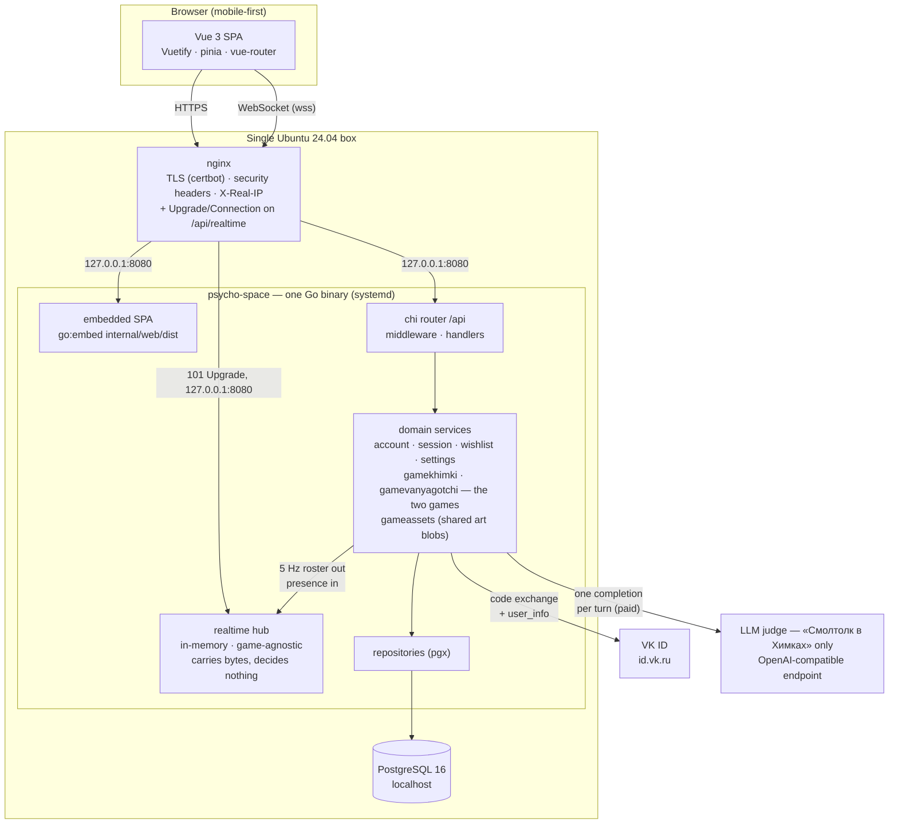

**Why one binary.** The SPA is compiled into the executable, so a deploy is a single file plus a restart, and nginx never needs to know about static asset paths. See [§8 → ADR-001](#adr-001--the-spa-is-embedded-in-the-go-binary) for why, and for what it costs.

**There are two ways in, and only one of them is a request.** Everything except the yard is request/response over `/api`. «Ванягоччи» additionally holds a WebSocket, which nginx must be told about explicitly — an upgrade is not a proxied request and the `Upgrade`/`Connection` headers do not survive a default `proxy_pass`. Inside the binary the hub is deliberately **not** a domain service: it is transport, it knows no game's vocabulary, and a game reaches it through two narrow seams — publish out, query presence in ([§8 → ADR-033](#adr-033--a-game-reads-the-socket-through-a-game-agnostic-handler-and-pulls-presence)). Note also what is **not** in the diagram: nothing runs on a schedule. There is no cron, no worker, no queue and no Redis. The one recurring thing in the process is the game's 5 Hz broadcast tick, and it reads memory rather than the database ([§2.6](#26-one-tick-of-the-yard)).

## 2. Runtime views

### 2.1 Login — VK ID confidential backend exchange

The authorization code is exchanged **on the server**, so the VK service token never reaches the browser. A session cookie is issued even for `pending` and `blocked` accounts: it identifies without authorizing, because `requireAuth` still demands `status == approved`. See [§8 → ADR-007](#adr-007--a-session-cookie-is-issued-even-for-pending-and-blocked-accounts) for why.

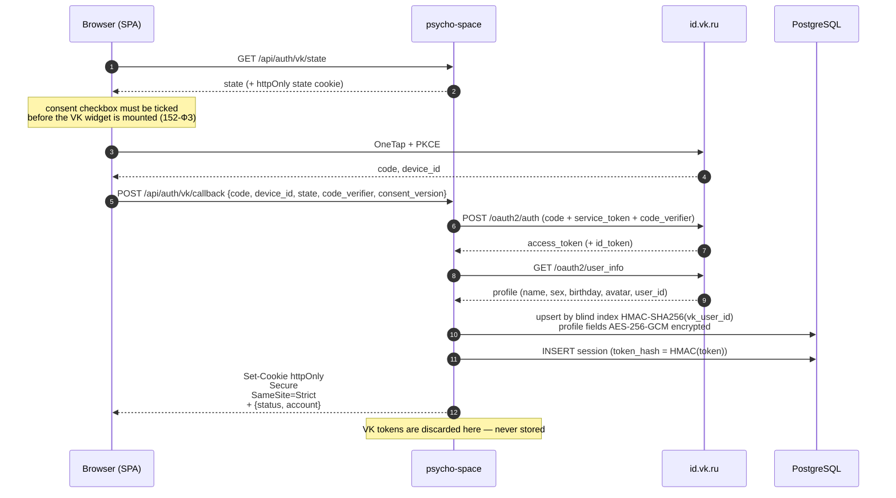

### 2.2 A wishlist upvote (the shape every gated request has)

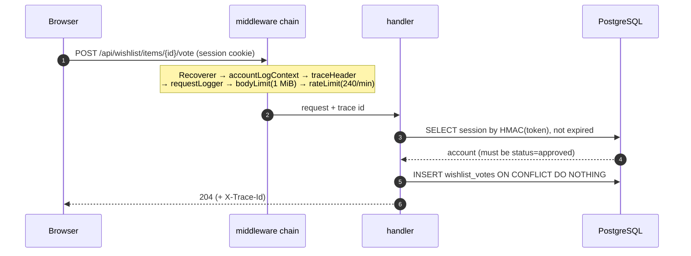

Any non-2xx answers `{error: "<stable_code>", trace_id}` — never `err.Error()` — and the SPA shows the trace id in a copyable modal. See [§8 → ADR-024](#adr-024--errors-carry-a-trace-id-and-never-carry-the-error-text) for why.

### 2.3 A turn in «Смолтолк в Химках» (the only paid path)

**This flow is specific to «Смолтолк в Химках»** — the LLM-judged dialogue game in `internal/gamekhimki/`, served under `/api/game-khimki/*` — and nothing in it generalises to another game. The second game, «Ванягоччи» (realtime, in design), makes no LLM call on any path: [§8 → ADR-016](#adr-016--no-realtime-message-may-reach-the-llm) forbids a realtime message from reaching the judge at all, so «Смолтолк в Химках» is the only paid path in the system, not merely the first one.

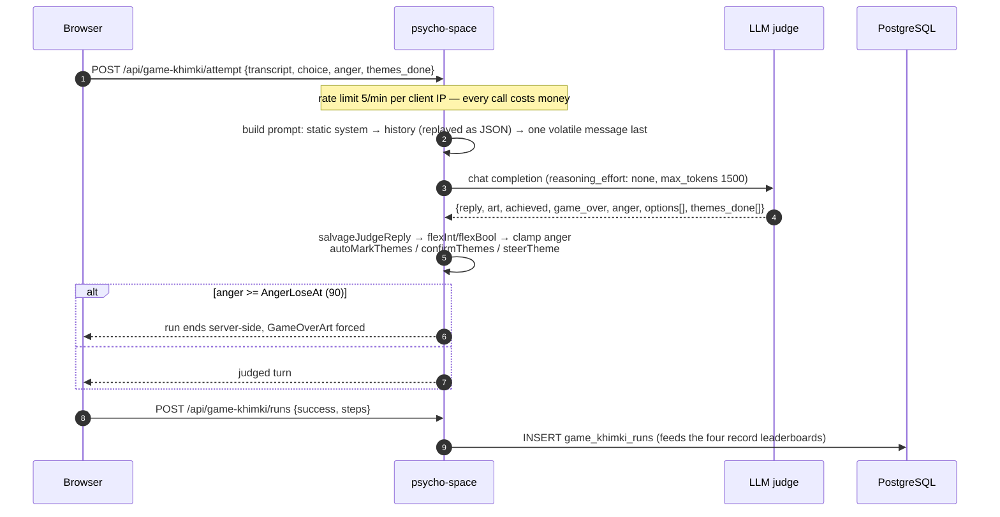

The prompt order is load-bearing, and so is the shape of the history: static system prompt → each past turn replayed as the JSON the judge returned → one volatile message last. See [§8 → ADR-013](#adr-013--the-prompt-is-laid-out-for-prefix-caching-and-history-is-replayed-as-json) for why. Measurements and per-turn costs: `RUNBOOK.md` → *Working on the game*.

### 2.4 Reading the pet in «Ванягоччи» (a GET that writes, and why)

**This flow is specific to «Ванягоччи»** and is the shape every time-varying thing in the system takes ([§8 → ADR-038](#adr-038--time-varying-state-is-computed-on-read-never-ticked)). Nothing runs on a timer: the pet is created, its stats are seeded, they are decayed, and a death is recorded — all by the request that happened to look.

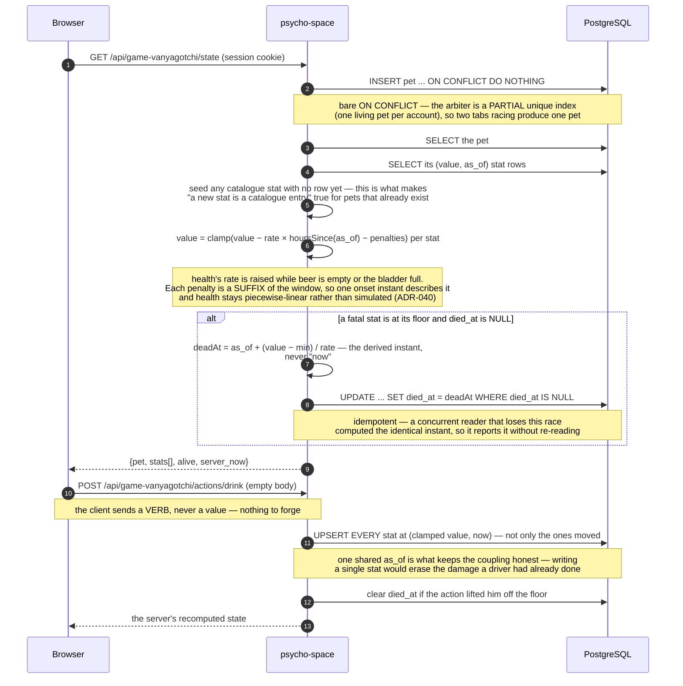

`server_now` is in every response so the SPA can keep the bar creeping between fetches against the **server's** clock rather than the phone's, and each stat carries the **effective rate it is suffering right now** — which is generally not the catalogue's rate, because a penalty may be active. Sending it is what stops the browser needing its own copy of the coupling. That interpolation is display only: the client never sends a value back, and every action is answered with the state the server computed, so a screen that has drifted is corrected the moment the player does anything.

### 2.5 Realtime connection lifetime

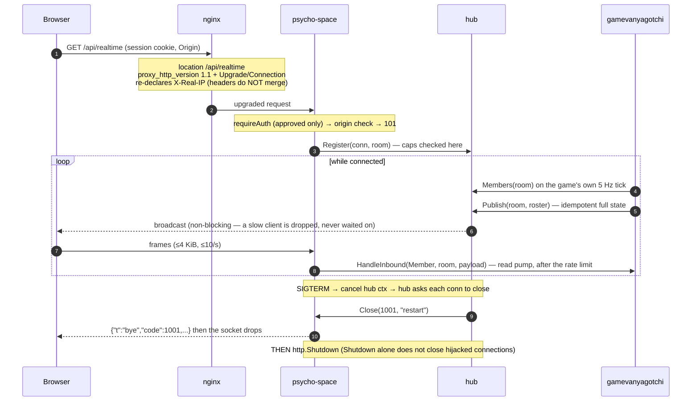

**The hub carries bytes and decides nothing.** A game publishes through it and reads from it across two game-agnostic seams — a `Handler` for inbound frames and a `Members` query for presence — so `internal/realtime` contains no game's vocabulary and «Ванягоччи» owns its own wire types. See [ADR-033](#adr-033--a-game-reads-the-socket-through-a-game-agnostic-handler-and-pulls-presence) and [ADR-034](#adr-034--the-broadcast-tick-is-injected-and-belongs-to-the-game).

**On the browser side** the socket is owned at module scope (`web/src/realtime/socket.ts`), not by a component: the yard is a lazy child route, so a component-owned socket would re-handshake on every navigation and spend another of the three connections the server allows per account. Its lifetime follows a subscription refcount with a grace period rather than the route. The rule that governs everything rendered from a frame is written in that file and in `web/src/lib/vanyagotchiPlane.ts`, and is worth knowing before touching either: **membership is reactive, positions are not.** Who is present goes through pinia and a keyed list; where they are is written straight to two CSS custom properties, because a 5 Hz frame bound to reactivity costs a scheduler pass and a vdom patch per entity to produce a transform the compositor could have been handed directly.

The reason arrives as a **frame**, not as a WebSocket close code — a browser sees `1006` for every disconnect and reads the reason from the last `bye` frame instead. Codes: `1001` planned restart (reconnect promptly), `1013` evicted or over a cap (back off), `4001` session revoked (terminal — stop). See [ADR-018 · *The close reason travels as a frame*](#adr-018--the-close-reason-travels-as-a-frame-not-as-a-close-code) for why, and [ADR-019 · *The read pump must not observe shutdown*](#adr-019--the-read-pump-must-not-observe-shutdown) for the library trap that makes the ordering load-bearing.

### 2.6 One tick of the yard

**This flow is «Ванягоччи»** and it is the other half of the game — §2.4 above is the pet in Postgres, this is the plane in memory. Three things happen at three different rates, and keeping them apart is the whole design: the **database is read once**, when a client says hello; a **tap** is accepted whenever one arrives; and the **broadcast runs five times a second and touches nothing but memory**.

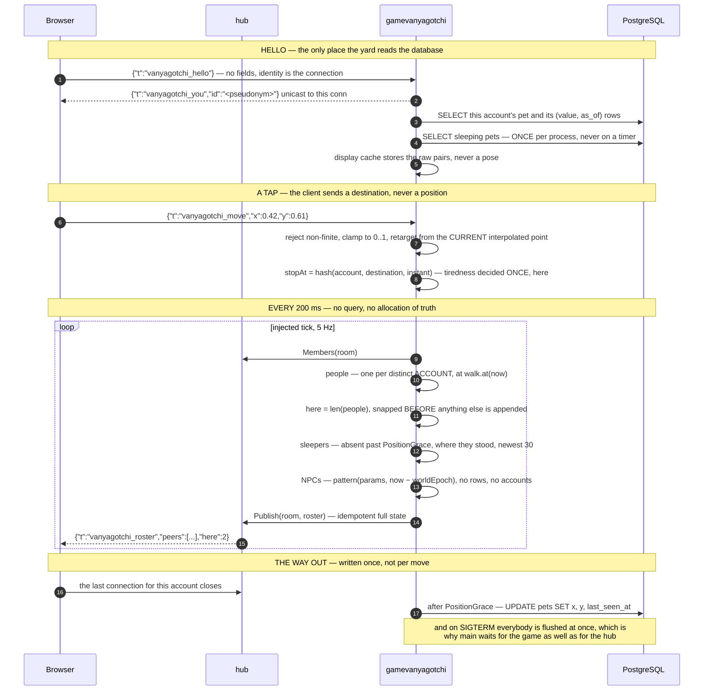

**The tick never touches Postgres, and that is a constraint rather than an optimisation.** At 5 Hz a query per entity per frame would be a self-inflicted load test, so appearance comes from an in-memory cache filled on hello and refreshed whenever that client acts over HTTP. What the cache holds is the **raw `(value, as_of)` pairs, not the pose** — a pose expires, so a cached one would show a healthy Ваня who has been dying since lunchtime, whereas a cached pair stays exact for the same reason the whole decay model does ([§8 → ADR-041](#adr-041--the-broadcast-tick-renders-from-a-cache-and-position-outlives-the-process)).

**Nothing on the plane integrates a velocity.** An NPC is `pattern(params, now − worldEpoch)` and a player is a point along a walk with a known start, so a tick that is late, early, skipped, duplicated, or served to a client that has just reconnected still produces the correct world. That is what makes a GC pause cost nothing and stops two people's yards drifting apart while neither reports a fault ([§8 → ADR-042](#adr-042--everything-that-moves-is-a-function-of-absolute-time)). It is also why an NPC needs no row and no account: there is nothing about one to store, so adding one is a catalogue entry with **no migration and no client deploy**. The same rule reaches past motion to anything that appears and disappears: a Ваня's speech balloon is a phrase pool indexed by hashing (account, time-slot), so it needs no timer, stores nothing, expires by arithmetic rather than by cleanup, and every client independently computes the same words at the same moment.

**The frame is idempotent full state — there are no deltas and no announcements.** A dropped frame therefore costs exactly nothing, because the next one is the truth again, which is what lets the hub drop a slow client's backlog instead of blocking on it. It is also why a world *event* has to be state in the frame rather than a one-shot message: a one-shot arrives once or never, and "never" is indistinguishable from "it did not happen".

**Three kinds of entity, and the client cannot tell them apart on purpose** — connected people, sleepers, and NPCs are the same shape on the wire. So the count of people is sent explicitly as `here` rather than derived by the browser: making the client work it out would mean teaching it what an NPC is, and the point of the envelope is that it does not know. An empty room publishes nothing at all — silence, not a roster of NPCs talking to themselves.

**Position is in memory, written down only on the way out.** A place survives a page reload because absence is not departure — it is held for a `PositionGrace` of two minutes after the last socket closes — and survives a *deploy* because the last disconnect (and shutdown, for everyone at once) writes it to `pets.x` / `pets.y`. A crash still loses whatever had not been written, and that is accepted rather than fixed. The reward for making it durable is that an absent player can be drawn asleep where he stood instead of vanishing, which is what keeps the yard from being an empty field when only one person is online.

### 2.7 Deploy

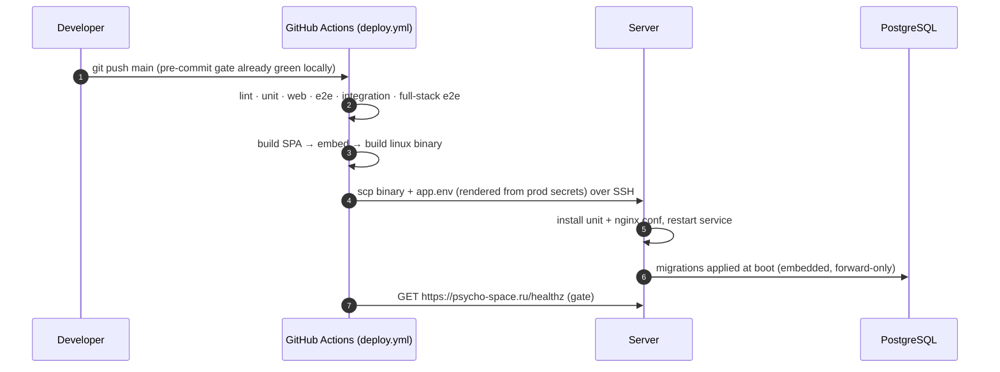

A push to `main` is a deploy, and a red run means production was not updated. See [§8 → ADR-003](#adr-003--push-to-main-deploys-the-gates-are-the-safety-net) for why that is safe without a staging environment.

## 3. Package structure

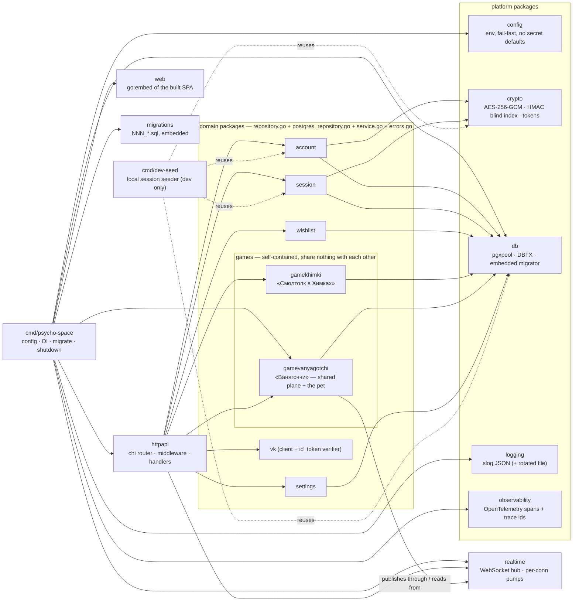

**The rule:** dependencies point inward and downward — handlers know services, services know repositories, repositories know `db.DBTX`. Nothing in `internal/*` imports `httpapi`. Adding a feature means a new `internal/<domain>/` package with those four files, a `NNN_*.sql` migration, wiring in `main.go` + `httpapi.Deps` + routes, and a case in `test/integration/`.

**Games are the exception to the usual instinct to factor things out.** Each game is a self-contained module: its own package, its own `game_<name>_*` tables, its own routes and views, its own leaderboard code — and **no game imports another, even where the code would be identical.** A game may depend on platform packages (`realtime`, `session`, `account`, `crypto`, `db`, and the `httpapi` plumbing); none of those may know a game exists, which is why the socket is addressed as the game-agnostic `/api/realtime?room=…` and game-specific message types live in the game's own package. The test for the boundary: deleting a game must mean deleting its package, its migration, its routes and its views — and nothing else. See [§8 → ADR-028](#adr-028--games-are-self-contained-modules) for why, and `CLAUDE.md` → *Games are self-contained modules* for the same rule stated as a working rule.

**And each game's name is spelled out at every layer**, which is what makes that boundary test executable rather than a judgement call: package `internal/game<name>/`, tables `game_<name>_*`, routes `/api/game-<name>/*`, view `Game<Name>View.vue` at `/app/game-<name>` — so `git grep -il game<name>` enumerates the whole module. «Смолтолк в Химках» is `gamekhimki`; «Ванягоччи» is `gamevanyagotchi`. Platform packages stay unprefixed on purpose, because the missing prefix is the signal that they are game-agnostic. See [§8 → ADR-030](#adr-030--game-modules-are-named-gamename).

**Its files split by what they know.** `content.go` is the catalogue (stats, actions, skins, locations, NPCs, every tuning constant); `decay.go` is the time arithmetic for stats and `motion.go` the time arithmetic for space — both pure, both closed-form, neither storing anything; `display.go` is the in-memory cache the broadcast draws from; `service.go` holds the verbs and the tick. A new character is a `content.go` entry. A new *way of moving* is one function and one map entry in `motion.go`. Neither is a migration and neither is a client change.

**`gamevanyagotchi` is one package holding two things with deliberately different lifetimes**, and the split is worth knowing before reading it. The **plane** — who is standing where — lives in memory and is published through the hub five times a second. The **pet** — the stats, the death — is in Postgres and outlives every deploy. The plane now *draws* what the database knows, and the way it does that is the load-bearing part: a **display cache** (`display.go`) holds each account's pet fields in memory, filled when a client says hello and refreshed by the HTTP read path, so **the broadcast tick never touches Postgres**. What it caches is the raw `(value, as_of)` pairs rather than a pose — a pose changes with the clock, so a cached one would quietly show a healthy Ваня who has been dying since lunchtime, whereas a cached pair stays exact for the same reason the whole decay model does ([§8 → ADR-041](#adr-041--the-broadcast-tick-renders-from-a-cache-and-position-outlives-the-process)). So beyond the usual four files the package carries the five listed above, and the two halves meet in exactly one place — the broadcast, which reads the cache and never the pool. See [§8 → ADR-038](#adr-038--time-varying-state-is-computed-on-read-never-ticked) and [ADR-039](#adr-039--game-content-is-a-go-catalogue-and-the-schema-stores-only-its-keys) for the two rules that shape it, and [§2.6](#26-one-tick-of-the-yard) for the flow.

### The SPA

The browser half is a normal Vue 3 application — until the yard, which has a second data source and a second rendering discipline, and that is the part worth having a diagram for.

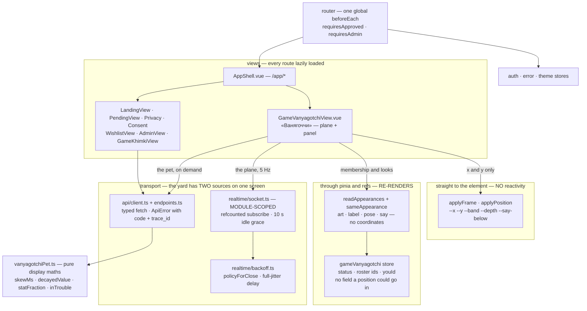

**The socket is owned at module scope, not by a component.** The yard is a lazy child route, so a component-owned socket would re-handshake on every navigation and spend another of the three connections a server allows per account. Its lifetime is a subscription refcount with a ten-second idle grace, so leaving the yard and coming back reuses the connection.

**In the yard, membership is reactive and positions are not.** This is the load-bearing rule of the client and it is enforced structurally rather than by convention, in three places at once: the store has no field a coordinate could go in, the `PeerAppearance` shape that enters reactivity has no `x`/`y`, and the function that writes a position takes an interface narrowed to `style.setProperty` alone — so the position path *cannot* read layout, measure a box, or touch an attribute. Who is present, what they look like and what they are saying go through pinia and a keyed list, behind an equality guard so a frame that changed nothing re-renders nothing. Where they are is written straight to CSS custom properties on the element, and the mapping from `0..1` to pixels happens in the stylesheet against the plane's own container box. The reason is arithmetic: at 5 Hz, binding positions to reactivity costs a scheduler pass and a vdom patch per entity per frame to produce a transform the compositor could have been handed directly — and it would cache a measured size that mobile browser chrome invalidates every time it slides.

**Everything the client knows about a game's content, it was told.** Stats, actions, skins, locations and characters all arrive from `GET /api/game-<name>/config` and are iterated generically, which is what makes a new stat or a new NPC a backend deploy. What is deliberately still hardcoded is *presentation*: the splash copy, the RU status strings, the pose vocabulary the stylesheet has rules for, and the plane's 3:4 aspect ratio — that last one being a genuine rule of the game rather than a style, because normalised coordinates only mean the same thing on two phones if both draw the same shape.

## 4. Data model

Every table carries `created_at` / `updated_at`, and everything soft-deletable carries `deleted_at` (queries filter `WHERE deleted_at IS NULL`).

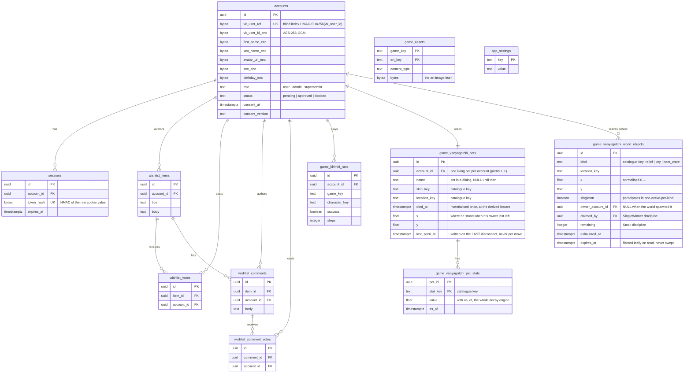

`game_assets` and `app_settings` stand apart — neither references an account. The art bytes live in Postgres, not in git and not in the binary. See [§8 → ADR-026](#adr-026--game-art-lives-in-postgres-not-in-git-or-the-binary) for why (that record predates the rename and names the table `game_assets`; [ADR-030](#adr-030--game-modules-are-named-gamename) is the amendment).

The three `game_vanyagotchi_*` tables are **«Ванягоччи»**, and they are shaped by two decisions worth knowing before changing them. **Every `*_key` column is `text` whose meaning lives in the Go catalogue, never a Postgres enum** — an enum makes each new stat, skin, location or object kind an `ALTER TYPE`, i.e. a permanent migration, which is exactly the cost the catalogue exists to remove ([§8 → ADR-039](#adr-039--game-content-is-a-go-catalogue-and-the-schema-stores-only-its-keys)). And **stats are tall while world objects are wide, on purpose**: stats are a homogeneous collection of `(value, as_of)` pairs that one decay expression covers, whereas world objects are heterogeneous rows carrying contended invariants — `claimed_by`, `remaining`, `exhausted_at` — that have to be indexable and `CHECK`-able. The tall shape pays for itself again in the coupling: a stat that raises another's drain is a catalogue entry naming a key, and adding one costs no column ([§8 → ADR-040](#adr-040--a-stat-may-drive-another-stats-rate-and-it-is-still-exact)). It also carries the invariant that coupling depends on — **every write touches every row of a pet, with one shared `as_of`** — so there is deliberately no single-stat write path. There is no JSONB in either. `game_vanyagotchi_world_objects` is written by no code yet; its shape landed with the other two because migrations are immutable, and the one-active-per-kind invariant is a partial unique index that an integration test pins today.

`game_khimki_runs` and `game_assets` belong to **«Смолтолк в Химках»**, and now say so — they were `game_runs` and `game_assets` until `migrations/007_game_khimki_rename.sql`. A second game gets its own `game_<name>_*` tables rather than rows in these — see [§8 → ADR-028](#adr-028--games-are-self-contained-modules) and [ADR-030](#adr-030--game-modules-are-named-gamename). Their `game_key` **values** did not move with the tables: the column still reads `smalltalk_khimki`, because it is data rather than a name and the art blobs are keyed on it.

## 5. API map

Everything is under `/api`, authenticated by the session cookie. `GET /healthz` sits outside it (the deploy gate polls it).

| Group | Endpoints | Access |
|---|---|---|
| `auth` | `GET vk/state` · `POST vk/callback` · `GET me` · `POST logout` | public (30/min per IP on the VK pair) |
| `wishlist` | `GET/POST items` · `DELETE items/{id}` · `POST/DELETE items/{id}/vote` · `GET/POST items/{id}/comments` · `DELETE comments/{id}` · `POST/DELETE comments/{id}/vote` | approved |
| `game-khimki` | `GET assets/{game}/{key}` | **public** (art, cacheable) |
| `game-khimki` | `GET config` · `POST attempt` (5/min per IP — paid) · `POST runs` · `GET runs/leaderboard` · `GET runs/me` | approved |
| `game-vanyagotchi` | `GET config` · `GET state` · `POST actions/{action}` | approved |
| `admin` | `GET accounts?status=` · `POST accounts/{id}/approve` · `POST accounts/{id}/block` · `GET settings` | admin+ |
| `admin` | `POST accounts/{id}/promote` · `POST accounts/{id}/demote` · `PUT settings/open-registration` | superadmin only |
| `realtime` | `GET realtime?room=` — WebSocket upgrade | approved |

The two `game-khimki` rows are **«Смолтолк в Химках»** and the `game-vanyagotchi` row is **«Ванягоччи»**; a third game gets its own `/api/game-<name>/*` group rather than new keys in either, while `realtime` is game-agnostic by design ([§8 → ADR-028](#adr-028--games-are-self-contained-modules), [ADR-030](#adr-030--game-modules-are-named-gamename)).

Two things about the `game-vanyagotchi` row read oddly and are deliberate. **`GET state` writes** — it creates the pet on first sight and records a death the first time one is observed; both are idempotent, and the alternative to writing on read is a background job this system does not have ([§8 → ADR-038](#adr-038--time-varying-state-is-computed-on-read-never-ticked)). **The action is a path segment checked against the content catalogue**, not a fixed set of routes, so a new stat-restoring verb is a catalogue entry rather than a handler — and the request body is empty, because the client sends a verb and never a value.

**`/api/game/*` no longer answers.** The pre-rename prefix was registered as a second route group on the same handlers for exactly one deploy cycle, so that a browser holding the previous SPA build in cache would not break mid-run; that cycle is over and the registration is deleted. `TestGameKhimkiLegacyPathAliasIsGone` in `test/integration/gamekhimki_test.go` now pins its **absence** — it asserts 404 rather than 401 on a gated path, because 401 would mean the route group had been re-registered and was merely refusing the request. On the client side `/app/game` redirects permanently to `/app/game-khimki`; that redirect is not an alias and stays.

Anything not matching `/api` or `/healthz` is served the embedded SPA, so client-side routes resolve on a hard refresh.

### The realtime wire contract

The table above is HTTP. `GET /api/realtime?room=yard` is the other half of the surface, and it is a **protocol rather than an endpoint**, so it is written out here. Everything in both directions is a JSON **text** frame with a string `t` discriminator, and **both ends ignore an unknown `t`** — that is what lets either side learn a message type without a coordinated deploy.

| Direction | `t` | Payload | Notes |
|---|---|---|---|
| → server | `vanyagotchi_hello` | none | Deliberately empty: identity is the connection, so there is nothing to forge. Sent on **every** open, including reconnects. |
| → server | `vanyagotchi_move` | `x`, `y` — both required, `*float64` | A destination, never a position. Non-finite is rejected; out of range is **clamped** to `0..1`, not refused. |
| ← client | `vanyagotchi_you` | `id` | Unicast reply to a hello: which entity in the roster is you. |
| ← client | `vanyagotchi_roster` | `peers[]`, `here` | The full-state frame, 5 Hz. Per entity: `id`, `x`, `y`, `art`, `pose`, and optional `label` / `say`. |
| ← client | `bye` | `code`, `reason` | Transport-owned, not the game's — sent immediately before the socket drops ([ADR-018](#adr-018--the-close-reason-travels-as-a-frame-not-as-a-close-code)). |

Six properties of it are load-bearing, and each one is a decision rather than an accident:

- **The frame is idempotent full state.** No deltas, no one-shot announcements, no join/leave bookkeeping on either side. A dropped frame costs nothing because the next one is the truth again — which is exactly what permits the hub to discard a slow client's backlog rather than block the broadcast on it.
- **`id` is a per-process pseudonym, never `accounts.id`.** It is an HMAC of the account under a key minted from `crypto/rand` at startup and held only in memory, truncated to 12 base64url characters. Stable across every connection and device of one account, meaningless after a restart, and stored nowhere. A roster is fanned out to the whole room, so anything in this field is a handle every other player can record ([ADR-037](#adr-037--one-account-is-one-entity-and-the-wire-carries-a-pseudonym)).
- **`here` is sent, not derived.** It counts distinct connected accounts, snapped before sleepers and NPCs are appended. The browser is not able to tell a person from a character and must not have to.
- **A malformed, unknown or invalid frame gets no reply and no log line.** Silence is the policy: a log per bad frame at the permitted 10/s would be a flood lever handed to any client.
- **Nothing inbound carries an account field.** The account is bound at the upgrade and travels to the game as a `realtime.Member`, so a payload cannot claim to be someone else.
- **No acknowledgement for a move.** The mover learns the outcome from the next roster like everybody else, so there is exactly one source of truth about where he is.

The `bye` codes are `1001` planned restart (reconnect promptly), `1013` evicted, rate-limited or over a cap (back off), and `4001` session revoked (terminal — stop, and do not reconnect). Reason strings are constants because the client branches on the exact text, so changing one is a wire change.

## 6. Security view

| Concern | Mechanism | Where |
|---|---|---|
| Personal data at rest | AES-256-GCM per field, per-row nonce; key from env, validated at startup | `internal/crypto`, `*_enc` columns |
| Lookup without plaintext | Deterministic `HMAC-SHA256(vk_user_id)` blind index | `accounts.vk_user_ref` |
| Sessions | 32-byte `crypto/rand` token; only its HMAC is stored; `httpOnly; Secure; SameSite=Strict` | `internal/session` |
| Authorization | `requireAuth` (status must be `approved`) → `requireAdmin` → `requireSuperadmin` | `internal/httpapi/router.go` |
| Revocation | Blocking an account deletes its sessions immediately | `internal/account`, `internal/session` |
| Rate limiting | Per client IP: 30/min login, **5/min `game-khimki/attempt`** (paid), 240/min blanket | `internal/httpapi/router.go` |
| Trusted client IP | `X-Real-IP`, honoured **only** from the loopback proxy; `X-Forwarded-For` is never trusted — see [§8 → ADR-027](#adr-027--the-client-ip-comes-from-x-real-ip-trusted-only-from-a-loopback-peer) | `internal/httpapi/middleware.go` — `clientIP` |
| Request size | 1 MiB body cap on every route | `bodyLimit` |
| Error disclosure | Stable codes + trace id; `err.Error()` never reaches a client | `internal/httpapi/respond.go` |
| Asset content type | Allowlisted image types + `nosniff` | `internal/httpapi/gamekhimki.go` — `imageContentType` |
| Consent (152-ФЗ) | Checkbox gates the VK widget; `consent_at` + `consent_version` persisted | SPA + `accounts` |
| WebSocket origin | Validated at upgrade (library default; never `InsecureSkipVerify`) — the same-origin policy does **not** apply to WebSocket | `internal/httpapi/realtime.go` |
| WebSocket frame size | `SetReadLimit(4096)` — the 1 MiB `bodyLimit` wraps `r.Body` and the hijack bypasses it | `internal/realtime/conn.go` |
| WebSocket message rate | 10/s per connection, burst 20 — the HTTP limiter fires once, at the handshake. Checked **before** the frame reaches a game, so a game inherits the bound rather than having to reimplement it | `internal/realtime/conn.go` |
| Socket identity | The account is bound at upgrade and travels to a game as `realtime.Member`; **no inbound frame has an account field**, so a payload cannot claim to be someone else | `internal/realtime/conn.go` — `readPump` |
| Identity on the wire | A broadcast roster carries a **per-process pseudonym**, never `accounts.id` — a durable cross-session handle must not be published to every other player ([ADR-037](#adr-037--one-account-is-one-entity-and-the-wire-carries-a-pseudonym)) | `internal/gamevanyagotchi` — `pseudonym` |
| Inbound payloads | Text frames only, ≤4 KiB, parsed by the owning game; anything malformed, unknown or non-finite is dropped without a reply and without a log line (a log per bad frame would be a flood lever at 10/s) | `internal/gamevanyagotchi/message.go` |
| Connection caps | 3 per account, 200 per process | `internal/realtime/hub.go` |
| Revocation on a live socket | Two paths, deliberately. Blocking through the admin API kicks in process — instant and deterministic. A **30 s revalidation sweep** is the backstop for the two cases that produce no in-process signal at all: a session reaching its `expires_at`, and a block applied straight in the database. Both close with `bye` code 4001, which the client treats as terminal. A socket is judged on **its own session**, not merely its account, because an expired session is exactly the case an account-level check cannot see. | `internal/realtime/revalidate.go` · `internal/httpapi/admin.go` → `Hub.KickAccount` |
| …and an error is not a revocation | If the check cannot answer — a database blip — the sweep closes **nobody** and tries again next tick. Failing closed here would turn a moment of database trouble into disconnecting every player at once, which is a worse outcome than a revoked session surviving 30 seconds longer. | `internal/realtime/revalidate.go` — `Authorizer` |

## 7. Where things are written down

| Question | File |
|---|---|
| How do I work on this? Conventions, gates, workflow | `../CLAUDE.md` |
| What is the shape of the system? | this file |
| Why is it like that? Decisions and their rationale | this file, [§8](#8-decision-records-adrs) — the append-only record log |
| How do I debug, deploy, or operate it? | `RUNBOOK.md` |
| What is still to do, and the owner's private operational detail | the local living doc (`~/Desktop/psycho-space/psycho-space.md`) |

## 8. Decision records (ADRs)

The code says *what*, and comments say *why this line*. Neither says why the system is shaped the way it is, and that is exactly what gets re-derived — usually wrongly — by whoever touches the project next. Each entry below is a decision, its reasoning, and its consequence.

**The bar is high, and it is about architecture.** A record is for a decision that shapes the *system* — how it is deployed, how it stores and protects data, where a boundary between components falls, what a whole class of future change will cost. Two questions have to be answered yes: is the reasoning unrecoverable from the diff, **and** would somebody redesigning this part need to know it? "Chose server-side sessions over JWT" is a record. "Renamed a variable" is not, and neither is a tuning constant, a UI behaviour, or a bug fix in the test harness — however subtle the reasoning behind it, that reasoning belongs in a comment next to the code it governs, where it will be read by the person actually changing it.

Four records were withdrawn on 2026-07-25 for failing that bar — an animation speed, a nav-drawer flourish, a test-harness race, and a note about defensive code that was correctly absent. Each one's reasoning still exists as a comment beside the code, which is where it was always more useful. **Withdrawal leaves a permanent gap in the numbering:** a number is never reused, so every existing reference keeps meaning what it meant, and `git log` still has the withdrawn text.

Sections 1–7 above are the structural view — what the system is made of and how it behaves. The records below are the other altitude: the durable decisions that produced that shape, each with the reasoning, and where one exists the measurement or the failure that settled it. They are grouped by subject, and a record describes a decision rather than the current code, which the sections above already cover.

**Records are append-only.** Never edit an accepted record's decision or its reasoning. The whole value of the log is that it says what was decided and why *at the time*; a record that has been quietly rewritten cannot be relied on for that. A decision is revisited by adding a record, never by editing one:

- **Retired** — the decision no longer holds. Write a new record, and leave the old one's body untouched, appending `_Superseded by ADR-0NN · <date>_` to its status line.
- **Amended** — the decision still stands, but the mechanism that implements it changed. Keep the record, and append `· amended by [ADR-0NN](#anchor) — <what changed>` to its status line; the new record carries `· amends ADR-0NN` in its own. ADR-017 and ADR-018 are the worked example.

Fixing a typo or a rotted link inside a record is fine. Changing what it decided, or why, is not.

**The status vocabulary is `Accepted` and `Superseded`, and nothing else.** There is no `Proposed`: a record here is written in the same commit as the change it describes, so by the time one exists the decision has already shipped. Proposals belong in the owner's living doc.

**The date on a record is when the record was written, not when the decision was taken.** They are usually the same day, and when they are not, the record's own commit in `git log` is the authority on the former.

**The numbers are identifiers, not an ordering, and not a sequence.** A new record takes the next globally unused number whichever group it lands in, so numbering within a group is often non-sequential, and a withdrawn record leaves a hole. Both are expected; renumbering to tidy either up would break every existing reference, and a reused number would silently redirect one. Find the next number with:

```bash
grep -o 'ADR-[0-9]\{3\}' docs/ARCHITECTURE.md | sort -u | tail -1
```

Records 001–026 were written on 2026-07-25 when this log was created, from `docs/DESIGN.md`; edits made to that file before the merge are in `git log -- docs/DESIGN.md` and are not reconstructed here. Immutability applies from the merge forward.

**Division of labour with the runbook.** A record owns the durable decision and its reasoning. `RUNBOOK.md` owns the measurements and the operational economics — the game's per-turn cost above all, which is a figure to be re-measured as models and prices move, not a decision to be superseded. A fresh cost measurement is a runbook edit, not a new record here.

### 8.1 Platform and delivery

#### ADR-001 · The SPA is embedded in the Go binary

_Accepted · 2026-07-25_

`go:embed internal/web/dist` compiles the built frontend into the executable, so a release is one file. nginx does TLS, headers, and a proxy — it never serves an asset or knows a path.

_Consequence:_ a CSS-only change still rebuilds and redeploys the binary. For one box and one maintainer that is cheaper than operating a second artifact with its own cache-busting and deploy order.

#### ADR-002 · Provisioning is a one-time manual script; only the app deploys from CI

_Accepted · 2026-07-25_

`scripts/bootstrap.sh` installs Postgres, nginx, certbot, systemd units, the `deploy` user, and the CI key, then hardens SSH. It is run once, by hand, over the existing root access — and it deliberately leaves SSH listening on **both** the old and the new port so a mistake cannot lock the operator out. `scripts/harden-finalize.sh` closes the old port afterwards, once the new one is proven from a second terminal.

_Reasoning:_ the lockout-sensitive part of provisioning is exactly the part that should not run unattended from a pipeline.

#### ADR-003 · Push to `main` deploys; the gates are the safety net

_Accepted · 2026-07-25_

There is one environment (production), one maintainer, and no staging. Feature branches are optional. What keeps that safe is that the mandatory pre-commit hook and the deploy workflow run the same suite — build, lint, unit, web, both e2e suites, integration — and the deploy is followed by an external health check.

_Consequence:_ a red deploy means production is stale. That is treated as unfinished work, not as a notification.

### 8.2 Identity and personal data

#### ADR-004 · Server-side opaque sessions, not JWT

_Accepted · 2026-07-25_

A 32-byte `crypto/rand` token is delivered in an `httpOnly; Secure; SameSite=Strict` cookie; only its HMAC is stored, alongside `expires_at`.

_Reasoning:_ the allowlist needs **instant revocation** — blocking someone has to end their access now, not at the next token expiry. A stateless token cannot do that without a revocation list, which is a session table wearing a disguise.

#### ADR-005 · Personal data is encrypted at rest, and looked up through a blind index

_Accepted · 2026-07-25_

Profile fields are AES-256-GCM with a per-row nonce. Lookups (login, dedupe, allowlist) go through a deterministic `HMAC-SHA256(vk_user_id)` blind index, never plaintext and never a reversible identifier.

_Reasoning:_ 152-ФЗ minimisation, and the practical version of it — a database dump on its own should not be a list of who uses the site. The cost is that equality is the only query available on those columns, which is all the application needs.

_Consequence, learned the hard way:_ the keys are load-bearing. Rotating `APP_HMAC_KEY` breaks every blind index; losing `APP_ENC_KEY` makes stored profiles unrecoverable. A single row that cannot be decrypted makes the whole admin list fail — which is how the full-stack e2e suite caught its own environment reusing a database across runs with fresh keys.

#### ADR-006 · VK tokens are discarded after the profile fetch

_Accepted · 2026-07-25_

The code exchange happens on the server with the service token; the resulting access/refresh tokens are used once to read `user_info` and then dropped.

_Reasoning:_ we never act on the user's behalf at VK, so storing a credential that would let us is pure liability.

#### ADR-007 · A session cookie is issued even for pending and blocked accounts

_Accepted · 2026-07-25_

_Reasoning:_ the SPA needs an identity to poll `/api/auth/me` with, so a waiting user's screen comes alive the instant an admin approves them, and a blocked user gets told what happened instead of a bare login screen. Authorization is unaffected — `requireAuth` still demands `status == approved`.

#### ADR-008 · Consent is a gate, not a checkbox on a form

_Accepted · 2026-07-25_

The VK widget is not mounted until the consent box is ticked; `consent_at` and `consent_version` are recorded server-side, and the version is bumped whenever the disclosed data set changes.

_Reasoning:_ consent has to precede processing to mean anything. Mounting the widget first and recording consent afterwards would reverse that order.

### 8.3 Roles and access

#### ADR-009 · Three tiers, with promotion reserved to one of them

_Accepted · 2026-07-25_

`user < admin < superadmin`. Admins approve and block; only the superadmin promotes or demotes, and the superadmin cannot be blocked.

_Reasoning:_ the failure this prevents is an admin locking out the owner, or a mutual-demotion standoff. One unrevokable root is the simplest structure that has no such state.

#### ADR-010 · Open registration is a toggle, not a rebuild

_Accepted · 2026-07-25_

`app_settings.open_registration` auto-approves new accounts as plain users when on; existing accounts are untouched either way.

_Reasoning:_ the setting is a row read at login time and it only ever supplies the status of a **brand-new** account — the login upsert's `ON CONFLICT` clause never touches `status` or `role` — so the toggle is reversible in either direction with no migration and no redeploy, and no existing account moves because it flipped.

### 8.4 The games

Records 011–014 and 029 are all about **«Смолтолк в Химках»**, the LLM-judged game; ADR-028 and ADR-030 are the rules that govern every game — the first says a game shares nothing with another game, the second says how a game module is named so that the first is checkable with a grep. «Смолтолк в Химках» is documented at length in `RUNBOOK.md` → *Working on the game*, because most of what matters there is operational (what a failure looks like in the log, what a turn costs). The decisions worth stating as decisions:

#### ADR-011 · The judge is an LLM, and there is no mock

_Accepted · 2026-07-25_

An unconfigured LLM answers `503` rather than falling back to canned replies.

_Reasoning:_ a mock judge would be test-only code on a production path — forbidden here — and a fallback that quietly produces worse dialogue is harder to notice than an outage.

#### ADR-012 · Theme progress steers the options but never awards the win

_Accepted · 2026-07-25_

The server tracks which of the character's deep themes the conversation has genuinely opened, uses that to aim one answer slot at a still-closed theme, and marks a theme open by itself when the conversation has engaged it enough times.

_Reasoning:_ two separate failures. Steering the slot at the *last* remaining theme every turn made the conversation collapse onto one subject and the run unwinnable — measured at 15 of 20 option sets having all four options on the same topic. And making theme state the win condition would let a tampering client award itself the ending, so `achieved` stays the judge's reading of the dialogue.

#### ADR-013 · The prompt is laid out for prefix caching, and history is replayed as JSON

_Accepted · 2026-07-25_

Static system prompt → history → one volatile message last. Each past turn is replayed as the JSON object the judge returned.

_Reasoning, both measured:_ the provider bills a cached prefix at a quarter rate, and the first volatile byte invalidates everything after it — the tension value used to sit near the top of the system prompt, so nothing downstream could ever be cached, for any player. And the model imitates whatever format it sees: given prose history with a bracketed footer, it answered in prose with a bracketed footer and no JSON at all.

#### ADR-014 · The third theme is alcohol, deliberately, and must not become drugs

_Accepted · 2026-07-25_

The provider's content filter answered substance-use turns with prose instead of JSON, which players saw as an error. `TestContentAvoidsDrugFlavouredPrompts` guards the whole prompt surface against the regression.

#### ADR-028 · Games are self-contained modules

_Accepted · 2026-07-25_

Each game owns its Go package, its `<game>_*` tables, its routes, its views and its leaderboard code, and **no game imports another — not even where the code would be identical.** There is no shared games layer: no common game service, repository or table, no extracted game-UI shell, no generic board building. What is shared is *platform* — `realtime`, `session`, `account`, `crypto`, `db`, `logging`, `observability`, the `httpapi` router and middleware, and on the front end `apiFetch`, the error store, the theme and the app shell — and none of those may know that a game exists. The boundary test is blunt: deleting a game must be deleting its package, its migration, its routes and its views, and nothing else.

_Reasoning:_ these games are jokes for a small group, with a short and unpredictable life. The realistic future of any one of them is deletion, not extension — and premature sharing bills you at exactly the wrong moment, when you want something gone and find it welded to something you are keeping. A few duplicated files are far cheaper than that, so the duplication between games is the design and not debt to be cleaned up later.

_Consequence:_ the WebSocket is addressed as the game-agnostic `/api/realtime?room=…`, and a game's own message types live in that game's package and are published *through* the hub rather than added to it. `CLAUDE.md` → *Games are self-contained modules* carries the same rule as a working rule; that duplication is deliberate too, because that file has to stand on its own.

#### ADR-029 · The judge runs on DeepSeek V4 Flash

_Accepted · 2026-07-25 · amended by [ADR-030](#adr-030--game-modules-are-named-gamename) — the endpoint is now `/api/game-khimki/attempt`_

«Смолтолк в Химках» judges its turns with `deepseek-v4-flash` over the OpenAI-compatible endpoint (`PSYCHOSPACE_LLM_MODEL` carries the full folder-specific model URI), replacing `yandexgpt-5-lite` — and it runs with **`reasoning_effort: "none"`**.

_Reasoning:_ DeepSeek costs more per turn than the model it replaced, and the difference buys visibly better play — it produced the first winning run seen in any audit. Its content filter is also not the one that pushed the third theme off substance use (ADR-014), so the character can swear in character. Reasoning is off because this model bills `reasoning_content` as output, the dearest rate, and twice it spent the entire completion budget thinking and returned an empty reply — `finish_reason: length`, 1500 completion tokens, zero characters of dialogue, a turn lost and billed in full. Judging is a rule-following task, not a puzzle, so the chain of thought was buying nothing that the failure class cost. (`thinking` and `enable_thinking` are rejected by this endpoint; `reasoning_effort` is the knob it accepts.)

_Consequence:_ the `/api/game/attempt` limit was halved from 10/min to **5/min per client IP**, because a turn costs about twice what it did — and there is still no per-account cap, so one determined player remains the real cost exposure. The salvage path stays even though this model rarely returns malformed JSON, because a bad turn costs a player their move.

Per-turn economics — the price table, the current cost per turn and how it got there — stay in `RUNBOOK.md` → *Working on the game*, to be re-measured as models and prices move rather than superseded here.

#### ADR-030 · Game modules are named `Game<Name>`

_Accepted · 2026-07-25 · amends ADR-029_

Every game module carries its own name at every layer: package `internal/game<name>/`, tables `game_<name>_*`, routes `/api/game-<name>/*`, view `Game<Name>View.vue` served at `/app/game-<name>`, and any exported identifier that names the game from outside its package. Game 1 moved onto the convention from generic `game` naming in this change — `internal/gamekhimki/`, `game_khimki_runs` (`migrations/007_game_khimki_rename.sql`), `/api/game-khimki/*`, `GameKhimkiView.vue` at `/app/game-khimki` — and game 2 is `gamevanyagotchi` throughout. **Shared infrastructure is deliberately not prefixed:** `realtime`, `session`, `account`, `crypto`, `db`, `logging`, `observability`, `httpapi`.

_Reasoning:_ ADR-028 makes deleting a game the design centre, and its boundary test — "removing a game is removing its package, its migration, its routes and its views, and nothing else" — was a judgement call that required knowing the codebase. Spelling the name out at every layer turns that test into a command: `git grep -il game<name>` enumerates the module, across Go, SQL, routes and the SPA, for someone who has never read it. The check also runs in the other direction, which is the more valuable half: if that list ever contains a file another game needs, the boundary is *already* broken and the grep has just said so. Generic `game` naming could not do either — it matched the platform, the other game, and the word "game" in prose.

The unprefixed platform names are load-bearing, not an omission. The *absence* of a game's name is the signal that a module is game-agnostic, which is why the socket is addressed `/api/realtime?room=…` rather than per-game and why game-specific message types live in the game's package rather than in `realtime` (ADR-028, ADR-016). Prefixing one of those would be a lie, and dropping the prefix from a game module would erase the signal. `wishlist` and `settings` are a third class — non-game **sections**, neither games nor platform — and stay unprefixed too; this convention is about game modules, not about every domain package.

_The one exception is inside a game's own package,_ where Go convention wins: `GameKhimkiService` in package `gamekhimki` stutters, `revive` flags it, and the linter is mandatory. Types inside a game package therefore keep plain names and read as `gamekhimki.Service` at the call site, where the package qualifier already carries the prefix. The prefix belongs to the package and to every layer outside it.

_Consequence:_ `game_key` **values** did not move with the table — `smalltalk_khimki` is data, already unambiguous, and the art blobs are keyed on it. `/api/game/*` is kept as an alias for exactly one deploy cycle so a stale SPA does not break mid-run, and `/app/game` redirects permanently. One earlier record names an identifier this rename retired and is amended rather than edited: ADR-029's `/api/game/attempt` is now `/api/game-khimki/attempt`. That decision stands exactly as written — only the name changed.

_What this rule does **not** reach_ is the asset blob store, which is shared infrastructure rather than any game's property — see ADR-031. Only the game's own *state* moved namespace.

#### ADR-031 · Game asset storage is shared infrastructure, not a game's property

_Accepted · 2026-07-25_

Art blobs live in one unprefixed `game_assets` table, read through one unprefixed package (`internal/gameassets`) and served from one game-agnostic route (`GET /api/game-assets/{game}/{key}`). A game supplies its own `game_key` and nothing else. Migration 007 therefore renamed `game_runs` to `game_khimki_runs` but deliberately left `game_assets` alone.

_Reasoning:_ ADR-028 refuses shared code between games, and the first pass at ADR-030 applied that to the asset table too — which was wrong, and the schema had already said so: `game_assets` has carried a `game_key` discriminator since migration 006, so it was always a multi-game store. Making it per-game would have thrown that away and duplicated the blob query, the content-type allowlist and the caching handler once per game.

The line ADR-028 was missing, and which this record supplies, is **rule versus mechanism**. A game's *state* is a rule of that game — its runs, its scores, its pet, its world objects — and sharing it couples two games' lifecycles, which is exactly what ADR-028 forbids. Storing bytes under a key and serving them with a validated content type is a *mechanism* any game needs and none of them defines. The test to apply at the next boundary decision: **does it encode a rule of this game, or is it a capability any game would want?** Assets are a capability. A decay rate is a rule.

_Consequence:_ adding art for a new character, NPC or location is an upload against an existing table — no migration, no new route, no serving code, and no schema change per game. The dependency runs one way only: `gamekhimki` declares a narrow `AssetPresence` interface that the shared service satisfies, so a game depends on infrastructure and infrastructure never learns a game exists (ADR-028). The store being shared is also why its content-type allowlist matters more than it looks: it is one control protecting every game's origin at once.

_Note the asymmetry is deliberate and will read as inconsistent at a glance:_ two tables created in adjacent migrations, one renamed per-game and one not. The reason is above, and the distinction is worth more than the symmetry.

### 8.5 Realtime

#### ADR-015 · WebSocket, in the same binary, with an in-memory hub

_Accepted · 2026-07-25_

There is one process, so the hub is a map guarded by a single goroutine and messages reach every client in the room in microseconds. Presence lives only in memory, because it is meaningless after a restart — persisting it would let it lie.

_Reasoning for WebSocket over SSE:_ at this scale neither latency nor efficiency decides it. What decides it is that every client→server action over SSE is a fresh HTTP request through the blanket per-IP limiter — and that limiter is the same mechanism protecting the paid LLM endpoint. Loosening it for chat-frequency traffic would be loosening exactly the wrong thing. A WebSocket spends one token at the handshake and then bounds itself.

#### ADR-016 · No realtime message may reach the LLM

_Accepted · 2026-07-25_

_Reasoning:_ the LLM is the only paid dependency, and its cost is currently bounded by human turn-taking behind a 5/min per-IP limit. A broadcast or a timer can multiply one player's action into many calls, which is unbounded in a way the first game never was. If a feature needs the judge, it goes through the existing HTTP endpoint. This is written in the package doc comment because it is the sort of rule that erodes silently.

#### ADR-017 · Shutdown drains the hub before the HTTP server

_Accepted · 2026-07-25 · amended by [ADR-018](#adr-018--the-close-reason-travels-as-a-frame-not-as-a-close-code) — the drain delivers its reason as a `bye` frame, not as close code 1001 (`aec6b63`)_

_Reasoning:_ `http.Server.Shutdown` does not close or wait for hijacked connections — its own documentation says so. This service restarts on every deploy, several times a day, so without an explicit drain each one would reset every player's socket with no warning at all. Draining first gives every connected client a reason before the socket goes away, which is what lets it distinguish a planned restart from a network failure and reconnect promptly instead of backing off.

#### ADR-018 · The close *reason* travels as a frame, not as a close code

_Accepted · 2026-07-25 · amends ADR-017_

A server-initiated close sends one last text frame — `{"t":"bye","code":1001,"reason":"restart"}` — immediately before dropping the socket. The transport close itself stays abrupt, so a browser reports `1006 / wasClean:false` for every disconnect. The client branches on the `code` in that frame, not on `CloseEvent.code`.

_Reasoning:_ emitting a real close code means calling the library's `Conn.Close`, and that runs a full close handshake: a 5 s write, then a 5 s wait for the peer's reply which needs the read lock our own read pump is already holding while blocked in `Read`, then a join bounded by a 15 s timer. That is seconds of stall on the two paths that must never stall — the single hub goroutine, which would freeze the whole room, and a shutdown drain budgeted at 5 s for every connection at once. The unexported `writeClose`, which would emit the code without waiting, is not reachable. So the choice is between a code that arrives late enough to hurt and a frame that arrives on time; the frame wins, and it can carry more than a number.

_Nothing safety-critical rests on that frame arriving._ Blocking an account also revokes its sessions, so its reconnect is refused by `requireAuth` with a 401 before any upgrade — and **that HTTP status, not the frame, is what the client treats as terminal.** The `bye` only makes the stop immediate.

#### ADR-019 · The read pump must not observe shutdown

_Accepted · 2026-07-25_

Reads run on `context.WithoutCancel`, so cancelling the hub context does not cancel them.

_Reasoning:_ `coder/websocket`'s `setupReadTimeout` installs a `context.AfterFunc` on the read context that calls `c.close()` when it fires. So a read whose context is cancelled does not merely return an error — **it tears down the whole connection.** Handing it the hub context meant that on every deploy the read pump destroyed the socket before the write pump could say why, silently degrading the most common disconnect in production into an unexplained network error. The loop still always terminates, because every path out of `Serve` calls `hardClose` and that makes the read fail.

_Recorded because it is invisible in the API:_ nothing in `Read`'s signature suggests the context outlives the call, and the first version of this code passed its own test by winning a goroutine race. The regression test now inserts a deliberate gap between the cancellation and the close request so it cannot pass by luck.

#### ADR-033 · A game reads the socket through a game-agnostic `Handler`, and pulls presence

_Accepted · 2026-07-25 · amended by [ADR-037](#adr-037--one-account-is-one-entity-and-the-wire-carries-a-pseudonym) — the roster identifies an entity per **account**, under a derived pseudonym, and a third seam (`PublishTo`) was added_

`internal/realtime` gained exactly two seams: a `Handler` interface (`HandleInbound(ctx, Member, room, payload)`) called on the connection's own read pump, and `Hub.Members(ctx, room) []Member`. The handler is supplied by the composition root through `httpapi.Deps.RealtimeHandler`, which is typed as the interface, so no platform file names a game. «Ванягоччи» owns its own wire types in its own package and publishes through `Hub.Publish`.

_Reasoning:_ before this, the read pump discarded every payload — it read frames only to enforce the read limit and the rate limit — so no inbound message could reach any domain service at all, and the hub had no way to say who was in a room. Both were needed, and the shape of each was the decision.

**Inbound dispatch runs on the read pump, never on the hub goroutine.** That goroutine owns every room and fans out to every client; a game handler that blocked there would freeze the whole yard behind one player, which is precisely what the hub's non-blocking fanout exists to prevent. One read pump per connection means a slow handler delays only the client that sent the frame. The rate check runs *before* the handler for a second reason worth stating: it means a game inherits the socket's bound for free instead of every game having to remember to limit itself.

**Presence is pulled, not pushed.** The tempting alternative — the hub notifying a service on join and leave — makes presence a thing two components each believe they know, and the bug is then a service whose roster has quietly drifted from the hub's. Rebuilding the roster from `Members` on every broadcast cannot drift, needs no join/leave bookkeeping, and prunes departed connections by construction. It also composes with the backpressure design: a roster built from the current member set *is* idempotent full state, so a dropped frame costs nothing.

`Member` is a value type carrying a connection id and an account id, deliberately not the `Sink` — a service should be able to ask who is present without acquiring the ability to write to, or close, somebody's socket.

_Consequence:_ the roster broadcast to peers identifies entities by **connection** id, which is a per-socket UUID that means nothing once the socket is gone. Two tabs are two entities, and no durable per-person identifier is fanned out to the room — so the frame carries no personal data and needs no redaction step.

#### ADR-034 · The broadcast tick is injected, and belongs to the game

_Accepted · 2026-07-25_

`gamevanyagotchi.Service.Run(ctx, tick <-chan time.Time)` takes its tick as a parameter. `main` passes a `time.Ticker`; tests pass a channel they fire themselves. The hub has no tick of its own.

_Reasoning:_ two separate things, both load-bearing.

**It is a render tick, not the background timer this project rules out.** The rule that nothing runs on a timer is about *state*: no cron, no per-entity goroutine, nothing that writes to the database because time passed. This loop writes nothing, owns nothing and decides nothing — it reads the hub's current members and sends a snapshot. Because the frame is full state rather than a step forward from the last one, a tick that is late, early, skipped or duplicated produces the same correct frame. That property is what makes the distinction safe rather than a euphemism.

**Injecting it removes every timing sleep from the tests.** The repository has no clock injection anywhere, and determinism has so far come from substituting network dependencies. A test that fires the tick and then reads the frame it caused has no race to lose; the alternative is `time.Sleep(250ms)` in every realtime test, which is slow when it works and flaky when it does not. It is an ordinary constructor-style parameter, not test-only code on a production path — the same shape as `session.NewManager`'s injected TTL.

_Consequence:_ the rate lives in `gamevanyagotchi.BroadcastInterval` and is half of a two-part decision — the other half is the CSS transition duration on the client, chosen to be slightly longer so consecutive segments overlap. Changing one without the other makes motion either stutter or lag, which is why the constant is documented as a pair rather than exposed as a knob.

#### ADR-037 · One account is one entity, and the wire carries a pseudonym

_Accepted · 2026-07-25 · amends ADR-033_

A game's roster contains **one entity per account**, not one per connection, and the id it publishes is a **pseudonym derived per process** — `HMAC-SHA256(processKey, accountID)`, base64url, truncated — where `processKey` is 32 bytes of `crypto/rand` minted when the service is constructed and never persisted or configured. `Hub.PublishTo(ctx, connID, msg)` is added as a third game-agnostic seam so a service can answer one connection; a game learns which entity a client is by sending a hello and being told, over that unicast.

_Reasoning:_ three separate things forced it, and one mechanism settles all three.

**Signing in on a second device produced a second Ваня.** The hub allows three connections per account, and the roster was keyed by connection, so a phone and a laptop were two dots that could stand in different places and be moved independently. That is a bug about *identity*, not about presence: the hub is right that presence is per connection, and the game is what decides an account is one thing in its world. Keying the game's own state by account fixes it where the decision belongs and leaves `realtime` unchanged.

**The obvious id to use instead was the account's, and it must not be.** `accounts.id` is a durable cross-session identifier, and a roster is broadcast to everybody else in the room — so publishing it would hand every player a stable handle on every other player, permanently, for the sake of drawing a circle. The pseudonym is stable exactly as long as it needs to be (one process) and no longer, which is the same lifetime presence already has: the key dies with the process that minted it, so nothing correlates across a restart. It needs no configuration, and there is no key to rotate wrongly.

**A client cannot recognise itself from a pseudonym**, by construction — that is what makes it one. So the server has to say, and saying it to one connection rather than to the room is what `PublishTo` is for. The request arrives through the existing inbound `Handler` (the client sends a hello, the reply goes back to the connection that asked), so no join/leave lifecycle hook was needed and ADR-033's seam count grew by exactly one.

_Consequence:_ ADR-033's closing paragraph — that entities are identified by connection id, and that two tabs are two entities — no longer describes the system, and is amended rather than edited. The hub's own `Member` still carries both ids and still decides nothing; what changed is what a game does with them. A pseudonym also changes on every reconnect, so a client asks again each time it opens a socket rather than caching the answer.

_Found while fixing it:_ the connection-cap rejection never actually delivered its `bye`. `Register` runs after the 101, and the refusal path called `Conn.Close`, which only queues onto a channel that the write pump drains — and `Serve`, which starts that pump, is never reached for a refused connection. So the frame explaining "too many connections" was written to nobody and the socket was dropped bare. `Conn.Refuse` now writes it on the calling goroutine, which is safe precisely because no pump exists yet to race it.

### 8.6 Testing

#### ADR-021 · Two Playwright suites, on purpose

_Accepted · 2026-07-25_

`web/e2e/` stubs `/api` in the browser and asserts **layout** at phone widths; `web/e2e-stack/` drives the **real binary against a real PostgreSQL** and asserts that actions persisted.

_Reasoning:_ they fail for different reasons, and each is bad at the other's job. Stubbing makes awkward states (pending, blocked, a 90-character unbroken word) trivial to render and keeps the responsive matrix fast; only the real stack can prove that an upvote became a row. Both are in the pre-commit gate.

_Consequence:_ the full-stack suite runs one viewport and one worker — every project would replay the whole suite against the same database, and the first to approve the seeded pending account would leave the next with nothing to approve.

#### ADR-022 · The pre-commit hook is the gate, and it is never skipped

_Accepted · 2026-07-25_

`./dev.sh pre-commit` runs build → lint (including `golangci-lint`, pinned in `mise.toml`) → unit → web → e2e → integration → full-stack e2e. `dev.sh` re-points `core.hooksPath` on every invocation, because that setting is per-clone and a fresh clone silently has no hook.

_Reasoning:_ pushing to `main` deploys. A skipped hook is a broken production site, and `--no-verify` is forbidden for that reason. Making the linter mandatory rather than "recommended if installed" closed the gap where a finding was invisible on one machine and blocking on another.

#### ADR-023 · Tests are a deliverable, separately from the suite passing

_Accepted · 2026-07-25_

Running the existing tests green proves nothing was broken; it does not prove the change was tested. Every code-touching change extends the suite — unit tests for the logic, and an integration or e2e test when there is an end-to-end path.

### 8.7 Operations

#### ADR-024 · Errors carry a trace id, and never carry the error text

_Accepted · 2026-07-25_

Every non-2xx returns `{error: "<stable_code>", trace_id}` and every response sets `X-Trace-Id`. The SPA shows the id in a copyable modal.

_Reasoning:_ the user can report something actionable, and a support conversation never requires them to describe symptoms. Internal error text stays internal.

#### ADR-025 · Tracing is always generated; exporting is opt-in

_Accepted · 2026-07-25_

OpenTelemetry spans and trace ids exist unconditionally; export only happens if `PSYCHOSPACE_OTLP_ENDPOINT` is set.

_Reasoning:_ trace ids are the identifier above, so they cannot be conditional. A collector on a one-box deployment usually is not worth running, so exporting is the part that is optional.

#### ADR-026 · Game art lives in Postgres, not in git or the binary

_Accepted · 2026-07-25_

`game_assets` holds the image bytes; the config endpoint advertises an image URL only for keys that actually have a blob, and everything else falls back to an emoji placeholder.

_Reasoning:_ art would otherwise inflate the repository and the binary forever, and partial uploads degrade gracefully instead of producing broken images.

#### ADR-027 · The client IP comes from `X-Real-IP`, trusted only from a loopback peer

_Accepted · 2026-07-25_

`clientIP` supplies the key for every per-IP rate limit. It reads `X-Real-IP`, and **only** when the request's own TCP peer is a loopback address; a request that arrived any other way, or one whose `X-Real-IP` is missing or unparsable, is keyed by that peer address instead. `X-Forwarded-For` is never consulted, and chi's `middleware.RealIP` is deliberately not installed.

_Reasoning:_ nginx passes `X-Forwarded-For: $proxy_add_x_forwarded_for`, which *appends* the peer to whatever the client already sent, so the header's leftmost entry is attacker-controlled. `middleware.RealIP` trusted exactly that entry and overwrote `r.RemoteAddr` with it — which made every per-IP limit forgeable by varying one header per request, the login limiter and the limiter guarding the paid LLM endpoint included. `X-Real-IP` is safe in the same position for two reasons that have to hold together: nginx sets it from `$remote_addr`, overwriting whatever the client sent, and the loopback check means a value that reached the app by any other route is not believed.

_Consequence:_ the limits are only meaningful while the app sits behind that proxy, which is already the deployment (it listens on loopback). Both halves are pinned by tests, because the failure is silent: `TestClientIPTrustsProxyHeaderOnlyFromLoopback` covers the trust rule, and `TestRateLimitNotBypassableByForwardedHeader` drives a client rotating `X-Forwarded-For` and requires it to still be counted as one client.

### 8.8 The pet

#### ADR-038 · Time-varying state is computed on read, never ticked

_Accepted · 2026-07-25_

Anything that changes with the clock is stored as the pair `(value, as_of)` and evaluated when somebody reads it — `clamp(value − rate × hoursSince(as_of), min, max)`. There is no cron, no background goroutine, no per-entity timer and no scheduler anywhere in the system. Facts that a passage of time *creates* rather than merely alters — a pet's death — are **materialised lazily and idempotently by the first read that observes them**, at the instant derived from the pair rather than at the moment somebody happened to look. The 5 Hz realtime broadcast is not an exception to this: it renders, and writes nothing.

_Reasoning:_ the obvious alternative is a job that walks every pet every minute and decrements. It costs a scheduler, a leader problem the day there are two processes, a per-entity write rate proportional to the population, and a class of bug where the job stops and the world silently freezes. The closed form costs one subtraction, and reading a value after a month away is exactly as cheap as reading it a second later, because it *is* the same subtraction. Offline progression is then not a feature anybody built — it is what the expression already means.

_Two properties are load-bearing, and both are easy to break by accident._ First, the result is **exact, not an approximation of ticking**: linear decay evaluated at an instant is precisely what a continuous simulation would have produced, so there is no divergence between "was away" and "was watching" and nothing to gain by choosing when to look. **That safety is a property of linearity, not of the pattern.** The moment a rate depends on another decaying value — compounding, one stat draining another — the closed form becomes an approximation whose *error sign* decides whether being absent beats playing; a shipped idle game had exactly that bug and made not playing strictly better. If non-linear decay is ever wanted, derive the closed form from the continuous model and check the direction of its error deliberately. Second, **server time is the only clock**: `now` is the server's and `as_of` is a column, so a device with a wound-forward clock changes nothing, and the client is sent `server_now` so its own drawing can correct for its skew.

_Consequence:_ a `GET` is allowed to write, which reads oddly in a route table and is the honest shape here — the write is idempotent and conditional (`UPDATE … WHERE died_at IS NULL`), so concurrent observers converge and the loser of the race can report the winner's timestamp without reading it back, because both derive the identical instant from the identical pair. It also means **nothing happens to a world nobody is looking at**, which is correct rather than a compromise: an event no player could have witnessed is not an event.

#### ADR-039 · Game content is a Go catalogue, and the schema stores only its keys

_Accepted · 2026-07-25_

A game's content — the stats and their rates and bounds, the actions, the skins, the locations, the labels — lives in one Go file inside that game's package (`content.go`) and is served whole to the SPA by that game's `GET /config`. The database stores **keys as `text`**, never Postgres enums, and holds none of the meaning. The SPA hardcodes no key, no label and no threshold: it renders whatever the config describes.

_Reasoning:_ this is a decision about the cost of a whole class of change, and migrations here are **immutable**, so getting it wrong is permanent. With enums, every new stat, skin, location or object kind is an `ALTER TYPE` — a migration, forever, for a value whose entire meaning is a label and a number. With a column per stat, every new stat is an `ALTER TABLE`. With the catalogue plus `text` keys, adding one is a Go-file edit: no migration, no client deploy, and the value's rate, bounds, label and rendering are all defined in the single place that can validate them against content anyway. A row whose key has left the catalogue is unrenderable and is skipped on read, which is the correct failure for a value only content can define.

_The homogeneous half gets rows; the heterogeneous half gets columns._ A pet's stats are all the same shape — a scalar with a rate and an `as_of` — so they are rows in a tall table, one decay expression covers every one of them, and adding a stat needs no schema at all. A **stat whose rate is zero is a lifetime counter**, which is how this game gets its records without a second runs table. World objects are the opposite: heterogeneous rows carrying contended invariants (`claimed_by`, `remaining`, `exhausted_at`) that must be indexable, `NOT NULL`-able and `CHECK`-able, because a typo silently reading as NULL is the one bug class a contested claim can least afford. Choosing differently in the two tables is the decision, not an inconsistency.

_And there is no JSONB, deliberately._ Both candidate uses were cosmetic and derive better from `hash(id)` against the catalogue — zero storage, and unable to drift out of step with the content. A JSONB column added now would ship unused, and an unused escape hatch is where load-bearing state goes to hide from constraints. _The trigger to revisit is named:_ the first kind that needs a persisted, kind-specific, non-derivable value earns either that column or a narrow side table **then**, decided with the concrete case in hand.

_Consequence:_ the property is testable rather than aspirational, and is tested — the stubbed Playwright suite serves a config containing a stat and an action the SPA has never heard of and asserts both render, labelled from the config. A client that had learned a content key fails that test. The same rule is why an invariant that must live in the database cannot name a content value in DDL: the "at most one active event of a kind" index is predicated on a `singleton` boolean the catalogue sets at insert time, not on `kind IN ('key', 'beer_crate')`, which would have put content into an immutable migration.

#### ADR-040 · A stat may drive another stat's rate, and it is still exact

_Accepted · 2026-07-25 · amends [ADR-038](#adr-038--time-varying-state-is-computed-on-read-never-ticked)_

A stat's drain may be raised while **another** stat sits in a named range — health falls faster while beer is empty and faster while the bladder is full. ADR-038 said the closed form is exact "only because the decay is linear" and warned that a rate depending on another decaying value turns it into an approximation. That warning stands as written; what this record adds is the **narrow shape in which the coupling is still exact**, and the three conditions that make it so. Outside them, ADR-038's warning applies unchanged.

The conditions, all three required:

**The coupling is one-directional, and the graph is one layer deep.** Beer and bladder drive health; nothing drives them but time and the player, and health drives nothing. There is no feedback term, so no differential equation — just one integrand that depends on functions already known in closed form. A stat with penalties may never itself be a driver, and that is asserted by a test rather than left to care.

**Every driver is linear and monotone between writes.** So the instant it crosses a threshold is solvable directly, and once crossed it stays crossed — the clamp at the bound only holds it there. A penalty is therefore a **suffix** of the integration window, described by a single instant: its **onset**. The penalised stat becomes piecewise-linear with one breakpoint per penalty, and both its value and the instant it reaches zero are computed by walking those segments. Exact, `O(penalties)`, nothing stored.

**Every write re-stamps every stat.** This is the one that is easy to skip and expensive to get wrong. Health is integrated from its own `as_of`, and the drivers' trajectories have to be known across that whole window — so all the pairs must share one instant. Write a single stat alone and the maths silently **erases damage**: relieve yourself at noon, and the morning's full bladder is re-derived from the post-reset pair, which says it was never full. Nothing errors; the number is just quietly wrong in the player's favour. The repository therefore exposes `WriteStats` (plural) and no single-stat setter, so the invariant is hard to violate by accident, and a unit test asserts that an action writes every row with one `as_of` — a property invisible from the response.

_Consequence:_ the client cannot interpolate from the catalogue rate any more, because the effective rate is a function of state it would have to re-derive. Rather than ship a second implementation of this arithmetic in TypeScript — kept honest by nothing, and the exact mistake refused for NPC motion — each stat is sent with the **effective rate it is suffering right now**, and the browser draws a straight line from it. That is correct until the next onset, which is hours away, and every action answers with freshly computed server state regardless.

_And it earns its keep in the design, not just the maths:_ health stops being a chore of its own and becomes the readable consequence of two needs the player can actually act on. The bar you cannot press is driven by the two you can, each threshold is the same number as the driving bar's warning mark, and the drink that keeps him alive is what fills his bladder — so the two loops are one system rather than two timers.

#### ADR-041 · The broadcast tick renders from a cache, and position outlives the process

_Accepted · 2026-07-25_

The 5 Hz roster carries each entity's **appearance** — art key, name, and a pose derived from that pet's own stats — so every player sees every Ваня properly rather than only their own. That data is durable and the tick is not allowed to read it: appearance comes from an **in-memory display cache**, filled when a client says hello and refreshed by the HTTP read path, and the tick reads nothing but memory. Separately, a pet's **position becomes durable** — written once when its owner's last connection goes away, and on shutdown for everybody still standing — so a deploy no longer teleports the yard back to the middle.

_Reasoning:_ the tick is a render step, and ADR-034 and ADR-038 both rest on it owning nothing: that is what makes a late, early, skipped or duplicated tick harmless. A query per tick would be five a second per room forever, to re-fetch a name and a skin key that change roughly never — and it would put a database round trip inside the one loop that must never block, where a slow query becomes a frozen yard for everyone.

**What is cached is the pairs, not the pose.** This is the whole subtlety. A pose is a function of the clock, so caching one would be caching an answer that expires — an hour later the plane would still be drawing a comfortable Ваня who has been at death's door since lunchtime, and nothing would be obviously wrong. Caching `(value, as_of)` and deriving the pose on each tick costs one subtraction per stat, needs no invalidation, and stays correct indefinitely, for exactly the reason ADR-038 gives: the value is a function of the pair and the clock rather than an accumulation. The cache is therefore refreshed for *correctness of identity* (a rename, a new skin) and never for *freshness of derived state*.

**The two moments the durable half is read are both human-paced.** A hello is a fresh socket, and it arrives on that connection's own read pump — so a slow query delays one client's next frame and never the room's. An action is an HTTP request that already touches the database. There is deliberately no join/leave callback for this: the hub stays game-agnostic and presence is still pulled rather than pushed (ADR-033).

**Position is written on departure, never on movement.** Thirty players moving at the socket's ten messages a second would be three hundred writes a second to persist something read only when they come back. The tick *notices* a departure and hands it to a writer goroutine down a buffered channel — a full queue drops rather than blocks, because the plane must keep running and the cost is one Ваня reappearing where he was last written. `saved` on the placement is what makes an absence cost one write rather than one per tick for the whole grace period.

_Consequence, and it is the part that only fails in production:_ a graceful shutdown cancels the context that the tick loop, the writer and every socket share, so without care a deploy would write nothing at all — the exact case durable position exists for. `Run` therefore flushes every held position on its way out, under a fresh bounded context, because the context that just ended is the reason it is flushing. A crash still loses the last position, and that is accepted: it is the same thing a dropped queue costs, and it is an acceptable failure for a nap.

#### ADR-042 · Everything that moves is a function of absolute time

_Accepted · 2026-07-26_

Nothing on the plane accumulates. An NPC's position is `pattern(params, now − epoch)`; a player's is a point along a walk with a known start; a pose is derived from stats and the clock. All of it is evaluated on the existing 5 Hz render tick, none of it is stored, and **the tick still writes nothing**. NPCs consequently have no rows, no accounts and no placements — adding one is a catalogue entry, and because the client renders whatever entities it is sent, no client deploy either.

_Reasoning:_ the alternative is a simulation — advance each thing by its velocity on every tick — and it fails in a way that is invisible until it is not. A GC pause, a slow publish or a missed tick would permanently displace the world, so two players would slowly stop seeing the same yard with nothing anywhere reporting a fault. Because position depends only on `now`, a tick that is late, early, skipped, duplicated or served to a client that has just reconnected produces the identical correct answer. It is the same self-correcting shape as computing decay from timestamps instead of counting ticks ([ADR-038](#adr-038--time-varying-state-is-computed-on-read-never-ticked)), applied to space.

**Motion is a keyed function table, and it lands with its second implementation.** `wander` and `patrol` arrive together, which is what earns the map; with one pattern it would have been a function and a map with a single key. The three axes of a character — appearance, motion, and (later) what tapping it does — are separate keys, so N characters × M ways of moving costs N + M rather than N × M, and a character reusing an existing pattern with new numbers costs no code at all.

**The epoch is fixed, not process start.** Two processes — or the same one after a deploy — have to agree about where a character is, and a per-process epoch would teleport the entire cast on every restart, several times a day.

**The walk is what makes distance mean anything.** Until now the position *was* the tap: the far side of the plane was 220 ms away, so distance was decorative. It is not decorative — the beer delivery is a race to *arrive*. A tap now starts `(from, to, startedAt)` and retargets from the **current interpolated position**, so changing your mind feels like changing your mind rather than queueing a second errand. Speed is in plane-widths per second, which is why the plane has a fixed 3:4 shape: a speed in plane-widths only means the same thing to two players if a plane-width does.

**Tiredness is decided once, server-side, at accept time.** For an ambitious tap the server may decide he gives up part way, and stores that in the walk — so everybody watches him sit down in the same spot at the same moment. A per-viewer roll would desynchronise the world and a client-side one would be forgeable. It is derived by hashing (account, destination, instant) rather than drawn from a generator: no seed, no injection, no stored state, and a test can assert an exact outcome. It also converts a limitation into content, which is the point — a speed cap alone reads as a tax, whereas a Ваня who sits down halfway across the yard and announces that he is tired *is* the game.

_Consequence — the yard is never empty, and that is why position had to become durable first._ A player past the reconnect grace is no longer removed: they are rendered **asleep where they stood**. With five to thirty friends the yard is almost never occupied by two people at once, so without this a solo visit is a bare field — and the real absent friends are a far better answer to that than filler characters would have been. The sleepers cost one lazy query per process (triggered by a human saying hello, never a timer), are capped and newest-first so the roster grows with the size of the group rather than the age of the game, and are counted separately from the people: the frame carries an explicit `here` count so the client can say how many are in the yard **without ever learning to tell a person from an NPC**.
