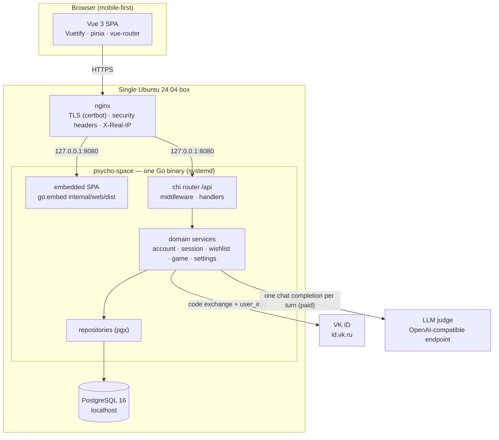
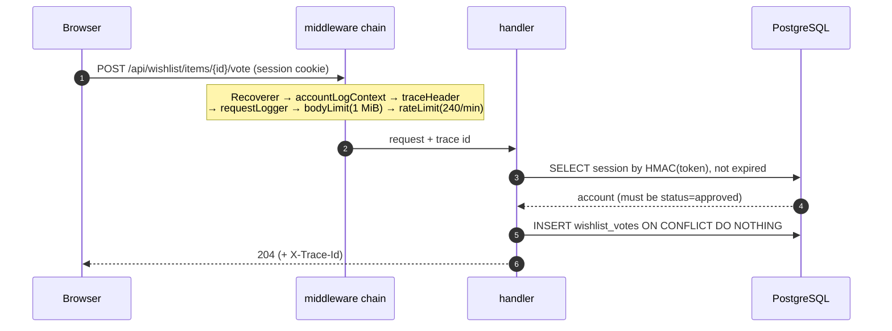
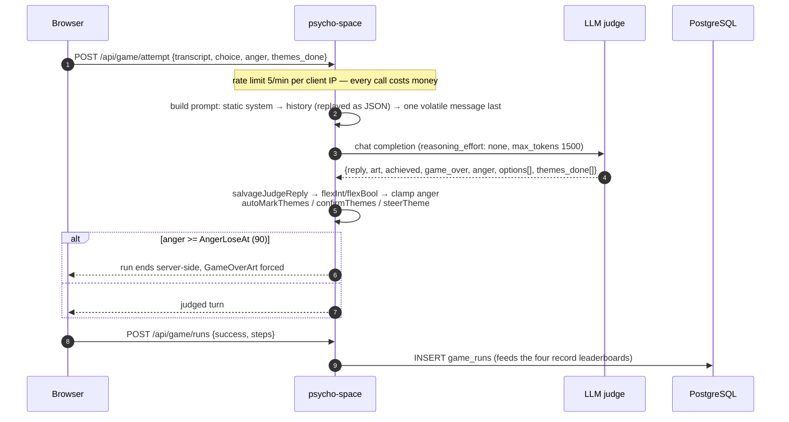
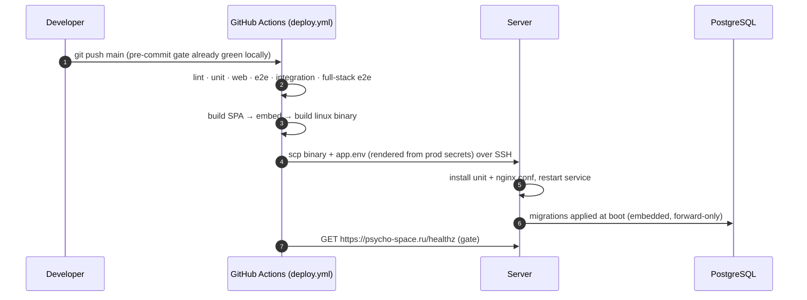
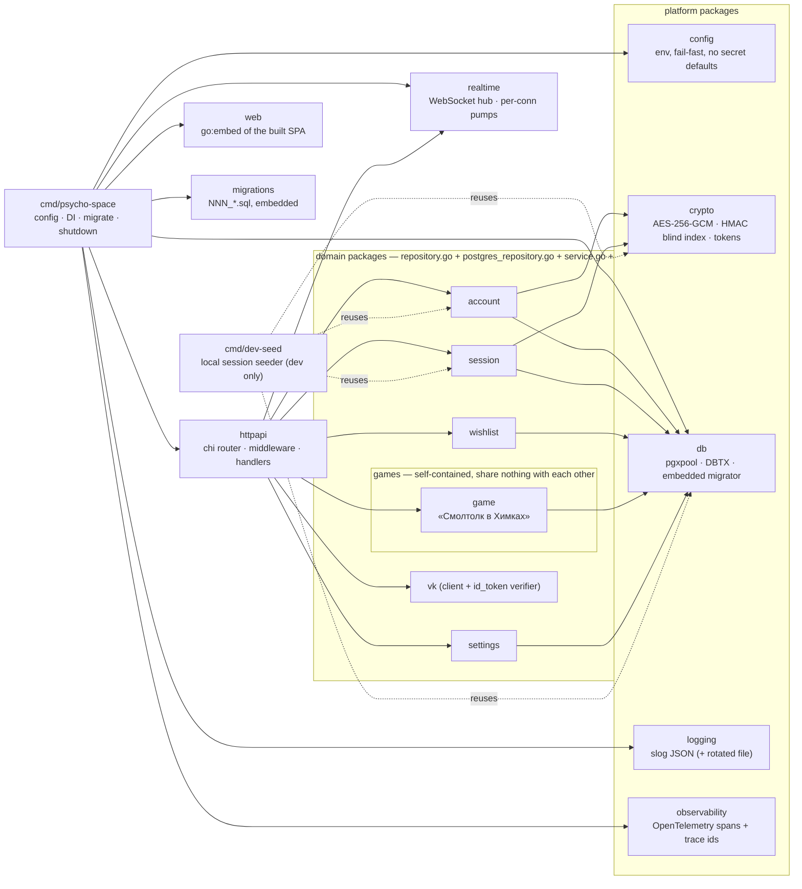

# psycho-space — Architecture

## LLM Continuation Context

_Machine-oriented recap for an LLM continuing this work. Written for agents, not humans — optimise for hand-off, not prose. Keep current with the doc._

- **topic:** the structural view of psycho-space — logical containers, runtime flows, package layout, data model, deployment. `CLAUDE.md` carries the *rules*; this file carries the *shape*.
- **status:** current as of the realtime close-reason work (2026-07-25). One Go binary (embedded Vue SPA + `/api`) behind nginx on a single Ubuntu box, PostgreSQL 16 local. The realtime transport is shipped and carries a `bye` frame; **no client consumes it yet** and nothing publishes game messages.
- **code:** `cmd/psycho-space/main.go` (DI root — read this first), `internal/httpapi/router.go` (every route and middleware), `migrations/` (schema, forward-only).
- **relocate:** `grep -rn "func (s \*Server) handle" internal/httpapi` lists every handler; `internal/*/service.go` is each domain's entry point.
- **done:** auth/accounts/allowlist, wishlist + comments (both upvotable), the LLM-judged game, admin + settings, tracing, rate limiting keyed on a trusted client IP.
- **next:** keep this file in step with the code — a new domain package, route group, table, or runtime flow updates the matching section here in the same change (`CLAUDE.md` → *Task workflow* step 7 makes that a gate).
- **decisions / constraints:** SPA is embedded in the binary, not separately hosted; sessions are server-side opaque tokens, never JWT; personal data is encrypted at rest and looked up through a blind index, never plaintext; migrations are immutable once shipped; no test-only code in production paths; **each game is a self-contained module that shares no DB or service code with any other game** — duplication between games is deliberate, and shared code is platform only (`CLAUDE.md` → *Games are self-contained modules*).

---

## 1. Logical view

One process serves everything. nginx terminates TLS and proxies to it; PostgreSQL holds all state (there is no Redis — TTLs are `expires_at` columns).



**Why one binary.** The SPA is compiled into the executable, so a deploy is a single file plus a restart, and nginx never needs to know about static asset paths. The cost is that a frontend-only change still rebuilds and redeploys the binary — accepted for a single-box, single-maintainer project.

## 2. Runtime views

### 2.1 Login — VK ID confidential backend exchange

The authorization code is exchanged **on the server**, so the VK service token never reaches the browser. A session cookie is issued even for `pending` and `blocked` accounts, so the SPA can poll `/api/auth/me` and come alive the moment an admin approves.

```mermaid
sequenceDiagram
    autonumber
    participant B as Browser (SPA)
    participant A as psycho-space
    participant V as id.vk.ru
    participant P as PostgreSQL

    B->>A: GET /api/auth/vk/state
    A-->>B: state (+ httpOnly state cookie)
    Note over B: consent checkbox must be ticked<br/>before the VK widget is mounted (152-ФЗ)
    B->>V: OneTap + PKCE
    V-->>B: code, device_id
    B->>A: POST /api/auth/vk/callback {code, device_id, state, code_verifier, consent_version}
    A->>V: POST /oauth2/auth (code + service_token + code_verifier)
    V-->>A: access_token (+ id_token)
    A->>V: GET /oauth2/user_info
    V-->>A: profile (name, sex, birthday, avatar, user_id)
    A->>P: upsert by blind index HMAC-SHA256(vk_user_id)<br/>profile fields AES-256-GCM encrypted
    A->>P: INSERT session (token_hash = HMAC(token))
    A-->>B: Set-Cookie httpOnly; Secure; SameSite=Strict<br/>+ {status, account}
    Note over A: VK tokens are discarded here — never stored
```

### 2.2 A wishlist upvote (the shape every gated request has)



Any non-2xx answers `{error: "<stable_code>", trace_id}` — never `err.Error()` — and the SPA shows the trace id in a copyable modal.

### 2.3 A game turn (the only paid path)



The prompt order is load-bearing: the provider caches a matching **prefix**, so anything per-turn placed early would invalidate the cached system prompt for every concurrent player. Full reasoning, measurements and costs: `RUNBOOK.md` → *Working on the game*.

### 2.4 Realtime connection lifetime

```mermaid
sequenceDiagram
    autonumber
    participant B as Browser
    participant N as nginx
    participant A as psycho-space
    participant H as hub

    B->>N: GET /api/realtime (session cookie, Origin)
    Note over N: location /api/realtime<br/>proxy_http_version 1.1 + Upgrade/Connection<br/>re-declares X-Real-IP (headers do NOT merge)
    N->>A: upgraded request
    Note over A: requireAuth (approved only) → origin check → 101
    A->>H: Register(conn, room) — caps checked here
    loop while connected
        H-->>B: broadcast (non-blocking; a slow client is dropped, never waited on)
        B->>A: frames (≤4 KiB, ≤10/s)
    end
    Note over A,H: SIGTERM → cancel hub ctx → hub asks each conn to close
    H->>A: Close(1001, "restart")
    A-->>B: {"t":"bye","code":1001,...} then the socket drops
    Note over A,H: THEN http.Shutdown (Shutdown alone does not close hijacked connections)
```

The reason arrives as a **frame**, not as a WebSocket close code — a browser sees `1006` for every disconnect and reads the reason from the last `bye` frame instead. Codes: `1001` planned restart (reconnect promptly), `1013` evicted or over a cap (back off), `4001` session revoked (terminal — stop). See `docs/DESIGN.md` → *The close reason travels as a frame* for why, and *The read pump must not observe shutdown* for the library trap that makes the ordering load-bearing.

### 2.5 Deploy



A red run means production was not updated — treat it as unfinished work.

## 3. Package structure



**The rule:** dependencies point inward and downward — handlers know services, services know repositories, repositories know `db.DBTX`. Nothing in `internal/*` imports `httpapi`. Adding a feature means a new `internal/<domain>/` package with those four files, a `NNN_*.sql` migration, wiring in `main.go` + `httpapi.Deps` + routes, and a case in `test/integration/`.

**Games are the exception to the usual instinct to factor things out.** Each game is a self-contained module: its own package, its own `<game>_*` tables, its own routes and views, its own leaderboard code — and **no game imports another, even where the code would be identical.** A game may depend on platform packages (`realtime`, `session`, `account`, `crypto`, `db`, and the `httpapi` plumbing); none of those may know a game exists, which is why the socket is addressed as the game-agnostic `/api/realtime?room=…` and game-specific message types live in the game's own package. The test for the boundary: deleting a game must mean deleting its package, its migration, its routes and its views — and nothing else. See `CLAUDE.md` → *Games are self-contained modules* for the reasoning.

## 4. Data model

Every table carries `created_at` / `updated_at`, and everything soft-deletable carries `deleted_at` (queries filter `WHERE deleted_at IS NULL`).


`game_assets` and `app_settings` stand apart — neither references an account. Art lives in Postgres rather than in git or the binary, so adding images never grows the repository.

## 5. API map

Everything is under `/api`, authenticated by the session cookie. `GET /healthz` sits outside it (the deploy gate polls it).

| Group | Endpoints | Access |
|---|---|---|
| `auth` | `GET vk/state` · `POST vk/callback` · `GET me` · `POST logout` | public (30/min per IP on the VK pair) |
| `wishlist` | `GET/POST items` · `DELETE items/{id}` · `POST/DELETE items/{id}/vote` · `GET/POST items/{id}/comments` · `DELETE comments/{id}` · `POST/DELETE comments/{id}/vote` | approved |
| `game` | `GET assets/{game}/{key}` | **public** (art, cacheable) |
| `game` | `GET config` · `POST attempt` (5/min per IP — paid) · `POST runs` · `GET runs/leaderboard` · `GET runs/me` | approved |
| `admin` | `GET accounts?status=` · `POST accounts/{id}/approve` · `POST accounts/{id}/block` · `GET settings` | admin+ |
| `admin` | `POST accounts/{id}/promote` · `POST accounts/{id}/demote` · `PUT settings/open-registration` | superadmin only |
| `realtime` | `GET realtime?room=` — WebSocket upgrade | approved |

Anything not matching `/api` or `/healthz` is served the embedded SPA, so client-side routes resolve on a hard refresh.

## 6. Security view

| Concern | Mechanism | Where |
|---|---|---|
| Personal data at rest | AES-256-GCM per field, per-row nonce; key from env, validated at startup | `internal/crypto`, `*_enc` columns |
| Lookup without plaintext | Deterministic `HMAC-SHA256(vk_user_id)` blind index | `accounts.vk_user_ref` |
| Sessions | 32-byte `crypto/rand` token; only its HMAC is stored; `httpOnly; Secure; SameSite=Strict` | `internal/session` |
| Authorization | `requireAuth` (status must be `approved`) → `requireAdmin` → `requireSuperadmin` | `internal/httpapi/router.go` |
| Revocation | Blocking an account deletes its sessions immediately | `internal/account`, `internal/session` |
| Rate limiting | Per client IP: 30/min login, **5/min `game/attempt`** (paid), 240/min blanket | `internal/httpapi/router.go` |
| Trusted client IP | `X-Real-IP`, honoured **only** from the loopback proxy; `X-Forwarded-For` is never trusted | `internal/httpapi/middleware.go` — `clientIP` |
| Request size | 1 MiB body cap on every route | `bodyLimit` |
| Error disclosure | Stable codes + trace id; `err.Error()` never reaches a client | `internal/httpapi/respond.go` |
| Asset content type | Allowlisted image types + `nosniff` | `internal/httpapi/game.go` — `imageContentType` |
| Consent (152-ФЗ) | Checkbox gates the VK widget; `consent_at` + `consent_version` persisted | SPA + `accounts` |
| WebSocket origin | Validated at upgrade (library default; never `InsecureSkipVerify`) — the same-origin policy does **not** apply to WebSocket | `internal/httpapi/realtime.go` |
| WebSocket frame size | `SetReadLimit(4096)` — the 1 MiB `bodyLimit` wraps `r.Body` and the hijack bypasses it | `internal/realtime/conn.go` |
| WebSocket message rate | 10/s per connection, burst 20 — the HTTP limiter fires once, at the handshake | `internal/realtime/conn.go` |
| Connection caps | 3 per account, 200 per process | `internal/realtime/hub.go` |
| Revocation on a live socket | Blocking an account revokes its sessions and closes its sockets, sending `bye` code 4001. **This in-process kick is the only path that cuts a live socket** — there is no revalidation sweep, so a session that expires on its own, or a block applied straight in the database, leaves the socket open until the peer or the process goes away. The reconnect is still refused by `requireAuth`. | `internal/httpapi/admin.go` → `Hub.KickAccount` |

**On the client IP** — nginx sends `X-Forwarded-For: $proxy_add_x_forwarded_for`, which *appends* the peer to whatever the client sent, so its leftmost entry is attacker-controlled. chi's `middleware.RealIP` trusted exactly that and overwrote `RemoteAddr` with it, which made every per-IP limit forgeable by varying a header — including the one protecting the endpoint that spends money. `clientIP` reads `X-Real-IP` (which nginx overwrites) and only when the request came from loopback.

## 7. Where things are written down

| Question | File |
|---|---|
| How do I work on this? Conventions, gates, workflow | `../CLAUDE.md` |
| What is the shape of the system? | this file |
| Why is it like that? Decisions and their rationale | `DESIGN.md` |
| How do I debug, deploy, or operate it? | `RUNBOOK.md` |
| What is still to do, and the owner's private operational detail | the local living doc (`~/Desktop/psycho-space/psycho-space.md`) |
