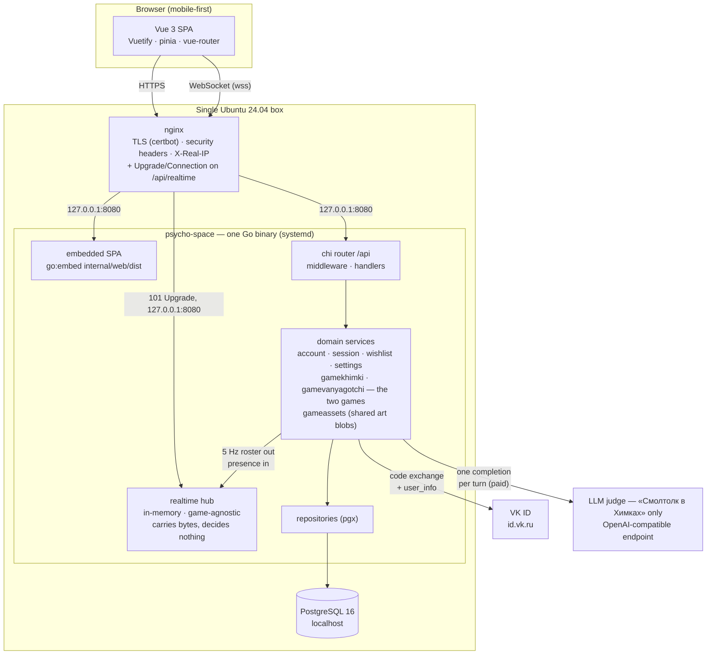
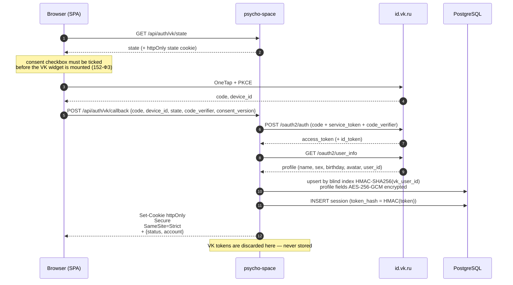
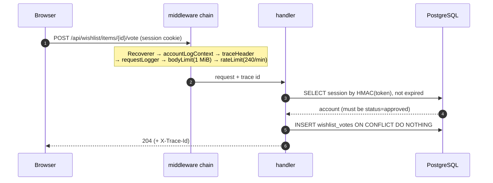
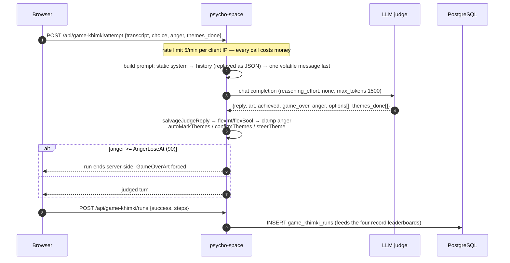
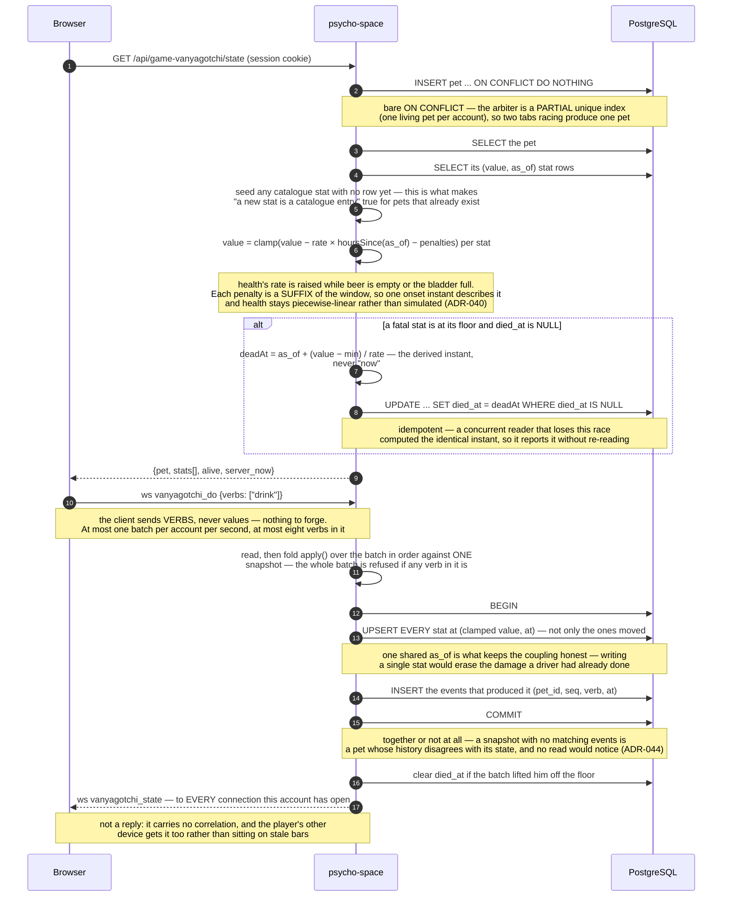
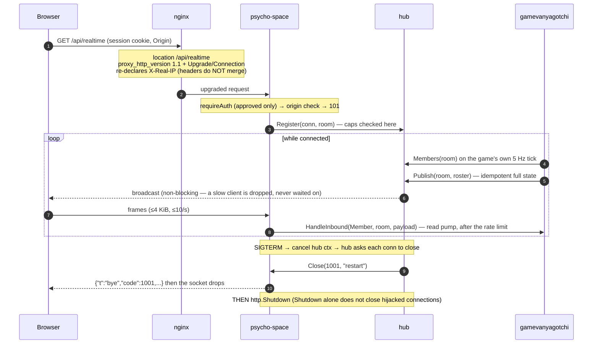
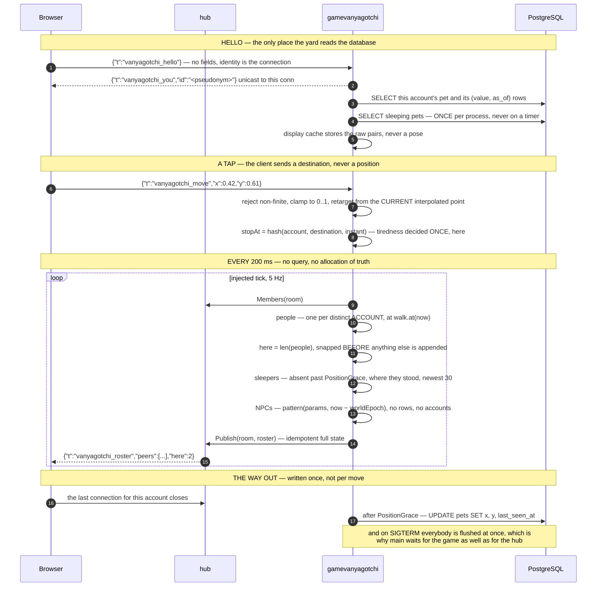
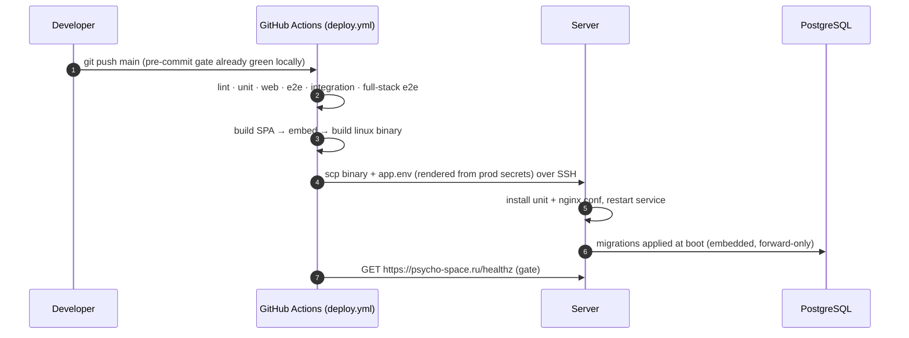
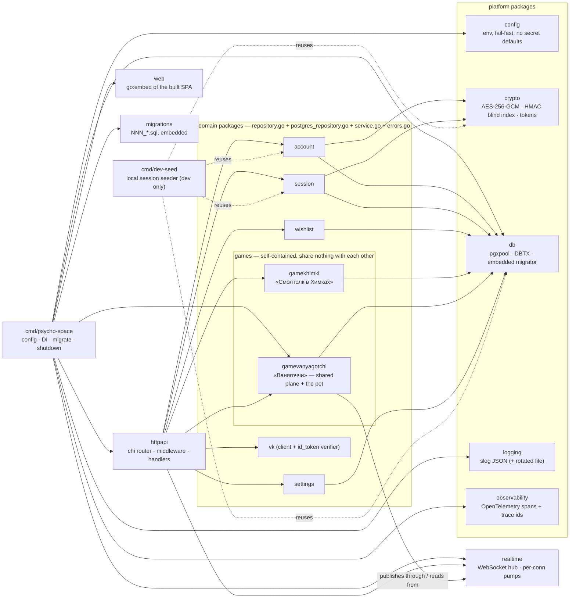
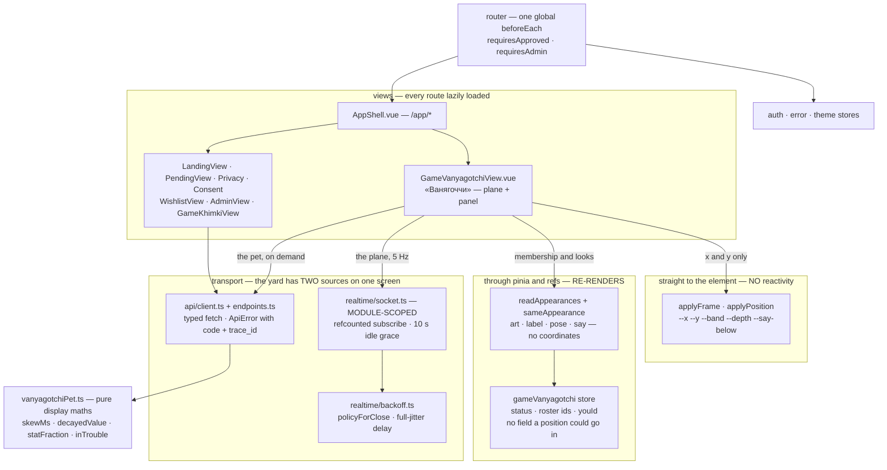

# psycho-space — Architecture

## LLM Continuation Context

_Machine-oriented recap for an LLM continuing this work. Written for agents, not humans — optimise for hand-off, not prose. Keep current with the doc._

- **topic:** psycho-space at two altitudes — the structural view (§1–7: logical containers, runtime flows, package layout, data model, API map, security) and, in §8, a one-paragraph summary of every decision that produced that shape, each linking to its full record in `docs/adrs/`. `CLAUDE.md` carries the *rules*; this file carries the *shape* and the *why*.
- **status:** a current-state snapshot, deliberately not a history — `git log` holds how it got here. **One Go binary** (embedded Vue SPA + `/api` + a WebSocket) behind nginx on one Ubuntu box, PostgreSQL 16 local, no Redis and no scheduler of any kind. Login is VK ID, access is allowlist-gated. Live sections: **wishlist** (items + threaded comments, both upvotable), **admin/settings**, and **two games**. **«Смолтолк в Химках»** (`internal/gamekhimki/`) is LLM-judged dialogue and the only paid path. **«Ванягоччи»** (`internal/gamevanyagotchi/`) is realtime with **no LLM on any path**: a shared plane broadcast at 5 Hz over the hub, a Postgres-backed **pet** whose stats decay lazily from `(value, as_of)`, three closed-form NPCs, walking with server-decided tiredness, absent players drawn asleep where they stood, and speech balloons. **A verb travels over the socket, not over HTTP**, and is followed by state rather than answered by a body — the pet's whole HTTP surface is two reads (ADR-043). Its splash screen is a **rules cheatsheet generated from the served catalogue**. The realtime transport carries a `bye` frame, exposes three game seams (`Handler`, `Hub.Members`, `Hub.PublishTo`), and revalidates sessions every 30 s so a socket cannot outlive its own.
- **code:** `cmd/psycho-space/main.go` (DI root — read this first), `internal/httpapi/router.go` (every route and middleware), `migrations/` (schema, forward-only, immutable once shipped). For the yard: `internal/gamevanyagotchi/service.go` (the verbs and the tick), `message.go` (the wire contract in §5), `content.go` (every tuning constant, character and phrase), and on the client `web/src/views/GameVanyagotchiView.vue` + `web/src/lib/vanyagotchi{Plane,Pet,Rules}.ts` + `web/src/realtime/socket.ts`.
- **relocate:** `grep -rn "func (s \*Server) handle" internal/httpapi` lists every handler; `internal/*/service.go` is each domain's entry point; `ls docs/adrs/` lists every decision record; `grep -n 'TypeHello\|TypeMove\|TypeDo\|TypeRoster\|TypeYou\|TypeStateFrame' internal/gamevanyagotchi/message.go` re-finds the wire types if §5 drifts.
- **adr:** §8 is a **summary layer**; the records themselves are one file each in `docs/adrs/ADR-0NN-<slug>.md`. **A record states the decision as it stands TODAY and is rewritten in place when it changes** — there is no append-only rule any more, no `Superseded by`, and no amendment chains. The history of a decision lives in `git log -p docs/adrs/ADR-0NN-*.md`, which is a better record of how the thinking moved than a status line was. Adding one: create the file, add a one-paragraph summary + link under the right `### 8.x` group, take the **next global number** wherever the group. **Numbers are never reused and gaps are permanent**, so existing references never shift. Status vocabulary is `Accepted` and nothing else. **The bar is architecture** — deployment, data, a component boundary, or the cost of a whole class of change; a tuning constant, a UI behaviour or a test-harness fix gets a comment beside the code instead. Highest record: **ADR-044** — confirm with `ls docs/adrs/ | tail -1`. The unused numbers are **020, 032, 035, 036**, all permanent gaps left by records withdrawn for failing the architecture bar. `./scripts/check-docs.sh` (in the lint gate) rejects a duplicate id, a summary with no file, a file with no summary, and a dead link.
- **next:** keep this file in step with the code — a new domain package, route group, table, or runtime flow updates the matching section here in the same change, and a decision whose reasoning is not recoverable from the diff gets a record (`CLAUDE.md` → *Task workflow* step 7 makes both a gate).
- **related:** `../CLAUDE.md` (rules), `RUNBOOK.md` (operations, and the owner of measurements and operational economics — notably the game's per-turn cost, which is re-measured rather than recorded here), `adrs/` (the records), the owner's local living doc (roadmap, TODO, private operational detail).
- **decisions / constraints:** SPA embedded in the binary, not separately hosted; sessions are server-side opaque tokens, never JWT; personal data is encrypted at rest and looked up through a blind index, never plaintext; **migrations are immutable once shipped**; no test-only code in production paths; **nothing runs on a timer** — time-varying state is computed on read (ADR-038) and everything that moves is a function of absolute time (ADR-042); the 5 Hz tick renders from an in-memory cache and never touches Postgres (ADR-041); **each game is a self-contained module** sharing no DB or service code with any other, named `Game<Name>` at every layer, with shared *capabilities* unprefixed (ADR-028/030/031). Each has a record carrying its reasoning — read it before arguing with the rule.
- **diagram authoring constraint:** the Mermaid blocks here must parse on GitHub, and a `;` anywhere in sequence-diagram message or note text is a **statement separator**, not punctuation — it silently breaks the whole diagram (`Parse error … got 'NEWLINE'`). Use `<br/>` or an em dash instead. Quotes, braces, `=`, and parentheses (including in a `participant X as Name (alias)`) are all safe. Validate a diagram change by rendering it, not by eye: extract each mermaid fence to its own `.mmd` file and run `npx -y @mermaid-js/mermaid-cli@latest -p pconf.json -i b.mmd -o b.svg`, where `pconf.json` is `{"args":["--no-sandbox"]}` (Chrome cannot sandbox in this environment).

---

## 1. Logical view

One process serves everything. nginx terminates TLS and proxies to it; PostgreSQL holds all state (there is no Redis — TTLs are `expires_at` columns).



**Why one binary.** The SPA is compiled into the executable, so a deploy is a single file plus a restart, and nginx never needs to know about static asset paths. See [§8 → ADR-001](#adr-001--the-spa-is-embedded-in-the-go-binary) for why, and for what it costs.

**There are two ways in, and only one of them is a request.** Everything except the yard is request/response over `/api`. «Ванягоччи» additionally holds a WebSocket, which nginx must be told about explicitly — an upgrade is not a proxied request and the `Upgrade`/`Connection` headers do not survive a default `proxy_pass`. Inside the binary the hub is deliberately **not** a domain service: it is transport, it knows no game's vocabulary, and a game reaches it through two narrow seams — publish out, query presence in ([§8 → ADR-033](#adr-033--a-game-reads-the-socket-through-a-game-agnostic-handler-and-pulls-presence)). Note also what is **not** in the diagram: nothing runs on a schedule. There is no cron, no worker, no queue and no Redis. The one recurring thing in the process is the game's 5 Hz broadcast tick, and it reads memory rather than the database ([§2.6](#26-one-tick-of-the-yard)).

## 2. Runtime views

### 2.1 Login — VK ID confidential backend exchange

The authorization code is exchanged **on the server**, so the VK service token never reaches the browser. A session cookie is issued even for `pending` and `blocked` accounts: it identifies without authorizing, because `requireAuth` still demands `status == approved`. See [§8 → ADR-007](#adr-007--a-session-cookie-is-issued-even-for-pending-and-blocked-accounts) for why.



### 2.2 A wishlist upvote (the shape every gated request has)



Any non-2xx answers `{error: "<stable_code>", trace_id}` — never `err.Error()` — and the SPA shows the trace id in a copyable modal. See [§8 → ADR-024](#adr-024--errors-carry-a-trace-id-and-never-carry-the-error-text) for why.

### 2.3 A turn in «Смолтолк в Химках» (the only paid path)

**This flow is specific to «Смолтолк в Химках»** — the LLM-judged dialogue game in `internal/gamekhimki/`, served under `/api/game-khimki/*` — and nothing in it generalises to another game. The second game, «Ванягоччи» (realtime, in design), makes no LLM call on any path: [§8 → ADR-016](#adr-016--no-realtime-message-may-reach-the-llm) forbids a realtime message from reaching the judge at all, so «Смолтолк в Химках» is the only paid path in the system, not merely the first one.



The prompt order is load-bearing, and so is the shape of the history: static system prompt → each past turn replayed as the JSON the judge returned → one volatile message last. See [§8 → ADR-013](#adr-013--the-prompt-is-laid-out-for-prefix-caching-and-history-is-replayed-as-json) for why. Measurements and per-turn costs: `RUNBOOK.md` → *Working on the game*.

### 2.4 The pet in «Ванягоччи» — a GET that writes, and a verb over the socket

**This flow is specific to «Ванягоччи»** and is the shape every time-varying thing in the system takes ([§8 → ADR-038](#adr-038--time-varying-state-is-computed-on-read-never-ticked)). It covers both halves of how a pet changes, because they are two ends of one rule rather than two features — and they arrive over **different transports**, which is itself a decision ([§8 → ADR-043](#adr-043--a-verb-travels-over-the-socket-and-is-answered-with-state)). Nothing runs on a timer, so the **read** is an ordinary `GET` and is what creates the pet, seeds its stats, decays them and records a death — all by the request that happened to look. A **verb** is not a request at all: it travels over the socket as one frame, is folded into the pet by the single `Service.Do` that a replay also goes through, and is followed by *state* rather than answered by a body.



**A verb is followed by state, never answered by a body**, and the refusal path is the same path as the confirmation. What the server decided appears as a line over the player's own Ваня, carried in the next 5 Hz roster — so the rest of the yard reads it too, and a Ваня who is dead still carries it, because «он не встаёт» is the server talking to his owner rather than the corpse talking. Nothing on the client waits for any of it: the roster is already the reconciliation channel, so a verb that is dropped is simply pressed again. The reasoning is [§8 → ADR-043](#adr-043--a-verb-travels-over-the-socket-and-is-answered-with-state).

`server_now` is in every read so the SPA can keep the bar creeping between fetches against the **server's** clock rather than the phone's, and each stat carries the **effective rate it is suffering right now** — which is generally not the catalogue's rate, because a penalty may be active. Sending it is what stops the browser needing its own copy of the coupling. That interpolation is display only: the client never sends a value back, and every verb is followed by the state the server computed, so a screen that has drifted is corrected the moment the player does anything.

### 2.5 Realtime connection lifetime



**The hub carries bytes and decides nothing.** A game publishes through it and reads from it across two game-agnostic seams — a `Handler` for inbound frames and a `Members` query for presence — so `internal/realtime` contains no game's vocabulary and «Ванягоччи» owns its own wire types. See [ADR-033](#adr-033--a-game-reads-the-socket-through-a-game-agnostic-handler-and-pulls-presence) and [ADR-034](#adr-034--the-broadcast-tick-is-injected-and-belongs-to-the-game).

**On the browser side** the socket is owned at module scope (`web/src/realtime/socket.ts`), not by a component: the yard is a lazy child route, so a component-owned socket would re-handshake on every navigation and spend another of the three connections the server allows per account. Its lifetime follows a subscription refcount with a grace period rather than the route. The rule that governs everything rendered from a frame is written in that file and in `web/src/lib/vanyagotchiPlane.ts`, and is worth knowing before touching either: **membership is reactive, positions are not.** Who is present goes through pinia and a keyed list; where they are is written straight to two CSS custom properties, because a 5 Hz frame bound to reactivity costs a scheduler pass and a vdom patch per entity to produce a transform the compositor could have been handed directly.

The reason arrives as a **frame**, not as a WebSocket close code — a browser sees `1006` for every disconnect and reads the reason from the last `bye` frame instead. Codes: `1001` planned restart (reconnect promptly), `1013` evicted or over a cap (back off), `4001` session revoked (terminal — stop). See [ADR-018 · *The close reason travels as a frame*](#adr-018--the-close-reason-travels-as-a-frame-not-as-a-close-code) for why, and [ADR-019 · *The read pump must not observe shutdown*](#adr-019--the-read-pump-must-not-observe-shutdown) for the library trap that makes the ordering load-bearing.

### 2.6 One tick of the yard

**This flow is «Ванягоччи»** and it is the other half of the game — [§2.4](#24-the-pet-in-ванягоччи--a-get-that-writes-and-a-verb-over-the-socket) is the pet in Postgres, this is the plane in memory. Three things happen at three different rates, and keeping them apart is the whole design: the **database is read once**, when a client says hello; a **tap** is accepted whenever one arrives; and the **broadcast runs five times a second and touches nothing but memory**.



**The tick never touches Postgres, and that is a constraint rather than an optimisation.** At 5 Hz a query per entity per frame would be a self-inflicted load test, so appearance comes from an in-memory cache filled on hello and refreshed whenever that client acts over HTTP. What the cache holds is the **raw `(value, as_of)` pairs, not the pose** — a pose expires, so a cached one would show a healthy Ваня who has been dying since lunchtime, whereas a cached pair stays exact for the same reason the whole decay model does ([§8 → ADR-041](#adr-041--the-broadcast-tick-renders-from-a-cache-and-position-outlives-the-process)).

**Nothing on the plane integrates a velocity.** An NPC is `pattern(params, now − worldEpoch)` and a player is a point along a walk with a known start, so a tick that is late, early, skipped, duplicated, or served to a client that has just reconnected still produces the correct world. That is what makes a GC pause cost nothing and stops two people's yards drifting apart while neither reports a fault ([§8 → ADR-042](#adr-042--everything-that-moves-is-a-function-of-absolute-time)). It is also why an NPC needs no row and no account: there is nothing about one to store, so adding one is a catalogue entry with **no migration and no client deploy**. The same rule reaches past motion to anything that appears and disappears: a Ваня's speech balloon is a phrase pool indexed by hashing (account, time-slot), so it needs no timer, stores nothing, expires by arithmetic rather than by cleanup, and every client independently computes the same words at the same moment.

**The frame is idempotent full state — there are no deltas and no announcements.** A dropped frame therefore costs exactly nothing, because the next one is the truth again, which is what lets the hub drop a slow client's backlog instead of blocking on it. It is also why a world *event* has to be state in the frame rather than a one-shot message: a one-shot arrives once or never, and "never" is indistinguishable from "it did not happen".

**Three kinds of entity, and the client cannot tell them apart on purpose** — connected people, sleepers, and NPCs are the same shape on the wire. So the count of people is sent explicitly as `here` rather than derived by the browser: making the client work it out would mean teaching it what an NPC is, and the point of the envelope is that it does not know. An empty room publishes nothing at all — silence, not a roster of NPCs talking to themselves.

**Position is in memory, written down only on the way out.** A place survives a page reload because absence is not departure — it is held for a `PositionGrace` of two minutes after the last socket closes — and survives a *deploy* because the last disconnect (and shutdown, for everyone at once) writes it to `pets.x` / `pets.y`. A crash still loses whatever had not been written, and that is accepted rather than fixed. The reward for making it durable is that an absent player can be drawn asleep where he stood instead of vanishing, which is what keeps the yard from being an empty field when only one person is online.

### 2.7 Deploy



A push to `main` is a deploy, and a red run means production was not updated. See [§8 → ADR-003](#adr-003--push-to-main-deploys-the-gates-are-the-safety-net) for why that is safe without a staging environment.

## 3. Package structure



**The rule:** dependencies point inward and downward — handlers know services, services know repositories, repositories know `db.DBTX`. Nothing in `internal/*` imports `httpapi`. Adding a feature means a new `internal/<domain>/` package with those four files, a `NNN_*.sql` migration, wiring in `main.go` + `httpapi.Deps` + routes, and a case in `test/integration/`.

**Games are the exception to the usual instinct to factor things out.** Each game is a self-contained module: its own package, its own `game_<name>_*` tables, its own routes and views, its own leaderboard code — and **no game imports another, even where the code would be identical.** A game may depend on platform packages (`realtime`, `session`, `account`, `crypto`, `db`, and the `httpapi` plumbing); none of those may know a game exists, which is why the socket is addressed as the game-agnostic `/api/realtime?room=…` and game-specific message types live in the game's own package. The test for the boundary: deleting a game must mean deleting its package, its migration, its routes and its views — and nothing else. See [§8 → ADR-028](#adr-028--games-are-self-contained-modules) for why, and `CLAUDE.md` → *Games are self-contained modules* for the same rule stated as a working rule.

**And each game's name is spelled out at every layer**, which is what makes that boundary test executable rather than a judgement call: package `internal/game<name>/`, tables `game_<name>_*`, routes `/api/game-<name>/*`, view `Game<Name>View.vue` at `/app/game-<name>` — so `git grep -il game<name>` enumerates the whole module. «Смолтолк в Химках» is `gamekhimki`; «Ванягоччи» is `gamevanyagotchi`. Platform packages stay unprefixed on purpose, because the missing prefix is the signal that they are game-agnostic. See [§8 → ADR-030](#adr-030--game-modules-are-named-gamename).

**Its files split by what they know.** `content.go` is the catalogue (stats, actions, skins, locations, NPCs, every tuning constant); `decay.go` is the time arithmetic for stats and `motion.go` the time arithmetic for space — both pure, both closed-form, neither storing anything; `display.go` is the in-memory cache the broadcast draws from; `service.go` holds the verbs and the tick. A new character is a `content.go` entry. A new *way of moving* is one function and one map entry in `motion.go`. Neither is a migration and neither is a client change.

**`gamevanyagotchi` is one package holding two things with deliberately different lifetimes**, and the split is worth knowing before reading it. The **plane** — who is standing where — lives in memory and is published through the hub five times a second. The **pet** — the stats, the death — is in Postgres and outlives every deploy. The plane now *draws* what the database knows, and the way it does that is the load-bearing part: a **display cache** (`display.go`) holds each account's pet fields in memory, filled when a client says hello and refreshed by the HTTP read path, so **the broadcast tick never touches Postgres**. What it caches is the raw `(value, as_of)` pairs rather than a pose — a pose changes with the clock, so a cached one would quietly show a healthy Ваня who has been dying since lunchtime, whereas a cached pair stays exact for the same reason the whole decay model does ([§8 → ADR-041](#adr-041--the-broadcast-tick-renders-from-a-cache-and-position-outlives-the-process)). The same rule now covers a third thing: **world objects** — what is lying about in the yard — are held in their own cache (`world.go`), filled at a hello and after a verb that leaves something behind, and rendered as ordinary entities so the client resolves an object's art exactly as it resolves a pet's and holds no object-kind key at all. Expiry is arithmetic over the cache against the tick's instant, so a deposit vanishes from every screen at the same moment without anybody asking the database. So beyond the usual four files the package carries the six listed above, and the two halves meet in exactly one place — the broadcast, which reads the caches and never the pool. See [§8 → ADR-038](#adr-038--time-varying-state-is-computed-on-read-never-ticked) and [ADR-039](#adr-039--game-content-is-a-go-catalogue-and-the-schema-stores-only-its-keys) for the two rules that shape it, and [§2.6](#26-one-tick-of-the-yard) for the flow.

### The SPA

The browser half is a normal Vue 3 application — until the yard, which has a second data source and a second rendering discipline, and that is the part worth having a diagram for.



**The socket is owned at module scope, not by a component.** The yard is a lazy child route, so a component-owned socket would re-handshake on every navigation and spend another of the three connections a server allows per account. Its lifetime is a subscription refcount with a ten-second idle grace, so leaving the yard and coming back reuses the connection.

**In the yard, membership is reactive and positions are not.** This is the load-bearing rule of the client and it is enforced structurally rather than by convention, in three places at once: the store has no field a coordinate could go in, the `PeerAppearance` shape that enters reactivity has no `x`/`y`, and the function that writes a position takes an interface narrowed to `style.setProperty` alone — so the position path *cannot* read layout, measure a box, or touch an attribute. Who is present, what they look like and what they are saying go through pinia and a keyed list, behind an equality guard so a frame that changed nothing re-renders nothing. Where they are is written straight to CSS custom properties on the element, and the mapping from `0..1` to pixels happens in the stylesheet against the plane's own container box. The reason is arithmetic: at 5 Hz, binding positions to reactivity costs a scheduler pass and a vdom patch per entity per frame to produce a transform the compositor could have been handed directly — and it would cache a measured size that mobile browser chrome invalidates every time it slides.

**Everything the client knows about a game's content, it was told.** Stats, actions, skins, locations and characters all arrive from `GET /api/game-<name>/config` and are iterated generically, which is what makes a new stat or a new NPC a backend deploy. The clearest payoff is the splash screen, which is a **rules cheatsheet generated from that catalogue** rather than written out — so retuning a constant in the game's `content.go` changes what the player is told with no client change, and the rules cannot drift from the game the way a hand-typed list would. Only what the server does not publish — walking speed, tiredness, the muttering, who else is in the yard — is hardcoded prose, and it is marked in the source as the part a rules change must come back and edit. What is deliberately still hardcoded is *presentation*: the splash copy, the RU status strings, the pose vocabulary the stylesheet has rules for, and the plane's 3:4 aspect ratio — that last one being a genuine rule of the game rather than a style, because normalised coordinates only mean the same thing on two phones if both draw the same shape.

## 4. Data model

Every table carries `created_at` / `updated_at`, and everything soft-deletable carries `deleted_at` (queries filter `WHERE deleted_at IS NULL`).


`game_assets` and `app_settings` stand apart — neither references an account. The art bytes live in Postgres, not in git and not in the binary. See [§8 → ADR-026](#adr-026--game-art-lives-in-postgres-not-in-git-or-the-binary) for why, and [ADR-031](#adr-031--game-asset-storage-is-shared-infrastructure-not-a-games-property) for why the table stayed unprefixed while every other game table gained its game's name.

The three `game_vanyagotchi_*` tables are **«Ванягоччи»**, and they are shaped by two decisions worth knowing before changing them. **Every `*_key` column is `text` whose meaning lives in the Go catalogue, never a Postgres enum** — an enum makes each new stat, skin, location or object kind an `ALTER TYPE`, i.e. a permanent migration, which is exactly the cost the catalogue exists to remove ([§8 → ADR-039](#adr-039--game-content-is-a-go-catalogue-and-the-schema-stores-only-its-keys)). And **stats are tall while world objects are wide, on purpose**: stats are a homogeneous collection of `(value, as_of)` pairs that one decay expression covers, whereas world objects are heterogeneous rows carrying contended invariants — `claimed_by`, `remaining`, `exhausted_at` — that have to be indexable and `CHECK`-able. The tall shape pays for itself again in the coupling: a stat that raises another's drain is a catalogue entry naming a key, and adding one costs no column ([§8 → ADR-040](#adr-040--a-stat-may-drive-another-stats-rate-and-it-is-still-exact)) — and again in the score, because **a stat whose rate is zero is a lifetime counter**. «выпито пива» and «покакано раз» are rows in this same table, moved only by the verbs that name them, which is why this game has no runs table, no leaderboard schema and no migration for keeping score. They are marked `counter` in the catalogue rather than inferred from the rate, so the client is told they are tallies rather than left to conclude it from a number — a counter is never drawn as a bar and is never "trouble" at any value. It also carries the invariant that coupling depends on — **every write touches every row of a pet, with one shared `as_of`** — so there is deliberately no single-stat write path. There is no JSONB in either. `game_vanyagotchi_world_objects` is written for the first time by the relief deposit: «покакать» leaves a row at the position the SERVER believes the player is standing — the client sends a verb and never a coordinate — inside the same transaction that writes the stats and the events, so a deposit that survived a rolled-back batch cannot exist. Its `expires_at` is **filtered lazily on read and never swept**, exactly as `sessions.expires_at` already is, because a sweeper would be the background timer this design does not have. The one-active-per-kind invariant is a partial unique index predicated on a **`singleton` boolean the catalogue sets at insert time** rather than on any kind named in DDL — a deposit sets it false, because deposits are never exhausted and many are live at once, and an index keyed on `exhausted_at` alone would have forbidden a second player from relieving himself.

`game_khimki_runs` and `game_assets` belong to **«Смолтолк в Химках»**, and now say so — they were `game_runs` and `game_assets` until `migrations/007_game_khimki_rename.sql`. A second game gets its own `game_<name>_*` tables rather than rows in these — see [§8 → ADR-028](#adr-028--games-are-self-contained-modules) and [ADR-030](#adr-030--game-modules-are-named-gamename). Their `game_key` **values** did not move with the tables: the column still reads `smalltalk_khimki`, because it is data rather than a name and the art blobs are keyed on it.

## 5. API map

Everything is under `/api`, authenticated by the session cookie. `GET /healthz` sits outside it (the deploy gate polls it).

| Group | Endpoints | Access |
|---|---|---|
| `auth` | `GET vk/state` · `POST vk/callback` · `GET me` · `POST logout` | public (30/min per IP on the VK pair) |
| `wishlist` | `GET/POST items` · `DELETE items/{id}` · `POST/DELETE items/{id}/vote` · `GET/POST items/{id}/comments` · `DELETE comments/{id}` · `POST/DELETE comments/{id}/vote` | approved |
| `game-khimki` | `GET assets/{game}/{key}` | **public** (art, cacheable) |
| `game-khimki` | `GET config` · `POST attempt` (5/min per IP — paid) · `POST runs` · `GET runs/leaderboard` · `GET runs/me` | approved |
| `game-vanyagotchi` | `GET config` · `GET state` · `GET avatar/{peer}` — reads only; **a verb is not HTTP** | approved |
| `admin` | `GET accounts?status=` · `POST accounts/{id}/approve` · `POST accounts/{id}/block` · `GET settings` | admin+ |
| `admin` | `POST accounts/{id}/promote` · `POST accounts/{id}/demote` · `PUT settings/open-registration` | superadmin only |
| `realtime` | `GET realtime?room=` — WebSocket upgrade | approved |

The two `game-khimki` rows are **«Смолтолк в Химках»** and the `game-vanyagotchi` row is **«Ванягоччи»**; a third game gets its own `/api/game-<name>/*` group rather than new keys in either, while `realtime` is game-agnostic by design ([§8 → ADR-028](#adr-028--games-are-self-contained-modules), [ADR-030](#adr-030--game-modules-are-named-gamename)).

Two things about the `game-vanyagotchi` row read oddly and are deliberate. **`GET state` writes** — it creates the pet on first sight and records a death the first time one is observed; both are idempotent, and the alternative to writing on read is a background job this system does not have ([§8 → ADR-038](#adr-038--time-varying-state-is-computed-on-read-never-ticked)). And **the group has no write endpoint at all**: a verb arrives as a `vanyagotchi_do` frame on the socket, listed in the wire contract below, because it owes no reply and the 5 Hz roster already reconciles the yard ([§8 → ADR-043](#adr-043--a-verb-travels-over-the-socket-and-is-answered-with-state)). What the catalogue-as-allowlist bought survives the move: the verb is a key checked against the content catalogue rather than a case in a handler, so a new stat-restoring action is still a catalogue entry and nothing else.

**`/api/game/*` no longer answers.** The pre-rename prefix was registered as a second route group on the same handlers for exactly one deploy cycle, so that a browser holding the previous SPA build in cache would not break mid-run; that cycle is over and the registration is deleted. `TestGameKhimkiLegacyPathAliasIsGone` in `test/integration/gamekhimki_test.go` now pins its **absence** — it asserts 404 rather than 401 on a gated path, because 401 would mean the route group had been re-registered and was merely refusing the request. On the client side `/app/game` redirects permanently to `/app/game-khimki`; that redirect is not an alias and stays.

Anything not matching `/api` or `/healthz` is served the embedded SPA, so client-side routes resolve on a hard refresh.

### The realtime wire contract

The table above is HTTP. `GET /api/realtime?room=yard` is the other half of the surface, and it is a **protocol rather than an endpoint**, so it is written out here. Everything in both directions is a JSON **text** frame with a string `t` discriminator, and **both ends ignore an unknown `t`** — that is what lets either side learn a message type without a coordinated deploy.

| Direction | `t` | Payload | Notes |
|---|---|---|---|
| → server | `vanyagotchi_hello` | none | Deliberately empty: identity is the connection, so there is nothing to forge. Sent on **every** open, including reconnects. |
| → server | `vanyagotchi_move` | `x`, `y` — both required, `*float64` | A destination, never a position. Non-finite is rejected; out of range is **clamped** to `0..1`, not refused. |
| → server | `vanyagotchi_do` | `verbs[]` — catalogue keys | A batch, folded in order against one snapshot and refused whole if any verb in it is refused. **Its own bound**, tighter than the socket's: one batch per account per second, at most eight verbs in a frame — a tap writes nothing and a verb writes a transaction. |
| ← client | `vanyagotchi_you` | `id` | Unicast reply to a hello: which entity in the roster is you. |
| ← client | `vanyagotchi_roster` | `peers[]`, `here` | The full-state frame, 5 Hz. Per entity: `id`, `x`, `y`, `art`, `pose`, and optional `label` / `say`. **No avatar and no name of a person** — a picture is fetched by `id` over HTTP instead, because a URL here would be re-sent per player per tick per viewer and would be the one durable thing on an ephemeral frame ([ADR-037](#adr-037--one-account-is-one-entity-and-the-wire-carries-a-pseudonym-and-a-face)). |
| ← client | `vanyagotchi_state` | `state` | The owner's own pet after it changed, unicast to **every** connection that account has open. Not an acknowledgement: no correlation, and it also fires for a verb pressed on the player's other device. |
| ← client | `bye` | `code`, `reason` | Transport-owned, not the game's — sent immediately before the socket drops ([ADR-018](#adr-018--the-close-reason-travels-as-a-frame-not-as-a-close-code)). |

Six properties of it are load-bearing, and each one is a decision rather than an accident:

- **The frame is idempotent full state.** No deltas, no one-shot announcements, no join/leave bookkeeping on either side. A dropped frame costs nothing because the next one is the truth again — which is exactly what permits the hub to discard a slow client's backlog rather than block the broadcast on it.
- **`id` is a per-process pseudonym, never `accounts.id`.** It is an HMAC of the account under a key minted from `crypto/rand` at startup and held only in memory, truncated to 12 base64url characters. Stable across every connection and device of one account, meaningless after a restart, and stored nowhere. A roster is fanned out to the whole room, so anything in this field is a handle every other player can record ([ADR-037](#adr-037--one-account-is-one-entity-and-the-wire-carries-a-pseudonym-and-a-face)). Nothing else in the frame identifies a person either, which is what lets a roster be published with no redaction step — and it is why an avatar is fetched by this id rather than carried beside it.
- **`here` is sent, not derived.** It counts distinct connected accounts, snapped before sleepers and NPCs are appended. The browser is not able to tell a person from a character and must not have to.
- **A malformed, unknown or invalid frame gets no reply and no log line.** Silence is the policy: a log per bad frame at the permitted 10/s would be a flood lever handed to any client.
- **Nothing inbound carries an account field.** The account is bound at the upgrade and travels to the game as a `realtime.Member`, so a payload cannot claim to be someone else.
- **No acknowledgement for a move.** The mover learns the outcome from the next roster like everybody else, so there is exactly one source of truth about where he is.

The `bye` codes are `1001` planned restart (reconnect promptly), `1013` evicted, rate-limited or over a cap (back off), and `4001` session revoked (terminal — stop, and do not reconnect). Reason strings are constants because the client branches on the exact text, so changing one is a wire change.

## 6. Security view

| Concern | Mechanism | Where |
|---|---|---|
| Personal data at rest | AES-256-GCM per field, per-row nonce; key from env, validated at startup | `internal/crypto`, `*_enc` columns |
| Lookup without plaintext | Deterministic `HMAC-SHA256(vk_user_id)` blind index | `accounts.vk_user_ref` |
| Sessions | 32-byte `crypto/rand` token; only its HMAC is stored; `httpOnly; Secure; SameSite=Strict` | `internal/session` |
| Authorization | `requireAuth` (status must be `approved`) → `requireAdmin` → `requireSuperadmin` | `internal/httpapi/router.go` |
| Revocation | Blocking an account deletes its sessions immediately | `internal/account`, `internal/session` |
| Rate limiting | Per client IP: 30/min login, **5/min `game-khimki/attempt`** (paid), 240/min blanket | `internal/httpapi/router.go` |
| Trusted client IP | `X-Real-IP`, honoured **only** from the loopback proxy; `X-Forwarded-For` is never trusted — see [§8 → ADR-027](#adr-027--the-client-ip-comes-from-x-real-ip-trusted-only-from-a-loopback-peer) | `internal/httpapi/middleware.go` — `clientIP` |
| Request size | 1 MiB body cap on every route | `bodyLimit` |
| Error disclosure | Stable codes + trace id; `err.Error()` never reaches a client | `internal/httpapi/respond.go` |
| Asset content type | Allowlisted image types + `nosniff` | `internal/httpapi/gamekhimki.go` — `imageContentType` |
| Consent (152-ФЗ) | Checkbox gates the VK widget; `consent_at` + `consent_version` persisted | SPA + `accounts` |
| WebSocket origin | Validated at upgrade (library default; never `InsecureSkipVerify`) — the same-origin policy does **not** apply to WebSocket | `internal/httpapi/realtime.go` |
| WebSocket frame size | `SetReadLimit(4096)` — the 1 MiB `bodyLimit` wraps `r.Body` and the hijack bypasses it | `internal/realtime/conn.go` |
| WebSocket message rate | 10/s per connection, burst 20 — the HTTP limiter fires once, at the handshake. Checked **before** the frame reaches a game, so a game inherits the bound rather than having to reimplement it | `internal/realtime/conn.go` |
| Socket identity | The account is bound at upgrade and travels to a game as `realtime.Member`; **no inbound frame has an account field**, so a payload cannot claim to be someone else | `internal/realtime/conn.go` — `readPump` |
| Identity on the wire | A broadcast roster carries a **per-process pseudonym**, never `accounts.id` — a durable cross-session handle must not be published to every other player ([ADR-037](#adr-037--one-account-is-one-entity-and-the-wire-carries-a-pseudonym-and-a-face)) | `internal/gamevanyagotchi` — `pseudonym` |
| Inbound payloads | Text frames only, ≤4 KiB, parsed by the owning game; anything malformed, unknown or non-finite is dropped without a reply and without a log line (a log per bad frame would be a flood lever at 10/s) | `internal/gamevanyagotchi/message.go` |
| Connection caps | 3 per account, 200 per process | `internal/realtime/hub.go` |
| Revocation on a live socket | Two paths, deliberately. Blocking through the admin API kicks in process — instant and deterministic. A **30 s revalidation sweep** is the backstop for the two cases that produce no in-process signal at all: a session reaching its `expires_at`, and a block applied straight in the database. Both close with `bye` code 4001, which the client treats as terminal. A socket is judged on **its own session**, not merely its account, because an expired session is exactly the case an account-level check cannot see. | `internal/realtime/revalidate.go` · `internal/httpapi/admin.go` → `Hub.KickAccount` |
| …and an error is not a revocation | If the check cannot answer — a database blip — the sweep closes **nobody** and tries again next tick. Failing closed here would turn a moment of database trouble into disconnecting every player at once, which is a worse outcome than a revoked session surviving 30 seconds longer. | `internal/realtime/revalidate.go` — `Authorizer` |

## 7. Where things are written down

| Question | File |
|---|---|
| How do I work on this? Conventions, gates, workflow | `../CLAUDE.md` |
| What is the shape of the system? | this file |
| Why is it like that? Decisions and their rationale | this file, [§8](#8-decision-records-adrs) — one paragraph per record, each linking to its file in `adrs/`, and each rewritten in place when the decision moves |
| How do I debug, deploy, or operate it? | `RUNBOOK.md` |
| What is still to do, and the owner's private operational detail | the local living doc (`~/Desktop/psycho-space/psycho-space.md`) |

## 8. Decision records (ADRs)

The code says *what*, and comments say *why this line*. Neither says why the system is shaped the way it is, and that is exactly what gets re-derived — usually wrongly — by whoever touches the project next. Each entry below is a decision, its reasoning, and its consequence.

**The bar is high, and it is about architecture.** A record is for a decision that shapes the *system* — how it is deployed, how it stores and protects data, where a boundary between components falls, what a whole class of future change will cost. Two questions have to be answered yes: is the reasoning unrecoverable from the diff, **and** would somebody redesigning this part need to know it? "Chose server-side sessions over JWT" is a record. "Renamed a variable" is not, and neither is a tuning constant, a UI behaviour, or a bug fix in the test harness — however subtle the reasoning behind it, that reasoning belongs in a comment next to the code it governs, where it will be read by the person actually changing it.

Four records were withdrawn on 2026-07-25 for failing that bar — an animation speed, a nav-drawer flourish, a test-harness race, and a note about defensive code that was correctly absent. Each one's reasoning still exists as a comment beside the code, which is where it was always more useful. **Withdrawal leaves a permanent gap in the numbering:** a number is never reused, so every existing reference keeps meaning what it meant, and `git log` still has the withdrawn text.

Sections 1–7 above are the structural view — what the system is made of and how it behaves. The records below are the other altitude: the durable decisions that produced that shape, each with the reasoning, and where one exists the measurement or the failure that settled it. They are grouped by subject.

**Each record is one paragraph here and a file of its own under [`docs/adrs/`](adrs/).** The paragraph says what was decided and why it matters; the file carries the full reasoning, the measurements, the alternatives that were rejected and the failures that settled it. The split exists because §8 grew to be the bulk of this document and started crowding out the structure that most readers came for — and because a decision's detail is read rarely and deliberately, while its *existence* needs to be visible at a glance.

**A record describes the decision as it stands today, and is rewritten in place when it changes.** This is the opposite of the append-only discipline the log used to carry, and the change is deliberate: a chain of `_Superseded by_` and `_amended by_` breadcrumbs meant that answering "what do we actually do about X?" required reading three records in the right order and working out which parts of the first two were still true. The current answer should be the thing you read first. **The history has not been lost — it moved to where history belongs:** `git log -p docs/adrs/ADR-0NN-*.md` shows every version of a decision with the commit that changed it and the message explaining why, which is a better record of *how the thinking moved* than a status line ever was.

Two rules survive the change, and both are about references:

- **A number is never reused, and gaps are permanent.** A withdrawn record's number stays retired, so every reference that already exists keeps meaning what it meant.
- **A record that no longer applies at all is deleted, not repurposed** — the number goes with it into the gap list rather than being handed to a new decision.

Fixing a typo or a rotted link inside a record is fine. Changing what it decided, or why, is not.

**The status vocabulary is `Accepted`, and nothing else.** There is no `Proposed`, because a record is written in the same commit as the change it describes — by the time one exists the decision has already shipped, and proposals belong in the owner's living doc. There is no `Superseded` either, now that a record is rewritten rather than retired: a record that is still here is current, which is the whole point of the change.

**The date on a record is when the record was written, not when the decision was taken.** They are usually the same day, and when they are not, the record's own commit in `git log` is the authority on the former.

**The numbers are identifiers, not an ordering, and not a sequence.** A new record takes the next globally unused number whichever group it lands in, so numbering within a group is often non-sequential, and a withdrawn record leaves a hole. Both are expected; renumbering to tidy either up would break every existing reference, and a reused number would silently redirect one. Find the next number with:

```bash
grep -o 'ADR-[0-9]\{3\}' docs/ARCHITECTURE.md | sort -u | tail -1
```

Records 001–026 were written on 2026-07-25 when this log was created, from `docs/DESIGN.md`; edits made to that file before the merge are in `git log -- docs/DESIGN.md` and are not reconstructed here. Immutability applies from the merge forward.

**Division of labour with the runbook.** A record owns the durable decision and its reasoning. `RUNBOOK.md` owns the measurements and the operational economics — the game's per-turn cost above all, which is a figure to be re-measured as models and prices move, not a decision to be superseded. A fresh cost measurement is a runbook edit, not a new record here.

### 8.1 Platform and delivery

#### ADR-001 · The SPA is embedded in the Go binary

_Accepted · 2026-07-25_

The built frontend is compiled into the executable with `go:embed`, so a release is one file and nginx never serves an asset or knows a path. The cost is that a CSS-only change still rebuilds and redeploys the binary — cheaper, for one box and one maintainer, than operating a second artifact with its own cache-busting and deploy order.

[Full record → `docs/adrs/ADR-001-the-spa-is-embedded-in-the-go-binary.md`](adrs/ADR-001-the-spa-is-embedded-in-the-go-binary.md)

#### ADR-002 · Provisioning is a one-time manual script; only the app deploys from CI

_Accepted · 2026-07-25_

`scripts/bootstrap.sh` installs the whole box — Postgres, nginx, certbot, systemd, the deploy user and the CI key — and is run once, by hand, over the existing root access. It leaves SSH on both the old and the new port so a mistake cannot lock the operator out; `harden-finalize.sh` closes the old one afterwards. The lockout-sensitive part of provisioning is exactly the part that must not run unattended from a pipeline.

[Full record → `docs/adrs/ADR-002-provisioning-is-a-one-time-manual-script-only.md`](adrs/ADR-002-provisioning-is-a-one-time-manual-script-only.md)

#### ADR-003 · Push to `main` deploys; the gates are the safety net

_Accepted · 2026-07-25_

One environment, one maintainer, no staging: pushing to `main` deploys to production. What makes that safe is that the mandatory pre-commit hook and the deploy workflow run the same suite, followed by an external health check — so a red deploy means production is stale, which is treated as unfinished work rather than as a notification.

[Full record → `docs/adrs/ADR-003-push-to-main-deploys-the-gates-are-the-safety.md`](adrs/ADR-003-push-to-main-deploys-the-gates-are-the-safety.md)

### 8.2 Identity and personal data

#### ADR-004 · Server-side opaque sessions, not JWT

_Accepted · 2026-07-25_

A 32-byte `crypto/rand` token in an `httpOnly; Secure; SameSite=Strict` cookie, stored only as its HMAC. The allowlist needs **instant** revocation — blocking someone must end their access now, not at the next expiry — and a stateless token cannot do that without a revocation list, which is a session table wearing a disguise.

[Full record → `docs/adrs/ADR-004-server-side-opaque-sessions-not-jwt.md`](adrs/ADR-004-server-side-opaque-sessions-not-jwt.md)

#### ADR-005 · Personal data is encrypted at rest, and looked up through a blind index

_Accepted · 2026-07-25_

Profile fields are AES-256-GCM with a per-row nonce, and every equality lookup goes through a deterministic `HMAC-SHA256(vk_user_id)` blind index rather than plaintext. 152-ФЗ minimisation, and its practical form: a database dump on its own should not be a list of who uses the site. The keys are load-bearing — rotating the HMAC key orphans every account and losing the encryption key makes stored profiles unrecoverable.

[Full record → `docs/adrs/ADR-005-personal-data-is-encrypted-at-rest-and-looked.md`](adrs/ADR-005-personal-data-is-encrypted-at-rest-and-looked.md)

#### ADR-006 · VK tokens are discarded after the profile fetch

_Accepted · 2026-07-25_

The code exchange happens on the server, and the resulting VK access and refresh tokens are used once to read the profile and then dropped. We never act on the user's behalf at VK, so storing a credential that would let us is pure liability.

[Full record → `docs/adrs/ADR-006-vk-tokens-are-discarded-after-the-profile.md`](adrs/ADR-006-vk-tokens-are-discarded-after-the-profile.md)

#### ADR-007 · A session cookie is issued even for pending and blocked accounts

_Accepted · 2026-07-25_

A cookie is issued even to `pending` and `blocked` accounts, because the SPA needs an identity to poll `/api/auth/me` with — so a waiting user's screen comes alive the moment an admin approves them, and a blocked one is told what happened instead of seeing a bare login. It identifies without authorizing: `requireAuth` still demands `approved`.

[Full record → `docs/adrs/ADR-007-a-session-cookie-is-issued-even-for-pending.md`](adrs/ADR-007-a-session-cookie-is-issued-even-for-pending.md)

#### ADR-008 · Consent is a gate, not a checkbox on a form

_Accepted · 2026-07-25_

The VK widget is not mounted until the consent box is ticked, and `consent_at` / `consent_version` are recorded server-side. Consent has to precede processing to mean anything; mounting the widget first and recording consent afterwards would reverse that order.

[Full record → `docs/adrs/ADR-008-consent-is-a-gate-not-a-checkbox-on-a-form.md`](adrs/ADR-008-consent-is-a-gate-not-a-checkbox-on-a-form.md)

### 8.3 Roles and access

#### ADR-009 · Three tiers, with promotion reserved to one of them

_Accepted · 2026-07-25_

`user < admin < superadmin`. Admins approve and block, only the superadmin promotes or demotes, and the superadmin cannot be blocked. One unrevokable root is the simplest structure with no state in which an admin locks out the owner or two admins demote each other.

[Full record → `docs/adrs/ADR-009-three-tiers-with-promotion-reserved-to-one-of.md`](adrs/ADR-009-three-tiers-with-promotion-reserved-to-one-of.md)

#### ADR-010 · Open registration is a toggle, not a rebuild

_Accepted · 2026-07-25_

`app_settings.open_registration` auto-approves brand-new accounts when on, and touches nothing that already exists — the login upsert's `ON CONFLICT` never writes `status` or `role`. So the toggle is reversible in both directions with no migration, no redeploy and no existing account moving because it flipped.

[Full record → `docs/adrs/ADR-010-open-registration-is-a-toggle-not-a-rebuild.md`](adrs/ADR-010-open-registration-is-a-toggle-not-a-rebuild.md)

### 8.4 The games

Records 011–014 and 029 are all about **«Смолтолк в Химках»**, the LLM-judged game; ADR-028 and ADR-030 are the rules that govern every game — the first says a game shares nothing with another game, the second says how a game module is named so that the first is checkable with a grep. «Смолтолк в Химках» is documented at length in `RUNBOOK.md` → *Working on the game*, because most of what matters there is operational (what a failure looks like in the log, what a turn costs). The decisions worth stating as decisions:

#### ADR-011 · The judge is an LLM, and there is no mock

_Accepted · 2026-07-25_

An unconfigured LLM answers `503` rather than serving canned replies. A mock judge would be test-only code on a production path — forbidden here — and a fallback that quietly produces worse dialogue is harder to notice than an outage.

[Full record → `docs/adrs/ADR-011-the-judge-is-an-llm-and-there-is-no-mock.md`](adrs/ADR-011-the-judge-is-an-llm-and-there-is-no-mock.md)

#### ADR-012 · Theme progress steers the options but never awards the win

_Accepted · 2026-07-25_

The server tracks which of the character's deep themes the conversation has genuinely opened and aims one answer slot at a still-closed one, but the **win is the judge's reading of the dialogue**, never theme state. Two failures forced both halves: steering at the last remaining theme collapsed the conversation onto one subject, and making theme state the win condition would let a tampering client award itself the ending.

[Full record → `docs/adrs/ADR-012-theme-progress-steers-the-options-but-never.md`](adrs/ADR-012-theme-progress-steers-the-options-but-never.md)

#### ADR-013 · The prompt is laid out for prefix caching, and history is replayed as JSON

_Accepted · 2026-07-25_

Static system prompt → history → one volatile message last, with each past turn replayed as the JSON the judge returned. Both halves were measured: the provider bills a cached prefix at a quarter rate and the first volatile byte invalidates everything after it, and the model imitates whatever format it is shown — given prose history it answered in prose and no JSON at all.

[Full record → `docs/adrs/ADR-013-the-prompt-is-laid-out-for-prefix-caching-and.md`](adrs/ADR-013-the-prompt-is-laid-out-for-prefix-caching-and.md)

#### ADR-014 · The third theme is alcohol, deliberately, and must not become drugs

_Accepted · 2026-07-25_

The third theme is alcohol and must not drift towards drugs: the provider's content filter answered substance-use turns with prose instead of JSON, which players saw as an error. A test guards the whole prompt surface against the regression.

[Full record → `docs/adrs/ADR-014-the-third-theme-is-alcohol-deliberately-and.md`](adrs/ADR-014-the-third-theme-is-alcohol-deliberately-and.md)

#### ADR-028 · Games are self-contained modules

_Accepted · 2026-07-25_

Each game owns its package, its `game_<name>_*` tables, its routes and its views, and **no game imports another even where the code would be identical**. These games are jokes for a small group whose realistic future is deletion, not extension — and premature sharing bills you at exactly the wrong moment, when you want something gone and find it welded to something you are keeping. The boundary test is blunt: deleting a game must be deleting its own files and nothing else.

[Full record → `docs/adrs/ADR-028-games-are-self-contained-modules.md`](adrs/ADR-028-games-are-self-contained-modules.md)

#### ADR-029 · The judge runs on DeepSeek V4 Flash

_Accepted · 2026-07-25_

«Смолтолк в Химках» judges with `deepseek-v4-flash` over the OpenAI-compatible endpoint, with `reasoning_effort: "none"`. It costs more per turn than the model it replaced and visibly plays better; reasoning is off because this model bills thinking at the output rate and twice spent the entire budget on it and returned nothing. The turn cost is why `/api/game-khimki/attempt` is limited to 5/min per IP.

[Full record → `docs/adrs/ADR-029-the-judge-runs-on-deepseek-v4-flash.md`](adrs/ADR-029-the-judge-runs-on-deepseek-v4-flash.md)

#### ADR-030 · Game modules are named `Game<Name>`

_Accepted · 2026-07-25_

Every game module carries its name at every layer — package, tables, routes, view, URL. That turns ADR-028's boundary test from a judgement call into a command: `git grep -il game<name>` enumerates the whole module for someone who has never read the codebase, and the same grep run in reverse says immediately if the boundary is already broken. Shared infrastructure is deliberately left unprefixed, because the missing prefix is the signal that it is game-agnostic.

[Full record → `docs/adrs/ADR-030-game-modules-are-named-gamename.md`](adrs/ADR-030-game-modules-are-named-gamename.md)

#### ADR-031 · Game asset storage is shared infrastructure, not a game's property

_Accepted · 2026-07-25_

Art blobs live in one unprefixed `game_assets` table behind one game-agnostic route, and a game supplies only its `game_key`. This is the line ADR-028 was missing: **a game's state is a rule of that game, but storing bytes under a key is a mechanism any game would want.** The test to apply at the next boundary decision is exactly that — a decay rate is a rule, an asset store is a capability.

[Full record → `docs/adrs/ADR-031-game-asset-storage-is-shared-infrastructure.md`](adrs/ADR-031-game-asset-storage-is-shared-infrastructure.md)

### 8.5 Realtime

#### ADR-015 · WebSocket, in the same binary, with an in-memory hub

_Accepted · 2026-07-25_

One process, so the hub is a map guarded by a single goroutine, and presence lives only in memory because it is meaningless after a restart. WebSocket rather than SSE is decided by rate limiting rather than by latency: every client→server action over SSE is a fresh HTTP request through the same blanket per-IP limiter that protects the paid LLM endpoint, and loosening that would be loosening exactly the wrong thing.

[Full record → `docs/adrs/ADR-015-websocket-in-the-same-binary-with-an-in.md`](adrs/ADR-015-websocket-in-the-same-binary-with-an-in.md)

#### ADR-016 · No realtime message may reach the LLM

_Accepted · 2026-07-25_

No realtime message may reach the LLM. Its cost is bounded today by human turn-taking behind a per-IP limit, and a broadcast or a timer can multiply one player's action into many calls — unbounded in a way the first game never was. Written in the package doc comment, because it is the sort of rule that erodes silently.

[Full record → `docs/adrs/ADR-016-no-realtime-message-may-reach-the-llm.md`](adrs/ADR-016-no-realtime-message-may-reach-the-llm.md)

#### ADR-017 · Shutdown drains the hub before the HTTP server

_Accepted · 2026-07-25_

SIGTERM drains the hub before `http.Server.Shutdown`, which by its own documentation neither closes nor waits for hijacked connections. This service restarts several times a day, so without an explicit drain every deploy would reset every socket with no warning — and the drain is what lets a client tell a planned restart from a network failure and reconnect promptly instead of backing off.

[Full record → `docs/adrs/ADR-017-shutdown-drains-the-hub-before-the-http-server.md`](adrs/ADR-017-shutdown-drains-the-hub-before-the-http-server.md)

#### ADR-018 · The close *reason* travels as a frame, not as a close code

_Accepted · 2026-07-25_

A server-initiated close writes one last `{"t":"bye",…}` text frame and then drops the socket abruptly, so the browser sees `1006` and reads the reason from the frame. Emitting a real close code means a full close handshake — seconds of stall on the hub goroutine and the 5 s drain, the two paths that must never stall. Nothing safety-critical rests on the frame arriving: a revoked session is refused at `requireAuth` with a 401, and that status is what the client treats as terminal.

[Full record → `docs/adrs/ADR-018-the-close-reason-travels-as-a-frame-not-as-a.md`](adrs/ADR-018-the-close-reason-travels-as-a-frame-not-as-a.md)

#### ADR-019 · The read pump must not observe shutdown

_Accepted · 2026-07-25_

Reads run on `context.WithoutCancel`, because `coder/websocket` installs an `AfterFunc` on the read context that tears down the whole connection when it fires. Handing it the hub context meant the read pump destroyed the socket on every deploy before the write pump could say why. Recorded because it is invisible in the API — nothing in `Read`'s signature suggests the context outlives the call, and the first version passed its test by winning a goroutine race.

[Full record → `docs/adrs/ADR-019-the-read-pump-must-not-observe-shutdown.md`](adrs/ADR-019-the-read-pump-must-not-observe-shutdown.md)

#### ADR-033 · A game reads the socket through a game-agnostic `Handler`, and pulls presence

_Accepted · 2026-07-25_

`internal/realtime` exposes exactly two game-agnostic seams: a `Handler` called on the connection's own read pump, and `Hub.Members` for presence. Inbound dispatch runs on the read pump and never on the hub goroutine, so a slow game handler delays one client rather than freezing the room; the rate check runs before the handler, so a game inherits the socket's bound for free. Presence is **pulled, not pushed**, because a hub that notified a service on join and leave would make presence a thing two components each believe they know.

[Full record → `docs/adrs/ADR-033-a-game-reads-the-socket-through-a-game.md`](adrs/ADR-033-a-game-reads-the-socket-through-a-game.md)

#### ADR-034 · The broadcast tick is injected, and belongs to the game

_Accepted · 2026-07-25_

The 5 Hz broadcast tick is a parameter — `main` passes a `time.Ticker`, tests pass a channel they fire. It is a **render** tick, not the background timer this project rules out: it writes nothing, owns nothing and sends a full-state snapshot, so a late, early, skipped or duplicated tick produces the same correct frame. Injecting it removes every timing sleep from the realtime tests.

[Full record → `docs/adrs/ADR-034-the-broadcast-tick-is-injected-and-belongs-to.md`](adrs/ADR-034-the-broadcast-tick-is-injected-and-belongs-to.md)

#### ADR-037 · One account is one entity, and the wire carries a pseudonym and a face

_Accepted · 2026-07-26_

A roster carries **one entity per account**, not per connection, and publishes a **per-process pseudonym** rather than `accounts.id`. Signing in on a second device used to produce a second Ваня — an identity bug the game must fix in its own state, leaving `realtime` correct that presence is per connection. The account id is deliberately not used: a roster is broadcast to the whole room, so publishing it would hand every player a permanent handle on every other player for the sake of drawing a circle. **A player is also recognisable by face, and the frame carries nothing about it**: the avatar is read once at hello through a narrow `Profiles` seam, held in the display cache so the tick still never leaves memory ([ADR-041](#adr-041--the-broadcast-tick-renders-from-a-cache-and-position-outlives-the-process)), and served at `GET /api/game-vanyagotchi/avatar/{peer}` under the same pseudonym — a 404 being the ordinary answer for every NPC. Putting the URL on the roster instead was tried and reversed for two reasons that point the same way: a couple of hundred characters re-sent per player per tick per viewer is about a megabit a second at ten people, on an audience holding phones; and a URL out of Postgres survives a restart while the pseudonym beside it deliberately does not, so it would have made frames linkable across a deploy. Showing the face at all is settled — the consent names it and three other endpoints already serve it to the same audience — but it is fetched, never broadcast.

[Full record → `docs/adrs/ADR-037-one-account-is-one-entity-and-the-wire.md`](adrs/ADR-037-one-account-is-one-entity-and-the-wire.md)

#### ADR-043 · A verb travels over the socket, and is answered with state

_Accepted · 2026-07-26_

A «Ванягоччи» verb arrives as one `vanyagotchi_do` frame and is interpreted only by `Service.Do` — the same function a replay folds over a history ([ADR-044](#adr-044--a-pets-history-is-an-append-only-event-log-and-one-function-interprets-it)) — and **nothing is sent back in reply**. The 5 Hz roster is already the reconciliation channel and is full state rather than a delta ([ADR-034](#adr-034--the-broadcast-tick-is-injected-and-belongs-to-the-game)), so a verb answered with a body would give one fact two ways of being reported, and the two can disagree; the HTTP route that did so is deleted, leaving the group two reads. What the player is owed arrives as **state** instead: a `vanyagotchi_state` push to every connection that account has open, and a line over their own Ваня that the whole yard reads. A refusal is that same line rather than an error, which is what lets it have an expiry instead of a delivery — and **it outranks being dead**, learned the expensive way, because the moment a player most needs «он не встаёт» is the moment his Ваня is a corpse. Where a movement gate goes is settled here too: in `Do`, against the in-memory placement at the instant the batch is folded, because that gate asks about *now* and stores nothing.

[Full record → `docs/adrs/ADR-043-a-verb-travels-over-the-socket-and-is.md`](adrs/ADR-043-a-verb-travels-over-the-socket-and-is.md)

### 8.6 Testing

#### ADR-021 · Two Playwright suites, on purpose

_Accepted · 2026-07-25_

`web/e2e/` stubs `/api` in the browser and asserts layout at phone widths; `web/e2e-stack/` drives the real binary against a real PostgreSQL and asserts that an action persisted. They fail for different reasons and each is bad at the other's job — only stubbing makes awkward states cheap to render, and only the real stack can prove an upvote became a row.

[Full record → `docs/adrs/ADR-021-two-playwright-suites-on-purpose.md`](adrs/ADR-021-two-playwright-suites-on-purpose.md)

#### ADR-022 · The pre-commit hook is the gate, and it is never skipped

_Accepted · 2026-07-25_

`./dev.sh pre-commit` runs build → lint → unit → web → e2e → integration → full-stack e2e, and `--no-verify` is forbidden. Pushing to `main` deploys, so a skipped hook is a broken production site. `dev.sh` re-points `core.hooksPath` on every run, because that setting is per-clone and a fresh clone silently has no hook.

[Full record → `docs/adrs/ADR-022-the-pre-commit-hook-is-the-gate-and-it-is.md`](adrs/ADR-022-the-pre-commit-hook-is-the-gate-and-it-is.md)

#### ADR-023 · Tests are a deliverable, separately from the suite passing

_Accepted · 2026-07-25_

Running the existing suite green proves nothing was broken; it does not prove the change was tested. Every code-touching change extends the suite — unit tests for the logic, and an integration or e2e test wherever there is an end-to-end path.

[Full record → `docs/adrs/ADR-023-tests-are-a-deliverable-separately-from-the.md`](adrs/ADR-023-tests-are-a-deliverable-separately-from-the.md)

### 8.7 Operations

#### ADR-024 · Errors carry a trace id, and never carry the error text

_Accepted · 2026-07-25_

Every non-2xx returns `{error: "<stable_code>", trace_id}` and sets `X-Trace-Id`, and the SPA shows the id in a copyable modal. The user can report something actionable without describing symptoms, and internal error text never reaches a client.

[Full record → `docs/adrs/ADR-024-errors-carry-a-trace-id-and-never-carry-the.md`](adrs/ADR-024-errors-carry-a-trace-id-and-never-carry-the.md)

#### ADR-025 · Tracing is always generated; exporting is opt-in

_Accepted · 2026-07-25_

Spans and trace ids are generated unconditionally; only export is gated on `PSYCHOSPACE_OTLP_ENDPOINT`. Trace ids are the identifier users quote back, so they cannot be conditional — but a collector on a one-box deployment usually is not worth running.

[Full record → `docs/adrs/ADR-025-tracing-is-always-generated-exporting-is-opt.md`](adrs/ADR-025-tracing-is-always-generated-exporting-is-opt.md)

#### ADR-026 · Game art lives in Postgres, not in git or the binary

_Accepted · 2026-07-25_

Image bytes live in Postgres rather than in git or the binary, and the config endpoint advertises a URL only for keys that actually have a blob, everything else falling back to an emoji placeholder. Art would otherwise inflate the repository and the binary forever, and a partial upload degrades into a placeholder instead of a broken image.

[Full record → `docs/adrs/ADR-026-game-art-lives-in-postgres-not-in-git-or-the.md`](adrs/ADR-026-game-art-lives-in-postgres-not-in-git-or-the.md)

#### ADR-027 · The client IP comes from `X-Real-IP`, trusted only from a loopback peer

_Accepted · 2026-07-25_

Per-IP rate limits are keyed on `X-Real-IP`, and **only** when the request's own TCP peer is loopback. `X-Forwarded-For` is never consulted and chi's `middleware.RealIP` is deliberately not installed — it trusted the leftmost, attacker-controlled entry and overwrote `RemoteAddr` with it, which made every per-IP limit forgeable by varying one header, the paid LLM endpoint included. Both halves are pinned by tests, because the failure is silent.

[Full record → `docs/adrs/ADR-027-the-client-ip-comes-from-x-real-ip-trusted.md`](adrs/ADR-027-the-client-ip-comes-from-x-real-ip-trusted.md)

### 8.8 The pet

#### ADR-038 · Time-varying state is computed on read, never ticked

_Accepted · 2026-07-25_

Anything that changes with the clock is stored as `(value, as_of)` and evaluated on read; a fact that time *creates*, such as a death, is materialised lazily and idempotently at the instant derived from the pair rather than when somebody happened to look. There is no cron, no background goroutine and no scheduler anywhere. The alternative — a job walking every pet every minute — costs a leader problem, a write rate proportional to the population, and a class of bug where the job stops and the world silently freezes; the closed form costs one subtraction, and offline progression is not a feature anybody built but simply what the expression already means.

[Full record → `docs/adrs/ADR-038-time-varying-state-is-computed-on-read-never.md`](adrs/ADR-038-time-varying-state-is-computed-on-read-never.md)

#### ADR-039 · Game content is a Go catalogue, and the schema stores only its keys

_Accepted · 2026-07-25_

A game's content lives in one Go file in that game's package and is served whole to the SPA; the database stores **`text` keys and none of the meaning**, never Postgres enums. Migrations here are immutable, so this is a permanent decision about the cost of a class of change: with enums every new stat or skin is an `ALTER TYPE` forever, whereas the catalogue makes it a Go-file edit with no migration and no client deploy. The homogeneous half gets rows and the heterogeneous half gets columns — stats are tall, world objects are explicit.

[Full record → `docs/adrs/ADR-039-game-content-is-a-go-catalogue-and-the-schema.md`](adrs/ADR-039-game-content-is-a-go-catalogue-and-the-schema.md)

#### ADR-040 · A stat may drive another stat's rate, and it is still exact

_Accepted · 2026-07-25_

A stat's drain may be raised while **another** stat sits in a named range, and it stays exact rather than becoming an approximation — but only inside three conditions, all required: the coupling is one-directional and one layer deep, every driver is linear and monotone between writes, and **every write re-stamps every stat with one shared `as_of`**. Each penalty is then a suffix of the window described by a single onset instant, so the penalised stat is piecewise-linear and both its value and its death instant are computed by walking segments. Outside those conditions ADR-038's warning applies unchanged, and the third is the one that silently corrupts the arithmetic if skipped.

[Full record → `docs/adrs/ADR-040-a-stat-may-drive-another-stats-rate-and-it-is.md`](adrs/ADR-040-a-stat-may-drive-another-stats-rate-and-it-is.md)

#### ADR-041 · The broadcast tick renders from a cache, and position outlives the process

_Accepted · 2026-07-25_

The roster carries every entity's appearance so all players see each other properly, and the 5 Hz tick is **not allowed to read the database** for it — appearance comes from an in-memory cache filled at hello and refreshed by the HTTP path. What is cached is the raw `(value, as_of)` pairs and **not the pose**, which is the whole subtlety: a pose expires, so a cached one would keep drawing a comfortable Ваня who has been at death's door since lunchtime. Separately, position became durable, written on the owner's last disconnect and on shutdown, so a deploy no longer teleports the yard to the middle.

[Full record → `docs/adrs/ADR-041-the-broadcast-tick-renders-from-a-cache-and.md`](adrs/ADR-041-the-broadcast-tick-renders-from-a-cache-and.md)

#### ADR-042 · Everything that moves is a function of absolute time

_Accepted · 2026-07-26_

Nothing on the plane accumulates: an NPC's position is `pattern(params, now − epoch)`, a player's is a point along a walk with a known start, and a balloon is a phrase pool indexed by a time slot. The alternative — advancing everything by a velocity each tick — fails invisibly, because a GC pause or a missed tick would permanently displace the world and two players would slowly stop seeing the same yard with nothing reporting a fault. It is ADR-038's self-correcting shape applied to space, and it is why an NPC needs no row, no account and no client deploy.

[Full record → `docs/adrs/ADR-042-everything-that-moves-is-a-function-of.md`](adrs/ADR-042-everything-that-moves-is-a-function-of.md)

#### ADR-044 · A pet's history is an append-only event log, and one function interprets it

_Accepted · 2026-07-26_

A pet used to exist only as its stat rows, overwritten by every action — which answers "what is he now" and nothing else, so a retuned constant could not be applied retroactively and no pet could be replayed to reproduce a bug. `game_vanyagotchi_events` is the missing half: append-only `(pet_id, seq, verb, at)`, stamped by the **server** because everything here is integrated against timestamps, and ordered by `seq` because a batch shares one instant and drink-then-relieve is a different pet from relieve-then-drink. The **stat rows stay the snapshot and stay authoritative for a read**, written in the same transaction as the events that produced them — so a read is still one indexed query and one subtraction, every existing pet keeps its state with no backfill, and persistence becomes a policy question rather than a correctness one. The load-bearing property is that **one function interprets a verb**: the live path loops it over a batch and a replay loops it over history, so the two cannot diverge. The closed form stays inside it ([ADR-038](#adr-038--time-varying-state-is-computed-on-read-never-ticked) is unchanged); the prize is retro-tuning, and the cost is a second thing to keep consistent and a log that grows unpruned.

[Full record → `docs/adrs/ADR-044-a-pets-history-is-an-append-only-event-log.md`](adrs/ADR-044-a-pets-history-is-an-append-only-event-log.md)
